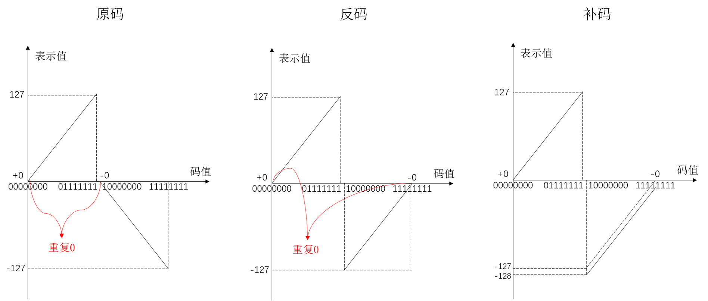
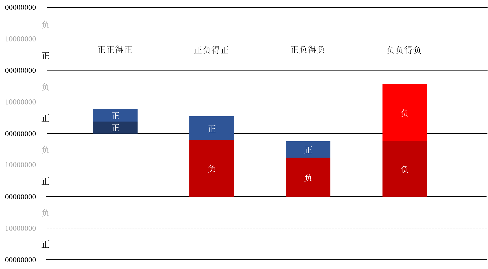

# 原码

## 原码规则

把左边第一位腾出位置，用来存放符号。正号用0来表示，负号用1来表示。这种表示**对人类友好，但是对于计算机不友好**。其有以下几个缺点：

- 可以进行表示，但是**无法进行运算**。两个用原码表示的数字用自然规则进行运算，得到的结果不一定是正确的；
- 存在两个0，即正0与负0，这是一种对于编码的浪费。

# 反码

## 反码规则

反码对于正数的表示规则相对于原码没有改变，但是负数上进行了改变，即符号位仍然是1，但是其余各位取反。

`反码的出现解决了正负相加等于0的问题：每一对正负数相加正好等于全1，在反码的表示规则中，全1表示负0。`

但是存在两个0的问题仍然没有得到解决。

# 补码

## 补码规则

补码的表示**对人类不友好，但是对于计算机友好**。我们希望只有一个0，所以发明了"补码"。"补码"的意思是，从原来"反码"的基础上，补充一个新的代码（+1），这样便完美地消除掉了负0，并且也空出了一个编码用来表示一个新的数字。

# 三种编码的比较

三种编码的区别如下图所示。

$\mathbf{X}$是表示值，带下标的代表码值。三种编码的数学表示如下：

- 原码的数学表示为：
  
  $$
f(x)=\left\{\begin{array}{cc}{x} & {2^{n-1}>x \geq 0} \\ {2^{n-1} -x} & {0 \geq x >-2^{n-1}}\end{array}\right.
  $$
  
- 反码的数学表示为：

  $$
  f(x)=\left\{\begin{array}{ll}{x} & {2^{n-1}>x \geq 0} \\ {\left(2^{n}-1\right)+x} & {0 \geq x>-2^{n-1}}\end{array}\right.
  $$

- 补码的数学表示为：

  $$
  f(x)=\left\{\begin{array}{ll}{x} & {2^{n-1}>x \geq 0} \\ {2^{n}+x} & {0>x \geq -2^{n-1}}\end{array}\right.
  $$

这里对三种编码的运算做一个比较：这种比较是基于四则运算的，且比较的`前置条件`是**两个运算数的表示值的理论上的运算结果应当位于编码的表示区间内**，也就是不存在溢出。

## 码的加法规则

两个码值$a=f(x_1)$以及$b =f(x_2)$的加法规则为$a\oplus b=(a+b)\mod 2^n$。

## 正正相加

为了保证满足以上前置条件，正数相加的范围是不大于$2^{n-1}-1$。

### 原码（成立）

设数$x_1, x_2$为两个数，容易得到：

$$
f(x_1) \oplus f(x_2)=(x_1+x_2)\mod 2^n=x_1+x_2=f(x_1+x_2)
$$

该式表明，两个**编码值**相加后的结果的**表示值**仍然正确。

### 反码（成立）

**反码**：反码的正数部分与原码相同，故**同上**。

### 补码（成立）

**补码**：补码的正数部分与原码相同，故**同上**。

## 正负相加得正

### 原码（不成立）

假设$x_1$为正数，$x_2$为负数：
$$
f(x_1) \oplus f(x_2)=x_1 + 2^{n-1}-x_2 \mod 2^n \neq f(x_1+x_2)=x_1 + x_2
$$
所以不成立。

### 反码（不成立）

假设$x_1$为正数，$x_2$为负数：
$$
f(x_1) \oplus f(x_2)=x_1 + 2^n-1+x_2 \mod 2^n \neq f(x_1+x_2)=x_1 + x_2
$$
两者相差一，所以不成立。

### 补码（成立）

假设$x_1$为正数，$x_2$为负数：
$$
f(x_1) \oplus f(x_2)=x_1 + 2^n+x_2 \mod 2^n = f(x_1+x_2)=x_1 + x_2
$$
成立。

## 正负相加得负

### 原码（不成立）

假设$x_1$为正数，$x_2$为负数：
$$
f(x_1) \oplus f(x_2)=x_1 + 2^{n-1}-x_2 \mod 2^n \neq f(x_1+x_2)=2^{n-1}-(x_1 + x_2)
$$
所以不成立。

### 反码（不成立）

假设$x_1$为正数，$x_2$为负数：
$$
f(x_1) \oplus f(x_2)=x_1 + 2^n-1+x_2 \mod 2^n = f(x_1+x_2)=2^n - 1 + x_1 + x_2
$$
反码在此处成立。

### 补码（成立）

假设$x_1$为正数，$x_2$为负数：
$$
f(x_1) \oplus f(x_2)=x_1 + 2^n+x_2 \mod 2^n = f(x_1+x_2)=2^n + x_1 + x_2
$$
成立。

## 负负相加

为了保证满足以上前置条件，负数相加的范围是不小于$-2^{n-1}+1$，对于补码是$-2^{n-1}$。

### 原码（不成立）

设数$x_1, x_2$为两个数，容易得到：

$$
f(x_1) \oplus f(x_2)=(2^{n-1} - x_1 + 2^{n-1} -x_2)\mod 2^n \neq f(x_1+x_2) = (2^{n-1} - x_1 -x_2)
$$

不成立。

### 反码（不成立）

设数$x_1, x_2$为两个数，容易得到：

$$
f(x_1) \oplus f(x_2)=(2^{n} - 1 + x_1 + 2^{n} - 1 +x_2)\mod 2^n \neq f(x_1+x_2) = (2^{n} - 1 + x_1 +x_2)
$$

差1，不成立。

### 补码（成立）

设数$x_1, x_2$为两个数，容易得到：

$$
f(x_1) \oplus f(x_2)=(2^{n} + x_1 + 2^{n} +x_2)\mod 2^n = f(x_1+x_2) = (2^{n} + x_1 +x_2)
$$

成立。

## 从群论的角度来理解加法运算在补码成立

设函数$f$为任意运算从实际值空间$C$到码值空间$D$的映射函数，我们只需要证明$f$为两个代数结构之间的一个同构映射，即：
$$
\forall x_1, x_2: f(x_1) \oplus f(x_2)=f(x_1+x_2)
$$
即可证明编码后的加法运算能够满足实际数值的加法运算。

### 原码（非同态、非双射）

从原码的表示方式我们可以得出，其并非一个同态映射，因为在**负负相加**、**正负相加**下其不满足同态映射性质；同时$f$也并非是一个双射函数，因为在0处有冗余。

### 反码（非同态、非双射）

从反码的表示方式我们可以得出，其并非一个同态映射，因为在有些情况下差1；同时$f$也并非是一个双射函数，因为在0处有冗余。

### 补码（同构）

其码值空间为一个模$2^n$同余类所构成的模$2^n$加法群，实际值空间为$[-2^{n-1}, 2^{n-1})$。由于根据定义，我们的函数$f$是一个一对一映射，也就是其为一个双射。同时其在任何情况下也满足同态性质，所以其为一个同态映射，综上所述，其为一个同构。

## 以更直观的方式来理解加法运算在补码成立

下面这张图可以直观地解释为什么补码的加法是正确的：

