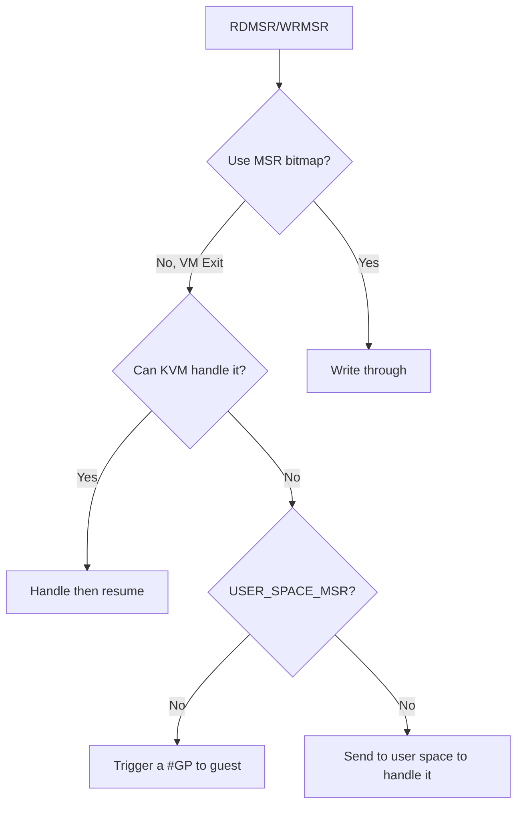
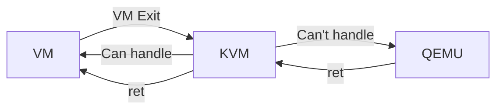
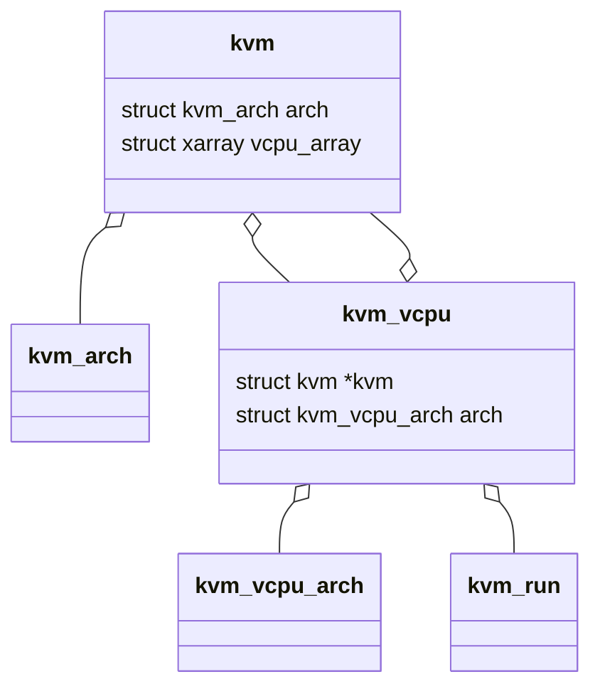
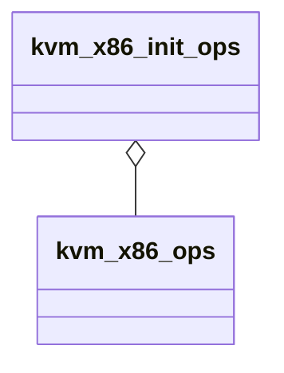

# Misc

KVM_SUPPORTED_CPUID maybe a super set for host supported CPUID, because some features (for example, x2apic), may not be present in the host cpu, but are exposed by kvm if it can emulate them efficiently.

### KVM device framework

Sometimes there will be frequent communication between Userspace (e.g., QEMU) and KVM. To facilitate it, KVM has a KVM device driver framework.

For example: KVM_DEV_TYPE_TDX_MIG_STREAM is a new kvm device added.

The ioctl to create a KVM device is `KVM_CREATE_DEVICE`.

### reg_cache Vs. shadow

`reg_cache` is a superior mechanism for KVM to handle VMCS caching.

### KVM with DebugFS

All DebugFS related files are created in one function:

```c
static void kvm_init_debug(void)
{
	const struct file_operations *fops;
	const struct _kvm_stats_desc *pdesc;
	int i;

	kvm_debugfs_dir = debugfs_create_dir("kvm", NULL);

	// vm-related debug files
	for (i = 0; i < kvm_vm_stats_header.num_desc; ++i) {
		pdesc = &kvm_vm_stats_desc[i];
		if (kvm_stats_debugfs_mode(pdesc) & 0222)
			fops = &vm_stat_fops;
		else
			fops = &vm_stat_readonly_fops;
		debugfs_create_file(pdesc->name, kvm_stats_debugfs_mode(pdesc),
				kvm_debugfs_dir,
				(void *)(long)pdesc->desc.offset, fops);
	}

	// vcpu-related debug files
	for (i = 0; i < kvm_vcpu_stats_header.num_desc; ++i) {
		pdesc = &kvm_vcpu_stats_desc[i];
		if (kvm_stats_debugfs_mode(pdesc) & 0222)
			fops = &vcpu_stat_fops;
		else
			fops = &vcpu_stat_readonly_fops;
		debugfs_create_file(pdesc->name, kvm_stats_debugfs_mode(pdesc),
				kvm_debugfs_dir,
				(void *)(long)pdesc->desc.offset, fops);
	}
}
```

For example, `/sys/kernel/debug/kvm/exits` is defined in `arch/x86/kvm/x86.c`:

```c
const struct _kvm_stats_desc kvm_vcpu_stats_desc[] = {
	//...
	STATS_DESC_COUNTER(VCPU, exits),
	//...
};
```

What kind of information does this file hold? Let's dig more…

```c
#define STATS_DESC_COUNTER(SCOPE, name)					       \
	STATS_DESC_CUMULATIVE(SCOPE, name, KVM_STATS_UNIT_NONE,		       \
		KVM_STATS_BASE_POW10, 0)

#define STATS_DESC_CUMULATIVE(SCOPE, name, unit, base, exponent)	       \
	STATS_DESC(SCOPE, name, KVM_STATS_TYPE_CUMULATIVE,		       \
		unit, base, exponent, 1, 0)

#define STATS_DESC(SCOPE, stat, type, unit, base, exp, sz, bsz)		       \
	SCOPE##_STATS_DESC(stat, type, unit, base, exp, sz, bsz)

#define VCPU_STATS_DESC(stat, type, unit, base, exp, sz, bsz)		       \
	{								       \
		{							       \
			STATS_DESC_COMMON(type, unit, base, exp, sz, bsz),     \
			.offset = offsetof(struct kvm_vcpu_stat, stat)	       \
		},							       \
		.name = #stat,						       \
	}

#define STATS_DESC_COMMON(type, unit, base, exp, sz, bsz)		       \
	.flags = type | unit | base |					       \
		 BUILD_BUG_ON_ZERO(type & ~KVM_STATS_TYPE_MASK) |	       \
		 BUILD_BUG_ON_ZERO(unit & ~KVM_STATS_UNIT_MASK) |	       \
		 BUILD_BUG_ON_ZERO(base & ~KVM_STATS_BASE_MASK),	       \
	.exponent = exp,						       \
	.size = sz,							       \
	.bucket_size = bsz
```

**Where does the KVM write the value to the file when exit?**

arch/x86/kvm/x86.c:

```c
static int vcpu_enter_guest(struct kvm_vcpu *vcpu)
{
	++vcpu->stat.exits;
}
```

### How does `to_vmx()` be implemented?

`to_vmx()` convert a `kvm_vcpu` **pointer** to a `vcpu_vmx` **pointer**.

Because `vcpu_vmx` is larger than `kvm_vcpu`, so it is casting from a pointer of a **small** struct to a big **struct**.

It should be noted that

1. Just pointer converting is supported, because pointer is basic type like int and float. struct cannot be cast directly! [Casting one C structure into another - Stack Overflow](https://stackoverflow.com/questions/3995940/casting-one-c-structure-into-another)
2. The `vcpu_vmx` is the struct which contains the `vcpu_vmx`, in other words, **container**.

The implementation is also easy to understand:

```c
static inline struct vcpu_vmx *to_vmx(struct kvm_vcpu *vcpu)
{
	return container_of(vcpu, struct vcpu_vmx, vcpu);
}

#define container_of(ptr, type, member) ({				\
	void *__mptr = (void *)(ptr);					\
	((type *)(__mptr - offsetof(type, member))); })
```

To summarize: `vcpu - offsetof(struct vcpu_vmx, vcpu)`.

### Instruction Emulator

### KVM code structure/location

`virt/kvm`: for all architectures, x86, ARM, etc.

`arch/x86/kvm`: x86 specific, but for all vendors, Intel, AMD, etc.

`arch/x86/kvm/vmx`: for Intel.

### FEAT_KVM

`CPUID[4000_0001].EAX` is the CPUID Features (KVM_CPUID_FEATURES).

Currently CPUID leaf `4000_0001` is invalid so just use it to represent some kvm-features, not CPUIDs.

### `vmcs` Vs. `loaded_vmcs` / KVM

`vmcs` is the struct to store the real VMCS data.

`loaded_vmcs` is the struct to **track** the state of the currently loaded VMCS for other uses.

```c
struct loaded_vmcs {
	struct vmcs *vmcs;
    // 
	struct vmcs *shadow_vmcs;
    // 表示这个 VMCS load 在了哪一个物理 CPU 上。
    // 在刚开始 alloc_loaded_vmcs() 的时候会被置为 -1，表示还没有 load
    // 到任何一个 CPU 上。后面在调用 vmx_vcpu_load_vmcs() 的时候，
    // 也就是要把这个 VMCS load 到某一个物理的 CPU 上的时候，才会去设置
    // 这个 field 的值。
	int cpu;
    //...
};
```

### KVM_GET_VCPU_EVENTS

**Event**: Interrupt or Exception. (Check for any event (interrupt or exception), arch/x86/kvm/x86.c)

Used by QEMU only in `kvm_arch_get_registers`.

`kvm_arch_get_registers` is only used by `do_kvm_cpu_synchronize_state`, which is only used by `kvm_cpu_synchronize_state`.

### kvm_check_and_inject_events

this function is only invoked by `vcpu_enter_guest`, which is also only invoked by `vcpu_run`.

### KVM_SET_CPUID

**Change CPUID of a running CPU**

Using KVM_SET_CPUID{,2} after KVM_RUN, i.e. changing the guest vCPU model after **running the guest**, may cause guest instability. So if you have called KVM_RUN, then its better not to call KVM_SET_CPUID.

### KVM_RUN

**Can it be used to resume a vcpu?**

yes:

```c
while (1) {
	ioctl(vcpufd, KVM_RUN, NULL);
	switch (run->exit_reason) {
	/* Handle exit */
	}
}
```

### Three MSR related arrays

```c
/*
 * List of msr numbers which we expose to userspace through KVM_GET_MSRS
 * and KVM_SET_MSRS, and KVM_GET_MSR_INDEX_LIST.
 *
 * The three MSR lists(msrs_to_save, emulated_msrs, msr_based_features)
 * extract the supported MSRs from the related const lists.
 * msrs_to_save is selected from the msrs_to_save_all to reflect the
 * capabilities of the host cpu. This capabilities test skips MSRs that are
 * kvm-specific. Those are put in emulated_msrs_all; filtering of emulated_msrs
 * may depend on host virtualization features rather than host cpu features.
 */
```

### RDMSR/WRMSR In guest

Per my understanding (may be not adequate):



Some MSRs are related to virtualization, such as `IA32_VMX_TRUE_PROCBASED_CTLS` will control the nested TD's behavior.

### A typical userspace example to use KVM

[Using the KVM API [LWN.net]](https://lwn.net/Articles/658511/)

### KVM_SET_USER_MEMORY_REGION

```c
struct kvm_userspace_memory_region region = {
	.slot = 0, // An integer index identifying each region of memory; calling KVM_SET_USER_MEMORY_REGION again with the same slot will replace this mapping.
	.guest_phys_addr = 0x1000,
	.memory_size = 0x1000,
	.userspace_addr = (uint64_t)mem, // Points to the backing memory in our process
};
ioctl(vmfd, KVM_SET_USER_MEMORY_REGION, &region);
```

```c
 mmap_size = ioctl(kvm, KVM_GET_VCPU_MMAP_SIZE, NULL);
 run = mmap(NULL, mmap_size, PROT_READ | PROT_WRITE, MAP_SHARED, vcpufd, 0);
```

Should use mmap to connect to userspace.

**KVM_SET_MEMORY_REGION vs. KVM_SET_USER_MEMORY_REGION**

KVM_SET_MEMORY_REGION is not used.

### Struct kvm_run

Each virtual CPU has an associated struct kvm_run data structure, used to communicate information about the CPU between the kernel and user space. In particular, whenever hardware virtualization stops (called a "vmexit"), such as to emulate some virtual hardware, the kvm_run structure will contain information about why it stopped.

[Using the KVM API [LWN.net]](https://lwn.net/Articles/658511/)

### kvm_memory_slot

表示虚拟机物理内存的一段空间。需要把客户机物理地址转换成宿主机虚拟地址 (Host Virtual Address, HVA)。

可以理解为主板上的一个内存插槽。

KVM 用一个 kvm_memory_slot 数据结构来记录每一个地址区间的映射关系，此数据结构包含了对应此映射区间的起始客户机页帧号 (Guest Frame Number, GFN)，映射的内存页数目以及起始宿主机虚拟地址。于是 KVM 就可以实现对客户机物理地址到宿主机虚拟地址之间的转换，也即

- 首先根据客户机物理地址找到对应的映射区间，有一个函数是 `kvm_vcpu_gfn_to_memslot`；
- 根据偏移量和 HVA 就可以得到宿主机虚拟地址，由以下函数可以看出来，这个 base HVA 其实就是 `userspace_addr`；

```c
static inline unsigned long
__gfn_to_hva_memslot(const struct kvm_memory_slot *slot, gfn_t gfn)
{
	//...
	unsigned long offset = gfn - slot->base_gfn;
	offset = array_index_nospec(offset, slot->npages);
	return slot->userspace_addr + offset * PAGE_SIZE;
}
```

- 进而再通过宿主机的页表也可实现客户机物理地址到宿主机物理地址之间的转换，也即 GPA 到 HPA 的转换。

[KVM内核模块重要的数据结构 - L](http://liujunming.top/2017/06/27/KVM%E5%86%85%E6%A0%B8%E6%A8%A1%E5%9D%97%E9%87%8D%E8%A6%81%E7%9A%84%E6%95%B0%E6%8D%AE%E7%BB%93%E6%9E%84/)

**We have EPT, why still using HVA?**

EPT is also a page table, it need first to be constructed, then used.

The intention of `kvm_memory_slot` is exactly for EPT.

[KVM内存管理 - Kernel Exploring](https://richardweiyang-2.gitbook.io/kernel-exploring/00-kvm/01-memory_virtualization/01_2-kvm_memory_manage)

**Relationship between vcpu and memslot**

Memslot is for each KVM, not for each vcpu.

kvm struct has 2 members related to memslots: active memslots and inactive memslots, why?

### Why using a for loop to run `vcpu_run` in `vcpu_enter_guest`?

Because there exist a return value EXIT_FASTPATH_REENTER_GUEST.

```c
for (;;) {
	//...
	exit_fastpath = static_call(kvm_x86_vcpu_run)(vcpu);
	if (likely(exit_fastpath != EXIT_FASTPATH_REENTER_GUEST))
		break;
	//...
}
```

### How does KVM handle the vmexit reason by `RDMSR/WRMSR`?

There are 2 vmexit reason corresponding to `RDMSR/WRMSR`:

```c
#define KVM_EXIT_X86_RDMSR        29
#define KVM_EXIT_X86_WRMSR        30
```    

Will be handled by `kvm_emulate_rdmsr`.

### Difference between 3 vmx.h

There are 3 `vmx.h` files in KVM, which are:

- `arch/x86/kvm/vmx/vmx.h`
- `arch/x86/include/asm/vmx.h`
- `arch/x86/include/uapi/asm/vmx.h`

|                 | `…/kvm/vmx/vmx.h` |  `…/include/asm/vmx.h`  | `…include/uapi/asm/vmx.h` |
| :-------------: | :-----------------: | :-----------------------: | :-------------------------: |
| Expose to user? |         No          |            No             |             Yes             |
|     Content     |    Some structs     | Mostly macros used by KVM |    Mostly `exit_reason`     |
|   Dependency    |         No          |       Included by 1       |        Included by 2        |

From the include hierarchy, you can truly understand the difference:

```
`.../kvm/vmx/vmx.h` includes
	`.../kvm/vmx/vmx_ops.h` includes
		`.../include/asm/vmx.h` includes
			`.../include/uapi/asm/vmx.h`
```

# High Level

### Three contexts must aware

Self-cached data, actually in the memory.

VMCS data, actually in the memory. accessed by VMREAD and VMWRITE.

MSRs, they are registers. accessed by RDMSR and WRMSR.

### Overhead

|  Operation   |        Cycles        |
| :----------: | :------------------: |
| Memory read  |       50-70ns        |
| Memory write |       50-70ns        |
|    VMREAD    |        Higher        |
|   VMWRITE    |        Higher        |
|    RDMSR     | Higher due to vmexit |
|    WRMSR     | Higher due to vmexit |

[21.pptx](https://www.cs.utexas.edu/users/mckinley/352/lectures/21.pdf)

### Why are VMREADs/VMWRITEs slower than Memory Read/Write operation?

Regular memory reads/writes are handled with dedicated hardware to optimize the hell out of them, because real programs are full of them.

Most workloads don't spend very much time on modifying special CPU control registers, so the internal handling of these instructions is often not heavily optimized. Internally, it may be microcoded (i.e. decodes to many uops from the microcode ROM).

[x86 64 - Why are VMREADs/VMWRITEs slower than Memory Read/Write operation - Stack Overflow](https://stackoverflow.com/questions/46705614/why-are-vmreads-vmwrites-slower-than-memory-read-write-operation)

### Does VMCS data need to be cached?

Yes.

VMREAD and VMWRITE has a higher cost, so we can cache the value in the memory, such as the fields in `vcpu->arch`.

### Does MSR data need to be cached?

No need.

The cost of guest reading and writing MSR is mainly the cost of vmexit, so passthrough the MSR is the best way to mitigate this.

# Concepts

### Misc

**Second Level Address Translation (SLAT)**, also known as **nested paging**, [Intel](https://en.wikipedia.org/wiki/Intel)'s implementation of SLAT, known as Extended Page Table (EPT), was introduced in the [Nehalem microarchitecture](https://en.wikipedia.org/wiki/Nehalem_(microarchitecture)) found in certain [Core i7](https://en.wikipedia.org/wiki/Core_i7), [Core i5](https://en.wikipedia.org/wiki/Core_i5), and [Core i3](https://en.wikipedia.org/wiki/Core_i3) processors.

### Why and how does userspace handle the VM Exit?



To kernel space (KVM): lightweight;

To user space (QEMU): heavyweight;

Related code:

```c
static int kvm_msr_user_space(struct kvm_vcpu *vcpu, u32 index,
			      u32 exit_reason, u64 data,
			      int (*completion)(struct kvm_vcpu *vcpu),
			      int r)      

// handle difference reasons
static int (*kvm_vmx_exit_handlers[])(struct kvm_vcpu *vcpu) = {
	[EXIT_REASON_EXCEPTION_NMI]           = handle_exception_nmi,
};

```

### Why in VMCS VM-Excution Control field, using the name **pin-based** and **processor-based**?

Maybe because pin-based control governs the handling of asynchronous events, like interrupt happen at interrupt pin, and processor-based control governs the handling of synchronous events, like exeptions happen in processor.

## VMX MSRs/registers

### VMX capability reporting registers

举个例子，`IA32_VMX_PROCBASED_CTLS2` 的作用就是 reports on the allowed settings of the secondary processor-based VM-execution controls. 真正用来被设置的并不是 MSR，而是 VMCS 里名为 Processor-Based VM-Execution Controls 的一个 field 的 一个 bit。

有时候有的 bit，比如 high 32bit 表示允许置 1，而 low 32bit 表示允许置 0（可能有的就是不能关掉，只能是 1？大多数时候 allow 0 的这些 bit 都是 0，表示这些 bit 所对应的 controls 都允许被置为 0）。

附录：截至 2023/04/07 所支持的和 VMX 相关的 capability reporting registers。

IA32_VMX_BASIC

IA32_VMX_PINBASED_CTLS

IA32_VMX_PROCBASED_CTLS

IA32_VMX_EXIT_CTLS

IA32_VMX_ENTRY_CTLS

IA32_VMX_MISC

IA32_VMX_CR0_FIXED0

IA32_VMX_CR0_FIXED1

IA32_VMX_CR4_FIXED0

IA32_VMX_CR4_FIXED1

IA32_VMX_VMCS_ENUM

IA32_VMX_PROCBASED_CTLS2

IA32_VMX_EPT_VPID_CAP

IA32_VMX_TRUE_PINBASED_CTLS

IA32_VMX_TRUE_PROCBASED_CTLS

IA32_VMX_TRUE_EXIT_CTLS

IA32_VMX_TRUE_ENTRY_CTLS

IA32_VMX_VMFUNC

IA32_VMX_PROCBASED_CTLS3

IA32_VMX_EXIT_CTLS2

### entry/exit Ctrls and true entry/exit ctrls

Related scope: MSR, VMCS.

VMCS has these ctrl fields, that's right, but there is also an MSR to control the setting of each bit, that's

- IA32_VMX_EXIT_CTLS MSR (index 483H)
- IA32_VMX_ENTRY_CTLS MSR (index 484H)
- IA32_VMX_EXIT_CTLS2 MSR (index 493H)

**IA32_VMX_ENTRY_CTLS2 doesn't exist!**

Each of these MSRs conposes:

- Allow 0 controls: if 0, then the VMCS field can be set to 0
- Allow 1 controls: if 1, then the VMCS field can be set to 1.

If bit 55 in the IA32_VMX_BASIC MSR is

- 0: use IA32_VMX_EXIT_CTLS.
- 1: use IA32_VMX_TRUE_EXIT_CTLS.

The reason of introducing IA32_VMX_TRUE_EXIT_CTLS is that maybe it is related to the **nest virtualization**. You can grep in the source code to see it.

## Instructions

All these instrunctions are executed on host.

| Instruction |                            Desc.                             |      |
| :---------: | :----------------------------------------------------------: | ---- |
|    VMXON    |                                                              |      |
|   VMXOFF    |                                                              |      |
|   VMPTRLD   |                                                              |      |
|   VMCLEAR   |                                                              |      |
|   VMREAD    |                                                              |      |
|   VMWRITE   |                                                              |      |
|  VMLAUNCH   |                                                              |      |
|  VMRESUME   |                                                              |      |
|   INVEPT    |                                                              |      |
|   INVVPID   | Invalidates mappings in the TLBs and paging-structure caches based on **virtualprocessor identifier** (VPID). |      |
|   VMCALL    |                                                              |      |
|   VMFUNC    |                                                              |      |

# Data Structures

### vmcs_config

```c
struct nested_vmx_msrs {
	u32 procbased_ctls_low;
	// ...
	u64 vmfunc_controls;
};

struct vmcs_config {
	int size;
	u32 basic_cap;
	u32 revision_id;
	u32 pin_based_exec_ctrl;
	u32 cpu_based_exec_ctrl;
	u32 cpu_based_2nd_exec_ctrl;
	u64 cpu_based_3rd_exec_ctrl;
	u32 vmexit_ctrl;
	u32 vmentry_ctrl;
	u64 misc;
	struct nested_vmx_msrs nested;
};
```

This struct also has a global variable `vmcs_config`.

**What's the purpose of `struct nested_vmx_msrs nested;`**

These are MSRs, it should be noted that these are not contained in the VMCS.

Guest 的 VMX `vmx->nested.msrs` 在初始化时是以这些为默认值的。

```c
kvm_arch_vcpu_create
	kvm_vcpu_reset
		static_call(kvm_x86_vcpu_reset)(vcpu, init_event);
			vmx_vcpu_reset
			...
			memcpy(&vmx->nested.msrs, &vmcs_config.nested, sizeof(vmx->nested.msrs));
```

At the same time, MSRs in `vmcs_config.nested` are also initialized by the corresponding MSRs in `vmcs_config`.

```c
void nested_vmx_setup_ctls_msrs(struct vmcs_config *vmcs_conf, u32 ept_caps)
{
	//...
	msrs->secondary_ctls_high = vmcs_conf->cpu_based_2nd_exec_ctrl;
	//...
}
```

**Difference between `vmcs_config.cpu_based_2nd_exec_ctrl` and `vmcs_config.nested.secondary_ctls_high`

`vmcs_config.cpu_based_2nd_exec_ctrl` is set by function `setup_vmcs_config` during hardware setup, it is set based on the host CPU capability.

`vmcs_config.nested.secondary_ctls_high` is for setup the nested MSRs.

Summary, there are 3 places:

- regs in vmcs_config, like `vmcs_config.cpu_based_2nd_exec_ctrl`;
- regs in vmcs_config.nested, like `vmcs_config.nested.secondary_ctrl_high`;
- regs in vmx.nested.msrs;

The reason why there aren't MSRs in VMX host is because `rdmsr/wrmsr` is just enough.

### `vcpu_vmx` / `kvm_vcpu`

`vcpu_vmx` contains a member `kvm_vcpu`, you can check

```c
struct vcpu_vmx *vmx = to_vmx(vcpu);


```

### regs_avail / regs_dirty

```c
/*
 * avail  dirty
 * 0	  0	  register in VMCS/VMCB
 * 0	  1	  *INVALID*
 * 1	  0	  register in vcpu->arch
 * 1	  1	  register in vcpu->arch, needs to be stored back
 */
static inline void kvm_register_mark_dirty(struct kvm_vcpu *vcpu,
					   enum kvm_reg reg)
{
	__set_bit(reg, (unsigned long *)&vcpu->arch.regs_avail);
	__set_bit(reg, (unsigned long *)&vcpu->arch.regs_dirty);
}

static inline void kvm_register_mark_available(struct kvm_vcpu *vcpu,
					       enum kvm_reg reg)
{
	__set_bit(reg, (unsigned long *)&vcpu->arch.regs_avail);
}

static inline bool kvm_register_is_available(struct kvm_vcpu *vcpu,
					     enum kvm_reg reg)
{
	return test_bit(reg, (unsigned long *)&vcpu->arch.regs_avail);
}
```

## `struct kvm_vcpu`, `struct kvm_vcpu_arch`

```c
struct kvm_vcpu_arch {
	u64 l1_tsc_scaling_ratio;
    // current used scaling ratio, if the vcpu is in guest mode, i.e.,
    // L2 is running, then it equals to l2's scaling ratio, else it will be l1's
    // both l1_tsc_scaling_ratio and tsc_scaling_ratio are **NOT** the vTSCfreq, they are
    // the ratio = vTSCfreq / pTSCfreq, remember this.
	u64 tsc_scaling_ratio;
    // l1's tsc offset, the formula: l1's tsc = l1's offset + l1's ratio * host_tsc
	u64 l1_tsc_offset;
    u64 this_tsc_nsec;

    // The most recent guest's tsc
    // only used when tsc is unstable, to calculate the offset
	u64 last_guest_tsc;

    // This vcpu's vTSCfreq
	unsigned int hw_tsc_khz;

    // for the various MMUs, please see root_mmu^
    // for apf, please see apf^
};
```

### What is `kvm_vcpu` and `kvm_vcpu_arch`?

From struct level: `kvm_vcpu` contains `kvm_vcpu_arch`.

From instance level: `vcpu->arch`.

`kvm_vcpu_arch` is arch specific, you grep in the source code by `struct kvm_vcpu_arch \{` and you can see six ISAs (riscv, ARM64, x86, s390, powerpc, mips) have defined this struct. The original message [[PATCH 04/33] KVM: Portability: Introduce kvm_vcpu_arch - Avi Kivity](https://lore.kernel.org/all/1199630379-28638-5-git-send-email-avi@qumranet.com/) is really concise:

```
Move all the architecture-specific fields in kvm_vcpu into a new struct
kvm_vcpu_arch.
```

`kvm_vcpu` is defined in `include/linux/kvm_host.h`, The reason is that it is not arch-specific.

`kvm_vcpu_arch` is defined in `arch/x86/include/asm/kvm_host.h`.

`kvm_vcpu` contains arch-independent attributes, e.g., CPU id, `kvm_vcpu_arch` contains arch-specific attributes, e.g., registers.

### How does these two struct work together?

`kvm_vcpu` has a member named `arch`, which represents the `kvm_vcpu_arch` struct. You can grep in the source code, you will find 5k+ lines contain `vcpu->arch`.

## `struct kvm` KVM

KVM 结构体在 KVM 的系统架构中代表一个具体的虚拟机。[KVM内核模块重要的数据结构 - L](http://liujunming.top/2017/06/27/KVM%E5%86%85%E6%A0%B8%E6%A8%A1%E5%9D%97%E9%87%8D%E8%A6%81%E7%9A%84%E6%95%B0%E6%8D%AE%E7%BB%93%E6%9E%84/)

`kvm_vcpu` has a `kvm` type pointer. `kvm` also has a member named `arch`, and it is also with the type `kvm_vcpu_arch`. `kvm_vcpu` already has `arch`, why another `arch`? why following this design?

```c
struct kvm {
// 防止 MMU 被更改。
#ifdef KVM_HAVE_MMU_RWLOCK
	rwlock_t mmu_lock;
#else
	spinlock_t mmu_lock;
#endif /* KVM_HAVE_MMU_RWLOCK */
};

```

## Relationships



## Struct kvm_run

```c
struct kvm_run {

	/*
	* The exit handlers return 1 if the exit was handled fully and guest execution
	* may resume.  Otherwise they set the this to indicate what needs to be done to
	* userspace and return 0.
	*/
	__u32 exit_reason;
}
```

Notes:

1. `xarray` is a kernel struct and an abstract data type which behaves like a very large array of pointers. [XArray — The Linux Kernel documentation](https://docs.kernel.org/core-api/xarray.html)

# Procedures

### How does KVM start to run?

There is a KVM API named `KVM_RUN`, you can see in [The Definitive KVM API Documentation — The Linux Kernel documentation](https://www.kernel.org/doc/html/latest/virt/kvm/api.html#kvm-run).

1. `kvm_vcpu_ioctl` to handle the ioctl
2. `kvm_arch_vcpu_ioctl_run` to run a vcpu
3. `vcpu_run` to run a vcpu
4. a for loop, until break, basically:

```c
for (;;) {
   //...
   if (kvm_vcpu_running(vcpu)) {
	   r = vcpu_enter_guest(vcpu);
   } else {
	   r = vcpu_block(vcpu);
   }
   //...
}
```

1. In `vcpu_enter_guest()`, there is another for loop:

```c
for (;;) {
   //...
   // kvm_x86_vcpu_run is kvm_x86_ops.vcpu_run is vmx_vcpu_run, you can see the macro "KVM_X86_OP" in arch/x86/kvm/x86.c,
   // and some declarations in arch/x86/include/asm/kvm-x86-ops.h
   exit_fastpath = static_call(kvm_x86_vcpu_run)(vcpu);
   //...
}
```

1. in `vmx_vcpu_run`, it will call `vmx_vcpu_enter_exit`
2. call `__vmx_vcpu_run`, which is defined in `arch/x86/kvm/vmx/vmenter.S`, between `SYM_FUNC_START(__vmx_vcpu_run)` and `SYM_FUNC_END(__vmx_vcpu_run)`, around 200 lines (vmenter.S is compiled to vmenter.o by the rules in `arch/x86/kvm/Makefile`).
3. `vmluanch` or `vmresume`.

https://notes.caijiqhx.top/ucas/linux_kernel/static_call/

### How does KVM handle the VMExit from VM?

`.handle_exit` in kvm_x86_ops, which corresponding to `vmx_handle_exit`, then `__vmx_handle_exit`.

The `.handle_exit` is called (only) in `vcpu_enter_guest`, by

```c
r = static_call(kvm_x86_handle_exit)(vcpu, exit_fastpath);
```

### Difference between `virt/kvm` and `arch/x86/kvm`?

`virt/kvm` is more generic, it includes all other ISAs not only x86.

Not many files here.

### KVM kernel module entry

For `kvm.ko`, the files involved are:

- `virt/kvm/kvm_main.c`: module_author and module_license functions;
- `arch/x86/kvm/x86.c`: module_init and module_exit functions;
- `arch/x86/kvm/kvm.mod.c` module information.

For `kvm-intel.ko`, the files involved are:

- `arch/x86/kvm/vmx/vmx.c`: module_author, module_license module_init and module_exit functions;
- `arch/x86/kvm/kvm-intel.mod.c`: module information.

We mainly cares about `arch/x86/kvm/vmx/vmx.c`, so the entry is

```c
static int __init vmx_init(void)
```

### KVM device is not the same as KVM device

In the context of KVM, "device" means 2 things:

- The KVM device under the /dev folder, i.e., /dev/kvm
- A device in a VM, can be created by KVM_CREATE_DEVICE IOCTL.

## What is KVM capability?

From official documentation: [The Definitive KVM API Documentation — The Linux Kernel documentation](https://docs.kernel.org/virt/kvm/api.html#capabilities-that-can-be-enabled-on-vcpus)

Three classed of KVM capabilities:

- vCPU level capabilities: There are certain capabilities that change the behavior of the virtual CPU or the virtual machine when enabled.
- VM level capabilities: There are certain capabilities that change the behavior of the virtual machine when enabled.
- Other capabilities.

Capability:

which KVM extension provides this ioctl. Can be ‘basic’, which means that is will be provided by any kernel that supports API version 12 (see section 4.1), a KVM_CAP_xyz constant, which means availability needs to be checked with KVM_CHECK_EXTENSION (see section 4.4), or ‘none’ which means that while not all kernels support this ioctl, there’s no capability bit to check its availability: for kernels that don’t support the ioctl, the ioctl returns -ENOTTY.

### Why are they placed under `include/uapi/linux/kvm.h`?

The capabilities are implemented with the following form:

```c
#define KVM_CAP_PPC_RMA	65
#define KVM_CAP_MAX_VCPUS 66       /* returns max vcpus per vm */
#define KVM_CAP_PPC_HIOR 67
#define KVM_CAP_PPC_PAPR 68
#define KVM_CAP_SW_TLB 69
#define KVM_CAP_ONE_REG 70
#define KVM_CAP_S390_GMAP 71
#define KVM_CAP_TSC_DEADLINE_TIMER 72
```

That's because the capabilities include all the ISAs, you can see both the ARM, X86 and S390 are placed under this folder. So it is not architecture specific, so they **shouldn't** be placed under the `asm` folder.

They are the ioctl parameter values can be seen from the userspace, so it should be placed under the `uapi` folder.

It should be noted that these capabilities are not IOCTL, they are IOCTL parameters, the real IOCTL is:

- `KVM_CHECK_EXTENSION` (system ioctl, vm ioctl, can check all the capabilities including vm's, vcpu's and other capabilities, based on their initialization different VMs may have different capabilities. It is thus encouraged to use the vm ioctl to query for capabilities).
- `KVM_ENABLE_CAP` (Can enable all the capabilities including vm's, vcpu's and other capabilities).

### Relationship with CPUID?

They are not the same, although you could see the following code:

```c
kvm_cpu_cap_mask(CPUID_7_ECX,
	F(AVX512VBMI) | F(LA57) | F(PKU) | 0 /*OSPKE*/ | F(RDPID) |
	F(AVX512_VPOPCNTDQ) | F(UMIP) | F(AVX512_VBMI2) | F(GFNI) |
	F(VAES) | F(VPCLMULQDQ) | F(AVX512_VNNI) | F(AVX512_BITALG) |
	F(CLDEMOTE) | F(MOVDIRI) | F(MOVDIR64B) | 0 /*WAITPKG*/ |
	F(SGX_LC) | F(BUS_LOCK_DETECT)
);
```

the `kvm_cpu_cap` means to check CPUID related information, not equals to the kvm capability.

### What't the difference between KVM capabilities and CPU features?

You can see the features in `arch/x86/include/asm/cpufeatures.h`.

The features located in the same CPUID leaf are placed together. For example:

```c
/* Intel-defined CPU features, CPUID level 0x00000007:0 (ECX), word 16 */
#define X86_FEATURE_AVX512VBMI		(16*32+ 1) /* AVX512 Vector Bit Manipulation instructions*/
#define X86_FEATURE_UMIP		(16*32+ 2) /* User Mode Instruction Protection */
#define X86_FEATURE_PKU			(16*32+ 3) /* Protection Keys for Userspace */
#define X86_FEATURE_OSPKE		(16*32+ 4) /* OS Protection Keys Enable */
#define X86_FEATURE_WAITPKG		(16*32+ 5) /* UMONITOR/UMWAIT/TPAUSE Instructions */
```

Although the '16' is meanningless, the number after the plus sign is corresponding to the real CPUID bit.

So we can say that **features and CPUID are somehow identical**, and they are not just for KVM, they are also for baremetal. But the capabilities are just in KVM.

### How does QEMU use these capabilities?

QEMU uses the IOCTL `KVM_CHECK_EXTENSION` to check a capability and uses the `KVM_ENABLE_CAP` to enable a capability.

**Both need to pass a parameter, the capability.**

Following code in QEMU:

```c
// KVM_CHECK_EXTENSION
// Userspace passes an extension identifier (an integer) and receives an integer that describes the extension availability.
ret = kvm_ioctl(s, KVM_CHECK_EXTENSION, extension);
ret = kvm_vm_ioctl(s, KVM_CHECK_EXTENSION, extension);

// KVM_ENABLE_CAP
kvm_vm_ioctl(s, KVM_ENABLE_CAP, &cap);
kvm_vcpu_ioctl(cpu, KVM_ENABLE_CAP, &cap);
```

### When should use the KVM_CAP?

Why the PKS KVM implementation didn't add it, but the bus_lock and notify vm exit did?

If the feature is for virtualization, for example, the

If the feature can be virtualized, for

### What's the difference between `cpufeatures.h` and `vmxfeatures.h`?

|                  |           cpufeatures.h            |           vmxfeatures.h            |
| :--------------: | :--------------------------------: | :--------------------------------: |
|      Place       | arch/x86/include/asm/cpufeatures.h | arch/x86/include/asm/vmxfeatures.h |
|      Scope       |      Virtualization agnostic       |        Virtualization aware        |
|      Format      |          X86_FEATURE_XXX           |          VMX_FEATURE_XXX           |
| Indentify method |            Incremental             |            Incremental             |
|    Reference     |               Kernel               | Used by arch/x86/include/asm/vmx.h |

vmxfeatures.h contains all the features about vmx, not just some VMCS field, for example, you can see if the instruction INVVPID is supported by VMX_FEATURE_INVVPID defined in this file.

## IOCTL types

The ioctls belong to the following classes:

 - **System ioctls**: These query and set global attributes which affect the whole kvm subsystem. **In addition a system ioctl is used to create virtual machines.**
 - **VM ioctls**: These query and set attributes that affect an entire virtual machine, for example memory layout. **In addition a VM ioctl is used to create virtual cpus (vcpus) and devices.** VM ioctls must be issued from the same process (address space) that was used to create the VM.
 - **vcpu ioctls**: These query and set attributes that control the operation of a single virtual cpu. vcpu ioctls should be issued from the same thread that was used to create the vcpu, except for asynchronous vcpu ioctl that are marked as such in the documentation. Otherwise, the first ioctl after switching threads could see a performance impact.
 - **device ioctls**: These query and set attributes that control the operation of a single device. device ioctls must be issued from the same process (address space) that was used to create the VM.

[The Definitive KVM API Documentation — The Linux Kernel documentation](https://docs.kernel.org/virt/kvm/api.html#general-description)

## KVM handle IOCTL

The entry is:

Main functions, in `virt/kvm/kvm_main.c`:

- `kvm_dev_ioctl` to handle the system ioctl.
- `kvm_vm_ioctl` to handle the VM specific ioctl.
- `kvm_vcpu_ioctl` to handle the vcpu specific ioctl.
- `kvm_device_ioctl` to handle the device specific ioctl. This is where the **KVM device framework**^ fits in.

### Why in `virt/kvm/kvm_main.c`?

because it is both ISA and Vendor agnostic, so it should be here.

## Some Useful IOCTLs

### KVM_GET_MSRS/KVM_SET_MSRS

[The Definitive KVM API Documentation — The Linux Kernel documentation](https://www.kernel.org/doc/html/latest/virt/kvm/api.html#kvm-get-msrs)

Get or set a specified MSR value.

### KVM_SET_CPUID

Set CPUID. A guest can see a feature if both KVM support it and user set the CPUID.

[The Definitive KVM API Documentation — The Linux Kernel documentation](https://www.kernel.org/doc/html/latest/virt/kvm/api.html#kvm-set-msrs)

### KVM_X86_SET_MSR_FILTER

related patchset:

- [[PATCH] KVM: VMX: Skip filter updates for MSRs that KVM is already intercepting - Sean Christopherson](https://lore.kernel.org/all/20220610214140.612025-1-seanjc@google.com/)

## Enum kvm_reg

This enum is defined in `arch/x86/include/asm/kvm_host.h`.

Such as VCPU_REGS_RAX, VCPU_EXREG_PKRS are defined there.

### regs_avail

Introduced in [KVM: x86: accessors for guest registers - Marcelo Tosatti](https://lore.kernel.org/all/20080627175802.GA18541@dmt.cnet/)

Motivation: **cost of `vmcs_read/vmcs_write` is significant**.

The standard register caching mechanism。

## How to inject an interrupt to Guest?

[实际上注入中断就是写 vmcs 里面的 VM_ENTRY_INTR_INFO_FIELD 这个域。然后在 vcpu 的 run 函数里面设置 cpu 进入非根模式，vcpu 会自动检查 vmcs 结构，然后注入中断，这是硬件自动完成的工作。](https://www.owalle.com/2019/02/20/kvm-src-analysis/#:~:text=%E5%AE%9E%E9%99%85%E4%B8%8A%E6%B3%A8%E5%85%A5%E4%B8%AD%E6%96%AD%E5%B0%B1%E6%98%AF%E5%86%99%20vmcs%20%E9%87%8C%E9%9D%A2%E7%9A%84%20vm_entry_intr_info_field%20%E8%BF%99%E4%B8%AA%E5%9F%9F%E3%80%82%E7%84%B6%E5%90%8E%E5%9C%A8%20vcpu%20%E7%9A%84%20run%20%E5%87%BD%E6%95%B0%E9%87%8C%E9%9D%A2%E8%AE%BE%E7%BD%AE%20cpu%20%E8%BF%9B%E5%85%A5%E9%9D%9E%E6%A0%B9%E6%A8%A1%E5%BC%8F%2Cvcpu%20%E4%BC%9A%E8%87%AA%E5%8A%A8%E6%A3%80%E6%9F%A5%20vmcs%20%E7%BB%93%E6%9E%84%2C%E7%84%B6%E5%90%8E%E6%B3%A8%E5%85%A5%E4%B8%AD%E6%96%AD%2C%E8%BF%99%E6%98%AF%E7%A1%AC%E4%BB%B6%E8%87%AA%E5%8A%A8%E5%AE%8C%E6%88%90%E7%9A%84%E5%B7%A5%E4%BD%9C%E3%80%82)

我们可以仔细看一下 VMCS 中 VM_ENTRY_INTR_INFO_FIELD 这个域。具体在 SDM 24.8.3 VM-Entry Controls for Event Injection 中的 VM-entry interruption-information field。

KVM 中也有对应的 IOCTL, `KVM_INTERRUPT`。

> Queues a hardware interrupt vector to be injected.

Code path:

1. **Userspace**: wants to inject an interrupt;
2. **Userspace**: call IOCTL KVM_INTERRUPT;
3. **KVM**: enter `kvm_vcpu_ioctl`;
4. **KVM**: because interrupt is arch specific, so fallback to `kvm_arch_vcpu_ioctl`, for x86, it is in `arch/x86/kvm/x86.c`;
5. **KVM**: enter `kvm_vcpu_ioctl_interrupt`, it is in `arch/x86/kvm/x86.c`;
6. **KVM**: set irq `vcpu->arch.interrupt.nr` by function `kvm_queue_interrupt`;
7. **KVM**: VMX has a hook `.set_irq = vmx_inject_irq`, which will be called by KVM;
8. **KVM**: `vmx_inject_irq` will check `vcpu->arch.interrupt.nr` then perform corresponding actions, such as write the VMCS: `vmcs_write32(VM_ENTRY_INTR_INFO_FIELD, intr);`

## Type of features

### On host, can be virtualized

Examples:

- KVM Buslock #DB: When a buslock is generated, an Exeption should be generated too to notify the software.
- PKU/PKS.

### On host, for virtualization

Examples:

- Buslock VM Exit: When a VM cause a buslock, VM Exit. This is for virtualization.
- Notify VM Exit: When a VM doesn't have commit, VM Exit. This is for virtualization.

## VMCS Definition in Code

First, VMCS is handled by the hardware, so the definitions are just **encodings**.

### What does "VMCS Encoding" mean?

SDM Appendix B's name is "FIELD ENCODING IN VMCS", what does "encoding" mean? Is it equal to the address of fields?

The answer is really short and reside in the first line of this chapter:

> Every component of the VMCS is encoded by a 32-bit field that can be used by VMREAD and VMWRITE.

So… You can think it as the address.

> Software should use the VMREAD and VMWRITE instructions to access the different fields in the current VMCS

There are two instructions: "VMREAD" and "VMWRITE" to get the data of current VMCS, and the para is just an address.

in `arch/x86/include/asm/vmx.h`, you can see a `enum`, which represents the encoding of each area of the VMCS data:

```c
/* VMCS Encodings */
enum vmcs_field {
	VIRTUAL_PROCESSOR_ID            = 0x00000000,
	POSTED_INTR_NV                  = 0x00000002,
	// ... //
	HOST_RIP                        = 0x00006c16,
}
```

But as you know, the field in the VMCS is not a single bit, they are organized in bytes. For an example, the `primary VM-exit controls` is a 32bits vector, and each bit in this vector control a specific feature, e.g., PKS. If we want to access a single bit, we need to define the bit outside the above enum (but still in the same file):

```c
#define VM_EXIT_SAVE_DEBUG_CONTROLS             0x00000004
#define VM_EXIT_HOST_ADDR_SPACE_SIZE            0x00000200
#define VM_EXIT_LOAD_IA32_PERF_GLOBAL_CTRL      0x00001000
#define VM_EXIT_ACK_INTR_ON_EXIT                0x00008000
#define VM_EXIT_SAVE_IA32_PAT			0x00040000
#define VM_EXIT_LOAD_IA32_PAT			0x00080000
#define VM_EXIT_SAVE_IA32_EFER                  0x00100000
#define VM_EXIT_LOAD_IA32_EFER                  0x00200000
```

## Mitigate the cost of VM-Exit

### By `vmcs_host_state` in `arch/x86/kvm/vmx/vmcs.h`

```c
/*
 * vmcs_host_state tracks registers that are loaded from the VMCS on VMEXIT
 * and whose values change infrequently, but are not constant.  I.e. this is
 * used as a write-through cache of the corresponding VMCS fields.
 */
struct vmcs_host_state {
	unsigned long cr3;	/* May not match real cr3 */
	unsigned long cr4;	/* May not match real cr4 */
	unsigned long gs_base;
	unsigned long fs_base;
	unsigned long rsp;

	u16           fs_sel, gs_sel, ldt_sel;
#ifdef CONFIG_X86_64
	u16           ds_sel, es_sel;
#endif
	u32           pkrs;
};
```

# Checks/CPUID Related

Note: `kvm_cpu_cap` is not meant for KVM capabilities, actually, it is for CPU capabilities.

### What will happen if we KVM_SET_CPUID to a value not supported by KVM_GET_SUPPORTED_CPUID?

### Code path for handling KVM_GET_SUPPORTED_CPUID

```
kvm_dev_ioctl
	kvm_arch_dev_ioctl
		kvm_dev_ioctl_get_cpuid
			get_cpuid_func
				do_cpuid_func    # get a single CPUID leaf
					__do_cpuid_func
						...
```

### Other paths

```
module_init(vmx_init)
	kvm_init
		kvm_arch_init
			
```

## [Tiny] arch/x86/kvm/reverse_cpuid.h

```c
// Separate a CPUID's leaf to it's components. 
static const struct cpuid_reg reverse_cpuid[] = {
	[CPUID_1_EDX]         = {         1, 0, CPUID_EDX},
	[CPUID_8000_0001_EDX] = {0x80000001, 0, CPUID_EDX},
	[CPUID_8086_0001_EDX] = {0x80860001, 0, CPUID_EDX},
	[CPUID_1_ECX]         = {         1, 0, CPUID_ECX},
	[CPUID_C000_0001_EDX] = {0xc0000001, 0, CPUID_EDX},
	[CPUID_8000_0001_ECX] = {0x80000001, 0, CPUID_ECX},
	[CPUID_7_0_EBX]       = {         7, 0, CPUID_EBX},
	[CPUID_D_1_EAX]       = {       0xd, 1, CPUID_EAX},
	[CPUID_8000_0008_EBX] = {0x80000008, 0, CPUID_EBX},
	[CPUID_6_EAX]         = {         6, 0, CPUID_EAX},
	[CPUID_8000_000A_EDX] = {0x8000000a, 0, CPUID_EDX},
	[CPUID_7_ECX]         = {         7, 0, CPUID_ECX},
	[CPUID_8000_0007_EBX] = {0x80000007, 0, CPUID_EBX},
	[CPUID_7_EDX]         = {         7, 0, CPUID_EDX},
	[CPUID_7_1_EAX]       = {         7, 1, CPUID_EAX},
	[CPUID_12_EAX]        = {0x00000012, 0, CPUID_EAX},
	[CPUID_8000_001F_EAX] = {0x8000001f, 0, CPUID_EAX},
};
```

## [Small] arch/x86/kvm/cpuid.h

## [Large] arch/x86/kvm/cpuid.c

### boot_cpu_has, kvm_cpu_cap_has

`boot_cpu_has` is to check if a CPUID is supported by the CPU.

`boot_cpu_has` and `static_cpu_has` are functionally equalled, but `static_cpu_has` use some assembly code to accelate for fast path, so it is faster.

[Re: [PATCH v10 005/108] KVM: TDX: Initialize the TDX module when loading the KVM intel kernel module - Sean Christopherson](https://lore.kernel.org/all/Y2qkjnpZsWEFBe6G@google.com/)

`kvm_cpu_cap_has` is not same as the `boot_cpu_has`. The difference is, `kvm_cpu_cap_has` is the capabilities KVM want to expose to guest though KVM_GET_SUPPORTED_CPUID, it is not equal to the CPUID the physical CPU really has.

[[PATCH v2 00/66] KVM: x86: Introduce KVM cpu caps - Sean Christopherson](https://lore.kernel.org/all/20200302235709.27467-1-sean.j.christopherson@intel.com/)

there is an enum:

```c
enum kvm_only_cpuid_leafs {
	CPUID_12_EAX	 = NCAPINTS,
	NR_KVM_CPU_CAPS,

	NKVMCAPINTS = NR_KVM_CPU_CAPS - NCAPINTS,
};
```

which defines some leaves only KVM cares, you can see that the real CPUID actually has 21H.

All the kvm_cpu_cap function family, includes:

- `kvm_cpu_cap_mask`
- `kvm_set_cpu_caps`
- `kvm_cpu_cap_has`
- `kvm_cpu_cap_clear`
- `kvm_cpu_cap_set`
- `kvm_cpu_cap_get`

actually is based on the global variable `u32 kvm_cpu_caps[NR_KVM_CPU_CAPS] __read_mostly;`

# MMU

## [Small] arch/x86/kvm/mmu.h

### permission_fault

```c
/*
 * Check if a given access (described through the I/D, W/R and U/S bits of a
 * page fault error code pfec) causes a permission fault with the given PTE
 * access rights (in ACC_* format).
 *
 * Return zero if the access does not fault; return the page fault error code
 * if the access faults.
 */
static inline u8 permission_fault(struct kvm_vcpu *vcpu, struct kvm_mmu *mmu,
				  unsigned pte_access, unsigned pte_pkey,
				  u64 access)
```

The `access` is the pfec, the `pte_access` is for the access of the pte.

This is how KVM handle memory access rights.

# Ops

In the code, we should use:

```c
static_call(kvm_x86_set_msr)(vcpu, &msr);
```

to call each field in the ops.



## `struct kvm_x86_ops` KVM

There is a variable `kvm_x86_ops`, with the same name:

```c
// arch/x86/kvm/x86.c
struct kvm_x86_ops kvm_x86_ops __read_mostly;

static_call(kvm_x86_mem_enc_ioctl)(kvm, argp);
static_call(kvm_x86_mem_enc_register_region)(kvm, &region);
static_call(kvm_x86_mem_enc_unregister_region)(kvm, &region);
//...
```

在一些 x86 generic 的 code 会调用到（大多数是在 `arch/x86/kvm/x86.c` 中）。

VMX specific 的 instance `vmx_x86_ops`：

```c
// arch/x86/kvm/vmx/vmx.c
static struct kvm_x86_ops vmx_x86_ops __initdata = {
	.name = KBUILD_MODNAME,
    //...
}
```

`kvm_x86_ops` 和 `vmx_x86_ops` 的关系如下所示，一目了然：

```c
static struct kvm_x86_init_ops vmx_init_ops __initdata = {
	.runtime_ops = &vmx_x86_ops,
    //...
};

vmx_init
    kvm_x86_vendor_init(&vmx_init_ops)
    	kvm_ops_update(ops)
static inline void kvm_ops_update(struct kvm_x86_init_ops *ops)
{
	memcpy(&kvm_x86_ops, ops->runtime_ops, sizeof(kvm_x86_ops));

#define __KVM_X86_OP(func) \
	static_call_update(kvm_x86_##func, kvm_x86_ops.func);
#define KVM_X86_OP(func) \
	WARN_ON(!kvm_x86_ops.func); __KVM_X86_OP(func)
#define KVM_X86_OP_OPTIONAL __KVM_X86_OP
#define KVM_X86_OP_OPTIONAL_RET0(func) \
	static_call_update(kvm_x86_##func, (void *)kvm_x86_ops.func ? : \
					   (void *)__static_call_return0);
#include <asm/kvm-x86-ops.h>
#undef __KVM_X86_OP

	kvm_pmu_ops_update(ops->pmu_ops);
}
```

简单来说就是把 `vmx_x86_ops` 里的函数指针先 copy 到了 `kvm_x86_ops` 里面，同时更新对应的 static call。**这样 x86 generic code 里对于函数的调用 `static_call(kvm_x86_*)` 就会调用到 vendor specific 的 code（VMX）**，这也是设计这两个 ops 的目的。

### `vcpu_after_set_cpuid`

This hook will be called after setting the CPUID.

path1:

- `kvm_vcpu_ioctl_set_cpuid`: userspace such as QEMU setup the cpuid by ioctl, works as an interface;
- ``kvm_set_cpuid``: the function to set cpuid for user;
- `kvm_vcpu_after_set_cpuid`, in the end of `kvm_set_cpuid`, this will be called.

## kvm_x86_init_ops

There is a global variable of this type named `vmx_init_ops`

## kvm_device_ops

## kvm_pmu_ops

# IOCTLs

# Caps

## KVM_CAP_X86_USER_SPACE_MSR

If enabled, MSR accesses that would usually trigger a \#GP by KVM into the guest will instead get bounced to user space through the KVM_EXIT_X86_RDMSR and KVM_EXIT_X86_WRMSR exit notifications.

IMHO, If a MSR is not supported by KVM, then usually it will trigger a \#GP to the guest to notify guest this MSR is not supported, if enabled this MSR, KVM can let user space to handle this to achieve a more fine-grained control.

# Userspace Interaction

### How does userspace send a command to KVM?

They are basically argument for a ioctl.

For example: Userspace VMM can send ioctl `KVM_MEMORY_ENCRYPT_OP` with argument `KVM_TDX_SERVTD_PREBIND`, which can be regarded as a command.