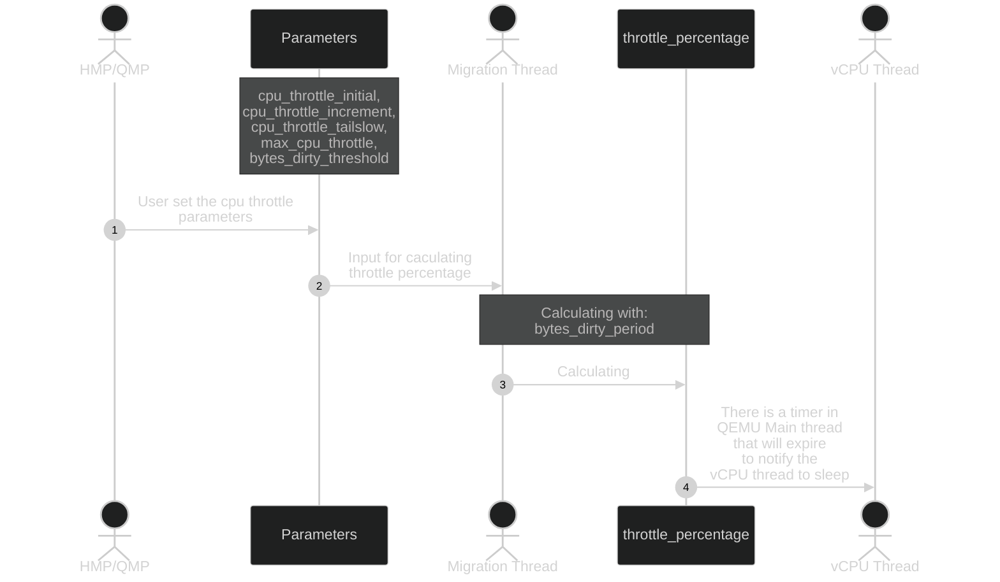

带 x 的 capability 表示还是 unstable 的。

所有的 Migration capabilities 默认都是 disable 的：

```c
// 这里的这个 false 表示 default value 就是 false。
#define DEFINE_PROP_MIG_CAP(name, x)             \
    DEFINE_PROP_BOOL(name, MigrationState, capabilities[x], false)
```

```c
typedef enum MigrationCapability {
    //...
    MIGRATION_CAPABILITY_MULTIFD,
    //...
} MigrationCapability;
```

### `MIGRATION_CAPABILITY_SWITCHOVER_ACK` QEMU

很新的 capability，QEMU 8.1 才加入。

src 端如果没有收到 dst 的 switchover 的 ack，就不会进入 blackout phase (`migration_completion()`)。

dst 端的每一个 device 都同意了（目前主要是 vfio 在用），dst 才会发送 ack 给 src 端。

`@switchover-ack`: If enabled, migration will not stop the source VM and complete the migration until an ACK is received from the destination that it's OK to do so. Exactly when this ACK is sent depends on the migrated devices that use this feature. For example, a device can use it to make sure some of its data is sent and loaded in the destination before doing switchover. This can reduce downtime if devices that support this capability are present. **'return-path' capability must be enabled to use it.** (since 8.1).

```
+----------------------+-----------------------+----------+
|    Switchover ack    | VFIO device data size | Downtime |
+----------------------+-----------------------+----------+
|       Disabled       |         300MB         |  1900ms  |
|       Enabled        |         300MB         |  420ms   |
+----------------------+-----------------------+----------+
```

The purpose of this capability is to **reduce migration downtime** in cases where **loading of migration data in the destination can take a lot of time**.

**就是说 destination 这里在 load 最后的一些 content 的时候，source 这里可以先跑着，等到 destination load 完成后然后 source 收到 destination 这边发来的 ACK 之后，source 再进入 blackout 阶段，这样可以节省一些 migration 的时间。**

Patchset 里的 background 这一栏讲的很清楚：

[[PATCH v6 0/8] migration: Add switchover ack capability and VFIO precopy support - Avihai Horon](https://lore.kernel.org/all/20230621111201.29729-1-avihaih@nvidia.com/)

### `MIGRATION_CAPABILITY_X_IGNORE_SHARED` QEMU

If enabled, QEMU will not migrate shared memory that is accessible on the destination machine. (since 4.0).

### `MIGRATION_CAPABILITY_LATE_BLOCK_ACTIVATE` QEMU

Don't activate the block devices if we're not going to auto-start the VM when the migration is finished.

```c
If enabled, the destination will not activate block devices (and thus take locks) immediately at the end of migration.
```

### `MIGRATION_CAPABILITY_RELEASE_RAM` QEMU

commit 53f09a1076f5efbba7d751a8005e2fcf008606db

主要针对 post-copy 场景优化的。

This feature frees the migrated memory on the source during postcopy-ram migration. In the second step of postcopy-ram migration when the source vm is put on pause we can free unnecessary memory.

### `MIGRATION_CAPABILITY_POSTCOPY_RAM` QEMU

The 'postcopy ram' capability allows postcopy migration of RAM.

这个就是最正统的 post-copy 的 capability。

# `MIGRATION_CAPABILITY_DIRTY_LIMIT` QEMU

应该是 CPU dirty page 的速度不变。

`dirty-limit` conflicts with `auto-converge`. 只能选择一个 enable。

If enabled, migration will throttle vCPUs as needed to keep their dirty page rate within `@vcpu-dirty-limit`. This can improve responsiveness of large guests during live migration, and can result in more stable read performance. Requires KVM with accelerator property "`dirty-ring-size`" set.

See CPU Throttling^ and CPU Throttling in Live Migration^ for more information.

# `MIGRATION_CAPABILITY_AUTO_CONVERGE` QEMU



Designed to improve the reliability of live migration, particularly in scenarios where the VM has a high rate of memory changes, which can make it difficult to complete the migration process within a reasonable time frame.

The auto-converge feature in QEMU addresses this issue by **dynamically adjusting the VM's CPU throttling to reduce the rate at which memory pages are dirtied**, thus helping the migration process to converge.

Throttling the VM's CPU can impact the performance of the applications running inside the VM.

整个算法的机制建立在 QEMU CPU Throttling^ 机制上，受 CPU Throttling for Live Migration 控制。

算法的大致思想如下：在第一次触发 throttling 的时候，设置一个预设的初始的 throttle 百分比。当后面每一次触发 throttling 的时候，我们可以增加一个预设好的值 increment，最多增加到预设好的 max，这是一种线性的增长方式。当然为了让后面增长速度放慢一点从而减小影响，我们可以设置一个布尔值 tailslow 来将这个过程变成非线性的。

### `mig_throttle_guest_down()` QEMU

传进来的两个参数：

- `bytes_dirty_period`：表示两次 CPU Throttling 触发中间有多少 bytes 又变 dirty 了
- `bytes_dirty_threshold`：当超过多少 bytes 在两次 CPU Throttling 中变 dirty 后我们应该触发 CPU Throttling

```c
static void mig_throttle_guest_down(uint64_t bytes_dirty_period, uint64_t bytes_dirty_threshold)
{
    uint64_t pct_initial = migrate_cpu_throttle_initial();
    uint64_t pct_increment = migrate_cpu_throttle_increment();
    bool pct_tailslow = migrate_cpu_throttle_tailslow();
    int pct_max = migrate_max_cpu_throttle();

    uint64_t throttle_now = cpu_throttle_get_percentage();
    uint64_t cpu_now, cpu_ideal, throttle_inc;

    // We have not started throttling yet. Let's start it.
    // 第一次触发 CPU Throttling
    if (!cpu_throttle_active()) {
        cpu_throttle_set(pct_initial);
    // 不是第一次触发 CPU Throttling
    } else {
        // 非 tailslow，线性地增长
        if (!pct_tailslow) {
            throttle_inc = pct_increment;
        // 开启 tailslow，改成非线性的增长
        } else {
            // Compute the ideal CPU percentage used by Guest, which may
            // make the dirty rate match the dirty rate threshold.
            // 现在 CPU 占的时间百分比
            cpu_now = 100 - throttle_now;
            // 期望 dirty / 实际 dirty 的比值表示的是我们应该让 CPU time scale 的倍数
            // 基于此计算得到期望的 cpu 时间百分比 cpu_ideal
            // 我们能够保证上述比值 <1 不然就不会执行到这里
            cpu_ideal = cpu_now * (bytes_dirty_threshold * 1.0 / bytes_dirty_period);
            // 最多增长这么多的 throttle time，从而完成目标：在尾部阶段减缓 throttle 的增加。
            throttle_inc = MIN(cpu_now - cpu_ideal, pct_increment);
        }
        // 设置 CPU throttling 的值，注意 pct_max。
        cpu_throttle_set(MIN(throttle_now + throttle_inc, pct_max));
    }
}
```

## Parameters for `auto-converge` in Live Migration

### `cpu-throttle-initial` QEMU

Initial percentage of time guest CPUs are throttled when migration `auto-converge` is activated.

第一次触发 throttling 的时候设置的初始值。

### `cpu-throttle-increment` QEMU

Throttle percentage increase each time auto-converge detects that migration is not making progress.

每次触发 throttling 应该增加的值。

### `cpu-throttle-tailslow` QEMU

这是一个 bool 值。

Make CPU throttling slower at tail stage. At the tail stage of throttling, **the Guest is very sensitive to CPU percentage** while the `cpu-throttle-increment` is excessive usually at tail stage. If this parameter is true, we will compute the ideal CPU percentage used by the Guest, which may exactly make the dirty rate match the dirty rate threshold. Then we will **choose a smaller throttle increment** between the one specified by `cpu-throttle-increment` and the one generated by ideal CPU percentage. Therefore, it is compatible to traditional throttling, meanwhile the throttle increment won't be excessive at tail stage. **The default value is false.**

我觉得 sensitive 的原因是 CPU 时间的变化不是一个线性的过程，比如 throttle percentage 在从 0.5 涨到 0.6 的过程中，CPU 速度变成了原来的 $0.4 / 0.5 = 0.8$，而在从 0.6 涨到 0.7 的过程中，CPU 速度变成了原来的 $0.3 / 0.4 = 0.75$，可以看到 CPU time 减少的速度是在加快的，所以需要小心不能让 vCPU 直接不工作了。

### `max-cpu-throttle` QEMU

最大的能设置的 CPU Throttle 的值。
