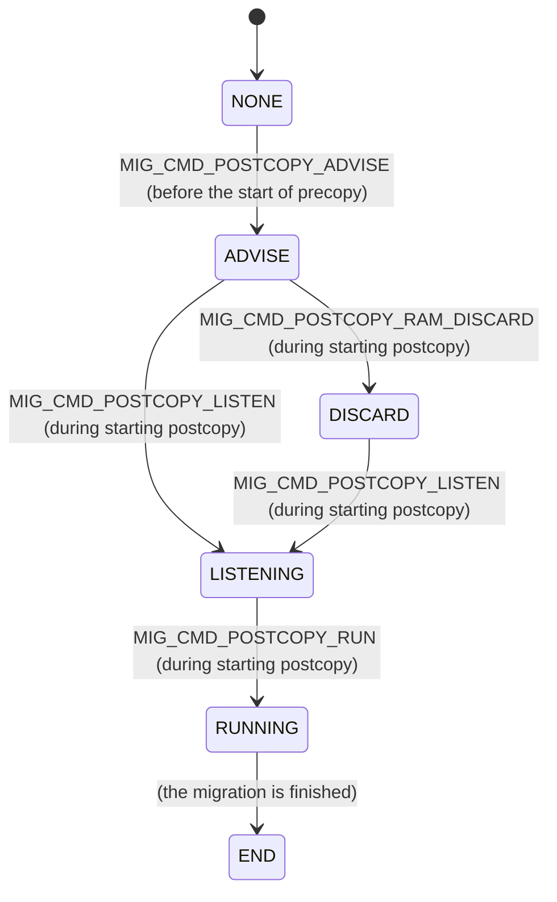

### `MIGRATION_STATUS_POSTCOPY_PAUSED` / `qmp_migrate_pause()` / `postcopy_pause()` QEMU

We can try to either:

- Unplug the wire of the migration channel to emulate an interrupt of migration, or
- We can use the "`migrate-pause`" command to emulate network interruption from the software layer. If the latter, the command only needs to be run on **source side**.

After the migration was interrupted, we should see that both sides of VM went into `postcopy-paused` state.

可能是因为网络原因，我们会进入 paused 状态，等到网络恢复我们可以手动触发 RESUME 来重新进行迁移。

Migrate-pause is currently only supported during `postcopy-active` or `postcopy-recover` state。

**migrate-pause 之后 destination 端还可以继续 run 吗？**

应该不可以了，因为 fault thread 会 block，从而导致 vCPU 发生的 page fault 没有办法被 handle，所以 block 在那里。

对于 postcopy 设计这个状态的原因可能是最新的状态是分散在两边的，所以不能 cleanup 任何一边，只能先保存现场。

```c
// destination side
qemu_loadvm_state_main
    if (ret < 0) {
        postcopy_pause_incoming
            // Current state can be either ACTIVE or RECOVER
            migrate_set_state(&mis->state, mis->state, MIGRATION_STATUS_POSTCOPY_PAUSED);
```

手动 pause migration 的地方（只需要在 source 端执行就行了，dst 端不需要执行）：

```c
void qmp_migrate_pause(Error **errp)
{
    MigrationState *ms = migrate_get_current();
    MigrationIncomingState *mis = migration_incoming_get_current();
    int ret = 0;

    if (migration_postcopy_is_alive(ms->state)) {
        /* Source side, during postcopy */
        Error *error = NULL;

        /* Tell the core migration that we're pausing */
        error_setg(&error, "Postcopy migration is paused by the user");
        migrate_set_error(ms, error);
        error_free(error);

        qemu_mutex_lock(&ms->qemu_file_lock);
        if (ms->to_dst_file) {
            ret = qemu_file_shutdown(ms->to_dst_file);
        }
        qemu_mutex_unlock(&ms->qemu_file_lock);
        if (ret) {
            error_setg(errp, "Failed to pause source migration");
        }

        /*
         * Kick the migration thread out of any waiting windows (on behalf
         * of the rp thread).
         */
        migration_rp_kick(ms);

        return;
    }

    if (migration_postcopy_is_alive(mis->state)) {
        ret = qemu_file_shutdown(mis->from_src_file);
        if (ret) {
            error_setg(errp, "Failed to pause destination migration");
        }
        return;
    }

    error_setg(errp, "migrate-pause is currently only supported "
               "during postcopy-active or postcopy-recover state");
}
```

发现可能有网络错误后自动 pause 的地方（source 端）：

```c
// 在 source 端：
migration_thread
    migration_detect_error
        // 如果发现是在 postcopy 中发现了错误
        if (state == MIGRATION_STATUS_POSTCOPY_ACTIVE && ret) {
            return postcopy_pause(s);
static MigThrError postcopy_pause(MigrationState *s)
{
    assert(s->state == MIGRATION_STATUS_POSTCOPY_ACTIVE);

    while (true) {
        QEMUFile *file;

        /*
         * Current channel is possibly broken. Release it.  Note that this is
         * guaranteed even without lock because to_dst_file should only be
         * modified by the migration thread.  That also guarantees that the
         * unregister of yank is safe too without the lock.  It should be safe
         * even to be within the qemu_file_lock, but we didn't do that to avoid
         * taking more mutex (yank_lock) within qemu_file_lock.  TL;DR: we make
         * the qemu_file_lock critical section as small as possible.
         */
        assert(s->to_dst_file);
        migration_ioc_unregister_yank_from_file(s->to_dst_file);
        qemu_mutex_lock(&s->qemu_file_lock);
        file = s->to_dst_file;
        s->to_dst_file = NULL;
        qemu_mutex_unlock(&s->qemu_file_lock);

        qemu_file_shutdown(file);
        qemu_fclose(file);

        /*
         * We're already pausing, so ignore any errors on the return
         * path and just wait for the thread to finish. It will be
         * re-created when we resume.
         */
        close_return_path_on_source(s);

        migrate_set_state(&s->state, s->state,
                          MIGRATION_STATUS_POSTCOPY_PAUSED);

        // 表示我们的确遇到了网络问题
        error_report("Detected IO failure for postcopy. Migration paused.");
        //...
    }
}
```

发现可能有网络错误后自动 pause 的地方（destination 端）：

```c
// 此时该函数是 run 在 listen thread 里的，所以 block 的也是 listen thread
qemu_loadvm_state_main
    if (ret < 0) {
        postcopy_pause_incoming
/* Return true if we should continue the migration, or false. */
static bool postcopy_pause_incoming(MigrationIncomingState *mis)
{
    //...
    // wake up fault thread, 告诉他 QEMUFile 都置 0 了。
    // 在 fault thread 中，当其发现 !mis->to_src_file 时，就会
    // 调用 postcopy_pause_fault_thread，从而 block 对于 page fault 的处理
    // 这样就相当于 block 了 vCPU 线程，因为其 page fault 没有办法得到处理。
    postcopy_fault_thread_notify(mis);

    //...
    // block this thread
    while (mis->state == MIGRATION_STATUS_POSTCOPY_PAUSED) {
        qemu_sem_wait(&mis->postcopy_pause_sem_dst);
    }
    //...
}
```

### Why we need to enable the `postcopy-ram` capability first?

有四个作用：

- 在 precopy 迁移前和 destination 对上我们这边 page size 之类的一些属性；
- 在 precopy 迁移前和 destination 的每一个 block 对上 page size 之类的属性；
- 做一些 post-copy 后面会用到的初始化工作；
- 实现 RAM device 的 `.has_postcopy()` 函数，用来判断 RAM 有没有 post-copy 阶段。

When this capability is enabled, function `migrate_postcopy_ram()` will return true rather than false.

我们需要在开始 pre-copy 迁移的时候就提前告诉 destination 端我们这边的一些属性：

- 每一个 `RAMBlock` 的 page size；
- target page size。

这样 destination 端才能进行比较：

```c
//...
if (remote_pagesize_summary != local_pagesize_summary)  {
    /*
     * This detects two potential causes of mismatch:
     *   a) A mismatch in host page sizes
     *      Some combinations of mismatch are probably possible but it gets
     *      a bit more complicated.  In particular we need to place whole
     *      host pages on the dest at once, and we need to ensure that we
     *      handle dirtying to make sure we never end up sending part of
     *      a hostpage on it's own.
     *   b) The use of different huge page sizes on source/destination
     *      a more fine grain test is performed during RAM block migration
     *      but this test here causes a nice early clear failure, and
     *      also fails when passed to an older qemu that doesn't
     *      do huge pages.
     */
    error_report("Postcopy needs matching RAM page sizes (s=%" PRIx64 " d=%" PRIx64 ")",
                 remote_pagesize_summary, local_pagesize_summary);
    return -1;
}
//...
if (remote_tps != page_size) {
    /*
     * Again, some differences could be dealt with, but for now keep it simple.
     */
    error_report("Postcopy needs matching target page sizes (s=%d d=%zd)", (int)remote_tps, page_size);
    return -1;
}
```

同时，如果我们有可能后面进入 post-copy，那么我们在 precopy 之前就应该：

```c
case MIG_CMD_POSTCOPY_ADVISE:
    loadvm_postcopy_handle_advise()
        ram_postcopy_incoming_init()
            postcopy_ram_incoming_init()
                foreach_not_ignored_block(init_range, NULL)

/*
 * Setup an area of RAM so that it *can* be used for postcopy later; this
 * must be done right at the start prior to pre-copy.
 */
static int init_range(RAMBlock *rb, void *opaque)
{
    const char *block_name = qemu_ram_get_idstr(rb);
    void *host_addr = qemu_ram_get_host_addr(rb);
    ram_addr_t offset = qemu_ram_get_offset(rb);
    ram_addr_t length = qemu_ram_get_used_length(rb);
    //...
    /*
     * Save the used_length before running the guest. In case we have to
     * resize RAM blocks when syncing RAM block sizes from the source during
     * precopy, we'll update it manually via the ram block notifier.
     */
    rb->postcopy_length = length;

    // 记住这个函数是在 precopy 之前调用的，所以本来这些 block 就是空的。但是我们现在要保证它完全是空的
    // 因为对于 precopy，原来的数据会被覆盖，所以不需要；但是对于 post-copy，如果有数据的地方还没来得及
    // 在之前的 precopy 阶段被覆盖，那么我们会误以为这个是已经迁移过来的而不向 src request page。so things
    // like ROMs and any data tables built during init must be zero'd.
    ram_discard_range(block_name, 0, length) //...
    return 0;
}
```

当然，如果发现我们 enable 了 `postcopy-ram` 这个 capability，在 `ram_save_setup()` 阶段我们也需要发送每一个 `RAMBlock` 的 page size 过去。

```c
// src
static int ram_save_setup(QEMUFile *f, void *opaque)
{
    //...
    WITH_RCU_READ_LOCK_GUARD() {
        qemu_put_be64(f, ram_bytes_total_with_ignored() | RAM_SAVE_FLAG_MEM_SIZE);
        RAMBLOCK_FOREACH_MIGRATABLE(block) {
            qemu_put_byte(f, strlen(block->idstr));
            qemu_put_buffer(f, (uint8_t *)block->idstr, strlen(block->idstr));
            qemu_put_be64(f, block->used_length);
            if (migrate_postcopy_ram() && block->page_size != qemu_host_page_size) {
                qemu_put_be64(f, block->page_size);
            }
            if (migrate_ignore_shared()) {
                qemu_put_be64(f, block->mr->addr);
            }
        }
    }
    //...
}

// dst
static int parse_ramblock(QEMUFile *f, RAMBlock *block, ram_addr_t length)
{
    //...
    /* For postcopy we need to check hugepage sizes match */
    if (postcopy_advised && migrate_postcopy_ram() && block->page_size != qemu_host_page_size) {
        uint64_t remote_page_size = qemu_get_be64(f);
        if (remote_page_size != block->page_size) {
            error_report("Mismatched RAM page size %s "
                         "(local) %zd != %" PRId64, block->idstr,
                         block->page_size, remote_page_size);
            return -EINVAL;
        }
    }
    //...
}
```

最后一个作用，用来实现 `.has_postcopy()` 这个 device specific 的函数，这个函数用来判断这个 device 有没有 post-copy 阶段，也就是在 post-copy 阶段有没有东西需要发送？这个 device 知不知道其在 post-copy 阶段需要发送什么？

### Where to send the remaining RAM state when post-copy has started?

Still in the original path in the master thread. 可以看到，`postcopy_start()` 会返回 `MIG_ITERATE_SKIP`，所以还会继续到下一个 iteration 或者 completion。

```c
static MigIterateState migration_iteration_run(MigrationState *s)
{
    //...
    if (pending_size && pending_size >= s->threshold_size) {
        /* Still a significant amount to transfer */
        //...
        if (!in_postcopy && pend_pre <= s->threshold_size && qatomic_read(&s->start_postcopy)) {
            postcopy_start(s)
            return MIG_ITERATE_SKIP;
        }
        qemu_savevm_state_iterate(s->to_dst_file, in_postcopy);
    } else {
        migration_completion(s);
        return MIG_ITERATE_BREAK;
    }
    //...
}

static void *migration_thread(void *opaque)
{
    //...
    while (migration_is_active(s)) {
        if (urgent || !qemu_file_rate_limit(s->to_dst_file)) {
            MigIterateState iter_state = migration_iteration_run(s);
            if (iter_state == MIG_ITERATE_SKIP) {
                continue;
            } else if (iter_state == MIG_ITERATE_BREAK) {
                break;
            }
        }
        //...
    }
    //...
}
```

### When does the source stop and the destination start to run?

Source will stop when:

```c
postcopy_start
    ret = vm_stop_force_state(RUN_STATE_FINISH_MIGRATE);
```

Destination will run when destination receive the flag `MIG_CMD_POSTCOPY_RUN`.

但是因为 listen thread 在接收到 `MIG_CMD_POSTCOPY_LISTEN` 之后就已经创建了，那么，在 dst 创建了 listen thread 之后并在收到 `MIG_CMD_POSTCOPY_RUN` 之前，两个接收者（主线程，listen thread）同时存在，这个时候 src 发来的数据应该由谁来负责接收？

从代码来看，src 端希望等到把所有 non-iterative 的 device state 发完之后才会发送 RUN，这部分数据是 dst 的 main thread 来接收的：

```c
postcopy_start
    qemu_savevm_send_postcopy_listen(fb);
    qemu_savevm_state_complete_precopy(fb, false, false);
    if (migrate_postcopy_ram()) {
        qemu_savevm_send_ping(fb, 3);
    }
    qemu_savevm_send_postcopy_run(fb);
```

其实是在 fb 这个 buffer 里面全部发送给 dst 的主线程的，虽然 dst 收到了 listen 会创建 listen 线程，但是还是主线程在接收数据。

### How long does the page fault handler hang when post-copy? `mark_postcopy_blocktime_begin()` / `mark_postcopy_blocktime_end()` / QEMU

`mark_postcopy_blocktime_begin()` 是在 fault thread 接收到 userfaultfd 的信息之后就开始调用的，记录了开始时间。

```c
// fault thread start blocktime
postcopy_ram_fault_thread
    mark_postcopy_blocktime_begin

// Receive the page from src and place it
ram_load_postcopy
    postcopy_place_page
        qemu_ufd_copy_ioctl
            mark_postcopy_blocktime_end
```

### `postcopy_request_page()` QEMU

dst 请求 page 的函数。

```c
postcopy_ram_fault_thread
    postcopy_request_page
static int postcopy_request_page(MigrationIncomingState *mis, RAMBlock *rb,
                                 ram_addr_t start, uint64_t haddr)
{
    //...
    return migrate_send_rp_req_pages(mis, rb, start, haddr);
}
```

### `migrate_send_rp_req_pages()` / `migrate_send_rp_message_req_pages()` / `migrate_send_rp_message()` QEMU

检查 `receivedmap` 并给 src 发送请求的地方。

```c
postcopy_ram_fault_thread
    postcopy_request_page
        migrate_send_rp_req_pages
int migrate_send_rp_req_pages(MigrationIncomingState *mis,
                              RAMBlock *rb, ram_addr_t start, uint64_t haddr)
{
    void *aligned = (void *)(uintptr_t)ROUND_DOWN(haddr, qemu_ram_pagesize(rb));
    bool received = false;

    //...
    // 检查一下 receivedmap 里有没有这个 page
    received = ramblock_recv_bitmap_test_byte_offset(rb, start);
    // 如果我们没有接收到同时我们也还没有给 src 发送请求
    if (!received && !g_tree_lookup(mis->page_requested, aligned)) {
        //...
        g_tree_insert(mis->page_requested, aligned, (gpointer)1);
        qatomic_inc(&mis->page_requested_count);
    }

    // If the page is there, skip sending the message.
    if (received) {
        return 0;
    }

    return migrate_send_rp_message_req_pages(mis, rb, start);
}

// Request one page from the source VM at the given start address.
int migrate_send_rp_message_req_pages(MigrationIncomingState *mis,
                                  RAMBlock *rb, ram_addr_t start)
{
    uint8_t bufc[12 + 1 + 255]; /* start (8), len (4), rbname up to 256 */
    size_t msglen = 12; /* start + len */
    size_t len = qemu_ram_pagesize(rb);
    enum mig_rp_message_type msg_type;
    const char *rbname;
    int rbname_len;

    // 前 8 个 bytes 放 start address
    *(uint64_t *)bufc = cpu_to_be64((uint64_t)start);
    // 4 个 bytes 用来放 len
    *(uint32_t *)(bufc + 8) = cpu_to_be32((uint32_t)len);

    // 记录一下上一个 page 请求所在的 ramblock
    // 这样我们可以只发送 MIG_RP_MSG_REQ_PAGES 而不发送 MIG_RP_MSG_REQ_PAGES_ID
    // 减少发送数据量
    if (rb != mis->last_rb) {
        mis->last_rb = rb;

        rbname = qemu_ram_get_idstr(rb);
        rbname_len = strlen(rbname);

        assert(rbname_len < 256);

        bufc[msglen++] = rbname_len;
        memcpy(bufc + msglen, rbname, rbname_len);
        msglen += rbname_len;
        msg_type = MIG_RP_MSG_REQ_PAGES_ID;
    } else {
        msg_type = MIG_RP_MSG_REQ_PAGES;
    }

    return migrate_send_rp_message(mis, msg_type, msglen, bufc);
}

// 这个函数不只是请求一个 page，其可以请求多个 page，取决于
// 传进来的 data 的对应 len 的那部分的值是几个 page size。
static int migrate_send_rp_message(MigrationIncomingState *mis,
                               enum mig_rp_message_type message_type,
                               uint16_t len, void *data)
{
    //...
    // [TYPE, LEN, DATA] 数据流，以一个相同 rb 的 request 为例：
    // TYPE = MIG_RP_MSG_REQ_PAGES
    qemu_put_be16(mis->to_src_file, (unsigned int)message_type);
    // 12 (start 8 bytes + len 4 bytes)
    qemu_put_be16(mis->to_src_file, len);
    // start address 8 bytes + len 4 bytes
    // 因为 len 这 4 bytes 所表示的值不一定就是 page size，所以
    // 这说明我们可以一次性请求多个 page（连续的）
    qemu_put_buffer(mis->to_src_file, data, len);
    qemu_fflush(mis->to_src_file);
    //...
}
```

### `postcopy_place_page()` / `qemu_ufd_copy_ioctl()` QEMU

This function is running inside the **listen thread**.

在 Dst 端执行的。当从 src 端收到了的页后，不管这个页是：

- 由于 dst 发生 page fault 而向 src 端请求的页，还是，
- src 端 bulk stage 的在 precopy 阶段还没有发送完的页。

都把它内容放到指定的地址。

```c
// from: 保存了这个 page 的数据
// host：要 place 的地址
int postcopy_place_page(MigrationIncomingState *mis, void *host, void *from, RAMBlock *rb)
{
    size_t pagesize = qemu_ram_pagesize(rb);

    /* copy also acks to the kernel waking the stalled thread up
     * TODO: We can inhibit that ack and only do it if it was requested
     * which would be slightly cheaper, but we'd have to be careful
     * of the order of updating our page state.
     */
    qemu_ufd_copy_ioctl(mis, host, from, pagesize, rb)
    //...
    return postcopy_notify_shared_wake(rb, qemu_ram_block_host_offset(rb, host));
}

// host_addr：要放的地址
// from_addr：指向存着数据的页
static int qemu_ufd_copy_ioctl(MigrationIncomingState *mis, void *host_addr,
                               void *from_addr, uint64_t pagesize, RAMBlock *rb)
{
    int userfault_fd = mis->userfault_fd;
    int ret;

    // The buffer for the content
    if (from_addr) {
        struct uffdio_copy copy_struct;
        copy_struct.dst = (uint64_t)(uintptr_t)host_addr;
        copy_struct.src = (uint64_t)(uintptr_t)from_addr;
        copy_struct.len = pagesize;
        copy_struct.mode = 0;
        // 通过 ioctl 来把 page 数据放到指定的地方
        ret = ioctl(userfault_fd, UFFDIO_COPY, &copy_struct);
    // This page is all zero
    } else {
        struct uffdio_zeropage zero_struct;
        zero_struct.range.start = (uint64_t)(uintptr_t)host_addr;
        zero_struct.range.len = pagesize;
        zero_struct.mode = 0;
        // 通过 ioctl 来把指定地址以及长度的空间置为 zero
        ret = ioctl(userfault_fd, UFFDIO_ZEROPAGE, &zero_struct);
    }
    //...
    qemu_mutex_lock(&mis->page_request_mutex);
    // 置上 receivedmap 表示这个 page 我们收到了
    ramblock_recv_bitmap_set_range(rb, host_addr, pagesize / qemu_target_page_size());
    // If this page resolves a page fault for a previous recorded faulted
    // address, take a special note to maintain the requested page list.
    if (g_tree_lookup(mis->page_requested, host_addr)) {
        g_tree_remove(mis->page_requested, host_addr);
        int left_pages = qatomic_dec_fetch(&mis->page_requested_count);

        //...
        /* Order the update of count and read of preempt status */
        smp_mb();
        if (mis->preempt_thread_status == PREEMPT_THREAD_QUIT && left_pages == 0) {
            /*
             * This probably means the main thread is waiting for us.
             * Notify that we've finished receiving the last requested
             * page.
             */
            qemu_cond_signal(&mis->page_request_cond);
        }
    }
    qemu_mutex_unlock(&mis->page_request_mutex);
    mark_postcopy_blocktime_end((uintptr_t)host_addr);
    //...
}
```

### `ram_load_postcopy()` QEMU

这个函数是在 postcopy listen thread（`postcopy_ram_listen_thread()`） 里被调用的，不是主线程，切记。

load **one page** in postcopy case，一般这个 page 是发生 page fault 之后请求的 page 吧。

有两个 channel，`RAM_CHANNEL_PRECOPY` 就是普通的，`RAM_CHANNEL_POSTCOPY` 是用来给 preempt 用的。

可以从以下 code 验证：

```c
ram_load
    //...
    // postcopy running 表示此时 src VM 已经停止运行了
    // destination 此时在运行（ps >= POSTCOPY_INCOMING_LISTENING）
    // 所以此时
    if (postcopy_running) {
        ret = ram_load_postcopy(f, RAM_CHANNEL_PRECOPY;
    } else {
        ret = ram_load_precopy(f);
    }

```

### `enum mig_rp_message_type` QEMU

Destination 往 source 发送的 flag，因为是 return path 嘛。

```c
/* Messages sent on the return path from destination to source */
enum mig_rp_message_type {
    MIG_RP_MSG_INVALID = 0,  /* Must be 0 */
    MIG_RP_MSG_SHUT,         /* sibling will not send any more RP messages */
    MIG_RP_MSG_PONG,         /* Response to a PING; data (seq: be32 ) */

    MIG_RP_MSG_REQ_PAGES_ID, /* data (start: be64, len: be32, id: string) */
    MIG_RP_MSG_REQ_PAGES,    /* data (start: be64, len: be32) */
    MIG_RP_MSG_RECV_BITMAP,  /* send recved_bitmap back to source */
    MIG_RP_MSG_RESUME_ACK,   /* tell source that we are ready to resume */
    MIG_RP_MSG_SWITCHOVER_ACK, /* Tell source it's OK to do switchover */
    MIG_RP_MSG_REQ_PRIVATE_PAGES_ID,
    MIG_RP_MSG_REQ_PRIVATE_PAGES,

    MIG_RP_MSG_MAX
};
```

### `MIG_CMD_RECV_BITMAP` QEMU

主要是用来在 postcopy 阶段，停止 live migration 并恢复 src 端的数据，也就是不想迁了。

所以这个时候，src 需要请求 dst 端的 receivemap，从而知道哪些 page 是需要拿回来的。

src:

```c
postcopy_do_resume
    qemu_savevm_state_resume_prepare
        ram_resume_prepare // savevm_ram_handlers->resume_prepare
            ram_dirty_bitmap_sync_all
                qemu_savevm_send_recv_bitmap
                    qemu_savevm_command_send(f, MIG_CMD_RECV_BITMAP, len + 1, (uint8_t *)buf);
```

dst:

```c
MIG_CMD_RECV_BITMAP
    loadvm_handle_recv_bitmap
        migrate_send_rp_recv_bitmap
            ramblock_recv_bitmap_send
```

### How to handle the page fault when post-copy / `postcopy_ram_fault_thread()` / QEMU

对于 private page 我们有一个 array 里面存着每一个 private page，对于 shared page 我们不需要缓存，是发生了 page fault 直接发的。

对于 private page fault，我们其实没有用到 userfaultfd 这个功能。

Destination side to process the page fault (private):

```c
KVM_EXIT_MEMORY_FAULT
    kvm_convert_memory
        kvm_convert_memory_private_mr
            // 如果是在 postcopy 过程中，同时我们要把 page 转成 private 的
            // 同时 receivedmap 没有置上表示我们还没有接收到这个 page 或者被 discard 掉了
            // 这种情况我们才需要向 source 请求。
            if (is_postcopy_private_fault())
                postcopy_add_private_fault_to_pending_list
                    QSIMPLEQ_INSERT_TAIL(&mis->private_fault_req_pending_list, req, next_req);
                    postcopy_fault_thread_notify(mis);
                        // Wakeup the fault_thread (this thread is for sending fault back to src).
                        // It's an eventfd that should currently be at 0, we're going to increment it to 1
                        write(mis->userfault_event_fd, &tmp64, 8)
                    // 需要等待拿到 fault 的 page 内容才可以继续，这只在 TD live migration 被用到
                    qemu_sem_wait(&req->sem);
```

对于 shared page fault，我们没有上面的这个通知过程，而是直接在 `postcopy_ram_fault_thread()` 里拿到发生 page fault 的 address 然后通知过去的。

```c
vcpu_enter_guest
    vmx_handle_exit
        __vmx_handle_exit
            handle_ept_violation
                kvm_mmu_page_fault
                    r = kvm_mmu_do_page_fault
                    // error occured
                    if (r < 0)
                		return r;
                    // this page fault is not an MMIO page fault, otherwise we should emulate it.
                	if (r != RET_PF_EMULATE)
                		return 1;

        
```

We will register the userfaultfd to get page faults when we receiving the LISTEN command:

```c
loadvm_postcopy_handle_listen
    postcopy_ram_incoming_setup
        ram_block_enable_notify
            ioctl(mis->userfault_fd, UFFDIO_REGISTER, &reg_struct)
```

Destination side to send the page fault:

```c
MIG_CMD_POSTCOPY_LISTEN
    loadvm_postcopy_handle_listen
        postcopy_ram_incoming_setup
            postcopy_thread_create(&mis->fault_thread, "fault-default", postcopy_ram_fault_thread);

// Handle faults detected by the USERFAULT markings
static void *postcopy_ram_fault_thread(void *opaque)
{
    MigrationIncomingState *mis = opaque;
    struct uffd_msg msg;
    int ret;
    size_t index;
    RAMBlock *rb = NULL;

    //...
    mis->last_rb = NULL; /* last RAMBlock we sent part of */
    qemu_sem_post(&mis->thread_sync_sem);

    struct pollfd *pfd;
    size_t pfd_len = 2 + mis->postcopy_remote_fds->len;

    pfd = g_new0(struct pollfd, pfd_len);

    // --------- setup pfd 这个数组 ---------
    // We have 2 fds:
    //  - userfault_fd: For kernel to send us notifications
    //  - userfault_event_fd: Let other thread wake up the fault thread, e.g., when need to quit,
    //    or clear the private page fault array for TD live migration.
    pfd[0].fd = mis->userfault_fd;
    pfd[0].events = POLLIN;
    pfd[1].fd = mis->userfault_event_fd;
    pfd[1].events = POLLIN; /* Waiting for eventfd to go positive */
    //...
    // ------------- 结束 setup -------------
    while (true) {
        ram_addr_t rb_offset;
        int poll_result;

        // We're mainly waiting for the kernel to give us a faulting HVA,
        // however we can be told to quit via userfault_quit_fd which is an eventfd
        // 我们会一直 pull pfd，看看有什么消息
        // 如果 dst TD 都还没有 run，那么断然是不会接收到 page fault 的
        // 所以我们可以保证在 dst 收到 RUN_CMD 后这里才会返回。
        poll_result = poll(pfd, pfd_len, -1 /* Wait forever */);
        //...
        //...

        // userfault eventfd，作用是让这个线程被唤醒，比如 page fault handler
        // 可以 post 这个 fd 然后唤醒这个线程来让这个线程发送 page fault 数据给 src。
        if (pfd[1].revents) {
            // consume the signal ...
            read(mis->userfault_event_fd, &tmp64, 8)
            // 这个 userfault eventfd 也可以让 fault thread 退出。
            if (qatomic_read(&mis->fault_thread_quit)) {
                //...
                break;
            }
        }

        // 清空要发送的 page fault 的 private page list（private_fault_req_pending_list）。
        // 注意，清空的是 private 的队列，normal page 没有队列，是发生了 page fault 后就直接发了。
        postcopy_send_private_fault_page(mis);

        // 0 is userfault fd, userfault fd 有了信息，说明有了 page fault
        if (pfd[0].revents) {
            poll_result--;
            ret = read(mis->userfault_fd, &msg, sizeof(msg));
            // error handling...

            // get the RAMBlock from the HVA
            rb = qemu_ram_block_from_host((void *)(uintptr_t)msg.arg.pagefault.address, true, &rb_offset);
            // error handling...

            rb_offset = ROUND_DOWN(rb_offset, qemu_ram_pagesize(rb));
            //...
            mark_postcopy_blocktime_begin( (uintptr_t)(msg.arg.pagefault.address), msg.arg.pagefault.feat.ptid, rb);

            // Send the request to the source，这应该是对于 shared 的。
            // 省去了因为网络原因 retry 的动作
            ret = postcopy_request_page(mis, rb, rb_offset, msg.arg.pagefault.address);
        }

        // 看 code 可能和 vHost 相关？先不管了
        for (index = 2; index < pfd_len && poll_result; index++) {
            if (pfd[index].revents) {
                //...
            }
        }
    }
    //...
    g_free(pfd);
    return NULL;
}
```

Source side return path thread receives the request, adds that request to the queue, then the master thread will send the queued page next time:

```c
source_return_path_thread
    case MIG_RP_MSG_REQ_PAGES:
        migrate_handle_rp_req_pages
            ram_save_queue_pages(rbname, start, len, is_private)
                QSIMPLEQ_INSERT_TAIL(&rs->src_page_requests, new_entry, next_req);

ram_find_and_save_block
    get_queued_page
        unqueue_page
            QSIMPLEQ_REMOVE_HEAD(&rs->src_page_requests, next_req);
    ram_save_host_page
```

Destination side to receive the page (just in the listen thread to receive). and wake up the sleeping page fault handler:

```c
// 这个函数是 destination 端来判断需不需要把这个 fault 发送给 src
// 如果 receivedbmap 里已经有了这个 page，那么其实不需要发送
// 直接 wake up page fault handler 就好了
postcopy_add_pending_req_to_sent_list
    if (test_bit(offset >> qemu_target_page_bits(), rb->receivedmap)) {
        qemu_sem_post(&req->sem);

// **in the listen thread** for **private** page
ram_load_postcopy
    if (is_private)
        postcopy_remove_from_sent_list
            // wake up
            qemu_sem_post(&req->sem);
        
// **in the listen thread** for **shared** page
ram_load_postcopy
    postcopy_place_page^ / postcopy_place_page_zero
        qemu_ufd_copy_ioctl
            ioctl(userfault_fd, UFFDIO_COPY, &copy_struct) / ioctl(userfault_fd, UFFDIO_ZEROPAGE, &zero_struct)
```

### `PostcopyChannels` QEMU

```c
enum PostcopyChannels {
    // RAM_CHANNEL_PRECOPY is the precopy channel of postcopy migration
    RAM_CHANNEL_PRECOPY = 0,
    // 这个 channel 是为了 postcopy-preempt 用的，为了更快地响应 destination 端发来的 page fault 的 
    RAM_CHANNEL_POSTCOPY = 1,
    RAM_CHANNEL_MAX,
};
```

### Does post-copy has blackout phase (downtime) like pre-copy?

Short answer: Yes.

**Downtime**: This is time during which the migrating VM’s execution is stopped. At the minimum this includes the transfer of processor state.

- For pre-copy, this transfer also includes any remaining dirty pages.
- For post-copy this includes other minimal execution state, if any, needed by the VM to start at the target.

(PDF) Post-copy live migration of virtual machines. Available from: https://www.researchgate.net/publication/220624148_Post-copy_live_migration_of_virtual_machines [accessed Oct 10 2023].

Post-copy 只是省去了 RAM 发送的 downtime，但是其他状态的发送仍然需要 downtime，比如 CPU 状态的发送。

### `source_return_path_thread()` QEMU

很重要的函数，表示在 source 端处理 return path 的主线程，地位和 `migration_thread` 和 `multifd_send_thread` 是相当的。有时间了仔细看看。

```c
migrate_fd_connect
    open_return_path_on_source
        qemu_thread_create(&ms->rp_state.rp_thread, "return path", source_return_path_thread, ms, QEMU_THREAD_JOINABLE);
static void *source_return_path_thread(void *opaque)
{
    MigrationState *ms = opaque;
    QEMUFile *rp = ms->rp_state.from_dst_file;
    uint16_t header_len, header_type;
    uint8_t buf[512];
    uint32_t tmp32, sibling_error;
    ram_addr_t start = 0; /* =0 to silence warning */
    size_t  len = 0, expected_len;
    int res;

    trace_source_return_path_thread_entry();
    rcu_register_thread();

retry:
    while (!ms->rp_state.error && !qemu_file_get_error(rp) &&
           migration_is_setup_or_active(ms->state)) {
        trace_source_return_path_thread_loop_top();
        header_type = qemu_get_be16(rp);
        header_len = qemu_get_be16(rp);

        if (qemu_file_get_error(rp)) {
            mark_source_rp_bad(ms);
            goto out;
        }

        if (header_type >= MIG_RP_MSG_MAX ||
            header_type == MIG_RP_MSG_INVALID) {
            error_report("RP: Received invalid message 0x%04x length 0x%04x",
                         header_type, header_len);
            mark_source_rp_bad(ms);
            goto out;
        }

        if ((rp_cmd_args[header_type].len != -1 &&
            header_len != rp_cmd_args[header_type].len) ||
            header_len > sizeof(buf)) {
            error_report("RP: Received '%s' message (0x%04x) with"
                         "incorrect length %d expecting %zu",
                         rp_cmd_args[header_type].name, header_type, header_len,
                         (size_t)rp_cmd_args[header_type].len);
            mark_source_rp_bad(ms);
            goto out;
        }

        /* We know we've got a valid header by this point */
        res = qemu_get_buffer(rp, buf, header_len);
        if (res != header_len) {
            error_report("RP: Failed reading data for message 0x%04x"
                         " read %d expected %d",
                         header_type, res, header_len);
            mark_source_rp_bad(ms);
            goto out;
        }

        /* OK, we have the message and the data */
        switch (header_type) {
        case MIG_RP_MSG_SHUT:
            sibling_error = ldl_be_p(buf);
            trace_source_return_path_thread_shut(sibling_error);
            if (sibling_error) {
                error_report("RP: Sibling indicated error %d", sibling_error);
                mark_source_rp_bad(ms);
            }
            /*
             * We'll let the main thread deal with closing the RP
             * we could do a shutdown(2) on it, but we're the only user
             * anyway, so there's nothing gained.
             */
            goto out;

        case MIG_RP_MSG_PONG:
            tmp32 = ldl_be_p(buf);
            trace_source_return_path_thread_pong(tmp32);
            qemu_sem_post(&ms->rp_state.rp_pong_acks);
            break;

        case MIG_RP_MSG_REQ_PAGES:
            start = ldq_be_p(buf);
            len = ldl_be_p(buf + 8);
            migrate_handle_rp_req_pages(ms, NULL, start, len);
            break;

        case MIG_RP_MSG_REQ_PAGES_ID:
            expected_len = 12 + 1; /* header + termination */

            if (header_len >= expected_len) {
                start = ldq_be_p(buf);
                len = ldl_be_p(buf + 8);
                /* Now we expect an idstr */
                tmp32 = buf[12]; /* Length of the following idstr */
                buf[13 + tmp32] = '\0';
                expected_len += tmp32;
            }
            if (header_len != expected_len) {
                error_report("RP: Req_Page_id with length %d expecting %zd",
                             header_len, expected_len);
                mark_source_rp_bad(ms);
                goto out;
            }
            migrate_handle_rp_req_pages(ms, (char *)&buf[13], start, len);
            break;

        case MIG_RP_MSG_RECV_BITMAP:
            if (header_len < 1) {
                error_report("%s: missing block name", __func__);
                mark_source_rp_bad(ms);
                goto out;
            }
            /* Format: len (1B) + idstr (<255B). This ends the idstr. */
            buf[buf[0] + 1] = '\0';
            if (migrate_handle_rp_recv_bitmap(ms, (char *)(buf + 1))) {
                mark_source_rp_bad(ms);
                goto out;
            }
            break;

        case MIG_RP_MSG_RESUME_ACK:
            tmp32 = ldl_be_p(buf);
            if (migrate_handle_rp_resume_ack(ms, tmp32)) {
                mark_source_rp_bad(ms);
                goto out;
            }
            break;

        case MIG_RP_MSG_SWITCHOVER_ACK:
            ms->switchover_acked = true;
            trace_source_return_path_thread_switchover_acked();
            break;

        default:
            break;
        }
    }

out:
    res = qemu_file_get_error(rp);
    if (res) {
        if (res && migration_in_postcopy()) {
            /*
             * Maybe there is something we can do: it looks like a
             * network down issue, and we pause for a recovery.
             */
            migration_release_dst_files(ms);
            rp = NULL;
            if (postcopy_pause_return_path_thread(ms)) {
                /*
                 * Reload rp, reset the rest.  Referencing it is safe since
                 * it's reset only by us above, or when migration completes
                 */
                rp = ms->rp_state.from_dst_file;
                ms->rp_state.error = false;
                goto retry;
            }
        }

        trace_source_return_path_thread_bad_end();
        mark_source_rp_bad(ms);
    }

    trace_source_return_path_thread_end();
    migration_release_dst_files(ms);
    rcu_unregister_thread();
    return NULL;
}
```

### `ram_save_queue_pages()` QEMU

This is only called in the return path (rp) function `migrate_handle_rp_req_pages()`. 也就是说，主要是 post copy 的时候会用到。

```c
int ram_save_queue_pages(const char *rbname, ram_addr_t start, ram_addr_t len)
{
    RAMBlock *ramblock;
    RAMState *rs = ram_state;

    stat64_add(&mig_stats.postcopy_requests, 1);
    RCU_READ_LOCK_GUARD();

    if (!rbname) {
        /* Reuse last RAMBlock */
        ramblock = rs->last_req_rb;

        if (!ramblock) {
            /*
             * Shouldn't happen, we can't reuse the last RAMBlock if
             * it's the 1st request.
             */
            error_report("ram_save_queue_pages no previous block");
            return -1;
        }
    } else {
        ramblock = qemu_ram_block_by_name(rbname);

        if (!ramblock) {
            /* We shouldn't be asked for a non-existent RAMBlock */
            error_report("ram_save_queue_pages no block '%s'", rbname);
            return -1;
        }
        rs->last_req_rb = ramblock;
    }
    trace_ram_save_queue_pages(ramblock->idstr, start, len);
    if (!offset_in_ramblock(ramblock, start + len - 1)) {
        error_report("%s request overrun start=" RAM_ADDR_FMT " len="
                     RAM_ADDR_FMT " blocklen=" RAM_ADDR_FMT,
                     __func__, start, len, ramblock->used_length);
        return -1;
    }

    /*
     * When with postcopy preempt, we send back the page directly in the
     * rp-return thread.
     */
    if (postcopy_preempt_active()) {
        ram_addr_t page_start = start >> TARGET_PAGE_BITS;
        size_t page_size = qemu_ram_pagesize(ramblock);
        PageSearchStatus *pss = &ram_state->pss[RAM_CHANNEL_POSTCOPY];
        int ret = 0;

        qemu_mutex_lock(&rs->bitmap_mutex);

        pss_init(pss, ramblock, page_start);
        /*
         * Always use the preempt channel, and make sure it's there.  It's
         * safe to access without lock, because when rp-thread is running
         * we should be the only one who operates on the qemufile
         */
        pss->pss_channel = migrate_get_current()->postcopy_qemufile_src;
        assert(pss->pss_channel);

        /*
         * It must be either one or multiple of host page size.  Just
         * assert; if something wrong we're mostly split brain anyway.
         */
        assert(len % page_size == 0);
        while (len) {
            if (ram_save_host_page_urgent(pss)) {
                error_report("%s: ram_save_host_page_urgent() failed: "
                             "ramblock=%s, start_addr=0x"RAM_ADDR_FMT,
                             __func__, ramblock->idstr, start);
                ret = -1;
                break;
            }
            /*
             * NOTE: after ram_save_host_page_urgent() succeeded, pss->page
             * will automatically be moved and point to the next host page
             * we're going to send, so no need to update here.
             *
             * Normally QEMU never sends >1 host page in requests, so
             * logically we don't even need that as the loop should only
             * run once, but just to be consistent.
             */
            len -= page_size;
        };
        qemu_mutex_unlock(&rs->bitmap_mutex);

        return ret;
    }

    struct RAMSrcPageRequest *new_entry =
        g_new0(struct RAMSrcPageRequest, 1);
    new_entry->rb = ramblock;
    new_entry->offset = start;
    new_entry->len = len;

    memory_region_ref(ramblock->mr);
    qemu_mutex_lock(&rs->src_page_req_mutex);
    QSIMPLEQ_INSERT_TAIL(&rs->src_page_requests, new_entry, next_req);
    migration_make_urgent_request();
    qemu_mutex_unlock(&rs->src_page_req_mutex);

    return 0;
}
```

### `migrate_handle_rp_req_pages()` QEMU

这个函数只在 `source_return_path_thread()` 中被调用了。

### `receivedmap` QEMU

这个 RAMBlock 的 field 是给 post-copy 用的。bitmap of already received pages in postcopy。但是因为 post-copy 之前也会 pre-copy，所以 pre-copy 的过程也会对其进行设置：

```c
// pre-copy dst load 一个 page 时设置 receivedmap 的地方
ram_load_precopy
    ramblock_recv_bitmap_set
        set_bit_atomic(..., rb->receivedmap);

// post-copy dst load 一个 page 时设置 receivedmap 的地方
ram_load_postcopy
    postcopy_place_page
    postcopy_place_page_zero
        qemu_ufd_copy_ioctl
            ramblock_recv_bitmap_set_range
```

一个页分三种情况：

- source 端有，destination 端没有
- source 端有，destination 端也有，并且和 source 端内容一样
- source 端有，destination 端有且被更新。

后两种都会在 `receivedmap` 中被置上，表示我们不需要向 source 端拿了，同时也表示 destination 端的此 page 要比 source 端更加新，更加 up-to-date。这也就是为什么在 discard 阶段要把 `receivedbmap` 也清空。所以它的作用：

- dst 发生 PF 时，可以 check 一下，如果为 1，表示在 handle PF 的这段时间内已经接收到了，这样就不需要再发送请求了。
- 迁移失败做 recover 时，receivedmap 表示了对于一个页哪边更新，可以把 bitmap 发送到 src 端然后两边一起 co-work 来恢复。
- …

这个 bitmap 并不是在发生 EPT Violation 然后做 `HVA->PFN` 映射转成 page fault 到 userfaultfd 之后需要检查的，因为在 userfaultfd 报告出来之后，就说明我们已经需要从 source 来拿这个 page 了（这个 page 要么还没有发送过来，要么已经 discard 掉了）。

```c
static bool is_postcopy_private_fault(RAMBlock *rb, ram_addr_t offset, bool to_private)
{
    //...
    return !test_bit(bit, rb->receivedmap);
}

// discard 阶段要 discard source 已经发送但是又 dirty 的 bitmap
// 在 dst 这里反映出来就是要 clear 对应 bit。
int ram_discard_range(const char *rbname, uint64_t start, size_t length)
{
    //...
    bitmap_clear(rb->receivedmap, start >> qemu_target_page_bits(), length >> qemu_target_page_bits());
    return ram_block_discard_range(rb, start, length);
}

// 这个函数是在接收到 source 端发来的对于 recved_bitmap 的请求时的 destination 端
// 的处理函数，本身并不能说明 receivedmap 的作用。
int64_t ramblock_recv_bitmap_send(QEMUFile *file, const char *block_name)
{
    //...
    bitmap_to_le(le_bitmap, block->receivedmap, nbits);
    //...
}
```

所有 test 和 set `receivedmap` 的 thread：

- QEMU main thread：在接到 ADVISE 命令的时候，把所有 RAMBLock 的 receivedbmap 清空，此时应该还没有开始迁移。
- QEMU main thread: 在 pre-copy 阶段 load 一个 page 的时候会设置。
- QEMU main thread：在接到 DISCARD 命令的时候需要清空。
- Listen thread：这个 thread 在开始 postcopy 的时候接管了 QEMU main thread 的功能，在收到一个 page 并 place 的时候，需要置上。
- Fault thread：在统计 fault handle 时间的时候用来检查是否已经接收过了。
- Fault thread：在 request page 的时候来检查是否已经接收过了。在 Listen thread load 结束的时候，理论上所有的 page 应该已经 load 结束了，所以所有 receivedmap 应该都是 1 了，因此不需要再向 source 端请求 page 了。page fault 还是会产生，但是不需要通过 userfaultfd 汇报上来了，因为我们不需要再请求页了。这只是一个 normal page fault，页内容已经在那里放着了。

```c
postcopy_request_page
    /*
     * Discarded pages (via RamDiscardManager) are never migrated. On unlikely
     * access, place a zeropage, which will also set the relevant bits in the
     * recv_bitmap accordingly, so we won't try placing a zeropage twice.
     *
     * Checking a single bit is sufficient to handle pagesize > TPS as either
     * all relevant bits are set or not.
     */
    if (ramblock_page_is_discarded(rb, start)) {
        bool received = ramblock_recv_bitmap_test_byte_offset(rb, start);

        return received ? 0 : postcopy_place_page_zero(mis, aligned, rb);
    }

```

## Return path

Only an unidirectional stream is required for normal migration, however a return path can be created when **bidirectional communication is desired**. This is primarily used by postcopy.

所以说 return path 和 post-copy 这两个概念是有一定的耦合的。

'return path' is a method for the destination to send messages back to the source; used for

- postcopy page requests.
- allows the destination to signal failure back to the source.

### Return path thread

```c
migrate_fd_connect
    // 当是 post-copy 时，或者不是 post-copy 但是也需要用 return path 时
    if (migrate_postcopy_ram() || migrate_use_return_path())
        open_return_path_on_source
            qemu_thread_create(&ms->rp_state.rp_thread, "return path", source_return_path_thread, ms, QEMU_THREAD_JOINABLE);
```

## QEMU live migration overall data stream structure for postcopy

### TD live migration overall data stream structure for postcopy

```python
# master thread
# 这是第一个发送的，用来表示这是一个 Migration stream
QEMU_VM_FILE_MAGIC # 4 bytes
# migrate stream version, 表示兼容与否
QEMU_VM_FILE_VERSION # 4 bytes
? QEMU_VM_CONFIGURATION # 可选，是否发送一些 configuration 过去
    ############## setup 阶段（缩进表示这是对所有的 device 不只是 ram，仅仅以 ram 为例） ###############
    ######################################## End of setup phase #######################################
    ################################## Start of PART phase in precopy ##################################
    ################################## End of PART phase in precopy ##################################
    ### After several PART phases in precopy...
    ################################ Start **preparing** for postcopy ################################
    # 这个部分主要是为了把所有 dirty 的 page 在 destination 那里 cancel 掉，
    # 这样 destination 才能触发 page fault。
    QEMU_VM_SECTION_PART # 传统 SECTION_PART 开局，不足为奇
    se->section_id # 4 bytes, 接下来的 section id
    RAM_SAVE_FLAG_CGS_EPOCH # 省略了一些 data，都是 CGS_EPOCH 相关的。
        # 缩进表示会有多次 page 的发送
        if this block:
            offset | RAM_SAVE_FLAG_CONTINUE | RAM_SAVE_FLAG_CGS_STATE_CANCEL
        else: # another block
            offset | RAM_SAVE_FLAG_CGS_STATE_CANCEL
            len(block->idstr)
            block->idstr
        TDX Header # 主要表示接下来的几个数据长度都是多少（都是等长的，目前实现是 1，也就是一次一个 page 发送）
        MBMD
        buffer list
        gpa list
        mac list
    RAM_SAVE_FLAG_EOS
    QEMU_VM_SECTION_FOOTER # 传统 SECTION_PART 结束，不足为奇
    se->section_id # 再发送一次 section id
    ################################# End **preparing** for postcopy #################################
    ####################################### Start of END phase #######################################
    # ...
    ######################################## END of END phase ########################################
QEMU_VM_EOF # 表示整个迁移的结束
# 完结，撒花
```

# Post-copy States / `PostcopyState`

这是 destination 端的概念，source 端没有这些。

The state is updated as postcopy messages are received, and in general only one thread should be writing to the state at any one time, initially the main thread and then the listen thread; The state is checked as messages are received to ensure that the source is sending us messages in the correct order.

```c
// Each state transition before state POSTCOPY_INCOMING_LISTENING is in main thread
// Each state transition after state POSTCOPY_INCOMING_LISTENING is in listen thread
typedef enum {
    POSTCOPY_INCOMING_NONE = 0,  /* Initial state - no postcopy */
    POSTCOPY_INCOMING_ADVISE,
    POSTCOPY_INCOMING_DISCARD,
    POSTCOPY_INCOMING_LISTENING,
    POSTCOPY_INCOMING_RUNNING,
    POSTCOPY_INCOMING_END
} PostcopyState;
```



### `MIG_CMD_POSTCOPY_ADVISE` / `loadvm_postcopy_handle_advise()` / `POSTCOPY_INCOMING_ADVISE` QEMU

在 src 端执行 `migrate -d tcp:$dst_ip:6666` 开启 precopy 的时候，如果 src 端

- enable 了 postcopy，或者，
- enable 了 `MIGRATION_CAPABILITY_DIRTY_BITMAPS` 这个 capability。

那么会发送这个 command 过来告诉 destination 我们后续**可能**进行 post-copy 的迁移。

如果两边都 enable 了 `postcopy-ram` 的话，dst 在**迁移之前**已经转成 `POSTCOPY_INCOMING_ADVISE` 状态了。

在 ADVISE 状态下，A postcopy *might* happen - it might be skipped if precopy transferred everything quickly.

Only "NONE" can transfer to this state.

```c
static int loadvm_postcopy_handle_advise(MigrationIncomingState *mis, uint16_t len)
{
    PostcopyState ps = postcopy_state_set(POSTCOPY_INCOMING_ADVISE);
    uint64_t remote_pagesize_summary, local_pagesize_summary, remote_tps;
    size_t page_size = qemu_target_page_size();
    //...
    // 后面跟着的信息有可能是（当 src 和 dst 都打开了 postcopy-ram 时，这时会在 master thread 刚开始就发送这个信息过来）
    //  - (len: 8) ram_pagesize_summary(): VM 里所有可能的 page size，是一个 bitmap，表示 page size 集合
    //  - (len: 8) qemu_target_page_size()：TARGET_PAGE_SIZE
    // 也有可能不跟任何信息（当 src, dst 都没有打开 postcopy-ram 时）
    //...
    // check if host can suport postcopy or not , e.g., userfaultfd...
    //...
    // page size checking based on the ram_pagesize_summary() info from src and dst side
    //...
    // target page size checking based on the TARGET_PAGE_SIZE info from src and dst side
    //...
}
```

## `MIG_CMD_POSTCOPY_RAM_DISCARD` / `loadvm_postcopy_ram_handle_discard()` / `POSTCOPY_INCOMING_DISCARD` QEMU

从 `POSTCOPY_INCOMING_ADVISE` 到 `POSTCOPY_INCOMING_DISCARD`。

对于 private dirty 的 page，也会走这一套流程吗？

`DISCARD` 状态表示我们正在 drop 那些 src 端 dirty 的 pages，从而能够让 dst 发生 page fault 去重新请求，而不是用 stale 的数据。

首先要了解基本的概念，`RANGE` 表示的是一个 RAMBlock 的 dirty bitmap 中一段连续的为 1 的区间。一个 `COMMAND` 包含多个 `DISCARDS`（也就是 `RANGE`）：

```c
#define MAX_DISCARDS_PER_COMMAND 12
```

虽然定义为 12，但是并不是每次发 `COMMAND` 的时候都包含 12 个 `RANGE`，这是因为一个 `RAMBlock` 不一定有 12 个 `RANGE`。因此可以总结：一个 `RAMBblock` 的所有 `RANGE` 的发送会使用 1 到无穷个 `COMMAND`s，其中最后一个 `COMMAND` 不一定包含 12 个 `RANGE`s。

```c
postcopy_start
    ram_postcopy_send_discard_bitmap
        postcopy_each_ram_send_discard
            postcopy_send_discard_bm_ram
                postcopy_discard_send_range
                    qemu_savevm_send_postcopy_ram_discard
                        qemu_savevm_command_send(f, MIG_CMD_POSTCOPY_RAM_DISCARD, tmplen, buf);

static int loadvm_postcopy_ram_handle_discard(MigrationIncomingState *mis, uint16_t len)
{
    int tmp;
    char ramid[256];
    PostcopyState ps = postcopy_state_get();
    //...

    // 因为 DISCARD 的命令会被发来很多次（针对不同的 range）
    // 所以只需要在第一次的时候设置为 DISCARD 的状态即可
    switch (ps) {
    case POSTCOPY_INCOMING_ADVISE:
        // 1st discard, set new state
        postcopy_ram_prepare_discard(mis);
        break;
    case POSTCOPY_INCOMING_DISCARD:
        // Expected state, do nothing
        break;
        //...
    }
    /* We're expecting a
     *    Version (0)
     *    a RAM ID string (length byte, name, 0 term)
     *    then at least 1 16 byte chunk
    */
    // 接下来要接收的数据的长度，因为至少需要接收到
    //  - version (1 byte),
    //  - ram string 的长度 (1 byte)，
    //  - block name (at lease 1 byte)
    //  - '\0' 表示 name 要结束：(1 byte)
    //  - 一个 (start, len) pair (8 + 8 bytes)
    // 所以至少是 1 + 1 + 1 + 1 + 2 * 8
    if (len < (1 + 1 + 1 + 1 + 2 * 8)) {
        error_report("CMD_POSTCOPY_RAM_DISCARD invalid length (%d)", len);
        return -1;
    }

    tmp = qemu_get_byte(mis->from_src_file);
    // 对比一下 version
    if (tmp != postcopy_ram_discard_version) {
        error_report("CMD_POSTCOPY_RAM_DISCARD invalid version (%d)", tmp);
        return -1;
    }

    // 读出来 ram string 的长度以及 ram string
    if (!qemu_get_counted_string(mis->from_src_file, ramid)) {
        error_report("CMD_POSTCOPY_RAM_DISCARD Failed to read RAMBlock ID");
        return -1;
    }

    // '\0'
    tmp = qemu_get_byte(mis->from_src_file);
    if (tmp != 0) {
        error_report("CMD_POSTCOPY_RAM_DISCARD missing nil (%d)", tmp);
        return -1;
    }

    len -= 3 + strlen(ramid);
    if (len % 16) {
        error_report("CMD_POSTCOPY_RAM_DISCARD invalid length (%d)", len);
        return -1;
    }
    //...
    // 接收 (start, len) pair，一个 pair 16 bytes
    while (len) {
        uint64_t start_addr, block_length;
        start_addr = qemu_get_be64(mis->from_src_file);
        block_length = qemu_get_be64(mis->from_src_file);

        len -= 16;
        ram_discard_range(ramid, start_addr, block_length);
        //...
    }
    //...
}
```

### `ram_discard_range()` / `ram_block_discard_range()` / `ram_block_discard_range_fd()` QEMU

真正把 dirty bitmap 置空，同时把 page 内容丢掉的地方。

```c
// discard dirtied pages at the beginning of postcopy
int ram_discard_range(const char *rbname, uint64_t start, size_t length)
{
    //...
    RAMBlock *rb = qemu_ram_block_by_name(rbname);
    //...
    // 把 bitmap 置空
    if (rb->receivedmap) {
        bitmap_clear(rb->receivedmap, start >> qemu_target_page_bits(), length >> qemu_target_page_bits());
    }

    // 扔掉 page 内容，这样才能真正触发 page fault
    return ram_block_discard_range(rb, start, length);
}

// 扔掉 page 内容
// 使用 rb 默认的 fd，如果要使用 restricted_fd（gmem_fd）
// 那么请直接调用 ram_block_discard_range_fd()
int ram_block_discard_range(RAMBlock *rb, uint64_t start, size_t length)
{
    return ram_block_discard_range_fd(rb, start, length, rb->fd);
}

// 扔掉 page 内容
// 这个函数还有一个可能被调用的地方，ram_block_convert_range
// 在那里，传进来的 fd 可能就是 rb->gmem_fd 而不是 rb->fd。
static int ram_block_discard_range_fd(RAMBlock *rb, uint64_t start, size_t length, int fd)
{
    int ret = -1;

    uint8_t *host_startaddr = rb->host + start;

    // align check...
    if ((start + length) <= rb->max_length) {
        bool need_madvise, need_fallocate;
        //...

        // The logic here is messy;
        //    madvise DONTNEED fails for hugepages
        //    fallocate works on hugepages and shmem
        //    shared anonymous memory requires madvise REMOVE
        // 从条件可以看出，need_madvise 一般是 true
        // 当传进来的是 gmem_fd 时，那我我们就不需要 madvise 了
        need_madvise = (rb->page_size == qemu_host_page_size) && (rb->fd == fd);
        // 从条件可以看出，这个也一般是 true
        need_fallocate = fd != -1;
        if (need_fallocate) {
            // For a file, this causes the area of the file to be zero'd
            // if read, and for hugetlbfs also causes it to be unmapped
            // so a userfault will trigger.
            // fallocate 函数就是用来操作文件内容的：
            // FALLOC_FL_PUNCH_HOLE 表示 deallocates space (i.e., creates a hole) in the
            // byte range starting at offset and continuing for len bytes
            // 从这两个可以看出来，
            ret = fallocate(fd, FALLOC_FL_PUNCH_HOLE | FALLOC_FL_KEEP_SIZE, start, length);
            //...
        }
        if (need_madvise) {
            // For normal RAM this causes it to be unmapped,
            // for shared memory it causes the local mapping to disappear
            // and to fall back on the file contents (which we just
            // fallocate'd away).
            //...
            if (qemu_ram_is_shared(rb) && fd < 0) {
                // MADV_REMOVE：Free up a given range of pages and its associated backing
                // store.  This is equivalent to punching a hole in the
                // corresponding range of the backing store
                // 也就是说，效果和 fallocate PUNCH_HOLE 是一样的
                ret = madvise(host_startaddr, length, QEMU_MADV_REMOVE);
            } else {
                // 在未来的一段时间我们不会访问这段内存区域
                ret = madvise(host_startaddr, length, QEMU_MADV_DONTNEED);
            }
            //...
        }
        //...
    }
    //...
}
```

### `struct PostcopyDiscardState` QEMU

```c
struct PostcopyDiscardState {
    // 一般就是 block->idstr
    const char *ramblock_name;
    // 表示是当前 COMMAND 的第几个 range
    uint16_t cur_entry;
    // 一个 (start_list[i], length_list[i]) pair 表示的是
    // 从第几个 byte 开始，中间有多长的 byte 是应该 discard 的。
    uint64_t start_list[MAX_DISCARDS_PER_COMMAND];
    uint64_t length_list[MAX_DISCARDS_PER_COMMAND];
    // 表示对于当前 block，已经发送了几个 RANGEs
    // 到下一个 block 时会清零。
    unsigned int nsentwords;
    // 表示对于当前 block，已经发送了几个 COMMANDs
    // 到下一个 block 时会清零。
    unsigned int nsentcmds;
};
```

### `ram_postcopy_send_discard_bitmap()` QEMU

主要针对的是之前传过，现在又 dirty 的 pages。需要在 destination 端 discard 才能触发 page fault。

从第一个 block 的第一个 page 开始搜。

```c
void ram_postcopy_send_discard_bitmap(MigrationState *ms)
{
    RAMState *rs = ram_state;
    //...
    // 这应该时最后一次 sync bitmap，因为 src 已经关闭了，不会有新的 dirty page 出现了
    migration_bitmap_sync(rs, false);

    // Easiest way to make sure we don't resume in the middle of a host-page
    // 这表示我们要从第一个 block 的第一个 page 开始扫？
    rs->pss[RAM_CHANNEL_PRECOPY].last_sent_block = NULL;
    rs->last_seen_block = NULL;
    rs->last_page = 0;

    postcopy_each_ram_send_discard(ms);
    //...
}
```

### `postcopy_each_ram_send_discard()` QEMU

对于每一个 RAMBlock 来执行。

```c
static void postcopy_each_ram_send_discard(MigrationState *ms)
{
    struct RAMBlock *block;

    // 对于每一个 RAMBlock
    RAMBLOCK_FOREACH_NOT_IGNORED(block) {
        postcopy_discard_send_init(ms, block->idstr);

        // 主要是大页相关的，先不关心
        postcopy_chunk_hostpages_pass(ms, block);

        /*
         * Postcopy sends chunks of bitmap over the wire, but it
         * just needs indexes at this point, avoids it having
         * target page specific code.
         */
        postcopy_send_discard_bm_ram(ms, block);
        postcopy_discard_send_finish(ms);
    }
}
```

### `postcopy_send_discard_bm_ram()` QEMU

概括：这个函数会把一个 block 的 dirty bitmap 的所有全 1 的**区间**找出来，然后把这些区间分别发出去。

```c
// postcopy_send_discard_bm_ram: discard a RAMBlock
// Callback from postcopy_each_ram_send_discard for each RAMBlock
static void postcopy_send_discard_bm_ram(MigrationState *ms, RAMBlock *block)
{
    // end 表示我们只在这一个 block 里进行搜索
    unsigned long end = block->used_length >> TARGET_PAGE_BITS;
    unsigned long current;
    // dirty bitmap used during migration
    unsigned long *bitmap = block->bmap;

    for (current = 0; current < end; ) {
        // 找到下一个 bitmap 为 1 的 bit
        unsigned long one = find_next_bit(bitmap, end, current);
        unsigned long zero, discard_length;

        //...

        // 再找到下一个为 0 的 bit，这样我们就能锁定一个全 1 的区间
        zero = find_next_zero_bit(bitmap, end, one + 1);

        if (zero >= end) {
            discard_length = end - one;
        } else {
            discard_length = zero - one;
        }
        // 把这个区间发过去
        postcopy_discard_send_range(ms, one, discard_length);
        current = one + discard_length;
    }
}
```

### `postcopy_discard_send_range()` QEMU

```c
/**
 * postcopy_discard_send_range: Called by the bitmap code for each chunk to
 *   discard. May send a discard message, may just leave it queued to
 *   be sent later.
 *
 * @ms: Current migration state.
 * @start,@length: a range of pages in the migration bitmap in the
 *   RAM block passed to postcopy_discard_send_init() (length=1 is one page)
 */
void postcopy_discard_send_range(MigrationState *ms, unsigned long start, unsigned long length)
{
    size_t tp_size = qemu_target_page_size();
    /* Convert to byte offsets within the RAM block */
    pds.start_list[pds.cur_entry] = start  * tp_size;
    pds.length_list[pds.cur_entry] = length * tp_size;
    //...
    pds.cur_entry++;
    pds.nsentwords++;

    // 满 12 个了，一起发过去
    // Full set, ship it!
    if (pds.cur_entry == MAX_DISCARDS_PER_COMMAND) {
        // send the command MIG_CMD_POSTCOPY_RAM_DISCARD
        qemu_savevm_send_postcopy_ram_discard(ms->to_dst_file,
                                              pds.ramblock_name,
                                              pds.cur_entry,
                                              pds.start_list,
                                              pds.length_list);
        pds.nsentcmds++;
        pds.cur_entry = 0;
    }
}
```

### `qemu_savevm_send_postcopy_ram_discard()` QEMU

发送一个 command（可能包含多个 range）。

```c
void qemu_savevm_send_postcopy_ram_discard(QEMUFile *f, const char *name,
                                           uint16_t len,
                                           uint64_t *start_list,
                                           uint64_t *length_list)
{
    //...
    // 把 COMMAND 和数据一起发过去
    qemu_savevm_command_send(f, MIG_CMD_POSTCOPY_RAM_DISCARD, tmplen, buf);
}
```

### `postcopy_discard_send_finish()` QEMU

平平无奇的函数，如果 block 扫完了还没有攒够 12 个，那就不管剩下几个，一起全部发过去。

```c
void postcopy_discard_send_finish(MigrationState *ms)
{
    /* Anything unsent? */
    if (pds.cur_entry) {
        qemu_savevm_send_postcopy_ram_discard(ms->to_dst_file,
                                              pds.ramblock_name,
                                              pds.cur_entry,
                                              pds.start_list,
                                              pds.length_list);
        pds.nsentcmds++;
    }
    //...
}
```

## `MIG_CMD_POSTCOPY_LISTEN` / `loadvm_postcopy_handle_listen()` / `POSTCOPY_INCOMING_LISTENING` / Listen thread QEMU

Destination 在接收到此 CMD 时，会将状态转为 `MIGRATION_STATUS_POSTCOPY_ACTIVE`。

- 从 DISCARD 转成 LISTEN：更加常见，因为我们大多数情况下都是需要扔掉旧 page 的。
- 从 ADVISE 转成 LISTEN：更加稀有。

一口气在 destination 端创建三个线程：在 `postcopy_ram_incoming_setup()` 中：

- `postcopy_ram_fault_thread()`：这个表示用来处理 userfaultfd 报上来的 page fault。
- `postcopy_preempt_thread()`: 这个表示快速 load source 端发来 page 的线程。（不一定有，取决于是否开启 preemption 这个 feature）。
- 最后创建了 `postcopy_ram_listen_thread()`。

在 dst 端：

```c
MIG_CMD_POSTCOPY_LISTEN
    loadvm_postcopy_handle_listen

/* After this message we must be able to immediately receive postcopy data */
static int loadvm_postcopy_handle_listen(MigrationIncomingState *mis)
{
    PostcopyState ps = postcopy_state_set(POSTCOPY_INCOMING_LISTENING);
    //...
    if (ps == POSTCOPY_INCOMING_ADVISE) {
        // 这说明我们没有经历中间的 discard 阶段，也就是说没什么需要 discard 的
        // so do the setup that's normally done at the time of the 1st discard.
        if (migrate_postcopy_ram()) {
            postcopy_ram_prepare_discard(mis);
        }
    }

    /*
     * Sensitise RAM - can now generate requests for blocks that don't exist
     * However, at this point the CPU shouldn't be running, and the IO
     * shouldn't be doing anything yet so don't actually expect requests
     */
    if (migrate_postcopy_ram()) {
        postcopy_ram_incoming_setup(mis)
    }

    //...
    mis->have_listen_thread = true;
    // 创建一个 listen 的线程
    postcopy_thread_create(mis, &mis->listen_thread, "postcopy/listen", postcopy_ram_listen_thread, QEMU_THREAD_DETACHED);
}
```

### `postcopy_ram_incoming_setup()` QEMU

最重要的在于创建了两个新的线程。

- `postcopy_ram_fault_thread`：这个表示用来处理 userfaultfd 报上来的 page fault。
- `postcopy_preempt_thread`: 这个表示快速处理 page fault 的线程。

```c
int postcopy_ram_incoming_setup(MigrationIncomingState *mis)
{
    Error *local_err = NULL;

    // 打开一个 userfaultfd
    mis->userfault_fd = uffd_open(O_CLOEXEC | O_NONBLOCK);
    //...

    // 使用这个 userfaultfd，进行一些 userfaultfd 的设置和初始化
    ufd_check_and_apply(mis->userfault_fd, mis, &local_err);

    /* Now an eventfd we use to tell the fault-thread to quit */
    // userfault_event_fd 是一个被 userfault 使用的 eventfd
    mis->userfault_event_fd = eventfd(0, EFD_CLOEXEC);
    //...

    // 创建一个新线程
    postcopy_thread_create(mis, &mis->fault_thread, "fault-default", postcopy_ram_fault_thread, QEMU_THREAD_JOINABLE);
    mis->have_fault_thread = true;

    /* Mark so that we get notified of accesses to unwritten areas */
    if (foreach_not_ignored_block(ram_block_enable_notify, mis)) {
        error_report("ram_block_enable_notify failed");
        return -1;
    }

    if (postcopy_temp_pages_setup(mis)) {
        /* Error dumped in the sub-function */
        return -1;
    }

    // 快速处理 page fault，需要创建一个 postcopy_preempt_thread 线程。
    if (migrate_postcopy_preempt()) {
        /*
         * This thread needs to be created after the temp pages because
         * it'll fetch RAM_CHANNEL_POSTCOPY PostcopyTmpPage immediately.
         */
        postcopy_thread_create(mis, &mis->postcopy_prio_thread, "fault-fast", postcopy_preempt_thread, QEMU_THREAD_JOINABLE);
        mis->preempt_thread_status = PREEMPT_THREAD_CREATED;
    }
    //...
}
```

### `postcopy_ram_listen_thread()` QEMU

在 destination 接收到 LISTEN 的 command 之后，其会创建一个此线程。这个线程会接管所有对于 RAM load 的工作，这样主线程可以专心用来处理 destination RUN 的过程中所需要处理的事情。具体的接管方式是，当 dst 收到了 `MIG_CMD_POSTCOPY_RUN` 这个 command 后，处理完后的返回值为 `LOADVM_QUIT`，此时在 dst 主线程运行的 `qemu_loadvm_state_main()` 函数会退出，这样后面的 read 就都由 listen 线程来负责了。

listen 线程和主线程都用了 `mis->from_src_file` 这个 `QEMUFile`，所以可以无缝衔接。

在 **listen 线程被创建**了之后到**主线程退出**还有一个时间 gap，在这个期间要发送 non-iterative 的 device state，这是让 destination 端跑起来所必须的：

```c
postcopy_start
    // listen 线程创建
    qemu_savevm_send_postcopy_listen(fb);
    // 发送 non-iterative device state
    qemu_savevm_state_complete_precopy(fb, false, false);
    if (migrate_postcopy_ram()) {
        qemu_savevm_send_ping(fb, 3);
    }
    // 主线程退出
    qemu_savevm_send_postcopy_run(fb);
```

如果我们改成下面就会出错：

```c
postcopy_start
    qemu_savevm_state_complete_precopy(fb, false, false, false);
    qemu_savevm_send_postcopy_listen(fb);
    qemu_savevm_send_postcopy_run(fb);
```

如何确保是主线程在接收而不是 listen 线程在接收呢？

对于 destination 发生 page fault 请求到 src 发来的 RAM 数据，也是在这里接收的，如果希望能够更快一些被处理，则会在 preempt 线程里被接收。

```c
loadvm_postcopy_handle_listen
    postcopy_thread_create(mis, &mis->listen_thread, "postcopy/listen", postcopy_ram_listen_thread, QEMU_THREAD_DETACHED);

static void *postcopy_ram_listen_thread(void *opaque)
{
    MigrationIncomingState *mis = migration_incoming_get_current();
    QEMUFile *f = mis->from_src_file;
    int load_res;
    MigrationState *migr = migrate_get_current();

    //...
    migrate_set_state(&mis->state, MIGRATION_STATUS_ACTIVE, MIGRATION_STATUS_POSTCOPY_ACTIVE);
    qemu_sem_post(&mis->thread_sync_sem);
    //...
    // 我们是线程不是协程，没法 yield 出去让别的协程执行
    // 所以我们将其设置为 block 的，这样当对面没发数据的时候
    // 我们 block 在这里，CPU 会调度到其他线程执行。
    // 如果我们是协程，我们不应该 block 因为我们可以主动让出去让其他的协程
    // 继续执行，否则会让给其他线程。
    qemu_file_set_blocking(f, true);
    // 最主要的地方，最后会调用到 ram_load_postcopy
    // 我们可以通过打印线程 id 来印证这一点。
    load_res = qemu_loadvm_state_main(f, mis);

    /*
     * This is tricky, but, mis->from_src_file can change after it
     * returns, when postcopy recovery happened. In the future, we may
     * want a wrapper for the QEMUFile handle.
     */
    f = mis->from_src_file;

    // And non-blocking again so we don't block in any cleanup
    qemu_file_set_blocking(f, false);

    // error handling...
    if (load_res >= 0) {
        /*
         * This looks good, but it's possible that the device loading in the
         * main thread hasn't finished yet, and so we might not be in 'RUN'
         * state yet; wait for the end of the main thread.
         */
        qemu_event_wait(&mis->main_thread_load_event);
    }
    postcopy_ram_incoming_cleanup(mis);

    // error handling...
    migrate_set_state(&mis->state, MIGRATION_STATUS_POSTCOPY_ACTIVE, MIGRATION_STATUS_COMPLETED);
    // ---------- here, we can say the migration is done ---------
    /*
     * If everything has worked fine, then the main thread has waited
     * for us to start, and we're the last use of the mis.
     * (If something broke then qemu will have to exit anyway since it's
     * got a bad migration state).
     */
    migration_incoming_state_destroy();
    qemu_loadvm_state_cleanup();

    //...
    mis->have_listen_thread = false;
    postcopy_state_set(POSTCOPY_INCOMING_END);

    object_unref(OBJECT(migr));
    //...
}
```

## `MIG_CMD_POSTCOPY_RUN` / `loadvm_postcopy_handle_run()` / `POSTCOPY_INCOMING_RUNNING` QEMU

不一定在 dst 接收到这个开始运行之后才会出现 page fault。

在 src 发送了 listen 并收到 run 之间，会发送 non-iterative device 的 final state，可能触发 dst QEMU 里的一些 setup，从而产生 page fault 请求过来。

```c
// After all discards we can start running and asking for pages
static int loadvm_postcopy_handle_run(MigrationIncomingState *mis)
{
    PostcopyState ps = postcopy_state_get();

    //...
    postcopy_state_set(POSTCOPY_INCOMING_RUNNING);
    mis->bh = qemu_bh_new(loadvm_postcopy_handle_run_bh, mis);
    qemu_bh_schedule(mis->bh);

    //...
    return LOADVM_QUIT;
}

loadvm_postcopy_handle_run_bh
static void loadvm_postcopy_handle_run_bh(void *opaque)
{
    Error *local_err = NULL;
    MigrationIncomingState *mis = opaque;

    //...
    // 把所有 QEMU 里缓存的 vCPU 数据比如 MSR set 到 KVM 里
    cpu_synchronize_all_post_init();
    //...
    qemu_announce_self(&mis->announce_timer, migrate_announce_params());

    /* Make sure all file formats throw away their mutable metadata.
     * If we get an error here, just don't restart the VM yet. */
    bdrv_activate_all(&local_err);
    //...

    dirty_bitmap_mig_before_vm_start();

    // 扶好把手，VM 要启动了
    vm_start();
    //...
}
```

# Post-copy Phases

### Post-copy phase in source / `postcopy_start()` / `migrate_start_postcopy` / QEMU

```c
hmp_migrate_start_postcopy
    qmp_migrate_start_postcopy
        qatomic_set(&s->start_postcopy, true);

migration_iteration_run
    // if during the precopy, we find we need to switch to postcopy
    if (&s->start_postcopy)
        postcopy_start
            migration_pause // Enter blackout period, like KVM_TDX_MIG_EXPORT_PAUSE in TDX
            qemu_savevm_state_prepare_postcopy // prepare postcopy
                se->ops->prepare_postcopy() // ram_prepare_postcopy, for ram, it is used to 
            qemu_savevm_state_complete_precopy(ms->to_dst_file) // complete the precopy phase, trasfer multable state and EXPORT.TRACK
            qemu_savevm_send_postcopy_listen(fb); // send MIG_CMD_POSTCOPY_LISTEN to dst, make it can receive postcopy data
            qemu_savevm_state_complete_precopy(fb); // I don't know this
            qemu_savevm_send_postcopy_run // 
                qemu_savevm_command_send(f, MIG_CMD_POSTCOPY_RUN, 0, NULL); // Send a signal and kick dst to run
            qemu_savevm_send_packaged // 

static int postcopy_start(MigrationState *ms)
{
    int ret;
    QIOChannelBuffer *bioc;
    QEMUFile *fb;
    int64_t time_at_stop = qemu_clock_get_ms(QEMU_CLOCK_REALTIME);
    uint64_t bandwidth = migrate_max_postcopy_bandwidth();
    bool restart_block = false;
    int cur_state = MIGRATION_STATUS_ACTIVE;

    // preempt 相关得，这是一个性能 feature，让 post-copy request 相比于
    // precopy 的优先级提高，能够更快地进行处理。
    if (migrate_postcopy_preempt()) {
        migration_wait_main_channel(ms);
        if (postcopy_preempt_establish_channel(ms)) {
            migrate_set_state(&ms->state, ms->state, MIGRATION_STATUS_FAILED);
            return -1;
        }
    }

    if (!migrate_pause_before_switchover())
        migrate_set_state(&ms->state, MIGRATION_STATUS_ACTIVE, MIGRATION_STATUS_POSTCOPY_ACTIVE);

    //...
    qemu_system_wakeup_request(QEMU_WAKEUP_REASON_OTHER, NULL);
    global_state_store();
    // shutdown 这个 VM
    ret = vm_stop_force_state(RUN_STATE_FINISH_MIGRATE);
    //...

    // enter blackout period, will execute KVM_TDX_MIG_EXPORT_PAUSE in TDX
    ret = migration_pause(ms, &cur_state, MIGRATION_STATUS_POSTCOPY_ACTIVE);
    // -------------------- 此时 src 已经关闭了 -----------------------
    //...

    // bdrv...
    restart_block = true;
    // 对于 TDX 来说，就是发送一些因为 dirty 需要 CANCEL 的 page
    ret = qemu_savevm_state_prepare_postcopy(ms->to_dst_file);
    //...

    // 把除了 RAM 所有不能进行 post-copy 的其他 iterative 设备
    //（non-postcopiable, but iterative devices）的数据先一次性发完，
    // 这样才能进入 post-copy 阶段（因为 post-copy 只与 RAM 有关）
    // 同时也会发送 cgs_mig_savevm_state_end
    qemu_savevm_state_complete_precopy(ms->to_dst_file, true, false, true);

    // Send DISCARD command to the destination
    // 进入 DISCARD 阶段，discard 掉 source 端已发送但是又 dirty 的
    if (migrate_postcopy_ram()) {
        ram_postcopy_send_discard_bitmap(ms);
    }

    /*
     * send rest of state - note things that are doing postcopy
     * will notice we're in POSTCOPY_ACTIVE and not actually
     * wrap their state up here
     */
    migration_rate_set(bandwidth);

    /*
     * While loading the device state we may trigger page transfer
     * requests and the fd must be free to process those, and thus
     * the destination must read the whole device state off the fd before
     * it starts processing it.  Unfortunately the ad-hoc migration format
     * doesn't allow the destination to know the size to read without fully
     * parsing it through each devices load-state code (especially the open
     * coded devices that use get/put).
     * So we wrap the device state up in a package with a **length** at the start;
     * to do this we use a qemu_buf to hold the whole of the device state.
     */
    // 这里创建了一个新的 channel，QIOChannelBuffer 类型的。
    // 名字叫做 "migration-postcopy-buffer"
    // 如 comment 所说，device state format 是 ad hoc 的，destination 不知道要读
    // 多长的数据，所以设计这么个 package，把 device state 放在最前面。
    bioc = qio_channel_buffer_new(4096);
    qio_channel_set_name(QIO_CHANNEL(bioc), "migration-postcopy-buffer");
    // 借此创建一个新的 QEMUFile
    fb = qemu_file_new_output(QIO_CHANNEL(bioc));
    //...

    // Make sure the receiver can get incoming pages before we send the rest of the state
    // 发送 MIG_CMD_POSTCOPY_LISTEN 给 destination。让 destination 转为 listen state。
    // destination 会创建 listen thread 来接收 RAM state
    // 注意，这是一个 fb，且目的地址暂时还没有指定，所以这里相当于只是
    // 发送到了 fb 这个 buffer 这里，还没有真正发到对端。
    qemu_savevm_send_postcopy_listen(fb);

    // 其实只跑了里面的 qemu_savevm_state_complete_precopy_non_iterable
    // 里面会对每一个 hander 调用 vmstate_save，也就是不以迭代的方式来发送了。以
    // FULL 的方式而不是 PART 的方式来发送。
    // 经过实验，发现里面并不是发送 RAM 数据的地方，可能是发送一些
    // VM Description 或者 device 的数据过去？
    // 发送 non-iterative device 的数据过去
    // fb 注意同上。
    qemu_savevm_state_complete_precopy(fb, false, false, false);
    //...

    // 告诉 destination 可以开始执行了
    // fb 注意同上。
    qemu_savevm_send_postcopy_run(fb);
    ///////////////// 从这里开始，dst 开始执行，可以发送 page 的 request 过来 ////////////////

    /* <><> end of stuff going into the package */
    // error detection...
    restart_block = false;

    /* Now send that blob */
    // 这个 blob 是上面 fb 里缓存的内容，注意。
    if (qemu_savevm_send_packaged(ms->to_dst_file, bioc->data, bioc->usage)) {
        goto fail_closefb;
    }
    qemu_fclose(fb);

    /* Send a notify to give a chance for anything that needs to happen
     * at the transition to postcopy and after the device state; in particular
     * spice needs to trigger a transition now
     */
    ms->postcopy_after_devices = true;
    notifier_list_notify(&migration_state_notifiers, ms);

    ms->downtime =  qemu_clock_get_ms(QEMU_CLOCK_REALTIME) - time_at_stop;
    qemu_mutex_unlock_iothread();
    //ping pong thing...
    if (migrate_release_ram()) {
        ram_postcopy_migrated_memory_release(ms);
    }
    //...
    // error handling...
}


hmp_migrate_start_postcopy
    qmp_migrate_start_postcopy
        qatomic_set(&s->start_postcopy, true);

migration_iteration_run
    // if during the precopy, we find we need to switch to postcopy
    if (&s->start_postcopy)
        postcopy_start

static int postcopy_start(MigrationState *ms, Error **errp)
{
    int ret;
    QIOChannelBuffer *bioc;
    QEMUFile *fb;
    uint64_t bandwidth = migrate_max_postcopy_bandwidth();
    bool restart_block = false;
    int cur_state = MIGRATION_STATUS_ACTIVE;

    //...

    // Stop the VM and enter the blackout phase
    qemu_system_wakeup_request(QEMU_WAKEUP_REASON_OTHER, NULL);
    global_state_store();
    ret = migration_stop_vm(RUN_STATE_FINISH_MIGRATE);
    //...

    // Cause any non-postcopiable, but iterative devices to * send out their final data.
    qemu_savevm_state_complete_precopy(ms->to_dst_file, true, false);

    // 1. State transition from ADVISE -> DISCARD
    // Tell the destination to throw the pages that are dirtied again, so page fault can occurs on them
    // and the destination will forward the request to source side to get the up-to-date page content.
    if (migrate_postcopy_ram())
        ram_postcopy_send_discard_bitmap(ms);

    //...
    // 2. State transition from ADVISE/DISCARD -> LISTEN
    // Tell the receiver to start a listen thread to take over the main thread's loading task,
    // so we can make sure the receiver can get incoming pages before we send the rest of the state
    qemu_savevm_send_postcopy_listen(fb);

    // Before we really start to run the destination VM,
    // we should send the remaining non-iterable device state.
    // Then the desination will get all the things needed to run the VM
    qemu_savevm_state_complete_precopy(fb, false, false);
    //...

    // 3. State transition from LISTEN -> RUN
    // Let destination VM start to run, we can just waiting for destination's page fault request
    qemu_savevm_send_postcopy_run(fb);
    //...
}
```

# Post-copy Capabilities

### `postcopy-ram` / `MIGRATION_CAPABILITY_POSTCOPY_RAM` QEMU

Enable post-copy.

## `postcopy-preempt` / `MIGRATION_CAPABILITY_POSTCOPY_PREEMPT` QEMU

[[PATCH v9 00/14] migration: Postcopy Preemption - Peter Xu](https://lore.kernel.org/all/20220707185342.26794-1-peterx@redhat.com/)

```c
# @postcopy-preempt: If enabled, the migration process will allow
#     postcopy requests to preempt precopy stream, so postcopy
#     requests will be handled faster.  This is a performance feature
#     and should not affect the correctness of postcopy migration.
#     (since 7.1)

// 可以看到在 destination 开始 listen 的时候才会创建线程
// 因为这个之后才有可能产生产生 page fault
loadvm_postcopy_handle_listen
    postcopy_ram_incoming_setup
        postcopy_thread_create(mis, &mis->postcopy_prio_thread, "fault-fast", postcopy_preempt_thread, QEMU_THREAD_JOINABLE);
```

在 source 端和 destination 端添加了两个 `QEMUFile`：`QEMUFile *postcopy_qemufile_dst` 和 ``

### `postcopy_preempt_thread()` QEMU

postcopy-preempt 在 dst 是需要有一个单独的 thread 的。注意，不要把这个 thread 和 listen thread 搞混。

This thread is on the **destination side**. 尽管 preemption feature 只需在 destination 那里创建一个 thread，但是还是需要两边都通过 `migrate_set_capability postcopy-preempt on` 来打开。因为有一些地方需要 source 来配合。

```c
// 在收到 src 发来的 listen 的 command 之后，才会创建对应的 postcopy_preempt_thread
loadvm_postcopy_handle_listen
    postcopy_ram_incoming_setup
        postcopy_thread_create("fault-fast", postcopy_preempt_thread);

void *postcopy_preempt_thread(void *opaque)
{
    MigrationIncomingState *mis = opaque;
    int ret;

    trace_postcopy_preempt_thread_entry();

    rcu_register_thread();

    qemu_sem_post(&mis->thread_sync_sem);

    /*
     * The preempt channel is established in asynchronous way.  Wait
     * for its completion.
     */
    qemu_sem_wait(&mis->postcopy_qemufile_dst_done);

    while (preempt_thread_should_run(mis)) {
        ret = ram_load_postcopy(mis->postcopy_qemufile_dst, RAM_CHANNEL_POSTCOPY);
        /* If error happened, go into recovery routine */
        if (ret && preempt_thread_should_run(mis)) {
            postcopy_pause_ram_fast_load(mis);
        } else {
            /* We're done */
            break;
        }
    }

    rcu_unregister_thread();

    trace_postcopy_preempt_thread_exit();

    return NULL;
}
```

# TD LM Post-copy

TD LM Post-copy 并没有用到 userfaultfd 这个 feature，而是直接通过 `KVM_EXIT_MEMORY_FAULT` 来 handle page fault 的。

整体流程是这样的：

1. vCPU thread 发生 page fault，阻塞自己并 wake up fault thread 让其发送请求；
2. listen thread 接收到 page，wake up vCPU thread 继续处理 page fault。

Post-copy 并没有使用 preempt 这个 feature：

```c
ram_save_queue_pages
    /*
     * When with postcopy preempt, we send back the page directly in the
     * rp-return thread if it is a shared page. Privates pages are too heavy
     * to be sent via this thread.
     */
```

加了一些 attributes：

```c
struct MigrationIncomingState {
    //...
    // 表示 128 个不同的 CPU
    CgsPrivateFaultReq private_fault_req[128];

    // List added by vCPU threads and removed by the fault thread
    // 主要函数：
    //   - postcopy_add_private_fault_to_pending_list
    //   - postcopy_send_private_fault_page
    QemuSpin req_pending_list_lock; // list 操作需要 lock，因为可能多个 vCPU 同时操作
    QSIMPLEQ_HEAD(, CgsPrivateFaultReq) private_fault_req_pending_list;

    // List added by the fault thread and removed by the ram listen thread
    // 主要函数：
    //   - postcopy_add_pending_req_to_sent_list
    //   - postcopy_remove_from_sent_list
    QemuSpin req_sent_list_lock; // list 操作需要 lock，因为可能多个 vCPU 同时操作
    QSIMPLEQ_HEAD(, CgsPrivateFaultReq) private_fault_req_sent_list;
};
```

### `CgsPrivateFaultReq` QEMU

这是很重要的一个数据结构，我们加的很多 attribute 基于的类型就是这个。

```c
typedef struct CgsPrivateFaultReq {
    // 发生 page fault GPA 属于哪一个 rb
    RAMBlock *rb;
    // 发生 page fault GPA 在这个 rb 中的 offset
    ram_addr_t offset;
    // 发生 page fault 的 GPA
    hwaddr gpa;
    QemuSemaphore sem;

    // 表示这个结构体能用 list 连起来
    QSIMPLEQ_ENTRY(CgsPrivateFaultReq) next_req;
} CgsPrivateFaultReq;
```

## `MigrationIncomingState-private_fault_req_pending_list` QEMU

### `postcopy_add_private_fault_to_pending_list()` QEMU

调用此函数时是在 dst 的 vCPU 线程中。

在 post-copy 阶段发生 private page fault 时会 run 到的一个函数，会 block（阻塞）住当前线程然后等从 src 拿到了 page 数据之后才会继续。

这个函数也会将新发生的加入到 `private_fault_req_pending_list` 中。这个 list 就是被用来向 src 请求 page 数据的。

```c
// 发生了 page fault
// 对于 TD post-copy 我们是不是没有用到 userfaultfd？你看直接 page fault 就出来了
case KVM_EXIT_MEMORY_FAULT:
    kvm_convert_memory
        kvm_convert_memory_private_mr
            // 必须在 post-copy stage，必须是 shared to private 而不是 private to shared
            // 必须还没有 receive（receivedmap）
            if (is_postcopy_private_fault(rb, offset, to_private)) {
                postcopy_add_private_fault_to_pending_list
                
void postcopy_add_private_fault_to_pending_list(RAMBlock *rb,
                                                ram_addr_t offset,
                                                hwaddr gpa,
                                                int cpu_index)
{
    MigrationIncomingState *mis = migration_incoming_get_current();
    CgsPrivateFaultReq *req = &mis->private_fault_req[cpu_index];

    // 在这里对 req 进行了初始化
    req->rb = rb;
    req->offset = offset;
    req->gpa = gpa;

    // some locking...
    QSIMPLEQ_INSERT_TAIL(&mis->private_fault_req_pending_list, req, next_req);
    // some locking...

    // 通知一下 fault thread，让它开始请求。
    postcopy_fault_thread_notify(mis);
    // 等拿到了再继续
    qemu_sem_wait(&req->sem);
}
```

### `postcopy_send_private_fault_page()` / QEMU, TD

调用此函数时是在 dst 的 ram fault 线程中。

这个函数是 TD live migration 加进去的。发送加进去的每一个 private page 的 request 到 src 端。

```c
postcopy_ram_fault_thread
    postcopy_send_private_fault_page
static int postcopy_send_private_fault_page(MigrationIncomingState *mis)
{
    CgsPrivateFaultReq *req;
    int ret = 0;
    bool need_send = false;

    while (1) {
        // for 循环 pending list 里面的每一个 private page
        req = QSIMPLEQ_FIRST(&mis->private_fault_req_pending_list);
        //...
        QSIMPLEQ_REMOVE_HEAD(&mis->private_fault_req_pending_list, next_req);

        // 检查下是否需要发送
        // 如果 receivedmap bit 是置上的，那么不需要请求
        // 如果没有置上，插入到 private_fault_req_sent_list，并返回 true
        // 也就是 need send
        need_send = postcopy_add_pending_req_to_sent_list(req);
        if (!need_send)
            continue;

        // 发送请求（但不是在这里接收）
        migrate_send_rp_message_req_pages(mis, req->rb, req->offset, true);
        //...
    }
    //...
}
```

## `MigrationIncomingState->private_fault_req_sent_list` QEMU

### `postcopy_add_pending_req_to_sent_list()` QEMU

如果在 `receivedmap` 里，那么 wake up 这个 req 对应的 page fault 线程，表示其可以继续了；否则，加入到 `private_fault_req_sent_list` 中去。

```c
postcopy_ram_fault_thread
    postcopy_send_private_fault_page
        postcopy_add_pending_req_to_sent_list
static bool postcopy_add_pending_req_to_sent_list(CgsPrivateFaultReq *req)
{
    MigrationIncomingState *mis = migration_incoming_get_current();
    RAMBlock *rb = req->rb;
    ram_addr_t offset = req->offset;

    if (test_bit(offset >> qemu_target_page_bits(), rb->receivedmap)) {
        qemu_sem_post(&req->sem);
        return false;
    } else {
        QSIMPLEQ_INSERT_TAIL(&mis->private_fault_req_sent_list, req, next_req);
        return true;
    }
}
```

### `postcopy_remove_from_sent_list()` QEMU

接收到一个 page 时，检查 GPA 并从 send_list 中将其 remove 掉，同时唤醒 handling page fault 的那个 vCPU 线程，让其继续 handle。

```c
ram_load_postcopy
    postcopy_remove_from_sent_list
void postcopy_remove_from_sent_list(RAMBlock *rb, ram_addr_t offset,
                                    uint32_t channel)
{
    MigrationIncomingState *mis = migration_incoming_get_current();
    CgsPrivateFaultReq *req, *next;

    //...
    QSIMPLEQ_FOREACH_SAFE(req, &mis->private_fault_req_sent_list, next_req, next) {
        if (req->rb == rb && req->offset == offset) {
            // remove 掉对应的 req entry
            QSIMPLEQ_REMOVE(&mis->private_fault_req_sent_list, req, CgsPrivateFaultReq, next_req);
            // 唤醒对应的 vCPU 线程
            qemu_sem_post(&req->sem);
        }
    }
    //...
}
```

## `qemu_savevm_state_prepare_postcopy()` / QEMU

TD LM 才引入的，传统的 post-copy 不需要去 prepare。

看下来主要的作用就是对于目前仍然 dirty 的 pages，执行 EXPORT(Cancel)，在 destination 那里把这些 page cancel 掉。这样子 destination 在访问这些 page 的时候，才会出现 page fault 从而请求 source 端，source 端才能把 dirty 的 page 传过去以更新最新的 page 内容。

作用有点像 legacy VM live migration 的 `ram_postcopy_send_discard_bitmap()` 函数。

```c
postcopy_start
    qemu_savevm_state_prepare_postcopy
int qemu_savevm_state_prepare_postcopy(QEMUFile *f)
{
    //...
    // Check in postcopy mode
    // ...
    QTAILQ_FOREACH(se, &savevm_state.handlers, entry) {
        //...
        save_section_header(f, se, QEMU_VM_SECTION_PART);
        ret = se->ops->prepare_postcopy(f, se->opaque);
        save_section_footer(f, se);
        //...
    }
}
```

### `ram_prepare_postcopy` / `.prepare_postcopy` / QEMU

```c
static int ram_prepare_postcopy(QEMUFile *f, void *opaque)
{
    RAMState **temp = opaque;
    RAMState *rs = *temp;
    PageSearchStatus pss;
    hwaddr last_gpa;
    bool found;
    int ret = 0;

    if (!rs->last_seen_block ||
        !cgs_mig_savevm_state_need_ram_cancel()) {
        info_report("Doesn't need to prepare!");
        goto out;
    }

    pss.block = QLIST_FIRST_RCU(&ram_list.blocks);
    pss.page = 0;
    pss.cgs_private_gpa = CGS_PRIVATE_GPA_INVALID;
    pss.complete_round = false;
    pss.last_sent_block = NULL;

    // 找到上次 find 的最后一个 block 的最后一个 page
    // 我们只需要再次找此 page 之前的所有 dirty 的就行
    // 因为此 page 之后的还没有 export 并且发过去，所以没有办法进行 cancel。
    last_gpa = ram_get_private_gpa(rs->last_seen_block, rs->last_page);

    cgs_ram_save_start_epoch(f);
    WITH_RCU_READ_LOCK_GUARD() {
        migration_bitmap_sync_precopy(rs, false);

        /* flush all remaining blocks regardless of rate limiting */
        for (; pss.complete_round == false; pss.page++) {
            found = find_dirty_block(rs, &pss);
            if (!found) {
                continue;
            }

            if (pss.cgs_private_gpa == CGS_PRIVATE_GPA_INVALID) {
                continue;
            }

            // 如上所述，last_gpa 之后的还没有 export，所以没必要 check
            if (pss.cgs_private_gpa >= last_gpa)
                break;
            ret = ram_save_target_page_private(&pss, true);
            if (ret < 0) {
                return ret;
            }
        }
    }

out:
    qemu_put_be64(f, RAM_SAVE_FLAG_EOS);
    qemu_fflush(f);

    return 0;
}
```

# Post-copy thread model / QEMU

在不考虑 multi-stream 的情况下（本身 postcopy 和 multi-stream 就不兼容，所以这种情况本来也不会出现），src 端的 thread 有：

- 迁移主线程 "live_migration"。
- `source_return_path_thread()` 名字叫做 "return path"，用来接收 destination 端发来的请求。

dst 端的 thread 有：

- `migration_incoming_process()` 这个并不是一个单独的 thread，这是一个协程。
- `postcopy_ram_fault_thread()`：名字叫做 "fault-default"，这个表示用来处理 userfaultfd 报上来的 page fault。
- `postcopy_ram_listen_thread()`: listen thread，名字叫做 "postcopy/listen"，用来从主线程接管剩下来发送的数据：`ram_load_postcopy()`。
- （Optional）`postcopy_preempt_thread()`: 名字叫做 "fault-fast"，这个表示快速处理 page fault 的线程。

