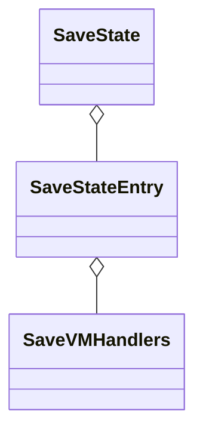
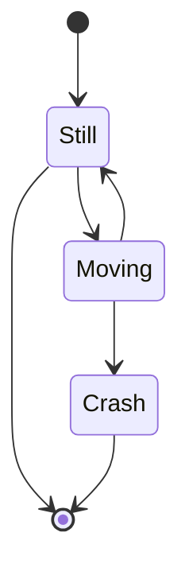

### How does vCPU thread know if it is in migrate state?

```c
migration_is_running()
```

## Migration types

Live migration refers to the process of moving a running VM between different physical machines without disconnecting the client or application.

Two techniques for moving the VM's **memory state** from the source to the destination are **pre-copy** memory migration and **post-copy** memory migration.

### Pre-copy memory migration

**Pre-copy phase**: The Hypervisor copies all the memory pages from source to destination while the VM is still running on the source. If some memory pages change (become 'dirty') during the pre-copy phase, they will be copied again and again over several 'pre-copy rounds'. Usually the pre-copy phase ends when the number of dirtied pages remaining becomes small enough to yield a short stop-and-copy phase.

**Stop-and-copy phase**: After the pre-copy phase, the VM will be paused on the source host, the remaining dirty pages will be copied to the destination, and the VM will be resumed at the destination. The downtime due to this phase can range from a few milliseconds to seconds depending on the number of dirty pages transferred during downtime.

### Post-copy memory migration

Post-copy is initiated by suspending the VM at the source. With the VM suspended, a minimal subset of the execution state of the VM (CPU state, registers and, optionally, non-pageable memory) is transferred to the target. The VM is then resumed at the target. Concurrently, the source actively pushes the remaining memory pages of the VM to the target - an activity known as pre-paging. At the target, if the VM tries to access a page that has not yet been transferred, it generates a page-fault. These faults are trapped at the target and redirected to the source.

Post-copy sends each page exactly once over the network whereas pre-copy can transfer the same page multiple times if the page is dirtied repeatedly at the source during migration. On the other hand, pre-copy retains an up-to-date state of the VM at the source during migration, whereas during post-copy, the VM's state is split across the source and the destination. If the destination fails during live migration, pre-copy can recover the VM, whereas post-copy cannot.

**pros and cons**

- For VMs with read-intensive workloads, pre-copy would be the better approach
- For large-memory or write-intensive workloads, post-copy would better suited.

# Overview

Live migrating a VM using 2 different TSC frequency is not encouraged, so `tsc-frequency=1000000000` should be added to the qemu command line in both src and dst platform.

Normal migration use 1 stream, however a **return path** can be created, which is **primarily used by postcopy**.

Source side

- Forward path - written by migration thread
- Return path - opened by master thread, read by **return-path thread**.

Destination side

- Forward path - read by main thread
- Return path - opened by master thread, written by main thread AND postcopy thread.

For most devices, the state is saved in a single call to the migration infrastructure; these are *non-iterative* devices. The data for these devices is sent at the **end of precopy migration**, when the CPUs are paused.

In general QEMU tries to maintain **forward** migration compatibility (i.e. migrating from QEMU $n -> n+1$) and there are users who benefit from backward compatibility as well.

[Migration — QEMU documentation](https://www.qemu.org/docs/master/devel/migration.html)



### Which states should be migrated?

要迁移哪些？VCPU(VMCS), RAM, Device state。

**Will the cached value in QEMU and KVM be migrated? Such as `kvm_vcpu` in KVM.**

They won't be migrated, they should be kept consistent by launching the TD using the **same** QEMU command line.

**QEMU 里的 `RAMBlock` 看起来也会迁移，比如函数 `ram_block_from_stream()`^，是怎么回事？**

其实并不是，只是把 RAMBlock 的 idstr 发过去了，表示这个 page 处于哪一个 RAMBlock，而非将 RAMBlock 的所有状态都发了过去。

**对于 TDX，Secure EPT entry 会不会迁移过去？**

As there is no guarantee of allocating the same physical memory addresses to the TD being migrated on the destination platform, the memory used for Secure EPT structures is not migrated across platforms. Hence, the VMM must invoke the TDX module’s `TDH.MEM.SEPT.*` interface functions on the destination platform to re-create the private GPA mappings on the destination platform.

### Structure scopes

|                        | Per stream/channel | Global (VM) |         Note         |
|:----------------------:|:------------------:|:-----------:|:--------------------:|
|    PageSearchStatus    |                    |      Y      | Specifically for src |
|   MultiFDRecvParams    |         Y          |             |                      |
| MigrationIncomingState |                    |      Y      | Specifically for dst |
|     MigrationState     |                    |      Y      | Specifically for src |
|   multifd_recv_state   |                    |      Y      | Specifically for dst |
|   multifd_send_state   |                    |      Y      | Specifically for src |

### `RAMState` QEMU

这个结构体只是为了迁移用的！

`MigrationState` 是整个迁移的状态，而 `RAMState` 只是迁移中 RAM 的状态，scope 是不一样的。

State of RAM **for migration**.

```c
/* State of RAM for migration */
struct RAMState {
    // 给 target 发送了多少个 page 了
    uint64_t target_page_count;
    // 其实这个数组就两个元素：PRECOPY 和 POSTCOPY
    PageSearchStatus pss[RAM_CHANNEL_MAX];
    // 这台机器所有 RAM 的大小
    uint64_t ram_bytes_total;
    // 下面两个 field 通常绑在一起用
    /* Last block that we have visited searching for dirty pages */
    // 用来判断这一轮迁移是不是结束了。
    RAMBlock *last_seen_block;
    // Last dirty target page we have sent
    ram_addr_t last_page;
    // number of dirty bits in the bitmap at present
    // 同样表示现在一共有多少 dirty pages
    uint64_t migration_dirty_pages;
    // ...

    /* Queue of outstanding page requests from the destination */
    QemuMutex src_page_req_mutex;
    QSIMPLEQ_HEAD(, RAMSrcPageRequest) src_page_requests;
};
```

### `qmp_migrate()` QEMU

```c
void qmp_migrate(const char *uri, bool has_channels,
                 MigrationChannelList *channels, bool has_blk, bool blk,
                 bool has_inc, bool inc, bool has_detach, bool detach,
                 bool has_resume, bool resume, Error **errp)
{
    bool resume_requested;
    Error *local_err = NULL;
    MigrationState *s = migrate_get_current();
    MigrationChannel *channel = NULL;
    MigrationAddress *addr = NULL;

    //...
    addr = channel->addr;

    //...
    resume_requested = has_resume && resume;
    if (!migrate_prepare(s, has_blk && blk, has_inc && inc,
                         resume_requested, errp)) {
        /* Error detected, put into errp */
        return;
    }

    if (!resume_requested) {
        if (!yank_register_instance(MIGRATION_YANK_INSTANCE, errp)) {
            return;
        }
    }

    if (addr->transport == MIGRATION_ADDRESS_TYPE_SOCKET) {
        SocketAddress *saddr = &addr->u.socket;
        if (saddr->type == SOCKET_ADDRESS_TYPE_INET ||
            saddr->type == SOCKET_ADDRESS_TYPE_UNIX ||
            saddr->type == SOCKET_ADDRESS_TYPE_VSOCK) {
            socket_start_outgoing_migration(s, saddr, &local_err);
        } else if (saddr->type == SOCKET_ADDRESS_TYPE_FD) {
            fd_start_outgoing_migration(s, saddr->u.fd.str, &local_err);
        }
#ifdef CONFIG_RDMA
    } else if (addr->transport == MIGRATION_ADDRESS_TYPE_RDMA) {
        rdma_start_outgoing_migration(s, &addr->u.rdma, &local_err);
#endif
    } else if (addr->transport == MIGRATION_ADDRESS_TYPE_EXEC) {
        exec_start_outgoing_migration(s, addr->u.exec.args, &local_err);
    } else if (addr->transport == MIGRATION_ADDRESS_TYPE_FILE) {
        file_start_outgoing_migration(s, &addr->u.file, &local_err);
    } else {
        error_setg(&local_err, QERR_INVALID_PARAMETER_VALUE, "uri",
                   "a valid migration protocol");
        migrate_set_state(&s->state, MIGRATION_STATUS_SETUP,
                          MIGRATION_STATUS_FAILED);
        block_cleanup_parameters();
    }

    if (local_err) {
        if (!resume_requested) {
            yank_unregister_instance(MIGRATION_YANK_INSTANCE);
        }
        migrate_fd_error(s, local_err);
        error_propagate(errp, local_err);
        return;
    }
}

```

### `migrate_prepare()` QEMU

### `ram_save_queue_pages()` QEMU

```c


int ram_save_queue_pages(const char *rbname, ram_addr_t start,
                         ram_addr_t len, bool is_private)
{
    RAMBlock *ramblock;
    RAMState *rs = ram_state;

    ram_counters.postcopy_requests++;
    RCU_READ_LOCK_GUARD();

    if (!rbname) {
        /* Reuse last RAMBlock */
        ramblock = rs->last_req_rb;

        if (!ramblock) {
            /*
             * Shouldn't happen, we can't reuse the last RAMBlock if
             * it's the 1st request.
             */
            error_report("ram_save_queue_pages no previous block");
            return -1;
        }
    } else {
        ramblock = qemu_ram_block_by_name(rbname);

        if (!ramblock) {
            /* We shouldn't be asked for a non-existent RAMBlock */
            error_report("ram_save_queue_pages no block '%s'", rbname);
            return -1;
        }
        rs->last_req_rb = ramblock;
    }
    trace_ram_save_queue_pages(ramblock->idstr, start, len);
    if (!offset_in_ramblock(ramblock, start + len - 1)) {
        error_report("%s request overrun start=" RAM_ADDR_FMT " len="
                     RAM_ADDR_FMT " blocklen=" RAM_ADDR_FMT,
                     __func__, start, len, ramblock->used_length);
        return -1;
    }

    if (ramblock->cgs_bmap) {
    	if (is_private) {
            bitmap_set(ramblock->cgs_bmap, start >> TARGET_PAGE_BITS,
                       len >> TARGET_PAGE_BITS);
        } else {
            bitmap_clear(ramblock->cgs_bmap, start >> TARGET_PAGE_BITS,
                         len >> TARGET_PAGE_BITS);
        }
    }

    struct RAMSrcPageRequest *new_entry =
        g_new0(struct RAMSrcPageRequest, 1);
    new_entry->rb = ramblock;
    new_entry->offset = start;
    new_entry->len = len;

    memory_region_ref(ramblock->mr);
    qemu_mutex_lock(&rs->src_page_req_mutex);
    QSIMPLEQ_INSERT_TAIL(&rs->src_page_requests, new_entry, next_req);
    migration_make_urgent_request();
    qemu_mutex_unlock(&rs->src_page_req_mutex);

    return 0;
}
```

### `ram_block_from_stream()` QEMU

```c
static inline RAMBlock *ram_block_from_stream(MigrationIncomingState *mis,
                                              QEMUFile *f, int flags,
                                              int channel)
{
    RAMBlock *block = mis->last_recv_block[channel];
    // 这个长度的 buffer，存 block 的名字够了
    char id[256];
    uint8_t len;

    if (flags & RAM_SAVE_FLAG_CONTINUE) {
        if (!block) {
            error_report("Ack, bad migration stream!");
            return NULL;
        }
        return block;
    }

    // 先得到接下来要拿到的 buffer 的长度
    len = qemu_get_byte(f);
    // 根据这个长度来取数据到 buffer，最后取出来的其实是个字符串
    // 也就是这个 RAMBlock 的名字，最长是 256 个 char。
    qemu_get_buffer(f, (uint8_t *)id, len);
    // buffer 的最后置 0
    id[len] = 0;

    // 根据名字拿到 block
    block = qemu_ram_block_by_name(id);
    // some checks...
    // 这个 block 表示接下来这个 channel 要接受的数据
    // 是这个 RAMBlock 的数据
    mis->last_recv_block[channel] = block;
    return block;
}
```

### `save_zero_page()` / `save_zero_page_to_file()` / `buffer_is_zero()` QEMU

对于 0 页，我们只发送 page header 就可以了，page content 没必要发，节省带宽。dst 端接收到 zero page header 之后也不会去把内存全写 0。

是不是 zero page 是通过 `buffer_is_zero()` 来判断的。但是，在迁移过程中我们并没有发现内存会膨胀到等于 qemu command line 里指定的 memory 的大小。如果每一个 page 都经过了 prefetch 来判断是不是 all zero，那应该所有的 page mapping 都在这个过程中被建立，used memory 应该会增加？

**破案了**: Zero page is a page filled with zeros. You can make a mapping to this page and get wide zeroed virtual region. Whenever you will write to one of this pages the COW will work and you will get a new one. 也就是说所有的 zero page 的 virtual address 都映射到了同一个物理页，这个页的内容是 all zero，所以无论怎么读都只是这一个页，used memory 自然不增加。但是一旦开始了对这个页的写，那么就会触发 COW，会得到一个新的物理页并建立起到此页的映射。

[memory management - Linux kernel: Role of zero page allocation at paging_init time - Stack Overflow](https://stackoverflow.com/questions/35547665/linux-kernel-role-of-zero-page-allocation-at-paging-init-time)

```c
static int save_zero_page_to_file(RAMState *rs, QEMUFile *file, RAMBlock *block, ram_addr_t offset)
{
    uint8_t *p = block->host + offset;
    int len = 0;

    // 检查下这个 page 是全 0 吗
    if (buffer_is_zero(p, TARGET_PAGE_SIZE)) {
        // 只发送 header
        len += save_page_header(rs, file, block, offset | RAM_SAVE_FLAG_ZERO);
        // 后面跟一个 0, 表示 buffer 结束了吧
        qemu_put_byte(file, 0);
        // 因为跟了一个 0，所以 len 要 + 1
        len += 1;
        // 可以扔掉这个页了
        ram_release_page(block->idstr, offset);
    }
    return len;
}

bool buffer_is_zero(const void *buf, size_t len)
{
    //...
    /* Fetch the beginning of the buffer while we select the accelerator.  */
    // prefetches memory from addr. The rationale is to minimize cache-miss latency
    // by trying to move data into a cache before accessing the data.
    __builtin_prefetch(buf);

    /* Use an optimized zero check if possible.  Note that this also
       includes a check for an unrolled loop over 64-bit integers.  */
    return select_accel_fn(buf, len);
}

```

### `save_page_header()` QEMU / page header

这个函数会在发送 0 页的时候用到，因为全 0 所以没必要发送过去，只发送 header 就行了。

Write page header to wire. 如果这个 page 是 block 的第一个 page，那么也把 block 信息一并发过去（it also writes the block identification）。

 - @`block`: block that contains the page we want to send.
 - @`offset`: offset inside the block for the **page** in the lower bits, it contains flags.

```c
static size_t save_page_header(RAMState *rs, QEMUFile *f,  RAMBlock *block,
                               ram_addr_t offset)
{
    size_t size, len;

    // 如果这个 address 所在的 block 和上次发的一样，
    // 那么将 RAM_SAVE_FLAG_CONTINUE 这个 flag 置上
    // 表示我们将继续使用上次的 block
    if (block == rs->last_sent_block) {
        offset |= RAM_SAVE_FLAG_CONTINUE;
    }
    qemu_put_be64(f, offset);
    size = 8;

    // 如果和上次不一样
    if (!(offset & RAM_SAVE_FLAG_CONTINUE)) {
        // 把 block 的 idstr 发过去
        len = strlen(block->idstr);
        qemu_put_byte(f, len);
        qemu_put_buffer(f, (uint8_t *)block->idstr, len);
        size += 1 + len;
        rs->last_sent_block = block;
    }
    return size;
}
```

### `control_save_page()` QEMU

目前只在 RDMA 中用了，暂时不考虑。

### `ram_control_save_page()` QEMU

目前只在 RDMA 中用了，暂时不考虑。

### `register_savevm_live()`

```c
register_savevm_live("slirp", 0, slirp_state_version(), &savevm_slirp_state, s->slirp);
register_savevm_live("ram", 0, 4, &savevm_ram_handlers, &ram_state);
register_savevm_live("block", 0, 1, &savevm_block_handlers, &block_mig_state);
register_savevm_live("dirty-bitmap", 0, 1, &savevm_dirty_bitmap_handlers, &dbm_state);
...
// Register the device instance as a SaveStateEntry into savevm_state global viriable
int register_savevm_live(const char *idstr,
                         uint32_t instance_id,
                         int version_id,
                         const SaveVMHandlers *ops,
                         void *opaque)
{
    SaveStateEntry *se;

    se = g_new0(SaveStateEntry, 1);
    se->version_id = version_id;
    se->section_id = savevm_state.global_section_id++;
    se->ops = ops;
    se->opaque = opaque;
    se->vmsd = NULL;
    /* if this is a live_savem then set is_ram */
    if (ops->save_setup != NULL) {
        se->is_ram = 1;
    }
    //...
    // insert into the savevm_state
    savevm_state_handler_insert(se);
    return 0;
}
```

### `qio_channel_read_all_eof()`

Read until the underlying `QIOChannel` doesn't have any messages (that's the meaning to EOF).

### `PageSearchStatus` (pss)

Per-VM, not per channel，原因很简单，内存是共享的，没有办法每一个 channel 各自搜自己的，会有冲突。

Data about the state of the **current dirty page scan**. It is a local variable created in `ram_find_and_save_block` and passed to all the called function chains.

```c
/* used by the search for pages to send */
struct PageSearchStatus {
    /* Current block being searched */
    RAMBlock    *block;
    /* Current page to search from */
    // 当前的 page，注意既不是 GFN，也不是 GPA
    // 只表示这是这个 RAMBlock 里的第几个 page。 
    // 这个表示的是 RAMBblock 里下一个 dirty 的 page
    // 还没有被发送
    unsigned long page;
    // 通过函数 ram_get_private_gpa 得到的，表示上面的 page 所处的 GPA
    /* Guest-physical address of the current page if it is private */
    hwaddr cgs_private_gpa;

    // 只在 find_dirty_block 里被置成了 true。
    // 表示这一个 iteration 结束了，我们已经把 RB 从头到尾
    // 扫了一遍，注意这并不保证前面的 RB 不会出现新的 dirty page
    // 这就留给下一个 iteration 吧。
    bool         complete_round;

    // for postcopy only
    bool         postcopy_requested;
    bool         postcopy_target_channel;
};
```

### `pss_find_next_dirty()` QEMU

在当前的 `RAMBlock` 里找下一个 dirty bit，找不到就更新 `pss->page` 到 end of this RAMBlock。如果 start 的地方已经是 dirty 的了，那么应该不会更新。所以因为如果当前 page 是 dirty 的话就不会更新了，所以如果是 dirty 的，那么无论调用多少次 `pss_find_next_dirty()` 都不会更新。

find 到的 page 只会更新在 pss 里面，而不是通过返回值的方式。

如果这个 RB 是 clean 的，那么 `pss->page` 会被置为 end of this ramblock。

```c
/**
 * pss_find_next_dirty: find the next dirty page of **current ramblock**
 *
 * This function updates pss->page to point to the next dirty page index
 * within the ramblock to migrate, or the end of ramblock when nothing
 * found.
 * 
 * Note that when pss->host_page_sending==true it means we're
 * during sending a host page, so we won't look for dirty page that is
 * outside the host page boundary.
 *
 * @pss: the current page search status
 */
static void pss_find_next_dirty(PageSearchStatus *pss)
{
    RAMBlock *rb = pss->block;
    // 表示 rb 里有多少个页
    unsigned long size = rb->used_length >> TARGET_PAGE_BITS;
    unsigned long *bitmap = rb->bmap;

    // 这个 RAMBlock 不需要被迁移
    if (migrate_ram_is_ignored(rb)) {
        pss->page = size;
        return;
    }

    /*
     * If during sending a host page, only look for dirty pages within the
     * current host page being send. 为什么要加这个限制呢？可能是因为同一个 host page
     * 内的 dirty page 需要先被考虑。
     */
    if (pss->host_page_sending) {
        assert(pss->host_page_end);
        size = MIN(size, pss->host_page_end);
    }

    // rb->bmap 表示的是这个 RB 的 dirty bitmap，可以用来找下一个需要 migrate 的 page，
    // 并将结果保存在 pss-page 当中。可见 pss->page 的更新并不是一 bit 一 bit，而是直接
    // 更新到下一个 dirty 的 page。如果 pss->page 已经是 dirty 的了，那么就直接返回了。
    pss->page = find_next_bit(bitmap, size, pss->page);
}
```

### `find_dirty_block()` / `pss->complete_round` QEMU

这个函数只会在 `ram_find_and_save_block()` 中被调用。

Find the **next** dirty page and **update** any state associated with the search process.

The search scope is current `RAMBlock`. If current block doesn't have any dirty page, then switch to next block.

If one call to this function hit the end of the block list, then it will mark this round is complete.

注意，是从 `pss->page` 开始搜索的，搜索包含了 `pss->page`，所以如果调用多次这个函数，每次都用同样的 `pss->page`，那么很有可能 `pss->page` 并不会更新。

`rs->last_seen_block` 和 `rs->last_page` 表示的是初始搜索时的状态（因为我们可能会返回 `PAGE_TRY_AGAIN` 从而让调用者 `ram_find_and_save_block()` 调用多次），调用过程中会动态改变的是 `pss->block` 和 `pss->page`。而 `pss->complete_round` 表示的是我们是否已经越过了 RAMBlock list 里的最后一个 `RAMBlock`，重新开始 search 了。并不是说我们真的就所有 block 都 search 一遍了（因为我们开始 search 的 block 不一定是第一个 block）。这个函数并不会主动将 `complete_round` 置为 false。因此，只有当以下三个条件同时满足时，才表示我们走了一圈又回到了我们开始 search 的那个 block：

```c
// 解释请看下面的 code block
// 要达成这个条件，肯定是上一次调用此函数的返回值是 PAGE_TRY_AGAIN，而且因为每一次切 RAMBlock
// 都会返回 PAGE_TRY_AGAIN，那么我们应该是拿到了很多个 PAGE_TRY_AGAIN 之后，在 while loop 里试了很多次
// 最后又回到了原来的 RAMBlock（pss->block == rs->last_seen_block）。同时即使是这个 block 也已经搜索到了
// 最后一个 page。
pss->complete_round && pss->block == rs->last_seen_block && pss->page >= rs->last_page
```

```c
/**
 * Returns:
 *         <0: An error happened
 *         PAGE_ALL_CLEAN: no dirty page found, give up
 *         PAGE_TRY_AGAIN: no dirty page found, retry for next block
 *         PAGE_DIRTY_FOUND: dirty page found
 *
 * @rs: current RAM state
 * @pss: data about the state of the current dirty page scan
 */
static int find_dirty_block(RAMState *rs, PageSearchStatus *pss)
{
    /* Update pss->page for the next dirty bit in ramblock */
    pss_find_next_dirty(pss);

    // 所有的 block 里的所有 page 都 search 过一遍了。
    // 我们本意是 find 一个 dirty page，但是我们的搜索越过了最后一个 RB（complete_round == true）
    // 这说明已经没有新的 dirty page 了（至少对于我们现在的 dirty bitmap 来说）
    if (pss->complete_round && pss->block == rs->last_seen_block && pss->page >= rs->last_page)
        return PAGE_ALL_CLEAN;

    // Didn't find anything in this RAM Block
    // 所以我们应该切到下一个 RAMBlock 了
    if (!offset_in_ramblock(pss->block, ((ram_addr_t)pss->page) << TARGET_PAGE_BITS)) {
        pss->page = 0;
        // Let's switch to the next block
        pss->block = QLIST_NEXT_RCU(pss->block, next);
        // 到最后了，RAMBlock 没的切了
        if (!pss->block) {
            // this is **likely** path, because usually we wont't flush
            // after each section
            if (!migrate_multifd_flush_after_each_section()) {
                QEMUFile *f = rs->pss[RAM_CHANNEL_PRECOPY].pss_channel;
                multifd_send_sync_main(f);
                // 当 dst 接到这个 flag 时，执行 multifd_recv_sync_main()
                qemu_put_be64(f, RAM_SAVE_FLAG_MULTIFD_FLUSH);
                qemu_fflush(f);
            }

            //...
            pss->block = QLIST_FIRST_RCU(&ram_list.blocks);
            pss->complete_round = true;
            // XBZRLE...
        }
        /* Didn't find anything this time, but try again on the new block */
        return PAGE_TRY_AGAIN;
    } else {
        /* We've found something */
        return PAGE_DIRTY_FOUND;
    }
}
```

### `ram_counters`

```c
MigrationStats ram_counters;

```

### Iterative / non-iterative device migration / device type in live migration

**Meaning of iterative**: Some devices, such as RAM, block storage, have **large amounts** of data that would mean that the CPUs would be paused for too long if they were sent in one section. For these devices an iterative approach is taken.

The iterative devices generally don’t use `VMState` macros and instead use `qemu_put_*/qemu_get_*` macros to read/write data to the stream.

Note: **RAM is also iterative device.**

If a device entry fill the callback function `.save_live_iterate()`, then it is an iterative device. It will send

- `QEMU_VM_SECTION_START`
- `QEMU_VM_SECTION_PART`
- `QEMU_VM_SECTION_END`

If a device entry fill the callback function `.save_state()`, then it is a non-iterative device using the legacy method. It will be sent as a whole during the blackout period.

- `QEMU_VM_SECTION_FULL`

If a device has `vmsd`.

### `migration_iteration_run()` QEMU

```c
static MigIterateState migration_iteration_run(MigrationState *s)
{
    uint64_t must_precopy, can_postcopy;
    Error *local_err = NULL;
    bool in_postcopy = s->state == MIGRATION_STATUS_POSTCOPY_ACTIVE;
    bool can_switchover = migration_can_switchover(s);

    // Estimate remaining data need to be transfered, but because
    // for RAM, we don't sync the latest dirty bitmap so this may
    // **less** than the real amount size
    // fetch the result to variable `must_precopy` and `can_postcopy`.
    // For RAM, all the data is postcopiable, i.e., 
    //  - can_postcopy == remaining size
    //  - must_precopy == 0
    // in case of RAM.
    // But for block devices, it is another story
    qemu_savevm_state_pending_estimate(&must_precopy, &can_postcopy);
    uint64_t pending_size = must_precopy + can_postcopy;

    //...
    // We cannot say we can start post-copy because the estimate size
    // is less than the real size. We need to sync the dirty bitmap
    // to get the real amount of remaining data
    // But if the estimate value is larger than threshold, we can skip
    // the dirty bitmap sync because that means definitely we cannot
    // start post-copy, this trick can reduce the overhead as possible
    if (must_precopy <= s->threshold_size) {
        qemu_savevm_state_pending_exact(&must_precopy, &can_postcopy);
        pending_size = must_precopy + can_postcopy;
    }

    // Let's compare again using the exact value.
    // If we hit this condition, we can ensure it is the exact value rather than the estimate
    // value, because we cannot meet the following 2 conditions simultaneously:
    //  1. must_precopy > s->threshold_size
    //  2. pending_size < s->threshold_size
    // We can eliminate the post-copy phase if requested because the pending size
    // is small enough.
    if ((!pending_size || pending_size < s->threshold_size) && can_switchover) {
        //...
        // enter the blackout phase and send the final data
        migration_completion(s);
        return MIG_ITERATE_BREAK;
    }

    // Still a significant amount to transfer. But if we find:
    //   - We are not in post copy mode;
    //   - We want enter post copy mode
    //   - The data must be sent at precopy phase is less than threshold_size
    // Then we can enter postcopy mode safely
    if (!in_postcopy && must_precopy <= s->threshold_size && can_switchover && qatomic_read(&s->start_postcopy)) {
        postcopy_start(s, &local_err);
        //...
        return MIG_ITERATE_SKIP;
    }

    // After the above journey we find nothing special, so just start another boring iteration
    qemu_savevm_state_iterate(s->to_dst_file, in_postcopy);
    return MIG_ITERATE_RESUME;
}
```

### `migration_iteration_finish()` QEMU

```c
static void migration_iteration_finish(MigrationState *s)
{
    /* If we enabled cpu throttling for auto-converge, turn it off. */
    cpu_throttle_stop();

    qemu_mutex_lock_iothread();
    switch (s->state) {
    // migration 完成了
    case MIGRATION_STATUS_COMPLETED:
        migration_calculate_complete(s);
        runstate_set(RUN_STATE_POSTMIGRATE);
        break;
    // colo things...
    // 当 migration 出错或者被取消的时候，我们需要恢复 src 端的数据与运行
    case MIGRATION_STATUS_FAILED:
    case MIGRATION_STATUS_CANCELLED:
    case MIGRATION_STATUS_CANCELLING:
        ram_save_abort();
        if (s->vm_old_state == RUN_STATE_RUNNING) {
            if (!runstate_check(RUN_STATE_SHUTDOWN)) {
                vm_start();
            }
        } else {
            if (runstate_check(RUN_STATE_FINISH_MIGRATE)) {
                runstate_set(s->vm_old_state);
            }
        }
        break;

    default:
        /* Should not reach here, but if so, forgive the VM. */
        error_report("%s: Unknown ending state %d", __func__, s->state);
        break;
    }
    migrate_fd_cleanup_schedule(s);
    qemu_mutex_unlock_iothread();
}
```

### `qapi/migration.json`

## `SaveVMHandlers`

有两种方式可以注册进来：

- `register_savevm_live()`：这种方式是动态地进行注册；
- `vmstate_register_with_alias_id()`：这种方式是 `device_set_realized()` 调用的，看函数里的实现可以看出，只要实现了 vmsd，就会调用 `vmstate_register_with_alias_id()` 进行注册。

Corresponding to a **device type**, each type of device has a corresponding struct, it is an **ops** which only contains function hooks. You can see the class diagram.

For different device types, there are different handlers:

- `savevm_dirty_bitmap_handlers`
- `savevm_ram_handlers`
- `savevm_block_handlers`
- `savevm_vfio_v1_handlers`
- `savevm_vtd_handlers`

```c
// For the RAM device
static SaveVMHandlers savevm_ram_handlers = {
    // initialises the data structures and transmits a first section
    // containing information on the device. In the case of RAM this
    // transmits a list of RAMBlocks and sizes.
    .save_setup = ram_save_setup,
    // send a chunk of data until the point that stream bandwidth limits tell it to stop. **Each call generates one section**.
    .save_live_iterate = ram_save_iterate,
    .save_live_complete_postcopy = ram_save_complete,
    // must transmit the **last** section for the device containing any remaining data.
    .save_live_complete_precopy = ram_save_complete,
    .has_postcopy = ram_has_postcopy,
    // load sections generated by any of the save functions that generate sections.
    .load_state = ram_load,
    .save_cleanup = ram_save_cleanup,
    // initialises the data structures on the destination.
    .load_setup = ram_load_setup,
    .load_cleanup = ram_load_cleanup,
    .resume_prepare = ram_resume_prepare,
    // indicates how much more data we must save.  When the estimated amount is smaller than the
    // threshold, we call `state_pending_exact`.
    // estimate 和 exact 的区别并不在于计算方式，而是在于当发现可以进入 blackout 时，
    // 会 sync 一下 bitmap 然后重新计算一下 remaining size，我觉得这么分成两步的原因是
    // bitmap sync 的开销比较大，这样可以尽量减少 bitmap sync 的次数。
    .state_pending_estimate = ram_state_pending_estimate,
    // indicates how much more data we must save.  The core migration code will use this to
    // determine when to pause the CPUs and complete the migration
    .state_pending_exact = ram_state_pending_exact,
};
```

### `.state_pending_estimate` / `ram_state_pending_estimate()` QEMU

This estimates the remaining data to transfer.

这个函数很简单，就是根据当前 `RAMState` 里的数据（`migration_dirty_pages`）做一个简单计算。所以这个就表示的是估计的。

Call trace:

```c
migration_iteration_run // 每一个 device 的 handler 都执行一下函数
    qemu_savevm_state_pending_estimate
        .state_pending_estimate // ram_state_pending_estimate
        
static void ram_state_pending_estimate(void *opaque, uint64_t *must_precopy, uint64_t *can_postcopy)
{
    //...
    uint64_t remaining_size = rs->migration_dirty_pages * TARGET_PAGE_SIZE;
    if (migrate_postcopy_ram())
        *can_postcopy += remaining_size;
    else
        *must_precopy += remaining_size;
}
```

### `.state_pending_exact()` / `ram_state_pending_exact()` QEMU

```c
migration_iteration_run
    // 只有在 must_precopy <= s->threshold_size 的时候才会触发，重新计算 
    qemu_savevm_state_pending_exact
        .state_pending_exact // ram_state_pending_exact

static void ram_state_pending_exact(void *opaque, uint64_t *must_precopy, uint64_t *can_postcopy)
{
    MigrationState *s = migrate_get_current();
    RAMState **temp = opaque;
    RAMState *rs = *temp;

    // exact 和 estimate 计算的方法是相同的（都是用了 migration_dirty_pages），
    // 但是计算的时机是不同的。
    uint64_t remaining_size = rs->migration_dirty_pages * TARGET_PAGE_SIZE;

    // 达到可以 block src 然后做最后 blockout 迁移的阈值了
    // 同步一下 dirty bitmap，根据更新的 bitmap 重新计算一下剩余的 size。
    if (!migration_in_postcopy() && remaining_size < s->threshold_size) {
        //...
        migration_bitmap_sync_precopy(rs, false);
        //...
        remaining_size = rs->migration_dirty_pages * TARGET_PAGE_SIZE;
    }

    if (migrate_postcopy_ram()) {
        *can_postcopy += remaining_size;
    } else {
        *must_precopy += remaining_size;
    }
}
```

### `MigrationStats` / QEMU

There is a global counter:

```c
MigrationStats ram_counters;
```

## QEMU live migration state / state diagram

```c
typedef enum MigrationStatus {
    MIGRATION_STATUS_NONE,
    MIGRATION_STATUS_SETUP,
    MIGRATION_STATUS_CANCELLING,
    MIGRATION_STATUS_CANCELLED,
    MIGRATION_STATUS_ACTIVE,
    MIGRATION_STATUS_POSTCOPY_ACTIVE,
    MIGRATION_STATUS_POSTCOPY_PAUSED,
    // recover phase
    MIGRATION_STATUS_POSTCOPY_RECOVER,
    MIGRATION_STATUS_COMPLETED,
    MIGRATION_STATUS_FAILED,
    MIGRATION_STATUS_COLO, // for colo
    MIGRATION_STATUS_PRE_SWITCHOVER,
    MIGRATION_STATUS_DEVICE,
    MIGRATION_STATUS_WAIT_UNPLUG,
    MIGRATION_STATUS__MAX,
} MigrationStatus;
```

Src diagram:



Dst diagram:


### `MIGRATION_STATUS_POSTCOPY_RECOVER` / Post-copy recover phase

Only exist for a super short period QEMU is trying to recover from an interrupted postcopy migration, during which handshake will be carried out for continuing the procedure with state changes from `PAUSED` -> `RECOVER` -> `POSTCOPY_ACTIVE` again.

Here RECOVER phase should be super small, that happens right after the admin specified a new but working network link for QEMU to reconnect to dest QEMU.

**RECOVER 的过程是手动触发的（比如说一个 HMP 命令）还是自动触发的（比如说 QEMU 检测到网络上线了）？**

```c

postcopy_try_recover


migration_channel_connect
migrate_fd_connect

```

## QEMU live migration overall data stream structure

```python
# master thread
# 这是第一个发送的，用来表示这是一个 Migration stream
QEMU_VM_FILE_MAGIC # 4 bytes
# migrate stream version, 表示兼容与否
QEMU_VM_FILE_VERSION # 4 bytes
? QEMU_VM_CONFIGURATION # 可选，是否发送一些 configuration 过去
    ############## setup 阶段（缩进表示这是对所有的 device 不只是 ram，仅仅以 ram 为例） ###############
    QEMU_VM_SECTION_START # 1 byte
    # 以下这些都是 SaveStateEntry 相关的，每一个 SaveStateEntry 可以看作一个 device 的 instance，比如 RAM
    # 这些都是在第一次发送时需要 send 过去的，下面我们以 RAM 为例
    se->section_id # 4 bytes, 接下来的 section id
    length of the idstr # 接下来的 se 的 idstr 的长度
    se->idstr
    se->instance_id # 4 bytes
    se->version_id # 4 bytes
    # 这个是 RAM specific 的发送方式
    # RAM_SAVE_FLAG_MEM_SIZE 表示这个信息表示的是总的 memory size
    total_mem_size | RAM_SAVE_FLAG_MEM_SIZE
        ##### 缩进表示对于每一个 RAMBlock #####
        len(block->idstr) # 当然，每一个 block 也有 idstr
        block->idstr
        block->used_length # block 的大小，上面发送的 total_mem_size 就是通过每一个 block 大小计算的出的
    RAM_SAVE_FLAG_MULTIFD_FLUSH # 让对端执行 multifd_recv_sync_main()
    # 表示这个 section 结束了，这个结束是为了让 ram_load_precopy 退出，从而开始 receive footer
    # 每一个 section 结束都会发送这个
    RAM_SAVE_FLAG_EOS
    QEMU_VM_SECTION_FOOTER
    se->section_id # 再发送一次 section id
    ######################################## End of setup phase #######################################
    ####################################### Start of PART phase #######################################
    QEMU_VM_SECTION_PART
    se->section_id # 4 bytes, 接下来的 section id
        # 缩进表示会有多次 page 的发送
        ########## legacy VM single stream ##########
        if page is zero:
            # 把这个 page 的 offset 加上 flag 发过去
            # 默认是上一个 block 里的 page，所以不用再发 block 的信息
            if this block:
                offset | RAM_SAVE_FLAG_ZERO | RAM_SAVE_FLAG_CONTINUE
            else: # another block
                offset | RAM_SAVE_FLAG_ZERO | 
                len(block->idstr)
                block->idstr
            0 # 这里要发送一个 byte 0 过去，表示全是 page content 全是 0
        else: # 不是空的 page
            # 同上
            # 把这个 page 的 offset 加上 flag 发过去
            # 默认是上一个 block 里的 page，所以不用再发 block 的信息
            if this block:
                offset | RAM_SAVE_FLAG_PAGE | RAM_SAVE_FLAG_CONTINUE
            else: # another block
                offset | RAM_SAVE_FLAG_PAGE | 
                len(block->idstr)
                block->idstr
            4K page content # 这里发送所有的 page content
        ###### End of legacy VM single stream ######
        ########## legacy VM multi stream ##########
        # multi-fd 线程在第一次启动的时候，会发送 initial packet（只有一次）
        MULTIFD_MAGIC
        MULTIFD_VERSION
        p->id # 表示自己是第几个 stream
            ###### multi-stream 每一个 packet ######
            MultiFDPacket_t # 元信息
            pages content * 128 # 后面跟着 128 个 page 的内容
            ########## end of each packet ##########
        ####### End of legacy VM multi stream #######
    RAM_SAVE_FLAG_EOS # 表示这个 section 结束了
    QEMU_VM_SECTION_FOOTER
    se->section_id # 再发送一次 section id
    ######################################## End of PART phase ########################################
    ####################################### Start of END phase #######################################
    QEMU_VM_SECTION_END
    se->section_id # 再发送一次 section id
        # 这一部分和 PART 发送的无异，故省略
        # 缩进是因为会发送多个 page
    RAM_SAVE_FLAG_EOS # 表示这个 section 结束了
    QEMU_VM_SECTION_FOOTER
    se->section_id # 再发送一次 section id
    ######################################## END of END phase ########################################
QEMU_VM_EOF # 表示整个迁移的结束
# 完结，撒花
```

### `se->instance_id` QEMU

Hard-coded，比如 RAM 的值就是 0，详见 `ram_mig_init`。

### `se->version_id` QEMU

Hard-coded，比如 RAM 的值就是 4，详见 `ram_mig_init`。

设计这个可能是为了保证迁移的兼容性。

### Initial packet

After connected, each channel should send an **initial packet** to sync several information.

`multifd_send_initial_packet` (`multifd_recv_initial_packet`)

### `ram_load_precopy()` QEMU

Load contents in **a section**.

```c
// For each section.. we will call vmstate_load()
vmstate_load
    savevm_ram_handlers->load_state
        ram_load
            ram_load_precopy

// 我们省略了出错的情况，只看 normal path
static int ram_load_precopy(QEMUFile *f)
{
    MigrationIncomingState *mis = migration_incoming_get_current();
    int flags = 0, ret = 0, invalid_flags = 0, len = 0, i = 0;
    // ADVISE is earlier, it shows the source has the postcopy capability on
    bool postcopy_advised = migration_incoming_postcopy_advised();
    //...

    // 如果我们没有接收到 RAM_SAVE_FLAG_EOS 也就是 section 结束的 flag，那么继续
    while (!ret && !(flags & RAM_SAVE_FLAG_EOS)) {
        ram_addr_t addr, total_ram_bytes;
        void *host = NULL, *host_bak = NULL;
        uint8_t ch;

         // Yield periodically to let main loop run, but an iteration of
         // the main loop is expensive, so do it each some iterations
        if ((i & 32767) == 0 && qemu_in_coroutine()) {
            aio_co_schedule(qemu_get_current_aio_context(), qemu_coroutine_self());
            qemu_coroutine_yield();
        }
        i++;

        addr = qemu_get_be64(f);
        flags = addr & ~TARGET_PAGE_MASK;
        addr &= TARGET_PAGE_MASK;
        //...

        // 表示这是一个页的 offset
        if (flags & (RAM_SAVE_FLAG_ZERO | RAM_SAVE_FLAG_PAGE | RAM_SAVE_FLAG_COMPRESS_PAGE | RAM_SAVE_FLAG_XBZRLE)) {
            // 拿到这个页的 HVA
            RAMBlock *block = ram_block_from_stream(mis, f, flags, RAM_CHANNEL_PRECOPY);
            host = host_from_ram_block_offset(block, addr);
            //...
            // 设置 recievedbmap，表示这个页已经接收到了。
            ramblock_recv_bitmap_set(block, host);
        }

        switch (flags & ~RAM_SAVE_FLAG_CONTINUE) {
        case RAM_SAVE_FLAG_MEM_SIZE:
            /* Synchronize RAM block list */
            // 看起来是 RAM block 有变（比如 size 变了），需要重新同步一下
            // ...
            break;
        case RAM_SAVE_FLAG_ZERO:
            // 空页
            ch = qemu_get_byte(f);
            ram_handle_compressed(host, ch, TARGET_PAGE_SIZE);
            break;
        case RAM_SAVE_FLAG_PAGE:
            // normal page
            // 因为 host 就是 buffer 的地址，所以我们相当于直接把数据放到了 page 所在的地址
            // 没有中间商赚差价（中间变量）。
            qemu_get_buffer(f, host, TARGET_PAGE_SIZE);
            break;
        case RAM_SAVE_FLAG_COMPRESS_PAGE:
            // 压缩页
            len = qemu_get_be32(f);
            //...
            decompress_data_with_multi_threads(f, host, len);
            break;
        case RAM_SAVE_FLAG_XBZRLE:
            // xbzrle 页
            //...
            load_xbzrle(f, addr, host);
            break;
        case RAM_SAVE_FLAG_MULTIFD_FLUSH:
            // sync
            multifd_recv_sync_main();
            break;
        case RAM_SAVE_FLAG_EOS:
            // 已经结束咧
            if (migrate_multifd_flush_after_each_section()) {
                multifd_recv_sync_main();
            }
            break;
            //...
        }
        //...
    }
    //...
}
```

### `MigrationState` QEMU

There is a **per-VM** global `current_migration`:

```c
static MigrationState *current_migration;
```

Specifically for source. Destination doesn't has this。dst 端对应的叫做 `MigrationIncomingState`：

```c
static MigrationState *current_migration;
static MigrationIncomingState *current_incoming;
```

即使我们还没有 start migration，我们也会 initialize `current_migration` 这个变量：

```c
qemu_init
    migration_object_init
        
```

```c
struct MigrationState {

    int state;
    QEMUFile *to_dst_file;
    /* Postcopy specific transfer channel */
    QEMUFile *postcopy_qemufile_src;
    /* params from 'migrate-set-parameters' */
    MigrationParameters *parameters;
    // we can't mix pages from one iteration through with pages for the following iteration
    // So we only need to do this after we have go through all the dirty pages
    // So why **after each section**? That's for historical reasons, and we know this is suboptimal
    // and flush too many times, so default is **false**.
    bool multifd_flush_after_each_section;
    // The final stage happens when the remaining data is smaller than
    // this threshold; it's calculated from the requested downtime and
    // measured bandwidth
    // s->threshold_size = bandwidth * s->parameters.downtime_limit;
    // 当剩余的数据量低于这个的时候，可以 block 住 src 然后一口气把剩下的 page
    // migrate 过去了。
    int64_t threshold_size;
    /* QEMU_VM_VMDESCRIPTION content filled for all non-iterable devices. */
    JSONWriter *vmdesc;
}
```

### `MigrationParameters`

Params from '`migrate-set-parameters`'.

# Destination

### How does the EPT page table established in the destination side during loading?

迁移完成后，Destination 这里仍然需要重头通过 page fault 等建立自己的 EPT 页表？

为什么我们在 load GPA 的内容的时候不能提前把已经 load 的 page 的 EPT 映射（`GPA->PFN`）建立起来呢？这样后面不就不会出现 EPT Violation，从而可以提高性能了嘛。

```c
// 只是把这个页的内容放上去，并没有通知 KVM 去建立页表
// 如果没有页，放上去之后 kernel 会自动分配一个 page 来完成 host->pfn 的映射
// 这样子当 EPT violation 发生的时候，就不会转成 hva->pfn 的 page fault 然后
// 通过 userfaultfd 来汇报过来了。
ram_load_precopy
    case RAM_SAVE_FLAG_PAGE:
        qemu_get_buffer(f, host, TARGET_PAGE_SIZE);
```

### `qemu_loadvm_section_part_end()` QEMU

```c
static int qemu_loadvm_section_part_end(QEMUFile *f, MigrationIncomingState *mis)
{
    uint32_t section_id;
    SaveStateEntry *se;
    int ret;

    // SECTION 的 flag 发过来之后，就是 section 的 id
    section_id = qemu_get_be32(f);
    //...
    QTAILQ_FOREACH(se, &savevm_state.handlers, entry) {
        // 找到对应的 se
        // load_section_id 在 START 阶段就已经发过来了，详见 
        if (se->load_section_id == section_id) {
            break;
        }
    }

    //...
    ret = vmstate_load(f, se);
    if (ret < 0) {
        error_report("error while loading state section id %d(%s)",
                     section_id, se->idstr);
        return ret;
    }
    if (!check_section_footer(f, se)) {
        return -EINVAL;
    }

    return 0;
}
```

### `qio_net_listener_set_client_func_full`

### What will happen when execute `-incoming tcp:localhost:6666` in QEMU cmdline? / `migration_incoming_process()` QEMU

Basically, it does:

- Listen to the given address;
- Accept connection requests from source;
- Receive the initial packet;
- Create and run the thread.

在 `qemu-options.hx` 中，定义了 `incoming` 参数 `QEMU_OPTION_incoming`。

```c
qemu_init()
    qmp_x_exit_preconfig // actually, hmp_migrate_incoming() also called, but we discuss cmdline here
        qmp_migrate_incoming
            qemu_start_incoming_migration
                socket_start_incoming_migration
                    // setup multifd number (num) if any
                    qio_net_listener_open_sync
                        qio_channel_socket_listen_sync // for each address
                            socket_listen(addr, num, errp) // listen num fds for multi-fd
                                // 这里的 n 表示只接受 n 个 connection。
                                listen(slisten, num) // Note: listen is NOT a blocking syscall!
                    // register watch source
                    qio_net_listener_set_client_func_full
                        // ------------- Async -------------
                        // when a event occurs (a client connect (G_IO_IN) to the listener), execute the following function
                        qio_net_listener_channel_func // accept, receive and process
                            qio_channel_socket_accept
                                qemu_accept
                                    // Though this syscall is blocking, we will call accept() only packets have come
                                    // because the watch source mechanism
                                    accept()
                            // 每当 accept 一个 fd 的时候会调用到这里
                            socket_accept_incoming_migration // wrong if exceed max channel num
                                //...
                                migration_ioc_process_incoming
                                    // Try to receive all multifd channels to get ready for the migration.
                                    // receive means receive the initial packet
                                    multifd_recv_new_channel
                                        multifd_recv_initial_packet // receive the initial packet^
                                        // create thread for receiving data for this channel
                                        qemu_thread_create(multifd_recv_thread)  // create and run the thread "multifdrecv_i"
                                            qio_channel_read_all_eof // read the data from channel
                                            multifd_recv_unfill_packet
                                    // This function will only called once all channels are received the initial packet
                                    @migration_incoming_process
// 上面 qemu_init 里只是把这些 handler 放到了 event source 里
qemu_main
    qemu_default_main
        qemu_main_loop
```

```c
// This function will only called once all channels are received the initial packet
// 这个函数掌握了包分发大权，有点像 source 端的 migration_thread (master thread)，区别是这个是执行在 coroutine 中的
// 不是一个单独的 thread
@migration_incoming_process
    // after accepted all the channels' initial packets, we can read the received packets.
    qemu_coroutine_create(process_incoming_migration_co);
        qemu_loadvm_state(mis->from_src_file) // Only executing on the first channel
            // load the **overall** migration header, i.e., MAGIC, VERSION
            // 对应 src 的 qemu_savevm_state_header 函数
            qemu_loadvm_state_header
            // load_setup: initialises the data structures on the destination.
            qemu_loadvm_state_setup
            qemu_loadvm_state_main^
```

### `MigrationIncomingState`

挺庞大的一个结构体，只在作为 dst 时有用。有一个全局变量 `current_incoming` 是这个类型的，在 `migration_object_init` 的时候会创建，这个的 scope 是全局的，和 channel 什么的无关。

```c
struct MigrationIncomingState {
    // The first channel accepted, other channels are recorded in multifd_recv_state->params[i],
    // BTW, MigrationState has a member to_dst_file
    QEMUFile *from_src_file;
    /* QEMUFile for postcopy only; it'll be handled by a separate thread */
    QEMUFile *postcopy_qemufile_dst;
    // Currently it is only a QIONetListener listener, which is used as the
    // input when calling transport_cleanup (socket_incoming_migration_end).
    void *transport_data;
    void (*transport_cleanup)(void *data);

    // A tree of pages that we requested to the source VM
    // 为什么要是 tree 的结构，list 不行吗？可能原因是查找起来比较快？
    GTree *page_requested;
    // ...
}
```

## When does the destination start to run?

```c
process_incoming_migration_co
    qemu_loadvm_state // 这个函数从 source 端 load 完了所有的数据
    process_incoming_migration_bh
        vm_start();

static void process_incoming_migration_bh(void *opaque)
{
    Error *local_err = NULL;
    MigrationIncomingState *mis = opaque;

    //...
    // Activate the block device
    bdrv_activate_all(&local_err);

    /*
     * This must happen after all error conditions are dealt with and
     * we're sure the VM is going to be running on this host.
     */
    qemu_announce_self(&mis->announce_timer, migrate_announce_params());

    if (multifd_load_cleanup(&local_err) != 0) {
        error_report_err(local_err);
        autostart = false;
    }
    /* If global state section was not received or we are in running
       state, we need to obey autostart. Any other state is set with
       runstate_set. */

    dirty_bitmap_mig_before_vm_start();

    if (!global_state_received() ||
        global_state_get_runstate() == RUN_STATE_RUNNING) {
        if (autostart) {
            vm_start();
        } else {
            runstate_set(RUN_STATE_PAUSED);
        }
    } else if (migration_incoming_colo_enabled()) {
        migration_incoming_disable_colo();
        vm_start();
    } else {
        runstate_set(global_state_get_runstate());
    }
    /*
     * This must happen after any state changes since as soon as an external
     * observer sees this event they might start to prod at the VM assuming
     * it's ready to use.
     */
    migrate_set_state(&mis->state, MIGRATION_STATUS_ACTIVE,
                      MIGRATION_STATUS_COMPLETED);
    qemu_bh_delete(mis->bh);
    migration_incoming_state_destroy();
}
```

## How does receive thread and main thread sync in destination?

Main coroutine: `process_incoming_migration_co()`.

Receive thread: `multifd_recv_thread()`

### `process_incoming_migration_co()^` QEMU

这个 coroutine 会 yield 出去让 main loop 执行：

- 在 `ram_load_precopy()` 里面，在 load 了一定数量的 page 之后，会 yield 出去让 main loop 执行；
- 在 `qemu_fill_buffer()` 的时候，如果返回了 `QIO_CHANNEL_ERR_BLOCK` 表示当前没有数据可以读，所以就先 yield 让 main loop 执行。

```c
process_incoming_migration_co(void *opaque)
{
    MigrationIncomingState *mis = migration_incoming_get_current();
    //...
    // compression...
    // 所有 RAMBlock 里最大的 page size
    mis->largest_page_size = qemu_ram_pagesize_largest();
    // state change...
    mis->loadvm_co = qemu_coroutine_self();
    // 主函数，大部分的逻辑都在这里面
    ret = qemu_loadvm_state(mis->from_src_file);
    mis->loadvm_co = NULL;
    // post copy things
    // ...
    // colo...
    // 一些清理工作，比如 shutdown mutlifd 什么的。
    mis->bh = qemu_bh_new(process_incoming_migration_bh, mis);
    qemu_bh_schedule(mis->bh);
    return;
    //clean up...
}
```

### `qemu_loadvm_state()^` QEMU

```c
int qemu_loadvm_state(QEMUFile *f)
{
    MigrationIncomingState *mis = migration_incoming_get_current();
    Error *local_err = NULL;
    int ret;

    // ...
    // 比如 QEMU_VM_FILE_MAGIC, VERSION 等等 migration 前的元信息
    qemu_loadvm_state_header(f);
    // ...
    // load 之前都 setup 一下
    qemu_loadvm_state_setup(f)
    // switch-over capality related things...

    // 把每一个 vcpu 的 vcpu_dirty^ 都置上
    cpu_synchronize_all_pre_loadvm();

    // 主函数
    ret = qemu_loadvm_state_main(f, mis);
    qemu_event_set(&mis->main_thread_load_event);

    //...
    // vm description...
    qemu_loadvm_state_cleanup();
    cpu_synchronize_all_post_init();

    return ret;
}
```

### `qemu_loadvm_state_main()^` QEMU

```c
int qemu_loadvm_state_main(QEMUFile *f, MigrationIncomingState *mis)
{
    uint8_t section_type;
    //...
    while(true) { // each iteration is a section
        switch (section_type) {
            // start: 第一个 section / full: 只有这一个 section
            case QEMU_VM_SECTION_START:
            case QEMU_VM_SECTION_FULL:
                qemu_loadvm_section_start_full
                    vmstate_load
                        ram_load //savevm_ram_handlers->load_state
                            ram_load_precopy
            // 中间的 section
            case QEMU_VM_SECTION_PART:
            case QEMU_VM_SECTION_END:
                qemu_loadvm_section_part_end
                    vmstate_load
                        ram_load //savevm_ram_handlers->load_state
                            ram_load_precopy
            // src 还可以给 dst 发 command，高级
            case QEMU_VM_COMMAND:
                loadvm_process_command
            // Migration 已经结束咧！
            case QEMU_VM_EOF:
                goto out;
        }
    }
    //...
}
```

# Source

### `unqueue_page()` QEMU

这是一个 helper 函数，专门为了 `get_queued_page()` 服务的。

返回的是那个 page 所在的 block。

```c
/**
 * unqueue_page: gets a page of the queue
 *
 * Helper for 'get_queued_page' - gets a page off the queue
 *
 * Returns the block of the page (or NULL if none available)
 *
 * @rs: current RAM state
 * @offset: used to return the offset within the RAMBlock
 */
static RAMBlock *unqueue_page(RAMState *rs, ram_addr_t *offset)
{
    struct RAMSrcPageRequest *entry;
    RAMBlock *block = NULL;

    if (!postcopy_has_request(rs)) {
        return NULL;
    }

    QEMU_LOCK_GUARD(&rs->src_page_req_mutex);

    /*
     * This should _never_ change even after we take the lock, because no one
     * should be taking anything off the request list other than us.
     */
    assert(postcopy_has_request(rs));

    entry = QSIMPLEQ_FIRST(&rs->src_page_requests);
    block = entry->rb;
    *offset = entry->offset;

    if (entry->len > TARGET_PAGE_SIZE) {
        entry->len -= TARGET_PAGE_SIZE;
        entry->offset += TARGET_PAGE_SIZE;
    } else {
        memory_region_unref(block->mr);
        QSIMPLEQ_REMOVE_HEAD(&rs->src_page_requests, next_req);
        g_free(entry);
        migration_consume_urgent_request();
    }

    return block;
}
```

### `get_queued_page()` QEMU

只有 postcopy 才会用到。

```c
/**
 * get_queued_page: unqueue a page from the postcopy requests
 *
 * Skips pages that are already sent (!dirty)
 *
 * Returns true if a queued page is found
 *
 * @rs: current RAM state
 * @pss: data about the state of the current dirty page scan
 */
static bool get_queued_page(RAMState *rs, PageSearchStatus *pss)
{
    RAMBlock  *block;
    ram_addr_t offset;
    bool dirty;

    do {
        block = unqueue_page(rs, &offset);
        /*
         * We're sending this page, and since it's postcopy nothing else
         * will dirty it, and we must make sure it doesn't get sent again
         * even if this queue request was received after the background
         * search already sent it.
         */
        if (block) {
            unsigned long page;

            page = offset >> TARGET_PAGE_BITS;
            dirty = test_bit(page, block->bmap);
            if (!dirty) {
                trace_get_queued_page_not_dirty(block->idstr, (uint64_t)offset,
                                                page);
            } else {
                trace_get_queued_page(block->idstr, (uint64_t)offset, page);
            }
        }

    } while (block && !dirty);

    if (!block) {
        /*
         * Poll write faults too if background snapshot is enabled; that's
         * when we have vcpus got blocked by the write protected pages.
         */
        block = poll_fault_page(rs, &offset);
    }

    if (block) {
        /*
         * We want the background search to continue from the queued page
         * since the guest is likely to want other pages near to the page
         * it just requested.
         */
        pss->block = block;
        pss->page = offset >> TARGET_PAGE_BITS;

        /*
         * This unqueued page would break the "one round" check, even is
         * really rare.
         */
        pss->complete_round = false;
    }

    return !!block;
}
```

### `migration_completion()` QEMU

```c
static void migration_completion(MigrationState *s)
{
    int ret = 0;
    int current_active_state = s->state;

    if (s->state == MIGRATION_STATUS_ACTIVE) {
        ret = migration_completion_precopy(s, &current_active_state);
    } else if (s->state == MIGRATION_STATUS_POSTCOPY_ACTIVE) {
        migration_completion_postcopy(s);
    } else {
        ret = -1;
    }

    //...
    migrate_set_state(&s->state, current_active_state, MIGRATION_STATUS_COMPLETED);
    return;
}
```

### `migration_completion_precopy()` QEMU

```c
static int migration_completion_precopy(MigrationState *s, int *current_active_state)
{
    //...
    // Wake up from suspend
    qemu_system_wakeup_request(QEMU_WAKEUP_REASON_OTHER, NULL);

    // Stop the VM from running
    ret = migration_stop_vm(RUN_STATE_FINISH_MIGRATE);
    //...
    s->block_inactive = !migrate_colo();
    ret = qemu_savevm_state_complete_precopy(s->to_dst_file, false, s->block_inactive);
    //...
}
```

### `ram_find_and_save_block()` QEMU / How to know which page to send?

尽管这个名字叫做 `save_block`，不代表这个函数会 send block 里的所有 dirty page，而是仅仅会只发送一个此 block 内的 dirty page（不过是 **host page**, 不是 **target page**）。一个 host page 可能会包含多个 target page。

这个函数调用了 `find_dirty_block()`。

```c
static int ram_find_and_save_block(RAMState *rs)
{
    PageSearchStatus *pss = &rs->pss[RAM_CHANNEL_PRECOPY];
    int pages = 0;

    //...
    // Reset to start status
    if (!rs->last_seen_block) {
        rs->last_seen_block = QLIST_FIRST_RCU(&ram_list.blocks);
        rs->last_page = 0;
    }

    // initialize pss using the value in rs
    // pss will change during find_dirty_block()
    // 注意，complete_round 也会被置为 false
    pss_init(pss, rs->last_seen_block, rs->last_page);

    while (true){
        // priority queue is for post-copy, this means we
        // don't get any post-copy requests
        if (!get_queued_page(rs, pss)) {
            // find a dirty page
            int res = find_dirty_block(rs, pss);
            if (res != PAGE_DIRTY_FOUND) {
                // We don't have any dirty pges for now (at least for current dirty bmap)
                if (res == PAGE_ALL_CLEAN) {
                    break;
                // We didn't find anything not because this round is completed
                // but we just switch to the next block and should try again
                } else if (res == PAGE_TRY_AGAIN)
                    continue;
                //...
            }
        }
        // save the page to the wire
        pages = ram_save_host_page(rs, pss);
        break;
    }

    // sync the status from pss back to rs
    rs->last_seen_block = pss->block;
    rs->last_page = pss->page;

    return pages;
}
```

### Do we need to block the GPA when we want to save it?

### `ram_save_setup()^` QEMU

Do 3 tasks:

1. Set dirty bitmap to all 1 to indicate all the pages are dirtied from destination's point of view and need to be sent;
2. Call `memory_global_dirty_log_start()` to enable global dirty page logging, this will eventually calls to KVM to update the flags of each `kvm_memory_slot` to enable dirty page logging from KVM side.
3. Send each `RAMBlock`'s meta-data, such as id, size.

```c
static int ram_save_setup(QEMUFile *f, void *opaque)
{
    RAMState **rsp = opaque;
    RAMBlock *block;
    int ret;

    // setup for compression...
    //  1. Set dirty bitmap to all 1 to indicate all the pages are dirtied from
    //     destination's point of view and need to be sent;
    //  2. Call memory_global_dirty_log_start() to enable global dirty page logging,
    //     This will eventually calls to KVM to update the flags of each kvm_memory_slot
    //     to enable dirty page logging from KVM side.
    ram_init_all(rsp);

    (*rsp)->pss[RAM_CHANNEL_PRECOPY].pss_channel = f;

    WITH_RCU_READ_LOCK_GUARD() {
        // Tell destination how many bytes need to be migrated.
        qemu_put_be64(f, ram_bytes_total_with_ignored() | RAM_SAVE_FLAG_MEM_SIZE);
        RAMBLOCK_FOREACH_MIGRATABLE(block) {
            // Send the length of each block's idstr
            qemu_put_byte(f, strlen(block->idstr));
            // Send the block's idstr
            qemu_put_buffer(f, (uint8_t *)block->idstr, strlen(block->idstr));
            // Send the block's size
            qemu_put_be64(f, block->used_length);
            // If we will use postcopy, we should send the page size to
            // destination if the page size is not aligned
            if (migrate_postcopy_ram() && block->page_size != qemu_host_page_size)
                qemu_put_be64(f, block->page_size);
            // Some ignore-shared capability code...
        }
    }

    // RDMA-related control...
    //...
    migration_ops = g_malloc0(sizeof(MigrationOps));
    migration_ops->ram_save_target_page = ram_save_target_page_legacy;

    // sync between master thread and worker threads
    ret = multifd_send_sync_main(f);
    //...
    if (migrate_multifd() && !migrate_multifd_flush_after_each_section())
        qemu_put_be64(f, RAM_SAVE_FLAG_MULTIFD_FLUSH);

    // RAM's this START section is end
    qemu_put_be64(f, RAM_SAVE_FLAG_EOS);
    qemu_fflush(f);
    //...
}
```

### `ram_save_iterate()` QEMU

```c
static int ram_save_iterate(QEMUFile *f, void *opaque)
{
    RAMState **temp = opaque;
    RAMState *rs = *temp;
    int ret = 0;
    int i;
    int64_t t0;

    //...
    WITH_RCU_READ_LOCK_GUARD() {
        //...
        // some RDMA things...

        t0 = qemu_clock_get_ns(QEMU_CLOCK_REALTIME);
        i = 0;
        // 判断条件：带宽限制
        while ((ret = qemu_file_rate_limit(f)) == 0 || postcopy_has_request(rs)) {
            int pages;
            // error handling...
            // Find a dirty page and send it
            pages = ram_find_and_save_block(rs);
            // If all blockes have been scaned one round, then we can break
            // Note, this doesn't mean we doesn't have any dirty pages, because
            // dirty page will emerge during we traversing the RAMBlock list and sending data
            if (pages == 0) {
                //...
                break;
            }

            // error handling...
            // post copy...
            // Check current time each 64 steps, if timeout then we break
            if ((i & 63) == 0) {
                uint64_t t1 = (qemu_clock_get_ns(QEMU_CLOCK_REALTIME) - t0) / 1000000;
                if (t1 > MAX_WAIT) {
                    break;
                }
            }
            i++;
        }
    }
    //...
    // some RDMA things...
    if (ret >= 0 && migration_is_setup_or_active(migrate_get_current()->state)) {
        ret = multifd_send_sync_main(rs->f);
        //...
        // We have finished this PART section
        qemu_put_be64(f, RAM_SAVE_FLAG_EOS);
        qemu_fflush(f);
        //...
    }
    //...
}
```

### `ram_save_complete()` QEMU

```c
static int ram_save_complete(QEMUFile *f, void *opaque)
{
    RAMState **temp = opaque;
    RAMState *rs = *temp;
    int ret = 0;

    rs->last_stage = !migration_in_colo_state();

    WITH_RCU_READ_LOCK_GUARD() {
        if (!migration_in_postcopy()) {
            // final sync of dirty bitmap
            migration_bitmap_sync_precopy(rs, true);
        }

        // rdma...
        // flush all remaining blocks regardless of rate limiting
        // We don't need to ensure ram_find_and_save_block() must start searching from the first block
        // for the reason why see complete_round^
        while (true) {
            //...
            pages = ram_find_and_save_block(rs);
            // We have sent all the ram state
            if (pages == 0)
                break;
            //...
        }
        //...
    }

    multifd_send_sync_main(rs->pss[RAM_CHANNEL_PRECOPY].pss_channel);
    //...

    if (migrate_multifd() && !migrate_multifd_flush_after_each_section()) {
        qemu_put_be64(f, RAM_SAVE_FLAG_MULTIFD_FLUSH);
    }
    qemu_put_be64(f, RAM_SAVE_FLAG_EOS);
    return qemu_fflush(f);
}
```

### `ram_save_host_page()`, `ram_save_target_page()`, `ram_save_multifd_page()`, `ram_save_page()`

它们之间的调用顺序是这样的，可以看到整个调用流程是 migration thread（也就是 master thread）驱动的：

```c
migration_thread
    migration_iteration_run
        qemu_savevm_state_setup
            save_section_header(f, se, QEMU_VM_SECTION_START); // 我们用了 start，表示这是第一个 section
        qemu_savevm_state_iterate // NOT multifd aware, 一次此函数调用表示一个 iteration，对于所有的 dev
            save_section_header(f, se, QEMU_VM_SECTION_PART); // 我们用了 part，而不是 full，说明不止一个 iteration
            ram_save_iterate // 对于 RAM device，我们调这个：savevm_ram_handlers->save_live_iterate()
                ram_find_and_save_block
                    ram_save_host_page // <----- start here
                        ram_save_target_page
                            ram_save_multifd_page // multifd
                                multifd_queue_page // 找到了 page 那就开始 save。
                            // or
                            ram_save_page // singlefd
```

当执行到这些函数时，Guest 的 vCPUs 正在运行中吗？如果运行中，那么对于一个 page，是不是需要先 block 它的 translation，再进行 save？因为 migration thread 和 vcpu thread 是互相独立的，同时每一个 migration iteration 并不是由 VM Exit 触发的，所以我认为 vCPUs 是正在运行中的。

Save a whole host page, but what does a `host page` mean? 因为 host page 可能是一个大页，所以可能包含很多 4K 的小页。offset 可以指向 host page 的中间，这种情况下剩下的部分会被发送。从代码里来看，一个 host page 就是 RAMBlock 里的 page_size 的大小。一般来说 host page size 和 guest page size 是相等的。

```c
// 这个函数就是把 host page 拆分成多个 page，然后逐个调用 ram_save_target_page 来发送
static int ram_save_host_page(RAMState *rs, PageSearchStatus *pss)
{
    int tmppages, pages = 0;
    // ...
    // host page 的地址上界，通过 round up 得到的
    unsigned long hostpage_boundary = QEMU_ALIGN_UP(pss->page + 1, pagesize_bits);
    // 从这个 page 开始
    unsigned long start_page = pss->page;
    int res;

    // postcopy related
    if (migrate_postcopy_preempt() && migration_in_postcopy()) {
        postcopy_preempt_choose_channel(rs, pss);
    }

    // for TD
    if (!migration_in_postcopy() && rs->cgs_start_epoch) {
        ram_save_cgs_start_epoch(rs);
    }

    do {
        if (postcopy_needs_preempt(rs, pss)) {
            postcopy_do_preempt(rs, pss);
            break;
        }

        /* Check the pages is dirty and if it is send it */
        if (migration_bitmap_clear_dirty(rs, pss->block, pss->page)) {
            tmppages = ram_save_target_page(rs, pss);
            //...
            pages += tmppages;
            // some rate limiting...
        }
        // find next dirty page to send
        pss->page = migration_bitmap_find_dirty(rs, pss->block, pss->page);
        pss->cgs_private_gpa = ram_get_private_gpa(pss->block, pss->page);
    } while (这个页还在 host page 范围中);
    /* The offset we leave with is the min boundary of host page and block */

    // post-copy handling
    // ...
    return (res < 0 ? res : pages);
}
```

`ram_save_target_page()`: save one target page.

```c
static int ram_save_target_page(RAMState *rs, PageSearchStatus *pss)
{
    RAMBlock *block = pss->block;
    ram_addr_t offset = ((ram_addr_t)pss->page) << TARGET_PAGE_BITS;
    int res;

    // TD live migration
    if (pss->cgs_private_gpa != CGS_PRIVATE_GPA_INVALID) {
        if (migrate_use_multifd() && !migration_in_postcopy())
            // 这种情况，offset 和 pss->cgs_private_gpa 是一样的
            // 写过 assert 验证过这一点。
            return ram_save_multifd_page(rs, block, offset, pss->cgs_private_gpa);
        return ram_save_cgs_private_page(rs, pss, false);
    }

    // rdma handling...
    // Compress the page before posting it out
    save_compress_page(rs, block, offset)

    res = save_zero_page(rs, block, offset);
    // 如果发现这是一个 zero page，那么返回就行了
    if (res > 0) {
        // xbzrle-related stuffs...
        return res;
    }

    // multifd 和 postcopy 不可共用
    if (migrate_use_multifd() && !migration_in_postcopy()) {
        return ram_save_multifd_page(rs, block, offset, CGS_PRIVATE_GPA_INVALID);
    }
    return ram_save_page(rs, pss);
}
```

`ram_save_page()`: send the given page to the stream

```c
static int ram_save_page(RAMState *rs, PageSearchStatus *pss)
{
    int pages = -1;
    uint8_t *p;
    bool send_async = true;
    RAMBlock *block = pss->block;
    ram_addr_t offset = ((ram_addr_t)pss->page) << TARGET_PAGE_BITS;

    // get the page, you know, the classic base + offset
    p = block->host + offset;

    // XBZRLE things...
    // ...
    pages = save_normal_page(rs, block, offset, p, send_async);
    return pages;
}

```

### `save_normal_page()` QEMU

```c
static int save_normal_page(RAMState *rs, RAMBlock *block, ram_addr_t offset,
                            uint8_t *buf, bool async)
{
    // 先发送 page header
    ram_transferred_add(save_page_header(rs, rs->f, block, offset | RAM_SAVE_FLAG_PAGE));

    // 再发送 page content，默认传进来 async 是 true
    if (async) {
        qemu_put_buffer_async(rs->f, buf, TARGET_PAGE_SIZE, migrate_release_ram() && migration_in_postcopy());
    } else {
        qemu_put_buffer(rs->f, buf, TARGET_PAGE_SIZE);
    }
    ram_transferred_add(TARGET_PAGE_SIZE);
    ram_counters.normal++;
    return 1;
}
```

### `qemu_savevm_state_iterate()` QEMU

发送的顺序是：d1s1, d1s2, d1s3 … d2s1, d2s2 …

而不是：d1s1, d2s1, dns1 … d1s2, d2s2 …

d: device, s: section。

也就是先把一个 device 的数据以 iterative 的形式发送完成后，才会发送下一个 device 的 sections。

```c
int qemu_savevm_state_iterate(QEMUFile *f, bool postcopy)
{
    SaveStateEntry *se;
    int ret = 1;

    //...
    QTAILQ_FOREACH(se, &savevm_state.handlers, entry) {
        // Pre-checks...
        if (!se->ops || !se->ops->save_live_iterate)
            continue;
        if (se->ops->is_active && !se->ops->is_active(se->opaque))
            continue;
        if (se->ops->is_active_iterate && !se->ops->is_active_iterate(se->opaque))
            continue;

        /*
         * In the postcopy phase, any device that doesn't know how to
         * do postcopy should have saved it's state in the _complete
         * call that's already run, it might get confused if we call
         * iterate afterwards.
         */
        if (postcopy && !(se->ops->has_postcopy && se->ops->has_postcopy(se->opaque))) {
            continue;
        }
        if (migration_rate_exceeded(f))
            return 0;

        save_section_header(f, se, QEMU_VM_SECTION_PART);
        ret = se->ops->save_live_iterate(f, se->opaque);
        save_section_footer(f, se);

        // Some error checks...
    }
    return ret;
}
```

### What will happen when executing `migrate -d tcp:localhost:6666` in HMP? / migration connect process

Summary:

1. Create a new thread to connect the master(first) channel.
2. When the master channel connect done, back to the main loop and create several threads to connect each worker channel. (for multifd)
3. When the master channel connect done, Create and start master thread to control the overall migration process.
4. When the worker channel create done, start each worker thread.

Since step 3 and 4 are triggered by different events and there is no dependency between them, so they are NOT executed in order, they can run in parallel. Which means we could first create the master thread or we could first create the worker threads.

Notes:

- `master` channel send function: `migration_thread`;
- `normal` channel send function: `multifd_send_thread`;

```c
// In main loop thread
hmp_migrate // defined in hmp-commands.hx
    qmp_migrate
        socket_start_outgoing_migration
            socket_start_outgoing_migration_internal
                // callback function (socket_outgoing_migration()) will be called when connect completion
                // this connect is for master thread to connection to the destination, not the worker threads
                qio_channel_socket_connect_async(socket_outgoing_migration) 
                    // "socket_outgoing_migration()" is callback, "qio_channel_socket_connect_worker()" is worker,
                    // first run the worker (connect) in the background thread, then run the callback
                    // function socker_outgoing_migration() in the main loop thread.
                    qio_task_run_in_thread^(socket_outgoing_migration, qio_channel_socket_connect_worker)
                        // this function is executing in the worker thread
                        qio_channel_socket_connect_worker
                            qio_channel_socket_connect_sync
                                socket_connect() // connect for **master** thread (the first channel)
// ################################### (event 1) master socket connected ###################################
// This function is called after the socket for master is connected
// This function is executing in the main loop thread
socket_outgoing_migration
    migration_channel_connect
        s->to_dst_file = qemu_file_new_output(ioc)
        migrate_fd_connect
            // First create return path if needed (for postcopy)
            // return path is mainly for postcopy
            open_return_path_on_source
            multifd_save_setup // normal thread (normal channels) to send data
                for (i = 0; i < thread_count; i++)
                    socket_send_channel_create
                        // This socket is owned by each channel
                        QIOChannelSocket *sioc = qio_channel_socket_new();
                        // The connect address is outgoing_args.saddr
                        qio_channel_socket_connect_async(multifd_new_send_channel_async)
                            // normal thread connect, as above, running in a **seperate thread**
                            qio_channel_socket_connect_worker
                                qio_channel_socket_connect_sync
                                    socket_connect()
// ################# (event 2) multifd socket connected #################
// worker (connect) done, this is the callback running in **main loop thread**
multifd_new_send_channel_async
    multifd_channel_connect
        qemu_thread_create(multifd_send_thread); // create channel thread
// ##################### End of handling of event 2 #####################
            // We are back the main loop thread, create the **master** thread to work
            qemu_thread_create(migration_thread) // master thread (the first channel), name is "live_migration"
                // Before sending, we should **setup**
                qemu_savevm_state_setup()
                    ram_save_setup() // ops->save_setup()
                // During sending, we should **iterate**
                while ...
                    migration_iteration_run // each iteration
                        qemu_savevm_state_iterate
                            for ...
                                ram_save_iterate // for each dev, taking ram as an example
                                    ram_find_and_save_block
                                        ram_save_host_page // follow this will have TDX specific code
                        // Place to blackout
                        migration_completion
                            migration_completion_precopy
                        // Place to start post-copy
                        postcopy_start
// ####################################### End of handling of event 1 ######################################
```

### `migration_thread()` QEMU

This function basically does:

1. Setup for each device before migration start;
2. Run each iteration until all the states are transferred (including the pre-copy phase and blackout phase);
3. Do different housekeeping works based on the ultimate migration status.

```c
static void *migration_thread(void *opaque)
{
    MigrationState *s = opaque;
    MigrationThread *thread = NULL;
    // Urgent means if the rate limiting was broken by an urgent request
    // in that case, we should take the priiority on handling the urgent
    // request rather than keeping the rate limit unbroken
    bool urgent = false;

    //...
    // Some devices need to be setuped before migration
    // e.g., some iterative devices such as RAM
    qemu_savevm_state_setup(s->to_dst_file);

    // We are in precopy active or postcopy active
    while (migration_is_active(s)) {
        // We have an urgent request need to be handled,
        // or we haven't exceed the rate limiting,
        // then we can go ahead and continue sendting the data
        if (urgent || !migration_rate_exceeded(s->to_dst_file)) {
            // Main function for handling iterative devices state migraing
            MigIterateState iter_state = migration_iteration_run(s);
            // We have finished the migration, break out.
            if (iter_state == MIG_ITERATE_BREAK) {
                break;
            }
        }

        //...
        thr_error = migration_detect_error(s);
        // This will happen e.g., when we killed the destination VM
        // and don't want to migrate the VM anymore.
        if (thr_error == MIG_THR_ERR_FATAL) {
            break;
        
        // Just recovered from a e.g. network failure, reset all
        // the local variables. This is important to avoid
        // breaking transferred_bytes and bandwidth calculation
        } else if (thr_error == MIG_THR_ERR_RECOVERED) {
            update_iteration_initial_status(s);
        }

        // To see, if there are any urgent requests
        urgent = migration_rate_limit();
    }

    // Do some housekeeping works based on different migration status
    // e.g., resume the executing of the VM when we detect the migration is failed.
    migration_iteration_finish(s);
    //...
}
```

### `qemu_savevm_state_setup()` QEMU

```c
void qemu_savevm_state_setup(QEMUFile *f)
{
    MigrationState *ms = migrate_get_current();
    SaveStateEntry *se;
    int ret;

    // The overall description in JSON format for this machine state
    // including all devices
    json_writer_int64(ms->vmdesc, "page_size", qemu_target_page_size());
    json_writer_start_array(ms->vmdesc, "devices");

    // For each device...
    QTAILQ_FOREACH(se, &savevm_state.handlers, entry) {
        // Eeary setup type non-iterative devices.
        // We should send all the states of this type of device
        // before the migration start.
        if (se->vmsd && se->vmsd->early_setup) {
            ret = vmstate_save(f, se, ms->vmdesc);
            //...
            continue;
        }

        if (!se->ops || !se->ops->save_setup)
            continue;

        if (se->ops->is_active)
            if (!se->ops->is_active(se->opaque))
                continue;

        // Setup process will use the START section, which
        // is also the first section for each device
        save_section_header(f, se, QEMU_VM_SECTION_START);

        // setup states for this device, e.g., RAM wil call this
        ret = se->ops->save_setup(f, se->opaque);

        // Send the footer to note we have finished sending
        // the section content
        save_section_footer(f, se);
        //...
    }
    //...
}
```

### Where to start dirty bit logging when live migration is enabled?

可以看出来，只有在触发 live migration 的时候，才会 enable dirty bit logging。

```c
ram_save_setup
    ram_init_all
        ram_init_bitmaps
            memory_global_dirty_log_start
```

### Precopy process

### `qemu_savevm_state_complete_precopy()` / `qemu_savevm_state_complete_precopy_non_iterable()` QEMU

```c
int qemu_savevm_state_complete_precopy(QEMUFile *f, bool iterable_only, bool inactivate_disks)
{
    int ret;
    Error *local_err = NULL;
    bool in_postcopy = migration_in_postcopy();

    //...
    // Get all the CPU states because we will send them to the destination
    cpu_synchronize_all_states();

    // if we are in precopy or iterable_only, then we send the final data iteratively
    if (!in_postcopy || iterable_only)
        // Send all iterable devices' data
        ret = qemu_savevm_state_complete_precopy_iterable(f, in_postcopy);
        //...

    if (iterable_only)
        return

    // Send all non iterable devices' data
    ret = qemu_savevm_state_complete_precopy_non_iterable(f, in_postcopy, inactivate_disks);
    //...
}
```

```c
int qemu_savevm_state_complete_precopy_non_iterable(QEMUFile *f, bool in_postcopy, bool inactivate_disks)
{
    MigrationState *ms = migrate_get_current();
    JSONWriter *vmdesc = ms->vmdesc;
    int vmdesc_len;
    SaveStateEntry *se;
    int ret;

    // Send each devices' FULL section data, including the vCPUs
    QTAILQ_FOREACH(se, &savevm_state.handlers, entry) {
        //...
        ret = vmstate_save(f, se, vmdesc);
        //...
    }

    if (inactivate_disks) {
        /* Inactivate before sending QEMU_VM_EOF so that the
         * bdrv_activate_all() on the other end won't fail. */
        ret = bdrv_inactivate_all();
        if (ret) {
            error_report("%s: bdrv_inactivate_all() failed (%d)",
                         __func__, ret);
            qemu_file_set_error(f, ret);
            return ret;
        }
    }
    if (!in_postcopy) {
        // Postcopy stream will still be going
        // So we won't send the EOF for if we are using post-copy
        qemu_put_byte(f, QEMU_VM_EOF);
    }

    json_writer_end_array(vmdesc);
    json_writer_end_object(vmdesc);
    vmdesc_len = strlen(json_writer_get(vmdesc));

    if (should_send_vmdesc()) {
        qemu_put_byte(f, QEMU_VM_VMDESCRIPTION);
        qemu_put_be32(f, vmdesc_len);
        qemu_put_buffer(f, (uint8_t *)json_writer_get(vmdesc), vmdesc_len);
    }

    /* Free it now to detect any inconsistencies. */
    json_writer_free(vmdesc);
    ms->vmdesc = NULL;

    return 0;
}
```

### `qemu_savevm_state_complete_precopy_iterable()` QEMU

当在 postcopy 中时，Cause any **non-postcopiable**, but iterative devices to send out their final data. 所以当 enable 了 postcopy 后就不包含 RAM data 了。但是如果没有 enable postcopy 就是还会发送 RAM data 的。

```c
static int qemu_savevm_state_complete_precopy_iterable(QEMUFile *f, bool in_postcopy)
{
    SaveStateEntry *se;

    QTAILQ_FOREACH(se, &savevm_state.handlers, entry) {
        // Some checks...
        if (!se->ops ||
            // 我们在 postcopy，同时我们有 postcopy，那么不需要在这里发
            // 在 postcopy 的时候动态来请求好了。
            (in_postcopy && se->ops->has_postcopy && se->ops->has_postcopy(se->opaque)) ||
            !se->ops->save_live_complete_precopy) {
            continue;
        }

        // For RAM, we don't have this callback function
        if (se->ops->is_active) {
            if (!se->ops->is_active(se->opaque)) {
                continue;
            }
        }

        // The final section for this device, the END section
        save_section_header(f, se, QEMU_VM_SECTION_END);
        ret = se->ops->save_live_complete_precopy(f, se->opaque);
        save_section_footer(f, se);
        //...
    }
}
```

### `QIOChannelSocket` QEMU

```c
struct QIOChannelSocket {
    // 可以看到 QIOChannelSocket 包含一个 QIOChannel
    // 说明后者包含更加 general 的信息，而前者包含 socket 相关的信息
    QIOChannel parent;
    int fd; // the real socket fd obtained by "accept()"
    //...
};
```

### Page header

可以理解为 page 的 address（Offset inside the RAMBlock for the page）。

### `SaveStateEntry`

```c
typedef struct SaveStateEntry {
    // This struct can act as an entry in a tail queue
    QTAILQ_ENTRY(SaveStateEntry) entry;
    // idstr and instance_id identify an entry
    // Different instance_id of same idstr can be added into the savevm_state both
    // But for RAM, we only added 1 instance
    char idstr[256];
    uint32_t instance_id;
    int alias_id;
    int version_id;
    /* version id read from the stream */
    int load_version_id;
    // A single section_id also identifies an entry
    int section_id;
    /* section id read from the stream */
    int load_section_id;
    // A set of functions
    const SaveVMHandlers *ops;
    const VMStateDescription *vmsd;
    void *opaque;
    CompatEntry *compat;
    // Is this a ram?
    int is_ram;
} SaveStateEntry;
```

## `SaveState` / `savevm_state` QEMU

所有的 `SaveStateEntry` 结构都链接在全局链表 `savevm_state` 上。

```c
typedef struct SaveState {
    // A list of SaveStateEntry with the default priority -1
    QTAILQ_HEAD(, SaveStateEntry) handlers;
    // ...
    // Each priority is a tail queue
    SaveStateEntry *handler_pri_head[MIG_PRI_MAX + 1];
    int global_section_id;
    uint32_t len;
    const char *name;
    uint32_t target_page_bits;
    uint32_t caps_count;
    MigrationCapability *capabilities;
    QemuUUID uuid;
} SaveState;
```

```c
register_savevm_live
savevm_state_handler_insert
QTAILQ_INSERT_TAIL(&savevm_state.handlers, nse, entry);
```

全局变量 `savevm_state` 是一个尾队列，链接了要迁移这个 VM 需要的所有部分的 handler，里面每一项是 `SaveStateEntry` 类型，ram 和 device 把实现的 save 函数（load 同理）放在 `handlers` 上。这个变量的访问都在 `migration/savevm.c` 里。

```c
static SaveState savevm_state = {
    .handlers = QTAILQ_HEAD_INITIALIZER(savevm_state.handlers),
    .handler_pri_head = { [MIG_PRI_DEFAULT ... MIG_PRI_MAX] = NULL },
    .global_section_id = 0,
};

int qemu_savevm_state_iterate(QEMUFile *f, bool postcopy)
{
    QTAILQ_FOREACH(se, &savevm_state.handlers, entry) {
        //...
    }
}
```

迁移时遍历链表执行一遍就 OK 了。ram 和 device 不同，ram 用 `SaveVMHandlers`，

There are cases in which the ordering of device loading matters; for example in some systems where a device may assert an interrupt during loading, if the interrupt controller is loaded later then it might **lose** the state. The `MigrationPriority` enum provides a means of explicitly enforcing ordering.

### `register_savevm_live()` / `savevm_state_handler_insert()` QEMU

```c
register_savevm_live("ram", 0, 4, &savevm_ram_handlers, &ram_state);
register_savevm_live("block", 0, 1, &savevm_block_handlers, &block_mig_state);
register_savevm_live("dirty-bitmap", 0, 1, &savevm_dirty_bitmap_handlers, &dbm_state);
//...
```

Insert new `SaveStateEntry` into `savevm_state`。

```c
int register_savevm_live(const char *idstr,
                         uint32_t instance_id,
                         int version_id,
                         const SaveVMHandlers *ops,
                         void *opaque)
{
    SaveStateEntry *se;

    se = g_new0(SaveStateEntry, 1);
    se->version_id = version_id;
    se->section_id = savevm_state.global_section_id++;
    se->ops = ops;
    se->opaque = opaque;
    se->vmsd = NULL;
    // only ram handers has save_setup()
    if (ops->save_setup != NULL)
        se->is_ram = 1;

    pstrcat(se->idstr, sizeof(se->idstr), idstr);

    if (instance_id == VMSTATE_INSTANCE_ID_ANY) {
        se->instance_id = calculate_new_instance_id(se->idstr);
    } else {
        se->instance_id = instance_id;
    }
    //...
    savevm_state_handler_insert(se);
}


register_savevm_live
    savevm_state_handler_insert
static void savevm_state_handler_insert(SaveStateEntry *nse)
{
    MigrationPriority priority = save_state_priority(nse);
    SaveStateEntry *se;
    int i;

    //...
    // idstr and instance_id identify an entry
    if (find_se(nse->idstr, nse->instance_id))
        exit(EXIT_FAILURE);

    for (i = priority - 1; i >= 0; i--) {
        // 
        se = savevm_state.handler_pri_head[i];
        if (se != NULL) {
            // 因为
            assert(save_state_priority(se) < priority);
            break;
        }
    }

    if (i >= 0) {
        QTAILQ_INSERT_BEFORE(se, nse, entry);
    } else {
        QTAILQ_INSERT_TAIL(&savevm_state.handlers, nse, entry);
    }

    if (savevm_state.handler_pri_head[priority] == NULL) {
        savevm_state.handler_pri_head[priority] = nse;
    }
}

```

## Where to send the vCPU state to destination?

### `vmstate_cpu_common` QEMU

```c
const VMStateDescription vmstate_cpu_common = {
    .name = "cpu_common",
    .version_id = 1,
    .minimum_version_id = 1,
    .pre_load = cpu_common_pre_load,
    .post_load = cpu_common_post_load,
    .fields = (VMStateField[]) {
        VMSTATE_UINT32(halted, CPUState),
        VMSTATE_UINT32(interrupt_request, CPUState),
        VMSTATE_END_OF_LIST()
    },
    .subsections = (const VMStateDescription*[]) {
        &vmstate_cpu_common_exception_index,
        &vmstate_cpu_common_crash_occurred,
        NULL
    }
};
```

### `vmstate_x86_cpu` QEMU

```c

```

# `VMState`

`VMState` 的发送看起来只是针对 non-iterative 的 device 的，在两个地方：

- `qemu_savevm_state_setup()`，在 live migration 之前的 setup 阶段，此类 device 的数据需要在迁移前发送。
- `qemu_savevm_state_complete_precopy_non_iterable()`，在 completion 阶段，也就是 live migration 将要结束的时候，此类 device 的数据需要在迁移后发送。

注意这两者是互斥的，一个 device 的数据不可能一部分在迁移前发送另一部分在迁移后发送。

```c
qemu_savevm_state_setup / qemu_savevm_state_complete_precopy_non_iterable
    vmstate_save
```

### `struct VMStateDescription` QEMU

Most device data can be described using the `VMStateDescription` it defines each field of the device type:

`VMStateDescription` 之间是可以嵌套的。比如对于 virtio pci modern，有下面的嵌套关系：

```c
virtio_device_put
virtio_save
vmstate_save_state(f, &vmstate_virtio, vdev, NULL);
vmstate_virtio
put_extra_state
k->save_extra_state()
virtio_pci_save_extra_state
vmstate_save_state(f, &vmstate_virtio_pci, proxy, NULL);
    vmstate_virtio_pci
        vmstate_virtio_pci_modern_state_sub
            vmstate_virtio_pci_modern_queue_state
```

```c
struct VMStateDescription {
    const char *name;
    bool unmigratable;
    /*
     * This VMSD describes something that should be sent during setup phase
     * of migration. It plays similar role as save_setup() for explicitly
     * registered vmstate entries, so it can be seen as a way to describe
     * save_setup() in VMSD structures.
     *
     * Note that for now, a SaveStateEntry cannot have a VMSD and
     * operations (e.g., save_setup()) set at the same time. Consequently,
     * save_setup() and a VMSD with early_setup set to true are mutually
     * exclusive. For this reason, also early_setup VMSDs are migrated in a
     * QEMU_VM_SECTION_FULL section, while save_setup() data is migrated in
     * a QEMU_VM_SECTION_START section.
     */
    bool early_setup;
    int version_id;
    int minimum_version_id;
    MigrationPriority priority;
    int (*pre_load)(void *opaque);
    int (*post_load)(void *opaque, int version_id);
    int (*pre_save)(void *opaque);
    int (*post_save)(void *opaque);
    bool (*needed)(void *opaque);
    bool (*dev_unplug_pending)(void *opaque);

    // field 和 section 是不一样的。
    const VMStateField *fields;
    // subsection 是同类型的，所以可以看到这里其实是嵌套的。
    const VMStateDescription **subsections;
};
```

### `vmstate_configuration` QEMU

```c
static const VMStateDescription vmstate_configuration = {
    .name = "configuration",
    .version_id = 1,
    .pre_load = configuration_pre_load,
    .post_load = configuration_post_load,
    .pre_save = configuration_pre_save,
    .post_save = configuration_post_save,
    .fields = (VMStateField[]) {
        VMSTATE_UINT32(len, SaveState),
        VMSTATE_VBUFFER_ALLOC_UINT32(name, SaveState, 0, NULL, len),
        VMSTATE_END_OF_LIST()
    },
    .subsections = (const VMStateDescription *[]) {
        &vmstate_target_page_bits,
        &vmstate_capabilites,
        &vmstate_uuid,
        NULL
    }
};
```

```c
migration_thread
    // before save_setup
    qemu_savevm_state_header(s->to_dst_file);
        if (s->send_configuration) {
            qemu_put_byte(f, QEMU_VM_CONFIGURATION);
    
            /*
             * This starts the main json object and is paired with the
             * json_writer_end_object in
             * qemu_savevm_state_complete_precopy_non_iterable
             */
            json_writer_start_object(s->vmdesc, NULL);
    
            json_writer_start_object(s->vmdesc, "configuration");
            vmstate_save_state(f, &vmstate_configuration, &savevm_state, s->vmdesc);
            json_writer_end_object(s->vmdesc);
        }
```

### `enum VMStateFlags` QEMU

```c
enum VMStateFlags {
    /* Ignored */
    VMS_SINGLE           = 0x001,

    /* The struct member at opaque + VMStateField.offset is a pointer
     * to the actual field (e.g. struct a { uint8_t *b;
     * }). Dereference the pointer before using it as basis for
     * further pointer arithmetic (see e.g. VMS_ARRAY). Does not
     * affect the meaning of VMStateField.num_offset or
     * VMStateField.size_offset; see VMS_VARRAY* and VMS_VBUFFER for
     * those. */
    VMS_POINTER          = 0x002,

    /* The field is an array of fixed size. VMStateField.num contains
     * the number of entries in the array. The size of each entry is
     * given by VMStateField.size and / or opaque +
     * VMStateField.size_offset; see VMS_VBUFFER and
     * VMS_MULTIPLY. Each array entry will be processed individually
     * (VMStateField.info.get()/put() if VMS_STRUCT is not set,
     * recursion into VMStateField.vmsd if VMS_STRUCT is set). May not
     * be combined with VMS_VARRAY*. */
    VMS_ARRAY            = 0x004,

    /* The field is itself a struct, containing one or more
     * fields. Recurse into VMStateField.vmsd. Most useful in
     * combination with VMS_ARRAY / VMS_VARRAY*, recursing into each
     * array entry. */
    VMS_STRUCT           = 0x008,

    /* The field is an array of variable size. The int32_t at opaque +
     * VMStateField.num_offset contains the number of entries in the
     * array. See the VMS_ARRAY description regarding array handling
     * in general. May not be combined with VMS_ARRAY or any other
     * VMS_VARRAY*. */
    VMS_VARRAY_INT32     = 0x010,

    /* Ignored */
    VMS_BUFFER           = 0x020,

    /* The field is a (fixed-size or variable-size) array of pointers
     * (e.g. struct a { uint8_t *b[]; }). Dereference each array entry
     * before using it. Note: Does not imply any one of VMS_ARRAY /
     * VMS_VARRAY*; these need to be set explicitly. */
    VMS_ARRAY_OF_POINTER = 0x040,

    /* The field is an array of variable size. The uint16_t at opaque
     * + VMStateField.num_offset (subject to VMS_MULTIPLY_ELEMENTS)
     * contains the number of entries in the array. See the VMS_ARRAY
     * description regarding array handling in general. May not be
     * combined with VMS_ARRAY or any other VMS_VARRAY*. */
    VMS_VARRAY_UINT16    = 0x080,

    /* The size of the individual entries (a single array entry if
     * VMS_ARRAY or any of VMS_VARRAY* are set, or the field itself if
     * neither is set) is variable (i.e. not known at compile-time),
     * but the same for all entries. Use the int32_t at opaque +
     * VMStateField.size_offset (subject to VMS_MULTIPLY) to determine
     * the size of each (and every) entry. */
    VMS_VBUFFER          = 0x100,

    /* Multiply the entry size given by the int32_t at opaque +
     * VMStateField.size_offset (see VMS_VBUFFER description) with
     * VMStateField.size to determine the number of bytes to be
     * allocated. Only valid in combination with VMS_VBUFFER. */
    VMS_MULTIPLY         = 0x200,

    /* The field is an array of variable size. The uint8_t at opaque +
     * VMStateField.num_offset (subject to VMS_MULTIPLY_ELEMENTS)
     * contains the number of entries in the array. See the VMS_ARRAY
     * description regarding array handling in general. May not be
     * combined with VMS_ARRAY or any other VMS_VARRAY*. */
    VMS_VARRAY_UINT8     = 0x400,

    /* The field is an array of variable size. The uint32_t at opaque
     * + VMStateField.num_offset (subject to VMS_MULTIPLY_ELEMENTS)
     * contains the number of entries in the array. See the VMS_ARRAY
     * description regarding array handling in general. May not be
     * combined with VMS_ARRAY or any other VMS_VARRAY*. */
    VMS_VARRAY_UINT32    = 0x800,

    /* Fail loading the serialised VM state if this field is missing
     * from the input. */
    VMS_MUST_EXIST       = 0x1000,

    /* When loading serialised VM state, allocate memory for the
     * (entire) field. Only valid in combination with
     * VMS_POINTER. Note: Not all combinations with other flags are
     * currently supported, e.g. VMS_ALLOC|VMS_ARRAY_OF_POINTER won't
     * cause the individual entries to be allocated. */
    VMS_ALLOC            = 0x2000,

    /* Multiply the number of entries given by the integer at opaque +
     * VMStateField.num_offset (see VMS_VARRAY*) with VMStateField.num
     * to determine the number of entries in the array. Only valid in
     * combination with one of VMS_VARRAY*. */
    VMS_MULTIPLY_ELEMENTS = 0x4000,

    /* A structure field that is like VMS_STRUCT, but uses
     * VMStateField.struct_version_id to tell which version of the
     * structure we are referencing to use. */
    VMS_VSTRUCT           = 0x8000,

    /* Marker for end of list */
    VMS_END = 0x10000
};
```

### `ms->vmdesc` QEMU / `JSONWriter` in live migration

这个 Json

```c
// before save_setup
migration_thread
    qemu_savevm_state_header(s->to_dst_file);
        s->vmdesc = json_writer_new(false);


qemu_savevm_state_complete_precopy_non_iterable
    // 发送每一个 non-iterative device 的数据...
    // 发送完成。
    // ...
    if (should_send_vmdesc()) {
        qemu_put_byte(f, QEMU_VM_VMDESCRIPTION);
        qemu_put_be32(f, vmdesc_len);
        qemu_put_buffer(f, (uint8_t *)json_writer_get(vmdesc), vmdesc_len);
    }
```

### `vmstate_save()` QEMU

相比于 iterable 的方式，这种发送的是 `QEMU_VM_SECTION_FULL`，而不是 `QEMU_VM_SECTION_PART`。

`QEMU_VM_SECTION_FULL` 这个 section **有并只有**在 `vmstate_save()` 中进行发送。

这个函数在下面两个情况被调用：

- `qemu_savevm_state_setup()`：`early_setup` 的情况，就是在 precopy 开始之前，发送一些需要提前 setup 的 device 的数据过去。暂时只有 `vmstate_virtio_mem_device_early`；
- `qemu_savevm_state_complete_precopy_non_iterable()`：这个就是在 precopy 要结束的 blackout 阶段，发送 CPU 或者其他 device 的数据过去。

这个函数里在发送的时候也会写 `JSONWriter`，传进来的 `JSONWriter` 是 `ms->vmdesc`。

```c
static int vmstate_save(QEMUFile *f, SaveStateEntry *se, JSONWriter *vmdesc)
{
    int ret;
    Error *local_err = NULL;
    MigrationState *s = migrate_get_current();
    //...
    // 发送 QEMU_VM_SECTION_FULL header 过去告诉这是一个 full section
    save_section_header(f, se, QEMU_VM_SECTION_FULL);
    // 这里要写 Json writer
    if (vmdesc) {
        json_writer_start_object(vmdesc, NULL);
        json_writer_str(vmdesc, "name", se->idstr);
        json_writer_int64(vmdesc, "instance_id", se->instance_id);
    }

    // 以一种递归的方式来写 vmdesc 这个 JSONWriter。
    ret = vmstate_save_state_with_err(f, se->vmsd, se->opaque, vmdesc, &local_err);
    //...
    // save footer
    save_section_footer(f, se);
    if (vmdesc) {
        json_writer_end_object(vmdesc);
    }
}
```

### `vmstate_save_state()` / `vmstate_save_state_with_err()` / `vmstate_save_state_v()` QEMU

不要把 vmsd 和 vmdesc 弄混。前者是 `VMStateDescription` 类型的，后者是 `JSONWriter` 类型的。

```c
int vmstate_save_state(QEMUFile *f, const VMStateDescription *vmsd,
                       void *opaque, JSONWriter *vmdesc_id)
{
    return vmstate_save_state_v(f, vmsd, opaque, vmdesc_id, vmsd->version_id, NULL);
}

int vmstate_save_state_with_err(QEMUFile *f, const VMStateDescription *vmsd,
                       void *opaque, JSONWriter *vmdesc_id, Error **errp)
{
    return vmstate_save_state_v(f, vmsd, opaque, vmdesc_id, vmsd->version_id, errp);
}

int vmstate_save_state_v(QEMUFile *f, const VMStateDescription *vmsd,
                        void *opaque, JSONWriter *vmdesc, int version_id, Error **errp)
{
    int ret = 0;
    const VMStateField *field = vmsd->fields;

    //...
    // 此处先 pre_save()
    if (vmsd->pre_save)
        ret = vmsd->pre_save(opaque);
        //...

    if (vmdesc) {
        json_writer_str(vmdesc, "vmsd_name", vmsd->name);
        json_writer_int64(vmdesc, "version", version_id);
        json_writer_start_array(vmdesc, "fields");
    }

    // 对于 VMStateDescription 里的每一个 field 都进行发送
    while (field->name) {
        if (vmstate_field_exists(vmsd, field, opaque, version_id)) {
            void *first_elem = opaque + field->offset;
            int i, n_elems = vmstate_n_elems(opaque, field);
            int size = vmstate_size(opaque, field);
            uint64_t old_offset, written_bytes;
            JSONWriter *vmdesc_loop = vmdesc;

            //...
            if (field->flags & VMS_POINTER) {
                first_elem = *(void **)first_elem;
                assert(first_elem || !n_elems || !size);
            }

            for (i = 0; i < n_elems; i++) {
                void *curr_elem = first_elem + size * i;

                vmsd_desc_field_start(vmsd, vmdesc_loop, field, i, n_elems);
                old_offset = qemu_file_transferred(f);
                if (field->flags & VMS_ARRAY_OF_POINTER) {
                    assert(curr_elem);
                    curr_elem = *(void **)curr_elem;
                }
                if (!curr_elem && size) {
                    /* if null pointer write placeholder and do not follow */
                    assert(field->flags & VMS_ARRAY_OF_POINTER);
                    ret = vmstate_info_nullptr.put(f, curr_elem, size, NULL, NULL);
                } else if (field->flags & VMS_STRUCT) {
                    ret = vmstate_save_state(f, field->vmsd, curr_elem, vmdesc_loop);
                } else if (field->flags & VMS_VSTRUCT) {
                    // 嵌套调用自己的原因是这个 field 本身也是一个 struct
                    ret = vmstate_save_state_v(f, field->vmsd, curr_elem,
                                               vmdesc_loop,
                                               field->struct_version_id, errp);
                } else {
                    // VMS_SINGLE
                    ret = field->info->put(f, curr_elem, size, field, vmdesc_loop);
                }
                if (ret) {
                    error_setg(errp, "Save of field %s/%s failed", vmsd->name, field->name);
                    if (vmsd->post_save) {
                        vmsd->post_save(opaque);
                    }
                    return ret;
                }

                written_bytes = qemu_file_transferred(f) - old_offset;
                vmsd_desc_field_end(vmsd, vmdesc_loop, field, written_bytes, i);

                /* Compressed arrays only care about the first element */
                if (vmdesc_loop && vmsd_can_compress(field)) {
                    vmdesc_loop = NULL;
                }
            }
        }
        //...
        // 下一个 field
        field++;
    }
    //...

    if (vmdesc)
        json_writer_end_array(vmdesc);

    ret = vmstate_subsection_save(f, vmsd, opaque, vmdesc);

    if (vmsd->post_save) {
        int ps_ret = vmsd->post_save(opaque);
        if (!ret) {
            ret = ps_ret;
        }
    }
    return ret;
}
```

# Precopy Recover Phase