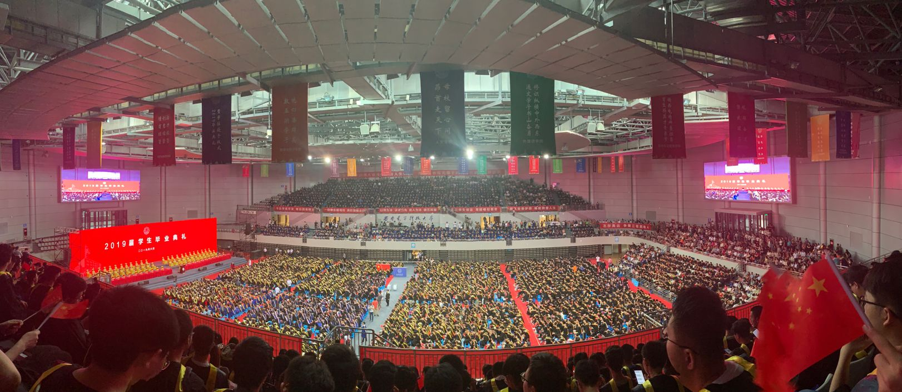

四年的本科时光一晃而过，转眼又到了毕业季。

回想起大一刚入学时的懵懂与初来乍到时的新鲜感、大二第一次参加数模校赛时的紧张与期待、大三繁忙课业之余时的得心应手，大四保研成功之后满载而归的喜悦，一切都仿佛在昨日。在西安电子科技大学的本科四年时光里，我收获的不只是知识，还有更多无价的财富。值此毕业之际，我也希望将自己的本科毕业设计经历分享给大家，希望每一个西电的学弟学妹们都能顺利毕业，尽早走向更广阔的世界！

> 本文将不定期进行更新，欢迎补充！
>
> **最终结果以学校为准，本文只作参考**。

# 相关背景

## 个人信息

云中君，西安电子科技大学计算机科学与技术学院（原软件学院）软件工程专业卓越班2015级本科生。

# 毕业设计流程

## 获得《本科生毕业设计论文工作手册》

> 时间：12月左右

大四上半学期末（12月左右），随着全校大四学生毕业设计工作的展开，大学生活便逐渐进入了尾声。这段时间每一个人都会收到一本《**本科生毕业设计论文工作手册**》，里面主要有以下几部分：

- **本科毕业设计（论文）概述**：大致讲一下什么是毕业设计，没有什么用；
- **毕设工作条例**：明确了各项工作（盲审、答辩、补做、校外等）的执行标准；
- **毕设论文撰写规范**：讲解了毕设论文的结构、内容与格式要求，较为重要；
- **毕设论文实施步骤与内容**：主要作为对论文的结构与内容方面的补充；
- **毕设论文示例**：如果前面部分的阐述较为抽象，这个示例可作为一个更加直观的补充说明。

总的来说，这个工作手册还是比较重要的，尤其是在来年五月的论文撰写环节会很有用。当然，随后教务处也会在教务网站上发布电子版的**《毕业设计手册（修订稿）》**，该文件也可作为**重要参考**，建议留意。

## 选择毕设类型

> 时间：临近寒假

毕设共分为以下三种类型：

- **校内企业毕设**：跟随学院所请的企业负责人进行毕业设计，临近寒假时选题（大概率以抓阄的方式，**真正的选题会在来年五月答辩前**）；
- **进导师实验室实习**：跟随校内导师，进入实验室完成毕业设计，大概率是科研项目（选题也是在临近寒假左右）；
- **外出毕业设计**：我所选择的类型，适合保研的和外出工作想提前适应下环境的。需要提交**外出毕设申请表**与**接收证明**，题目自拟或由接收方给出。外出毕设的同学选题时间与校内企业毕设相同，都为**来年五月答辩前**。

## 前半期毕设

> 时间：任何时间至4月初

## 中期答辩

> 时间：4月初至4月末

准确来说，在校内的同学会在4月初参加中期答辩，在校外的同学会在4月末参加中期答辩（学院会组织指导老师到指定的城市）。在中期答辩环节，需要准备的文件如下：

- **中期答辩报告**：5000字左右，阐述目前完成的工作；
- **中期检查评分表**：用以对答辩结果评分的表，答辩前上交，答辩完成后会返还。

## 后半期毕设

> 时间：4月到5月

中期答辩完毕后会有半个月到一个月左右的时间继续完善毕设结果。

## 撰写论文

> 时间：5月初

五一小长假搭配毕设论文再合适不过啦。

## 盲审

> 时间：5月上中旬

五月上中旬会出盲审名单，大约百分之五的概率会被抽到，参加盲审有以下几种结果：

- **合格**：最好的结果，没有任何问题，**可直接参加答辩**；
- **适当修改**：少量问题，适当修改，**填写修改说明，由导师重审后签字，方可参加答辩**；
- **大量修改**：大量问题，大量修改，**填写修改说明，由导师重审，签字，由院系重审方可参加答辩**；
- **重做**：问题过多，**直接重做，延期答辩**。

## 答辩

> 时间：5月21日至5月25日

答辩分组结果与具体答辩时间在5月20日通知。答辩需准备以下材料：

- **论文**：包含论文封面、诚信书与论文正文；
- **论文查重报告单**：重复率不得高于30%；
- **论文修改意见表**：作为答辩后的修改意见；
- **论文答辩登记表**：答辩情况记录；
- **论文评定意见表**：论文质量评定；
- **软硬件验收表**：查看毕业设计的工程实现情况。

答辩结果分为五个等级，分别为**不合格（<60）、合格（60-70）、中（70-80）、良（80-90）、优（>90）**。其中不合格的论文需要参加二辩。

## 二辩

> 时间：5月28日

## 修改

> 时间：5月28日至6月12日

根据答辩结果对论文作适量修改。

## 装订及提交

> 时间：6月12日

修改完成并经过评审后，可进行装订与提交。装订使用胶装的方式。

**在提交前，教务系统的毕设分数便已经给出，提交只是方便院里的存档，按照院里要求完成即可，不用太关注格式等问题。**

至此，所有毕设流程便已执行完毕。

## 复审

> 时间：6月13日至6月16日

对论文格式进行复审，6月17日公布复审结果，不合格的学生须重新修改并装订，**事实上所有人都过了复审**。

## 最终提交

> 时间：6月17日至6月19日。

最终提交时间为6月19日下午17:00之前。

## 毕业典礼

> 时间：6月21日。

上午完成**校毕业典礼**，下午完成**院毕业典礼**，院毕业典礼会完成学位的授予仪式（拔穗）。

## 离校

> 时间：6月23日下午6时之前。

完成离校手续的办理（图书馆注销，退宿等），完成个人行李的寄存，完成**毕业证**与**学位证**的领取。