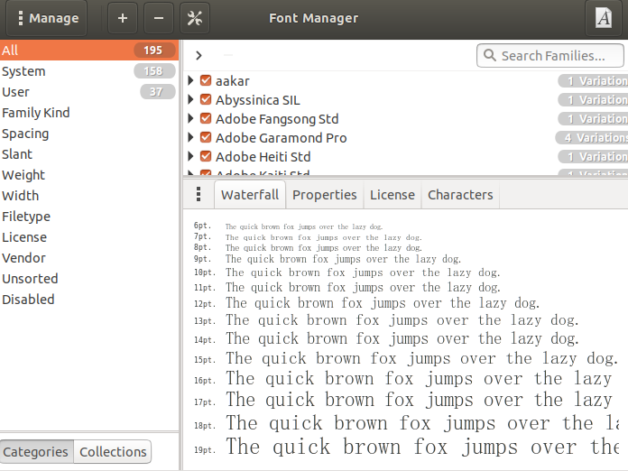

很多时候，我们需要在Ubuntu中添加或删除我们需要的字体，但是使用命令行的方式管理字体却十分麻烦，这里推荐两个傻瓜式的字体管理相关工具，以供大家参考。

# Font Viewer

Ubuntu自带的字体浏览工具，只有浏览的功能，可以在Ubuntu Software当中安装与卸载，也可以通过apt包管理器进行下载与安装。

# Font Manager

该工具相比于Font Viewer增加了添加与删除等智能化管理的功能。其可以在Ubuntu Software当中安装与卸载，也可以通过apt包管理器进行下载与安装。其界面如下：

可以通过点击左上角的加号，从文件系统中选择**已下载**好的字体文件进行安装。