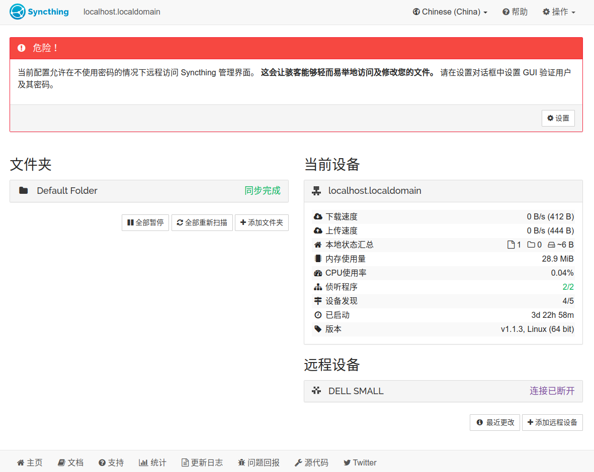

随着设备的增多，多设备间文件的同步问题一直是一件令人脑壳疼的事情，传统的使用U盘进行拷贝的方式显然很不合理（这也是为什么版本控制这么重要的原因），但其他的同步方式也多种多样，各有优缺点，让人很难抉择。下面我总结一下我在文件同步中爬过的一些坑，用到的一些工具，希望能够帮助看到的人少走弯路。

# 文件同步问题的基本考量

从我的需求出发，我对文件同步有以下几点要求，其按照优先级从高到低如下：

- **跨平台性**： 能够跨平台进行使用，必须支持`Ubuntu`系统与`Windows`系统，`IOS`系统可选择性支持；
- **速度与稳定性**：最好是国内的厂商，如果无法满足，那么翻墙后应该有着与国内相当的吞吐率（延迟较高没关系）；
- **价位**：价格越低越好，免费最好不过。
- **容量**：容量不能低于3GB。

# Github

Github是我用来当做文件同步的第一个工具，每次在打开同步文件夹前，都会经过以下几步：

- **Fetch Origin**：首先从远端拉下更新；
- **Pull Origin**：将更新提交到本地的仓库；

在完成工作，并试图提交到远端仓库时，会经过以下几步：

- **Commit**：承认并提交更改；
- **Push Origin**：将更改提交到远端仓库。

`GIthub`单独作为一个文件同步工具具有很多优点，比如在`Linux`系统与`Windows`系统下都可以工作等等，但是，它的缺点也很明显：

- `Github`对于单个大文件不友好，其官方也不鼓励向仓库中放置大文件；
- `Github`的仓库大小有隐性限制，据说当仓库大小超过1GB时会被`Github`官方请喝咖啡；
- `GIthub`的`.git`文件夹用来记录仓库的更改历史，其大小甚至比我们需要同步的所有文件加起来还要大，这极大地浪费了我们的存储空间。

考虑到`Github`如此多的缺点，我把目光转向了其他替代品。

# 坚果云

坚果云是曾经上海交通大学一个团队开发的国产云同步软件，但是由于其免费版本有流量限制，所以最后没有选择使用，继续寻找替代品。

# Dropbox

`Dropbox`一个很大的缺点是服务器在国外无法访问、另一个很大的缺点是免费的容量只有3GB（虽然可以在淘宝上买）、还有一个更大的缺点是即使翻墙了速度也慢的要死，所以我选择pass（不考虑真香定律）。

# Seafile

`Seafile`貌似是一个国人开发的平台，因为其`Desktop`在`Ubuntu 18.04 LTS`下拖拽不流畅，被果断地pass。

# Nextcloud

`Nextcloud`有一个很大的优点是可以自己搭建文件同步服务，如果你有自己的服务器，这将节省很大一部分开销，而且连接速度、质量与数据安全性也会得到很大的保障。一张刚刚配置好的截图如下：

`Nextcloud`也有很多的缺点（开源软件的通病），但是这不能阻挡它称为一款非常优秀易用的文件同步软件。

# Syncthing

这是个很强大的开源文件同步软件，也是一个可以自己搭建文件同步服务器的开源工具。贴一张配置好的图：

这个工具的缺点就是太强大了，用起来很累赘。果断pass。

# Google Drive

`Google Drive`一个很大的缺点是`Google`在国内的服务无法正常使用，只能借助`shadowsocks`翻墙进行同步。好在这点成本还可以考虑，而且速度也不算太慢（相比于`GIthub`与`Dropbox`来说），`Google Drive`的另一个缺点是其没有`Ubuntu`上的客户端，这导致跨系统同步十分不方便，好在如今`Github`有很多开源库，其调用了`Google`开发并开放的`Drive API`接口，下面介绍几个工具：

## insync

一个新加坡的团队开发的针对于`Google Drive`的同步的软件，有华丽的用户界面，功能很棒很全面，但是很贵（29刀），为了节省开支，还是先寻找一下其他的替代品。

## overgrive

这个软件很便宜（5刀左右），但是安装之后出现了卡死的现象，而且是基于`Python 2.7`开发的，有些老旧，所以还是继续寻找替代品。

## cloudcross

开源的命令行工具（没有用户界面），很不稳定，所以还是选择pass。

## rclone

`rclone`除了可以同步`Google Drive`，还可以针对很多其他的工具进行同步，而且很稳定很强大，不过缺点是速度相对于`cloudcross`有些慢，这点其实还可以忍受啦。

# 结束语

关于文件同步软件，我也一直在不断地寻找当中，后续如果有更好地替代还会对本文继续更新。如果大家有更好地替代品的话，也欢迎通过邮件主动联系我，向我推荐更多的优秀易用的文件同步软件。