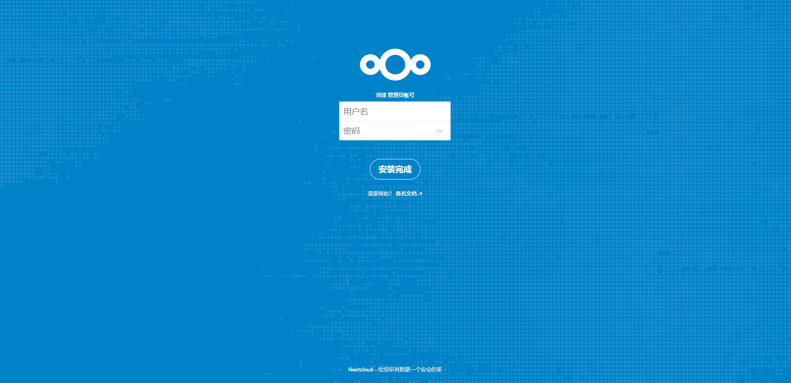

# 环境配置

使用Snap完成Nextcloud的傻瓜式安装。首先运行以下命令安装Snap：

```shell
sudo apt-get install snapd
```

使用以下命令更新软件源（-y 参数表示对于所有的选项执行yes）：

```shell
apt-get update -y
```

# Nextcloud安装

使用以下命令使用Snap安装Nextcloud：

```shell
snap install nextcloud
```

# Nextcloud配置

在浏览器中输入服务器ip地址，得到以下页面：



在其中填入相关信息即完成服务端配置。

# 在Ubuntu环境下安装Client版本

在官网找到AppImage版本下载运行即可。