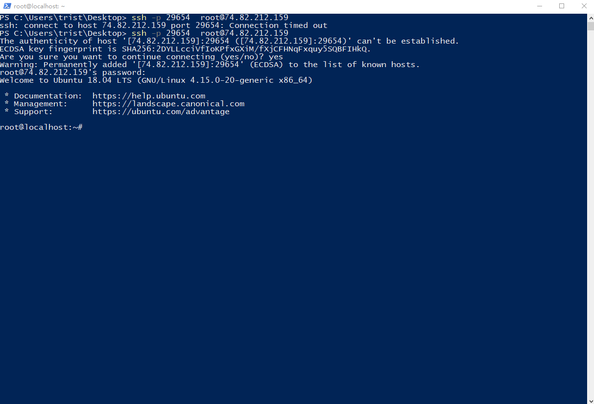

打算今天使用Nextcloud搭建一个自己的文件同步服务器，原来的Shadowsocks运行在CentOS操作系统上，重装为Ubuntu 18.04 LTS之后仍然需要自己装一遍Shadowsocks的服务器端，正好借此机会写下这篇搭建教程。

Shadowsocks的搭建其实非常简单，只需要几行命令就可以搞定。下面介绍基于远程服务器搭建的详细步骤。

# 连接服务器

我的服务器是两年前买的搬瓦工最低配版本，年付130左右，现在已经取消了，取而代之的是年付49.9刀的版本。虽然这款服务器价格便宜，但是性能也能够满足代(fan)理(qiang)+文件同步服务器的需求（每月流量500GB，硬盘空间10G左右），话不多说，下面开始进行搭建。

首先连接服务器，懒得开Ubuntu，所以直接用了Windows下的Powershell ssh到服务器上（此时需要确保服务器是刚刚重装后的干净的版本）。



登录之后输入以下命令更改`root`用户密码：

``` shell
passwd root
```

# Shadowsocks Server安装

首先更新软件源：

``` shell
sudo apt-get update
```

安装Python3的pip：

``` shell
sudo apt install python3-pip
```

使用pip3安装Shadowsocks服务器软件，这个软件本身为GitHub的一个开源项目，后因为相关规定下架，但是其发布的版本已被存档，所以我们可以使用以下命令对其进行安装：

``` shell
pip3 install https://github.com/shadowsocks/shadowsocks/archive/master.zip
```

使用以下命令检查版本：

```shell
ssserver --version
```

应该会输出3.0.0版本。

# Shadowsocks Server配置

首先创建shadowsocks.json：

```shell
sudo vi /etc/shadowsocks.json
```

把下面的代码复制进该文件中，并保存（将各项设置替换为自己的设置）：

```json
{
    "server": "74.82.212.159",
    "server_port": **********,
    "local_address": "127.0.0.1",
    "local_port": 1080,
    "password": "**********",
    "timeout": 300,
    "method": "aes-256-cfb"
}
```

使用以下命令重新启动Shadowsocks Server（-d选项表示在后台运行）：

```shell
ssserver -c /etc/shadowsocks.json -d start
```

大功告成！

# 小插曲

使用`vi`或者`vim`编辑文件其实特别麻烦和累赘，这里推荐一下VSCode上的插件SSH FS，其可以直接把远端的文件系统挂载到VSCode上，从而实现文件的本地编辑。

