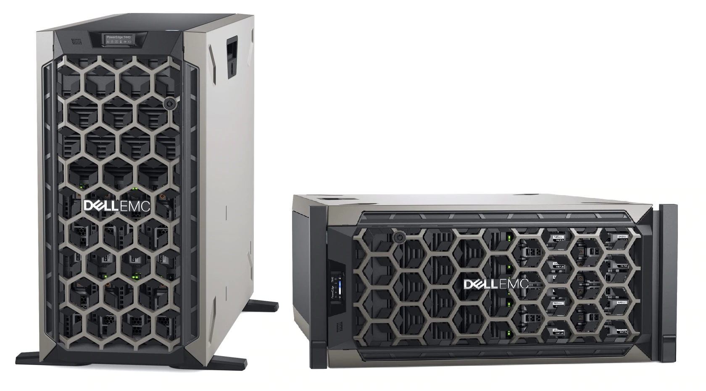
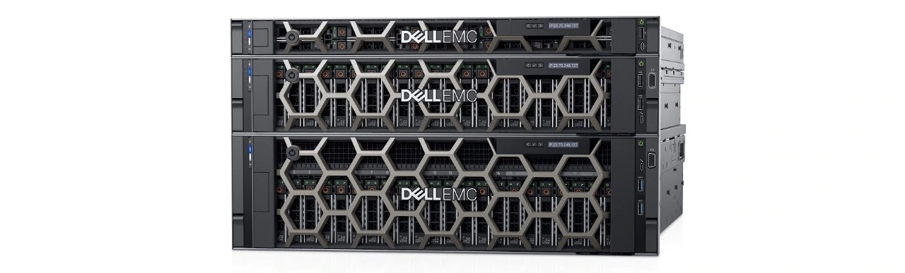
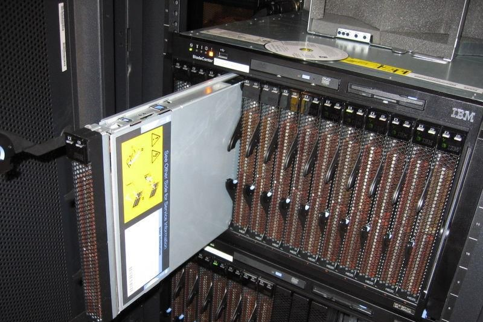

# Tower Server

> it refers to a standalone computer that is built in an upright cabinet known as the tower. Generally, tower servers are constructed with a certain extent of robustness considered in order to reduce service downtime and prevent possible damages. For the deployment of NFVI, most operators would like to use branded servers from major manufactures like Cisco, IBM, Huawei, HPE, etc. However, due to the large volume and weight of tower server, the floor space may be a big limitation for NFVI expansion. In addition, since tower servers are actually independent from each other, each of them will need a complete auxiliary system which includes an individual cooling system, monitor, I/O devices (e.g., keyboard), etc. Such situation naturally leads to high CAPEX for NFVI deployment and maintenance.

Tower Server（塔式服务器）指的是一个独立的计算机，它建在一个称为塔的直立机柜中。通常，塔式服务器的构造具有一定程度的鲁棒性，以减少服务停机时间并防止可能的损坏。 对于NFVI的部署，大多数运营商都希望使用思科，IBM，华为，HPE等主要设备的品牌服务器。但是，由于塔式服务器的体积和重量很大，占地面积可能是 NFVI扩张的一大局限。此外，由于塔式服务器实际上彼此独立，因此每个塔式服务器都需要一个完整的辅助系统，包括单独的冷却系统，监视器，I/O设备（例如键盘）等。这种情况自然会导致用于NFVI部署和维护的高CAPEX。

一个常见的塔式服务器如下图所示：

# Rack Server

> it refers to the server that is mounted inside a rack (a shelf to manage servers). Compared with the tower server that one tower only contains one server, a rack can contain multiple servers stacking one above the other, which not only reduces the required floor space, but also consolidates network resources. Currently, the commonly used industry standard servers are 1U or 2U (U is the rack unit and 1U indicates 19 inches wide and 1.75 in. high) rack servers. Due to the fact that many effort s from the open source projects (e.g., CloudNFV) are contributed to the combination of NFV and cloud, most manufactures are trans- forming their rack systems to cloud based infrastructure, such that they can support and serve NFV workloads in a better way.

Rack Server（机架式服务器）指的是安装在机架内的服务器（用于管理服务器的机架）。与一个塔只包含一个服务器的塔式服务器相比，一个机架可以包含多个堆叠在一起的服务器，这不仅减少了所需的占地面积，而且还整合了网络资源。 目前，常用的行业标准服务器是1U或2U（U是机架单元，1U表示19英寸宽，1.75英寸高）机架式服务器。 由于来自开源项目（例如，CloudNFV）的许多努力为NFV和云的组合做出了贡献，大多数制造商正在将其机架系统转换为基于云的基础架构，以便它们可以支持和服务NFV 工作量更好的方式。

一个常见的机架式服务器如下图所示：

# Blade Server

> it evolves from the concept of rack sever. The blade servers are typically placed inside a blade enclosure to form a blade system that meets the IEEE standards of rack units. Compared with tower and rack servers, the blade server allows more processing power in less rack space, since it shares certain elements of hardware among blade servers within the same enclosure. Considering the case that the NFV workloads are primarily about computing and net- working (e.g., packet processing and communication) rather than storage, the blade server is a good choice, because multiple blade servers can be packed into one chassis to provide a high-density server which takes care of networking, power, cooling and hardware management for the entire set of compute nodes.

它从机架服务器的概念演变而来。刀片服务器通常放置在刀片机箱内，以形成符合IEEE机架单元标准的刀片系统。 与塔式和机架式服务器相比，刀片式服务器可在更少的机架空间内提供更强的处理能力，因为它在同一机箱内的刀片服务器之间共享硬件的某些元素。 考虑到NFV工作负载主要是关于计算和网络（例如，数据包处理和通信）而不是存储的情况，刀片服务器是一个不错的选择，因为多个刀片服务器可以打包到一个机箱中以提供高密度服务器，负责整个计算节点的网络，电源，冷却和硬件管理。

一个常见的刀片式服务器如下图所示：

