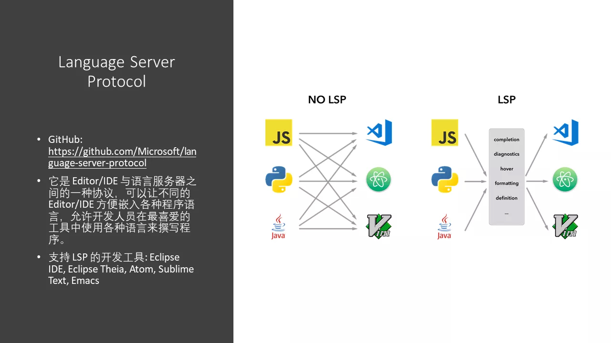

根据百度百科的定义：LSP（Language-Server-Protocol）即开源的语言服务器协定。由**红帽、微软和 Codenvy**联合推出，可以让不同的**程序编辑器与集成开发环境（IDE）**方便嵌入各种**程序语言**，允许开发人员在最喜爱的工具中使用各种语言来撰写程序。

那么什么是**语言服务器**呢？就是提供了检查语言特性功能的服务器。当提供相关的代码等信息给它后，它能响应给你关于语法检查、自动补全、跳转位置、引用查找等信息。

# 为什么需要LSP

如下图所示：

如果我们现在有M款IDE，N款编程语言，那么我们需要实现M×N个接口来使得它们之间相互支持，而如果我们有了LSP，我们只需要提供M+N种支持即可。

LSP的具体文档见官方网站：[LSP官方网站](https://microsoft.github.io/language-server-protocol/)。

LSP的Github项目地址如下：[Github LSP](https://github.com/Microsoft/language-server-protocol)。

