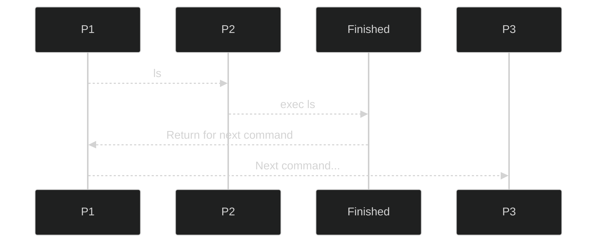
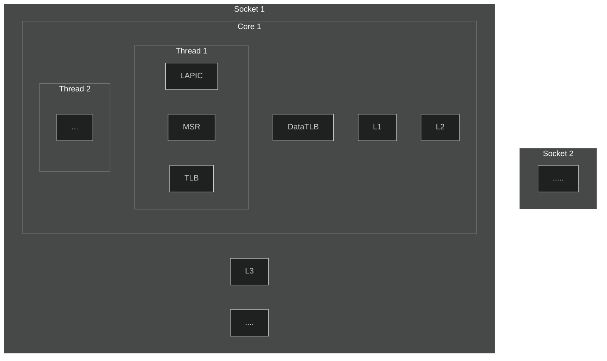

### Misc ideas

Pressing the *Enter key* by itself will repeat the last command.

Linux has ELF, Windows has PE (Portable Executable), Apple (MacOS and iOS) has Mach-O and Unix System V has COFF.

root account always have UID/GID 0 [linux - Does the root account always have UID/GID 0? - Super User](https://superuser.com/questions/626843/does-the-root-account-always-have-uid-gid-0).

At the [file descriptor](http://en.wikipedia.org/wiki/File_descriptor) level, ***stdin\* is defined to be file descriptor 0**, ***stdout\* is defined to be file descriptor 1**; and ***stderr\* is defined to be file descriptor 2**.

*EPTP* is like *CR3* but for EPT. So constructing an extended page table is the responsibility of VMM just like constructing a normal page table is the responsibility of OS.

### iTLB / dTLB / TLB Hierarchy

(2022) Modern processors typically use a two-level TLB hierarchy:

- The first level (L1) is split in two components: the **dTLB** is used to cache translations triggered by data loads while the **iTLB** stores those triggered by instruction fetches.（也就是说取指产生的 TLB miss 放在 iTLB 里面而读数据产生的 TLB miss 放在 dTLB 里面）。
- A second level (L2) TLB is consulted after an **L1 miss** and can be either shared (sTLB), storing translations from either memory access type, or itself split, handling **data loads** and **instruction fetches** independently。

[sec22fall_tatar.pdf](https://www.usenix.org/system/files/sec22fall_tatar.pdf)

Similar to caches, TLBs may have multiple levels. CPUs can be (and nowadays usually are) built with multiple TLBs, for example a small L1 TLB (potentially fully associative) that is extremely fast, and a larger L2 TLB that is somewhat slower. When instruction-TLB (ITLB) and data-TLB (DTLB) are used, a CPU can have three (ITLB1, DTLB1, TLB2) or four TLBs.

TLB 本身是缓存页表的。

https://en.wikipedia.org/wiki/Translation_lookaside_buffer#:~:text=Similar%20to%20caches,or%20four%20TLBs.

### `arch/x86/include`

It has 2 sub-folders: `asm` and `uapi/asm`.

The `asm` denotes architecture-specific-macros, so it is put under this directory is not strange. It is not designed to be interacted with the userspace, so it is not in `uapi`.

`uapi/asm` : provide a standardized way for user-space applications to access the system call interface and other kernel features on x86-based systems. These header files define system call numbers, function prototypes, and data structures that are needed by user-space programs to interact with the kernel.

### `include` Directory in the kernel source code

All the common headers are in `include` and its sub-directories, and the architecture-specific headers are in sub-directories of the `arch/x86/include` directory. In most cases you’d include headers from `include`.

When you compile the kernel source code, the compiler will automatically search for header files in the appropriate directories, including both the generic `/include` folder and the architecture-specific `arch/x86/include` folder.

**Why `kvm_host.h` is located under the `/include/linux` folder?**

Because it needs to be included, and it is not arch-specific.

### When VCPU is in low overhead, can Host use the CPU resource to do other things?

`Guest Non-Register State -> Activity state` may has the value `HLT`, it denotes the logical processor is inactive because it executed the HLT instruction. (SDM 24.4.2 Guest Non-Register State)

**I think** the Host couldn't do the dynamic sharing this way, it can only do some statically sharing by the scheduling algorithm. For an example, if we use the CFS algorithm, then all the VMs will share the vcpu without regarding the real CPU utilization of each VM.

Need to be confirmed: [virtualization - KVM CPU share / priority / overselling - Stack Overflow](https://stackoverflow.com/questions/47621257/kvm-cpu-share-priority-overselling)

### How do we kick a vcpu down if it just don't VMexit?

Remember we still have the task switch function which is enforced by the clocking hardware. So it will vmexit when task switch happened and the VMM can determine which task to run next. (The VM is managed by QEMU for VMLAUNCH and VMRESUME, and QEMU is managed by the OS).

[virtualization - KVM CPU share / priority / overselling - Stack Overflow](https://stackoverflow.com/questions/47621257/kvm-cpu-share-priority-overselling)

### What does "Idle" mean for CPU?

TLDR; by `halt` (HLT).

There is an always ready process named "System Idle Process" (Windows), you can see it in task manager -> Details, and sort the process by the CPU utilization.

This process is essentially a wrapper for `halt`.

不要把进程挂起和 halt 指令混淆，当我们调用 sleep 之类函数时，暂停运行的只是进程，此时如果还有其它进程可以运行那么 CPU 是不会空闲下来的，当 CPU 开始执行 halt 指令时就意味着系统中所有进程都已经暂停运行。

[CPU 空闲时在干嘛？ - 知乎](https://zhuanlan.zhihu.com/p/356447262)

**CPU 如何从 HLT 中恢复？**

HALT 时，CPU 的 LAPIC 并不会停止工作，即 CPU 将会继续接收外部 **中断、异常** 等事件（事实上，CPU HALT 状态的退出将由外部事件触发）。当中断服务函数执行完毕后，RIP 会指向 HLT 的 **下一条指令**，即 CPU 继续执行 HLT 之后的程序。

[CPU在空闲的时候做什么_河马虚拟化的博客-CSDN博客_native_safe_halt](https://blog.csdn.net/lindahui2008/article/details/83051411)

### Halt instruction

This instruction is a privileged instruction, so userspace cannot execute this instruction directly.

### TPM

The TPM is an actual co-processor living on the motherboard of your device.

TPM can store and encrypt data based on these measurements.

If you take the output generated by this TPM chip and that output was generated against specific measurements then that output can never be decrypted on another TPM unless it was somehow identical to your current device -- I'll demo this in a minute. This should never be the case even if it's the same model of laptop because the manufacturer would have put in different serial numbers.

TPM 芯片的工作原理是什么？ - furious 的回答 - 知乎 https://www.zhihu.com/question/35496371/answer/856294314

### Style customization for Thunderbird

If you just want to make the "Unread" explict, you could just change the theme to "Dark".

Note: should first change `toolkit.legacyUserProfileCustomizations.stylesheets` to true.

[Aris-t2/CustomCSSforTb: Custom user styles for Thunderbird 68+](https://github.com/Aris-t2/CustomCSSforTb#unlock-custom-css-usage-in-thunderbird)

### Attestation Service

An attest service, or attestation service, is an independent review of a company's financial statement conducted by a certified public accountant (CPA).

### Intel vs. AMD in Features

|             Intel             |                  AMD                  | Who First? |
| :---------------------------: | :-----------------------------------: | :--------: |
| Total Memory Encryption (TME) |    Secure Memory Encryption (SME)     |    AMD     |
|             MKTME             | Secure Encrypted Virtualization (SEV) |    AMD     |
|   Extended Page Table (EPT)   |        Nested Page Table (NPT)        | Don't know |

### Where to find the spec?

[Index of /x86docs/](https://kib.kiev.ua/x86docs/)

### ELF symbols

**Assembly is not ELF!**

### CPUID is x86 related rather than vendor (Intel, AMD) related

For example, in QEMU: they are defined in `target/i386/cpu.h`.

in KVM, they are defined under `arch/x86/include/asm/cpufeatures.h` and `tools/arch/x86/include/asm/cpufeatures.h`, which means some features are shared between Intel and AMD.

### Authenticated Code Module (ACM)

A code module that is designed to be loaded, verified and executed by the CPU in on-chip memory (CRAM).

There are two types of ACM signing keys:

- Debug key
- Production key

There are three possible types of signed AC Modules:

- Debug signed: signed by debug ACM key. Used for debugging and validation.
- Production signed: signed by production ACM key. Can run **only** on production HW.
- Production signed Non-production worthy (NPW): signed by production ACM key. Can run **only** on production HW. These modules are intended for debugging on production HW.

### What is on-chip memory (CRAM)?

The on-chip SRAM, refers to data memory residing on-chip, that is mapped into an address space disjoint from the off-chip memory, but connected to the same address and data buses.

The primary characteristic of an OCRAM is its size. The amount of available on chip RAM can vary considerably between SoCs from a few kilobytes to many megabytes.

On chip RAM is, most often than not, implemented as a fast low-latency static RAM.

**It usually requires little to no configuration before use meaning it can be available early within the boot sequence. OCRAM is often used as an important component of the boot process, providing a small quantity of RAM resources to the bootloader before the main external SDRAM is initialized.**

[Introduction to On-Chip RAM - JBLopen](https://www.jblopen.com/introduction-ocram/)

### Wrapper: failed with: gRPC call failed: Connection reset by peer

Turn off the network proxy.

### 5800X3D/3D V-Cache

V stands for "vertical", not "virtual".

3D V-Cache 是 AMD 开发的一项新技术，可以让 L3 缓存垂直堆叠，这样可以在占用很少空间的情况下显着增加缓存的大小。

### How does shell work when you executing commands?

Run `ls` in shell process



I think P2 is a non-login, non-interactive shell.

Run `exec ls` in shell process


### Create a new user / Add a new user (tested on Ubuntu, CentOS)

First, add new user lei:

```bash
useradd -ou 0 -g 0 -m lei
```

When finished, execute:

```bash
visudo
```

Then add:

```
lei ALL=(ALL:ALL) ALL
```

alongside the line `root    ALL=(ALL:ALL) ALL`.

Then

```bash
passwd lei
```

Then (On CentOS, you may **NOT** need this)

```bash
sudo usermod -aG sudo lei
```

[Create a sudo user in Ubuntu -](https://docs.rackspace.com/support/how-to/create-a-sudo-user-in-ubuntu/)

### Python LSP server parameters

[python-lsp-server/CONFIGURATION.md at develop · python-lsp/python-lsp-server](https://github.com/python-lsp/python-lsp-server/blob/develop/CONFIGURATION.md)

### Difference between `(1ULL << 2)` and `0x00000004`

The first one is 64 bit and is for 64 bits long register, the latter is for 32 bit long register.

Another advantange of `0x00000004` it can represent multi-bits in one time, and `(1ULL << 2)` is always used to represents a single bit value.

[code-snippets/bit_definition.c at main · tristone13th/code-snippets](https://github.com/tristone13th/code-snippets/blob/main/c/bit_definition.c)

### Tabstop, shiftwidth, softtabstop, expandtab, smarttab

**tabstop**: Tab width relative to a space char.

**shiftwidth**: When you indent a line, the width you indented is determined by shiftwidth.

- if you set `expandtab`, then it will indent with spaces;
- if you set `noexpandtab`:
  - if the value of `shiftwidth` is an integer multiple of `tabstop`, then it will appear as several tabs;
  - if not, then it will fill with tabs first, the remaining will be spaces.

**softtabstop**: The value is converted to tabs and spaces when you insert a tab. The only difference with `shiftwidth` is that it is triggered by inserting a Tab, not by indentation.

**smarttab**: determines whether `shiftwidth` is triggered or `softtabstop` is triggered.

**expandtab**: determines if a tab is expanded to spaces.

### How to fix "You’ll Need a New App to Open This ms-gaming overlay"

[How to Fix the 'You'll need a new app to open this ms-gaming overlay' Error on Windows 10? - Appuals.com](https://appuals.com/how-to-fix-the-youll-need-a-new-app-to-open-this-ms-gaming-overlay-error-on-windows-10/)

### The Shadow Suite

**encode password**: *one way hash function*, This is an algorithm that is easy to compute in one direction, but very difficult to calculate in the reverse direction.

When a user picks or is assigned a password, it is encoded with a randomly generated value called the *salt*. The *salt* value is then stored with the encoded password.

prone to *dictionary attack*: an 8 character password encodes to 4096 * 13 character strings. So a dictionary of say 400,000 common words, names, passwords, and simple variations would easily fit on a 4GB hard drive. The attacker need only sort them, and then check for matches. Since a 4GB hard drive can be had for under $1000.00, this is well within the means of most system crackers.

The *Shadow Suite* solves the problem by relocating the passwords to another file (usually `/etc/shadow`). The `/etc/shadow` file is set so that it cannot be read by just anyone. Only *root* will be able to read and write to the `/etc/shadow` file.

[Linux Shadow Password HOWTO: Why shadow your passwd file?](https://tldp.org/HOWTO/Shadow-Password-HOWTO-2.html)

### How to see which version of softwares Ubuntu is using

Open the manifest file in:

[Ubuntu 22.04.1 LTS](https://releases.ubuntu.com/22.04/)

if you also want to get the source code, you can:

[How to get source code of package using apt on Debian/Ubuntu - nixCraft](https://www.cyberciti.biz/faq/how-to-get-source-code-of-package-using-the-apt-command-on-debian-or-ubuntu/)

[How do I get and modify the source code of packages installed through apt-get? - Ask Ubuntu](https://askubuntu.com/questions/28372/how-do-i-get-and-modify-the-source-code-of-packages-installed-through-apt-get)

### Linux PAM

Pluggable Authentication Modules

Will be used by (not only) /usr/bin/login.

[Understanding PAM - Linux.com](https://www.linux.com/news/understanding-pam/)

### Linux utils like /usr/bin/login

[util-linux/util-linux](https://github.com/util-linux/util-linux)

### Usermode-Helper API

[IBM Developer](https://developer.ibm.com/articles/l-user-space-apps/)

### Shell type

A login shell is the first process that executes under your user ID when you log in for an interactive session. (You needn't to login again).

A Non-login shell needn't you to login again because you have logined.

Examples:

|           |            Interactive            |              Non-interactive               |
| :-------: | :-------------------------------: | :----------------------------------------: |
|   Login   |      ssh/su - (bash_profile)      | Rare (Non-interactive, then how to login?) |
| Non-login | Start a shell in a shell (bashrc) |                  .sh file                  |

[bashrc - What is the difference between interactive shells, login shells, non-login shell and their use cases? - Unix & Linux Stack Exchange](https://unix.stackexchange.com/questions/50665/what-is-the-difference-between-interactive-shells-login-shells-non-login-shell)

### Linux init 进程

init 比较特殊，两个状态，刚开始是内核态，属于内核线程（kernel_init），然后转成用户态（init）（通过一个系统调用，开始执行用户空间的 `/sbin/init` 程序）。

[Linux下1号进程的前世今生----Linux进程的管理与调度_CHENG Jian的博客-CSDN博客](https://blog.csdn.net/gatieme/article/details/51532804)

[Linux的init进程_开发联盟的博客-CSDN博客_状态init](https://blog.csdn.net/weixin_40673765/article/details/83411696)

### Idle process

idle 进程，也就是 swapper 进程，其 pid 是 0，是所有进程的祖先。每个 cpu 都有一个 idle 进程。

```c
// in kernel/sched/idle.c
// start_kernel –> rest_init
void cpu_startup_entry(enum cpuhp_state state)
{
	arch_cpu_idle_prepare();
	cpuhp_online_idle(state);
	while (1)
         //idle 进程是一个死循环，当没有 thread 处于 TASK_RUNNING 的时候，CPU 会跑这个 idle 进程，idle 的优先级最低
		do_idle();
}
```

[每个cpu 都有一个idle进程._tiantao2012的博客-CSDN博客_do_idle](https://blog.csdn.net/tiantao2012/article/details/77935491)

### Change mermaid in typora to dark theme

Add `%%{init: { 'theme': 'dark' } }%%` to the first line.

[mermaid - Markdownish syntax for generating flowcharts, sequence diagrams, class diagrams, gantt charts and git graphs.](https://mermaid-js.github.io/mermaid/#/./directives)

### What is gdb MI?

GNU Debugger Machine-*Interface*.

A frontend for gdb.

[GDB/MI](https://sourceware.org/gdb/onlinedocs/gdb/GDB_002fMI.html)

### Not only commits are recognized by Github as contribution to show up in the graph.

Issues, pull requests and discussions will appear on your contribution graph if they were opened in a standalone repository, not a fork.

[Why are my contributions not showing up on my profile? - GitHub Docs](https://docs.github.com/en/account-and-profile/setting-up-and-managing-your-github-profile/managing-contribution-settings-on-your-profile/why-are-my-contributions-not-showing-up-on-my-profile)

### **CONFIG_=n** And **# CONFIG_ is not set**

**CONFIG_=n** It means that you are explicitly disabling this config item from your defconfig file. So in your .config file it will show like *# CONFIG_ is not set*.

**# CONFIG_ is not set** In this case also you are explicitly disabling this config. So generated config file (.config) will show like *# CONFIG_ is not set*.

However with Any of these options you can disable the config item; but as per @ Alexandre comment it seems that "not set" is the proper way.

[c - Which approach to use for Kernel CONFIG_? - Stack Overflow](https://stackoverflow.com/questions/41946817/which-approach-to-use-for-kernel-config)

### Uncore

"**Uncore**" is a term used by [Intel](https://en.wikipedia.org/wiki/Intel) to describe the functions of a [microprocessor](https://en.wikipedia.org/wiki/Microprocessor) that are **not in the core**, but which must be **closely connected to the core** to achieve high performance.

Uncore functions include [QPI](https://en.wikipedia.org/wiki/Intel_QuickPath_Interconnect) controllers, [L3 cache](https://en.wikipedia.org/wiki/L3_cache), [snoop agent](https://en.wikipedia.org/wiki/Memory_coherence) [pipeline](https://en.wikipedia.org/wiki/Instruction_pipeline), on-die [memory controller](https://en.wikipedia.org/wiki/Memory_controller), on-die [PCI Express Root Complex](https://en.wikipedia.org/wiki/PCI_Express_Root_Complex), and [Thunderbolt controller](https://en.wikipedia.org/wiki/Thunderbolt_(interface)).

[Uncore - Wikipedia](https://en.wikipedia.org/wiki/Uncore)

### How to examine an object file?

`objdump` and `nm`.

`nm` can list all symbols of an object file.

### AT&T Assembly syntax

Use "#" as the comments mark.

https://gist.github.com/mishurov/6bcf04df329973c15044

### Assembler Directives

All assembler directives have names that begin with a period (`.').

[Using as - Assembler Directives](https://ftp.gnu.org/old-gnu/Manuals/gas-2.9.1/html_chapter/as_7.html)

### Kernel assembly style

Kernel use AT&T as the standard syntax.

[GAS](https://tldp.org/HOWTO/Assembly-HOWTO/gas.html)

### Kernel Address Space Layout Randomization (or KASLR)

Two approachs for adding additional security for kernel:

1. Hiding the kernel addresses;
   1. You cannot really hide it, because most systems out there are running stock distribution kernels. Getting the needed address information from the distributor's kernel package is not a particularly challenging task.
   2. So, on these systems, there is no real mystery about the layout of the kernel, regardless of whether pointer values are allowed to leak to user space or not.
2. Randomizing the kernel addresses.
   1. If the kernel calculated a different offset for itself at every boot, it could subtract that offset from pointer values before passing them to user space.
   2. Those pointers could then be used by tools like perf, but they would no longer be helpful for anybody seeking to overwrite kernel data structures.
   3. ASLR is a "statistical defense", because brute force methods can generally be used to overcome it.

[Kernel address randomization [LWN.net]](https://lwn.net/Articles/444503/)

[Kernel address space layout randomization [LWN.net]](https://lwn.net/Articles/569635/)

### Exploit (security)

An **exploit** (from the English verb *to exploit*, meaning "to use something to one’s own advantage") is a piece of [software](https://en.wikipedia.org/wiki/Software), a chunk of data, or a sequence of commands that takes advantage of a [bug](https://en.wikipedia.org/wiki/Software_bug) or [vulnerability](https://en.wikipedia.org/wiki/Vulnerability_(computer_science)) to cause unintended or unanticipated behavior to occur on computer software, hardware, or something electronic.

[Exploit - Wikipedia](https://en.wikipedia.org/wiki/Exploit_%28computer_security%29)

### Kick?

The goal of a VCPU kick is to bring a VCPU thread out of guest mode in order to perform some KVM maintenance. To do so, an IPI is sent, forcing a guest mode exit.

[KVM VCPU Requests — The Linux Kernel documentation](https://01.org/linuxgraphics/gfx-docs/drm/virt/kvm/vcpu-requests.html)

### Microcode, microops and microinstructions

x86 instructions are internally converted into simpler RISC-style micro-operations that are specific to a particular processor and **stepping level**.

原始的 microcode 映射是从一个 ROM 中来的，新设计了一块相对比较小的 SRAM，它用来在该 ROM 上打补丁。

既然是在 SRAM 上进行，掉电以后就需要重新打补丁了，每次重启都要重新打补丁。打补丁的方式也很简单，就是把 Microcode 放在某个内存中，写个 MSR 就行了。

Microcode 更新可以通过 BIOS 来进行，也可以通过操作系统来进行。BIOS 更新的好处是一更新，上面安装的操作系统（Linux，Windows）都可以收益；操作系统更新比如 Windows 一般通过 Windows Update 来更新 Microcode。

**直接更新 ROM 里的微码映射，和每次重启把更新写在 SRAM 里的区别**

ROM 里的是不可更改的，所以不存在更新映射这一说，只可以通过 SRAM 来打补丁。

[Microcode是什么？它为什么能修正CPU硬件错误？ - 知乎](https://zhuanlan.zhihu.com/p/86432216)

An update to microcode can allow a CPU's low-level behaviour to be modified to work around certain yet to be discovered bugs, without needing to replace the CPU hardware.

A **microinstruction** contains all control information required to operate all involved functional units for one clock cycle. We refer to a plurality of microinstructions as microcode.

[terminology - What exactly is microcode and how does it differ from firmware? - Super User](https://superuser.com/questions/1283788/what-exactly-is-microcode-and-how-does-it-differ-from-firmware)

**Micro-operations** are detailed low-level instructions used in some designs to implement complex machine instructions.

Each micro-op would execute in a single clock cycle.

As with traditional microcode, one or more table lookups (or equivalent) is done to locate the appropriate μop-sequence based on the encoding and semantics of the machine instruction.

Execution engine (back-end) inside the cpu can only execute so-called “micro-ops” (uops), that were provided by the front-end.

**Then, what's the diff between Microcode and Micro-ops?**

It seems they are the same thing on Intel's CPU.

First, Microcode is earlier than Micro-ops.

Micro-ops are not single-cycle, they may not be load/store, they literally are microcode, there are a lot of different types, yes they do have a fixed format, and they were not designed to interact well with a compiler on important algorithms or application code.

Micro-ops are microcode, written by microcoders inside the company, without concern for the issues with which ISA designers must wrestle.

Furthermore, all Intel x86 microcode since P6 is written as sequences of mops, and some of these sequences are therefore quite complicated;

[The Origin of Intel’s Micro-Ops](https://ieeexplore.ieee.org/stamp/stamp.jsp?tp=&arnumber=9623410&tag=1)

### Difference between #AC and #DB and the handling of them

[25. Bus lock detection and handling — The Linux Kernel documentation](https://www.kernel.org/doc/html/latest/x86/buslock.html)

### Relationship between TLB and MMU

Note that usually the TLB is considered to be part of the MMU. The Wikipedia [article](https://en.wikipedia.org/wiki/Memory_management_unit) on MMU shows a figure from an old version of a book that indicates that they are separate. However, the most recent version of the book has removed the figure and says that the TLB is part of the MMU.

[x86 - Does a hyper-threaded core share MMU and TLB? - Stack Overflow](https://stackoverflow.com/questions/51360825/does-a-hyper-threaded-core-share-mmu-and-tlb)

### `CONFIG_HZ`

The frequency of interrupt.

x86 supports 100 Hz, 250 Hz and 1000 Hz.

[Linux中的tick模式 - 知乎](https://zhuanlan.zhihu.com/p/133211285)

[Linux中的tick模式 - L](http://liujunming.top/2022/09/06/Linux%E4%B8%AD%E7%9A%84tick%E6%A8%A1%E5%BC%8F/)

**How does hardware be configured by this values?**

For periodic mode, software sets a "initial count" and the local APIC uses it for a "current count". The local APIC decrements the current count until it reaches zero, then generates a timer IRQ and resets the current count to the initial count and begins decrementing the current count again. In this way the local APIC generates IRQs at a fixed rate depending on the initial count. The current count is decremented at a rate that depends on the CPU's external frequency ("bus frequency") divided by the value in the local APIC's "Divide Configuration Register".

For example, for a 2.4 GHz CPU with an external/bus frequency of 800 MHz, if the Divide Configuration Register is set to "divide by 4" and the initial count is set to 123456; then the local APIC timer would decrement the count at a rate of 200 MHz and generate a timer IRQ every 617.28 us, giving a rate of IRQs of 1620.01 Hz.

[APIC timer - OSDev Wiki](https://wiki.osdev.org/APIC_timer)

### 笔记本合盖子不休眠

https://man7.org/linux/man-pages/man5/logind.conf.5.html

[笔记本安装ubuntu关闭盖子不休眠设置_icodekang的博客-CSDN博客_ubuntu关闭盖子不挂起](https://blog.csdn.net/u011922698/article/details/122953668)

### Bus from southbridge to CPU

其中南桥跟 CPU 之间的通信 DMI 总线（Intel platform, on AMD, it is just PCIe），也就是 PCIe 3.0 x4 改了个名字。

On Intel platforms, all southbridge features and remaining I/O functions are managed by the PCH which is directly connected to the CPU via the [Direct Media Interface](https://en.wikipedia.org/wiki/Direct_Media_Interface) (DMI).

DMI shares many characteristics with [PCI Express](https://en.wikipedia.org/wiki/PCI_Express), using multiple lanes and [differential signaling](https://en.wikipedia.org/wiki/Differential_signaling) to form a point-to-point link. Most implementations use a ×4 link.

### 什么是“可信“ (trusted, Not equals to trustworthy)

1990 年，国际标准化组织与国际电子技术委员会 ISO/IEC 在其发布的目录服务系列标准中基于行为预期性定义了可信性：**如果第 2 个实体完全按照第 1 个实体的预期行动时，则第 1 个实体认为第 2 个实体 是可信的。**

1999 年，国际标准化组织与国际电子技术委员会在 ISO/IEC15408 标准中定义可信为：**参与计算的组件、操作或过程在任意的条件下是可预测的，并能够抵御病毒和一定程度的物理干扰。**

2002 年，TCG 用实体行为的预期性来定义可信：**一个实体是可信的，如果它的行为总是以预期的方式，朝着预期的目标。**这一定义的优点是抓住了实体的行为特征，符合哲学上实践是检验真理的唯一标准的基本原则。

IEEE 可信计算技术委员会认为，**可信是指计算机系统所提供的服务是可信赖的，而且这种可信赖是可论证的。**

我国沈昌祥院士认为，可信计算系统是能够提供系统的可靠性、可用性、信息和行为安全性的计算机系统。系统的可靠性和安全性是现阶段可信计算最主要的两个属性。因此，**可信可简单表述为可信≈可靠 + 安全。**

[可信计算概述 - 知乎](https://zhuanlan.zhihu.com/p/80413237)

### QEMU trival patches

for small patches only touch a few lines of code.

[Trivial Patches — QEMU documentation](https://www.qemu.org/docs/master/devel/trivial-patches.html)

### The meaning of `vim.schedule`

https://www.youtube.com/watch?v=GMS0JvS7W1Y

### Wrapper: failed with: gRPC call failed: Connection reset by peer

setup proxy to none.

### Sed

`-s`: it only matter if you give `sed` multiple files.

### Clock

Look inside qemu's definition of clock types:

```c
/**
 * QEMUClockType:
 *
 * The following clock types are available:
 *
 * @QEMU_CLOCK_REALTIME: Real time clock
 *
 * The real time clock should be used only for stuff which does not
 * change the virtual machine state, as it runs even if the virtual
 * machine is stopped.
 *
 * @QEMU_CLOCK_VIRTUAL: virtual clock
 *
 * The virtual clock only runs during the emulation. It stops
 * when the virtual machine is stopped.
 *
 * @QEMU_CLOCK_HOST: host clock
 *
 * The host clock should be used for device models that emulate accurate
 * real time sources. It will continue to run when the virtual machine
 * is suspended, and it will reflect system time changes the host may
 * undergo (e.g. due to NTP).
 *
 * @QEMU_CLOCK_VIRTUAL_RT: realtime clock used for icount warp
 *
 * Outside icount mode, this clock is the same as @QEMU_CLOCK_VIRTUAL.
 * In icount mode, this clock counts nanoseconds while the virtual
 * machine is running.  It is used to increase @QEMU_CLOCK_VIRTUAL
 * while the CPUs are sleeping and thus not executing instructions.
 */

typedef enum {
    QEMU_CLOCK_REALTIME = 0,
    QEMU_CLOCK_VIRTUAL = 1,
    QEMU_CLOCK_HOST = 2,
    QEMU_CLOCK_VIRTUAL_RT = 3,
    QEMU_CLOCK_MAX
} QEMUClockType;
```

### Clock generator/Electronic oscillator

MCUs have at least one clock to keep timing going at a regular pace, much like you would use a metronome to keep pace in piano playing.

Here is a good explanation of clock:

[CPU Clocks and Clock Interrupts, and Their Effects on Schedulers](https://accu.org/journals/overload/23/130/schmidt_2185/)

### Clock interrupt

Aka. timer interrupt.

The clock interrupt is a regular interrupt, often **every millisecond**, which is used by the Operating System for things like sharing the CPU. All sorts of internal operations are timed by this clock - timeouts waiting for events, movements on the screen, and so on.

The CPU clock and the clock interrupt are probably derived, distantly, from the same crystal.

### Processor, Die, Core, Thread (logical core)

The instruction cache TLB may be duplicated or shared in each logical processor, depending on implementation specifics of different processor families.

**MMU? per thread or per core?**

- [x86 - Does a hyper-threaded core share MMU and TLB? - Stack Overflow](https://stackoverflow.com/questions/51360825/does-a-hyper-threaded-core-share-mmu-and-tlb)
- [multithreading - Do multi-core CPUs share the MMU and page tables? - Stack Overflow](https://stackoverflow.com/questions/9929755/do-multi-core-cpus-share-the-mmu-and-page-tables)



**L2 maybe shared by all cores such as the e-cores in Alder Lake**.

**TLB is in logical core?**

SDM 28.4.1:

> … identifies two kinds of translation-related information that may be cached by a logical processor: translations, which are mappings from linear page numbers to physical page frames, and pagingstructure caches, …

**L1 Cache sharing strategy in the context of Hyperthreading**

[Shared memory in Hyperthreading - Intel Communities](https://community.intel.com/t5/Intel-Moderncode-for-Parallel/Shared-memory-in-Hyperthreading/m-p/994001)

## Code debugging

### Kernel debugging

First, make kernel config allow debugging (**The navi command in my XDG config**):

```
CONFIG_DEBUG_INFO=y
CONFIG_DEBUG_INFO_DWARF5=y
CONFIG_GDB_SCRIPTS=y
```

or gdb will complaint that there is no symbol when you start it using `gdb vmlinux`.

Second (**The navi command in my XDG config**)

```bash
# make an initrd (one time)
mkinitramfs -o ramdisk.img

# without kernel modules
sudo qemu-system-x86_64 -s -S -m 16G -smp 16 -chardev stdio,id=gdb0 -device isa-debugcon,iobase=0x402,chardev=gdb0,id=d1 -enable-kvm -vnc :4 -net nic,model=virtio -net user,hostfwd=tcp::8022-:22 -kernel arch/x86_64/boot/bzImage -append "nokaslr" -initrd ~/ramdisk.img

# start a gdb
gdb vmlinux -ex "target remote :1234" -ex "hbreak start_kernel" -ex "c"
```

Third, start debug adaptor in Neovim.

### Kernel debugging with kernel modules (e.g., KVM)

In this case, you need a virtual machine because you need to install the kernel module.

```bash
# with kernel modules
sudo qemu-system-x86_64 -s -S -m 16G -smp 16 -chardev stdio,id=gdb0 -device isa-debugcon,iobase=0x402,chardev=gdb0,id=d1 -enable-kvm ~/lei.img -vnc :4 -net nic,model=virtio -net user,hostfwd=tcp::8022-:22

# start a gdb
gdb vmlinux -ex "target remote :1234" -ex "hbreak start_kernel" -ex "c"
```

### Qemu debugging

```bash
gdb --args qemu-system-x86_64 --m 16G -smp 16 -enable-kvm /home/lei/p/lei.img -vnc :4 -net nic,model=virtio -net user,hostfwd=tcp::8022-:22
```

## Linux Process/Thread model

在 Linux 内核中，其实是没有线程的概念的，它把所有的线程当做标准的进程来实现。

对于 Linux 而言，**线程只是进程间共享资源的一种方式**，非常轻量。举个简单例子，假设有一个进程包含了 N 个线程。对于那些显示支持线程的操作系统而言，应该是存在一个进程描述符，依次轮流指向 N 个线程。进程描述符指明共享资源，包括内存空间和打开的文件，然后线程描述它们自己独享的资源。相反的是在 Linux 中，只有 N 个进程，因此有 N 个 task_struct 数据结构，只是这些数据结构的某些资源项是共享的。

在 Linux 中，还存在一个 Kernel Thread 的概念，也就是内核线程。内核创建一些内核线程来执行一些后台任务。相对于普通的进程，内核线程完整的存在于内核空间，是没有自己的地址空间的，也就是 mm 指针为空，它的操作仅存在于内核态，并且也不会上下文切换到用户态。不过内核线程和普通进程类似的是，是可调度和可抢占的。

任何一个进程，如果只有主线程，那 pid 是自己，tgid (thread group) 是自己，pgid (process group) 指向的还是自己。

The PGID is the same as the PID of the first process.

Thread groups were a feature added in Linux 2.4 to support the POSIX threads notion of a set of threads that share a single PID. Internally, this shared PID is the so-called thread group identifier (TGID) for the thread group. Since Linux 2.4, calls to getpid(2) return the TGID of the caller.[^1]

the separation of process ID and thread ID make the Linux behaviour look more like other systems and more like the POSIX requirements in this sense. Though technically the OS still doesn't have separate implementations for threads and processes.[^2]

但是，如果一个进程创建了其他线程，那就会有所变化了。线程有自己的 pid，tgid 就是进程的主线程的 pid，group_leader 指向的就是进程的主线程。

有了 tgid 之后，我们就可以判断一个 task 是线程还是进程了。

在 Linux 上，进程和线程的相同点要远远大于不同点。**在 Linux 下的线程甚至都被称为了轻量级进程**。

对于线程来说，我们假如一个进程下创建了多个线程出来。那么每个线程的 pid 都是不同的。但是我们一般又需要记录线程是属于哪个进程的。这时候，tgid 就派上用场了，通过 tgid 字段来表示自己所归属的进程 ID。

事实上，进程线程创建的时候，使用的函数看起来不一样。但实际在底层实现上，最终都是使用同一个函数来实现的。

内存虚拟地址空间是最重要的。因此区分一个 Task 任务该叫线程还是该叫进程，一般习惯上就看它是否有独立的地址空间。

这里展开多说一句，对于内核任务来说，无论有多少个任务，其使用地址空间都是同一个。所以一般都叫内核线程，而不是内核进程。

[^1]: [Are threads implemented as processes on Linux? - Unix & Linux Stack Exchange](https://unix.stackexchange.com/questions/364660/are-threads-implemented-as-processes-on-linux)

[浅谈 Linux 线程模型 - 知乎](https://zhuanlan.zhihu.com/p/57349087)

[聊聊Linux中线程和进程的联系与区别！](https://mp.weixin.qq.com/s/--S94B3RswMdBKBh6uxt0w)

## Typical C headers

### unistd.h

Unix standard: On Unix-like systems, the interface defined by `unistd.h` is typically made up largely of [system call wrapper functions](https://en.wikipedia.org/wiki/System_call#The_library_as_an_intermediary) such as `fork`, `pipe` and [I/O](https://en.wikipedia.org/wiki/Input/output) primitives (`read`, `write`, `close`, etc.).
