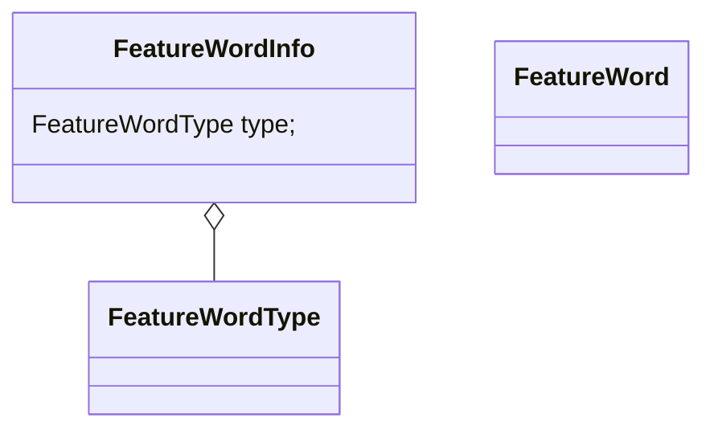

`GET_SUPPORTED_CPUID` is to get the value, not just the field.

CPU Model has another name in the code: CPU Type.

Ref: x86 CPU related type info inheritance hierarchy:

```c
TYPE_OBJECT (object_info)
    TYPE_DEVICE (device_type_info)
        TYPE_CPU (cpu_type_info)
            TYPE_X86_CPU (x86_cpu_type_info) // name = "x86_64-cpu"
                base-i386-cpu (x86_base_cpu_type_info)
                max-i386-cpu (max_x86_cpu_type_info)
                    host-i386-cpu (host_cpu_type_info) // name = "host-x86_64-cpu"
                SapphireRapids
                Icelake-Server
                ...
```

### CPU Model load process

- x86_cpu_load_model # this is done when calling .instance_init.
- apply the properties specified from command line.

```c
qmp_x_exit_preconfig
	qemu_init_board
		machine_run_board_init
			machine_class->init(machine); // call the pc_init1()
				pc_init1 // piix, set in mc->init = initfn;
					x86_cpus_init
						x86_cpu_new
							object_new // Object *cpu = object_new(MACHINE(x86ms)->cpu_type); cpu_type == "host-x86_64-cpu"
								object_new_with_type
									object_initialize_with_type
									    object_init_with_type
									        instance_init // x86_cpu_initfn
												/* CPU model is loaded here !!!!! */
										        x86_cpu_load_model
										// Apply **global_props**, initialize CPU object
										object_post_init_with_type
											device_post_init // ti->instance_post_init(obj);
												qdev_prop_set_globals
													object_apply_global_props
														object_property_parse
															object_property_set // object_property_get
																// x86_cpu_set_bit_prop
																/* property is set here !!!!! */
																prop->set(obj, v, name, prop->opaque, errp);
```

- expand - max_features expanding（对于 CPU Model 不是 max, host 的没有作用）
- expand - dependency prefiltering
- filter (filter 的时候是不会考虑这个 feature 是不是 migratable 的（KVM ），即使 CPU Model 要置上，但是不可迁移，也不会 filter 掉)
- cpu_x86_cpuid

### How does a cpu model (e.g., Sapphire Rapids) be registered to a Type that QEMU recognize?

```c
// target/i386/cpu.c
static void x86_cpu_register_types(void)
{
    //...
    for (i = 0; i < ARRAY_SIZE(builtin_x86_defs); i++) {
        x86_register_cpudef_types(&builtin_x86_defs[i]);
    }
    //...
}

// x86_register_cpudef_types will call x86_register_cpu_model_type
// target/i386/cpu.c
static void x86_register_cpu_model_type(const char *name, X86CPUModel *model)
{
    // define
    g_autofree char *typename = x86_cpu_type_name(name);
    TypeInfo ti = {
        .name = typename,
        .parent = TYPE_X86_CPU,
        .class_init = x86_cpu_cpudef_class_init,
        .class_data = model,
    };
    // register
    type_register(&ti);
}
```

### Feature Word

`FeaturewordInfo` represents a **single output** (such as EAX) from a CPUID leaf, defined in `target/i386/cpu.h`.

It has 2 types:

```c
typedef enum FeatureWordType {
   CPUID_FEATURE_WORD,
   MSR_FEATURE_WORD,
} FeatureWordType;
```

This struct describes a Feature Word:

```c
typedef struct FeatureWordInfo {
    FeatureWordType type;
    /* feature flags names are taken from "Intel Processor Identification and
     * the CPUID Instruction" and AMD's "CPUID Specification".
     * In cases of disagreement between feature naming conventions,
     * aliases may be added.
     */
    const char *feat_names[64];
    union {
        /* If type==CPUID_FEATURE_WORD */
        struct {
            uint32_t eax;   /* Input EAX for CPUID */
            bool needs_ecx; /* CPUID instruction uses ECX as input */
            uint32_t ecx;   /* Input ECX value for CPUID */
            int reg;        /* output register (R_* constant) */
        } cpuid;
        /* If type==MSR_FEATURE_WORD */
        struct {
            uint32_t index;
        } msr;
    };
    uint64_t tcg_features; /* Feature flags supported by TCG */
    uint64_t unmigratable_flags; /* Feature flags known to be unmigratable */
    uint64_t migratable_flags; /* Feature flags known to be migratable */
    /* Features that shouldn't be auto-enabled by "-cpu host" */
    uint64_t no_autoenable_flags;
} FeatureWordInfo;
```



### Feature Bit

Feature Bit (also defined in `target/i386/cpu.h`): A single bit from a Feature Word.

Why some feature bits start with “CPUID”, some start with “MSR”, some start with “VMX”?

- CPUID: this feature can be enabled by CPUID;
- MSR: this feature can be enabled by MSR;
- VMX: this feature has nested virtualization implementation in KVM code, so allow guest to start nested VM.

### Where to assign the values of CPU Model to `env->features`？

**First**, construct a `X86CPUModel` object:

```c
static void x86_register_cpudef_types(const X86CPUDefinition *def)
{
    //...
    m = g_new0(X86CPUModel, 1);
    m->cpudef = def;
    m->version = CPU_VERSION_AUTO;
    m->is_alias = true;
    x86_register_cpu_model_type(def->name, m);
    //...
}

```

**Second**, the definition need to be converted to a `X86CPUModel` object and assigned to the `model` attribute:

```c
struct X86CPUClass {
    //...
    X86CPUModel *model;
    //...
};

static void x86_cpu_cpudef_class_init(ObjectClass *oc, void *data)
{
    X86CPUModel *model = data;
    //...
    xcc->model = model;
    //...
}
```

**Third:** load the model to `env->features`:

```c
static void x86_cpu_load_model(X86CPU *cpu, X86CPUModel *model){
    //...
    for (w = 0; w < FEATURE_WORDS; w++) {
        env->features[w] = def->features[w];
    }
    //...
}
```

**Before "`expand` and `filter`" or after？**

`expand` and `filter` are in function `x86_cpu_realizefn`.

`x86_cpu_realizefn` is set as the realize function in `x86_cpu_common_class_init`.

`x86_cpu_common_class_init` is set as the `.class_init` function of `x86_cpu_type_info`.

`x86_cpu_load_model` is set as the `.instance_init` function of `x86_cpu_type_info`.

Add a `qemu_printf(cpu->parent_obj.parent_obj.realized ? "True":"False");` before the line in `x86_cpu_load_model`, you can see it is false, which means **the CPU model is loaded first, then expand and filter.**

Also:

```c
/***** Steps involved on loading and filtering CPUID data
 *
 * When initializing and realizing a CPU object, the steps
 * involved in setting up CPUID data are:
 *
 * 1) Loading CPU model definition (X86CPUDefinition). This is
 *    implemented by x86_cpu_load_model() and should be completely
 *    transparent, as it is done automatically by instance_init.
 *    No code should need to look at X86CPUDefinition structs
 *    outside instance_init.
 *
 * 2) CPU expansion. This is done by realize before CPUID
 *    filtering, and will make sure host/accelerator data is
 *    loaded for CPU models that depend on host capabilities
 *    (e.g. "host"). Done by x86_cpu_expand_features().
 *
 * 3) CPUID filtering. This initializes extra data related to
 *    CPUID, and checks if the host supports all capabilities
 *    required by the CPU. Runnability of a CPU model is
 *    determined at this step. Done by x86_cpu_filter_features().
 *
 * Some operations don't require all steps to be performed.
 * More precisely:
 *
 * - CPU instance creation (instance_init) will run only CPU
 *   model loading. CPU expansion can't run at instance_init-time
 *   because host/accelerator data may be not available yet.
 * - CPU realization will perform both CPU model expansion and CPUID
 *   filtering, and return an error in case one of them fails.
 * - query-cpu-definitions needs to run all 3 steps. It needs
 *   to run CPUID filtering, as the 'unavailable-features'
 *   field is set based on the filtering results.
 * - The query-cpu-model-expansion QMP command only needs to run
 *   CPU model loading and CPU expansion. It should not filter
 *   any CPUID data based on host capabilities.
 */
```

### 命令行里 CPU feature 的指定都有哪些方式？

Run `qemu-system-x86_64 -cpu "?"` to see supported cpu model and cpuid flags.

To configure a single feature such as `vmx`: `qemu-system-x86_64 -cpu host,vmx=off,…`.

### What is feature dependencies?

```c
// index, mask
static FeatureDep feature_dependencies[] = {
    {
        .from = { FEAT_7_0_EDX,             CPUID_7_0_EDX_ARCH_CAPABILITIES },
        .to = { FEAT_ARCH_CAPABILITIES,     ~0ull },
    },
    //...
    {
        .from = { FEAT_8000_0001_ECX,       CPUID_EXT3_SVM },
        .to = { FEAT_SVM,                   ~0ull },
    },
};
```

Each entry is a dependency arrow, from a feature word **bits** to another feature word **bits**. `to` field depends on the `from` field.

The logic is in:

```c
void x86_cpu_expand_features(X86CPU *cpu, Error **errp)
{
    //..
    for (i = 0; i < ARRAY_SIZE(feature_dependencies); i++) {
        FeatureDep *d = &feature_dependencies[i];
        if (!(env->features[d->from.index] & d->from.mask)) {
            uint64_t unavailable_features = env->features[d->to.index] & d->to.mask;

            /* Not an error unless the dependent feature was added explicitly.  */
            mark_unavailable_features(cpu, d->to.index,
                                      unavailable_features & env->user_features[d->to.index],
                                      "This feature depends on other features that were not requested");

            env->features[d->to.index] &= ~unavailable_features;
        }
    }
    //...
}
```

### What does `env->features` do?

First, it is loaded from the CPU Model (base, host, max, or Sapphire Rapids) to `env->features`.

Then, `expand` and `filter`, `filter` will use `GET_SUPPORTED_CPUID` to see which CPUID are invalid.

**Note: `filter` only cares the CPUID field, but also the value!**

Then, `kvm_arch_init_vcpu` will call `cpu_x86_cpuid` to get the `env->features` value, then use `KVM_SET_CPUID2` ioctl to set the value to the vcpu.

### What does `cpu_x86_cpuid` do？

The responsibility of this function is consolidate CPUID values for QEMU.

### What does expand mean?

It means the function `x86_cpu_expand_features()`, it mainly does 2 things:

- Add the features not requested but supported (**only if we use the `max` CPU model**, `host` is sub-model of `max`).
- Check the feature dependencies. (for all).
- add XSAVE `x86_cpu_enable_xsave_components()` (for all).

```c
void x86_cpu_expand_features(X86CPU *cpu, Error **errp)
{
    //...
    // expand the features
    if (cpu->max_features) {
        for (w = 0; w < FEATURE_WORDS; w++) {
            /* Override only features that weren't set explicitly
             * by the user.
             */
            env->features[w] |=
                x86_cpu_get_supported_feature_word(w, cpu->migratable) &
                ~env->user_features[w] &
                ~feature_word_info[w].no_autoenable_flags;
        }
    }
	
    // check feature dependencies
    for (i = 0; i < ARRAY_SIZE(feature_dependencies); i++) {
        FeatureDep *d = &feature_dependencies[i];
        if (!(env->features[d->from.index] & d->from.mask)) {
            uint64_t unavailable_features = env->features[d->to.index] & d->to.mask;

            /* Not an error unless the dependent feature was added explicitly.  */
            mark_unavailable_features(cpu, d->to.index,
                                      unavailable_features & env->user_features[d->to.index],
                                      "This feature depends on other features that were not requested");

            env->features[d->to.index] &= ~unavailable_features;
        }
    }

    // 无论是 host 还是 CPU Model，都要 expand 的。
    x86_cpu_enable_xsave_components(cpu);
    //...
}
```

### How to check if the value in CPU model is supported?

In `x86_cpu_filter_features`.

```c
for (w = 0; w < FEATURE_WORDS; w++) {
    uint64_t host_feat =
        x86_cpu_get_supported_feature_word(w, false);
    uint64_t requested_features = env->features[w];
    uint64_t unavailable_features = requested_features & ~host_feat;
    mark_unavailable_features(cpu, w, unavailable_features, prefix);
}
```

### What's the difference between "base", "host" and "max" cpu type? / `max_features`

**What's the default CPU model?**

`qemu64` is used for x86_64 guests and `qemu32` is used for i686 guests, when no `-cpu` argument is given to QEMU. `qemu64` is defined as the first entry in the `builtin_x86_defs` list.

The related code is:

```c
static void pc_machine_class_init(ObjectClass *oc, void *data)
{
    //...
    mc->default_cpu_type = TARGET_DEFAULT_CPU_TYPE;
    //...
}
```

**How does "host" be implemented as an exception?**

```c
struct X86CPUClass {
    //...
    bool host_cpuid_required;
    //...
};
```

**How does "max" be implemented as an exception?**

```c
static void max_x86_cpu_initfn(Object *obj)
{
    //...
    cpu->max_features = true;
    //...
}
```

**What's the difference between "max" and "host"?**

because "host" comes from "max", so "host" will also be expanded by `max_features`.

I don't see `any difference` between if the KVM is enabled.

### Where to set the CPU model passed by the cmdline?

```c
void qemu_init(int argc, char **argv)
{
    //...
    current_machine->cpu_type = machine_class->default_cpu_type;
    if (cpu_option) {
        current_machine->cpu_type = parse_cpu_option(cpu_option);
    }
    //...
}
```

### How does `+feature,-feature,feature=foo` like options work?

```
x86_cpu_parse_featurestr
```

# How to write a CPU Model for a new platform?

对于 CPUID 类型的 `FeatureWord`，考察两部分：

- `-cpu host` 会 `SET_CPUID` 置上的 bit；
- `-cpu <Model>` 会 `SET_CPUID` 置上的 bit。

| In `SET_CPUID` when `-cpu host` | In `SET_CPUID` when `cpu <model>` | Output                                                                                                                                                     |
| ------------------------------- | --------------------------------- | ---------------------------------------------------------------------------------------------------------------------------------------------------------- |
| 0                               | 0                                 | 硬件或者 KVM 不支持这个 CPUID。（**如果是 KVM 不支持但是硬件支持，应该等待 KVM 支持后再 introduce CPU Model**）                                                                             |
| 0                               | 1                                 | Won't happen. host 已经是尽可能 passthrough 了，如果 host 没有这个 CPUID，CPU Model 也大概率没有。                                                                               |
| 1                               | 0                                 | `-cpu host` 有，说明这个 CPUID 是被虚拟化的了（KVM 支持）并且 migrate-safe 的（migratable），所以**可以**加到 CPU Model 当中。但是非必须，因为可能会有其他考虑，比如 RTM 和 HLE 就被 disable 掉了，类似还有 SGX, SGXLC。 |
| 1                               | 1                                 | Do nothing. 这种是无论 host 还是 model 都会自动加上去的，比如 `FEAT_XSAVE_XCR0_LO` (`x86_cpu_enable_xsave_components()`)。                                                    |

还有一些是 KVM 不会 report support，但是 QEMU 会置上的，比如 `CPUID_HT`。这部分 CPUID 在 `kvm_arch_get_supported_cpuid()` 函数中进行了处理。

对于 MSR 类型的 `FeatureWord`，考察两部分：

- `-cpu host,+vmx,+pmu` 会 `kvm_init_msrs()` 里置上的 bit；
- `-cpu <Model>,+vmx,+pmu` 会 `kvm_init_msrs()` 置上的 bit。

处理方式同上（区别是 `SET_CPUID` 换成 `kvm_init_msrs()`）。

### Compare difference between 2 CPU Models

可以用 VSCode 来 diff，是基于 word 的 diff，非常直观。