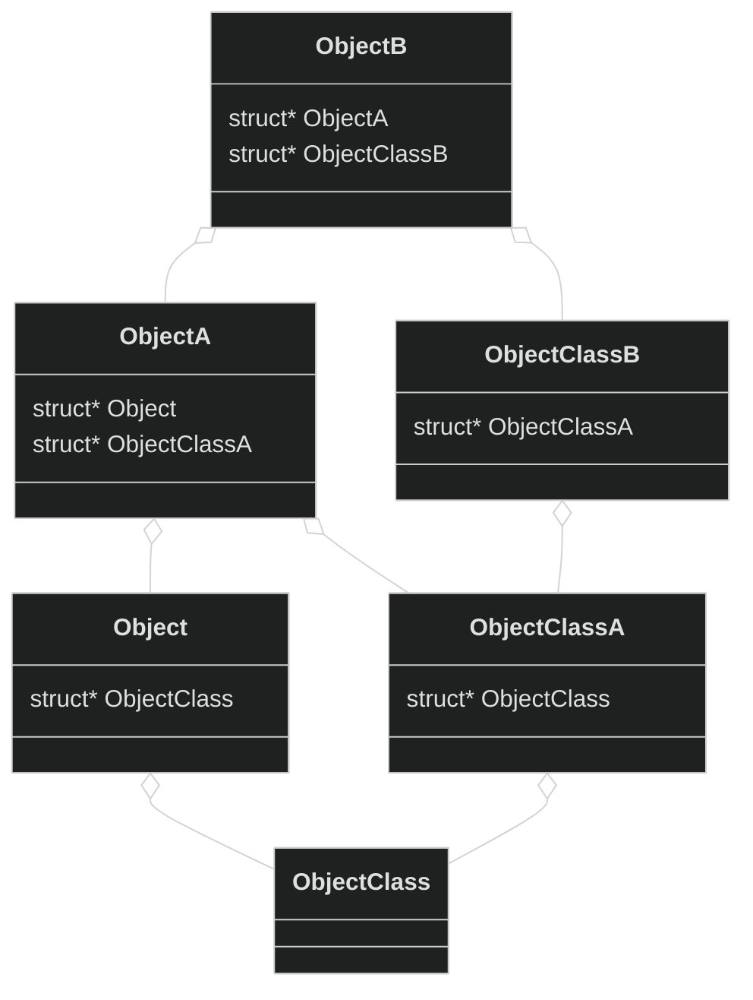

Methods are always *virtual*.

不止 method，property 也是划分为 static 和 Non-static 的，分别挂到 ObjectClass 和 Object 上。

qdev 出现的比 qom 要早，当 qom 出现之后，qdev 按照 qom 的模式重写过。

一个结构体通过 `ObjectClass` 和 `Object` 属性实现 OOP，

一个使用 QOM 的例子：

```c
#include "qdev.h"
// No new virtual functions: we can reuse the typedef for the superclass.
// 注意这个名字 MyDeviceClass，这不是随便定义的，而是需要是 MyDevice + Class
// 这是 object 和 object class 之间的命名规范。
// 一个要加入 QOM 的结构体，必须定义这个结构体对应的 class，也就是 MyDeviceClass
// 当然我们可以重用，如果我们没啥 virtual function 的话。
typedef DeviceClass MyDeviceClass;
typedef struct MyDevice
{
    DeviceState parent_obj;
    int reg0, reg1, reg2;
} MyDevice;

static const TypeInfo my_device_info = {
    .name = "my-device",
    // The TYPE_DEVICE class is the parent class for all modern devices implemented in QEMU
    // and adds some specific methods to handle QEMU device model.
    // This includes managing the lifetime of devices from creation through to
    // when they become visible to the guest and eventually unrealized.
    // 注意 QEMU 里 device 的意思：这是一个很宽泛的概念，cpu 本身都算是一种 device
    .parent = TYPE_DEVICE,
    .instance_size = sizeof(MyDevice),
};

static void my_device_register_types(void)
{
    type_register_static(&my_device_info);
}

type_init(my_device_register_types)
```

# QOM tree

The QOM tree is a composition tree which represents all of the objects that make up a QEMU “machine”

```bash
info qom-tree
```

# QOM Type/Class

### `init_type_list()` QEMU

A type itself may also have a type.

```c
typedef enum {
    MODULE_INIT_MIGRATION, // migration_init()
    MODULE_INIT_BLOCK, // block_init()
    MODULE_INIT_OPTS, // opts_init()
    MODULE_INIT_QOM, // type_init()
    MODULE_INIT_TRACE, // ...
    MODULE_INIT_XEN_BACKEND, // ...
    MODULE_INIT_LIBQOS, // ...
    MODULE_INIT_FUZZ_TARGET, // ...
    MODULE_INIT_MAX // ...
} module_init_type;

static ModuleTypeList init_type_list[MODULE_INIT_MAX];
```

All the `.parent` stuffs are only in `MODULE_INIT_QOM`.

# QOM Property

```c
struct ObjectClass
{
    /* private: */
    Type type;
    GSList *interfaces;

    const char *object_cast_cache[OBJECT_CLASS_CAST_CACHE];
    const char *class_cast_cache[OBJECT_CLASS_CAST_CACHE];

    ObjectUnparent *unparent;

    GHashTable *properties; // map from string (name) to ObjectProperty
};
```

`object_class_property_add()` 和 `object_property_add()` 分别用于给类和对象添加属性。

```c
object_class_property_add(oc, prop_name, "bool",
						  x86_cpu_get_bit_prop,
						  x86_cpu_set_bit_prop,
						  NULL, fp);
```

Property 可以被 Visitor 来 Visit, 不论是 getter 还是 setter 里，Visitor visit 使用的都是 **同一个函数**，比如对于一个 bool 类型的 property，都可以用 `visit_type_bool` 函数。

There are four kinds of visitors:

- input visitors (QObject, string, and QemuOpts) parse an external representation and build the corresponding QAPI object,
- output visitors (QObject and string) take a QAPI object and generate an external representation,
- the dealloc visitor takes a QAPI object (possibly partially constructed) and recursively frees it, and
- the clone visitor performs a deep clone of a QAPI object.

我们可以把 property 看作是 Visitor 所携带的 data（暂且称之为 vdata）与 qemu 里真正 hold 的 data （暂且称之为 hdata）中间的媒介，其中：

- Get property (when call "getter") 可以看作数据从 hdata 流向 vdata，所以里面的 `visit_type_*` 对应的 visitor 是 output visitor.
- Set property (when call "setter") 可以看作数据从 vdata 流向 hdata，所以里面的 `visit_type_*` 对应的 visitor 是 input visitor.

一般的函数执行流程是这样的：

1. `property->set()/get()`
2. `visit_type_*()`
3. `visitor->type_*()`

Visitor 有多种类型的钩子：

```c
// the getter for a bool property
static void x86_cpu_get_bit_prop(Object *obj, Visitor *v, const char *name,
                                 void *opaque, Error **errp)
{
    X86CPU *cpu = X86_CPU(obj);
    BitProperty *fp = opaque;
    uint64_t f = cpu->env.features[fp->w];
    bool value = (f & fp->mask) == fp->mask;
    visit_type_bool(v, name, &value, errp);
}

struct Visitor
{
	//...
    /* Must be set */
    bool (*type_bool)(Visitor *v, const char *name, bool *obj, Error **errp);

    /* Must be set */
    bool (*type_str)(Visitor *v, const char *name, char **obj, Error **errp);

    /* Must be set to visit numbers */
    bool (*type_number)(Visitor *v, const char *name, double *obj,
                        Error **errp);
	//...
}
```

注意，get/set property 和 get/set 真正的 data 是不一样的。举个例子：

```c
static void x86_cpu_set_bit_prop(Object *obj, Visitor *v, const char *name,
                                 void *opaque, Error **errp)
{
    DeviceState *dev = DEVICE(obj);
    X86CPU *cpu = X86_CPU(obj);
    BitProperty *fp = opaque;
    bool value;

    if (dev->realized) {
        qdev_prop_set_after_realize(dev, name, errp);
        return;
    }

    if (!visit_type_bool(v, name, &value, errp)) {
        return;
    }

    if (value) {
        cpu->env.features[fp->w] |= fp->mask;
    } else {
        cpu->env.features[fp->w] &= ~fp->mask;
    }
    cpu->env.user_features[fp->w] |= fp->mask;
}
```

**Note: 这里虽然看起来是 set 一个 bool 的 property，但是会通过这个 bool 是 true 还是 false，来 set 具体的 `cpu->env.features`。**

### Experimental property (x-)

Some property names are prefixed with `x-`, such as `x-blockdev-insert-medium`, `x-blockdev-change`, etc. That means this feature is **experimental**.

# OOP in QOM

### How to achieve inheritance？

利用结构体的包含关系来实现继承：

```c
struct Object
{
    //...
    Object *parent;
};
```

包含其实可以有两个作用：

- 包含另一个 Object，实现继承（They are similar, you can see: [在c++中，应该何时用继承，何时用包含？ - 知乎](https://www.zhihu.com/question/47146791)）；
- 包含一个 ObjectClass，实现静态函数。

有点像：



QEMU 不支持多继承。

### Difference between `type_init()`, `type_register()`, and `type_initialize()`

Do not mix-up `type_init()` and `type_initialize()`!

- `type_init(function)`: Parameter is just a function `function()`, `type_init()` will based on `function()` to construct a `ModuleEntry` and add this entry to the tail of a `ModuleTypeList`; `function()` will be called when `qemu_init()`.
- `TypeImpl *type_register(TypeInfo)`: Always called in the function `function()` passed to `type_init()`. So when `qemu_init()`, the `type_register()` will be called to convert a `TypeInfo` to a `TypeImpl`, then add the `TypeImpl` to a **type table** mapping from it's **name** to **itself**.
- `void type_initialize(TypeImpl)`: Call the `class_init()` function in the `TypeImpl` to initialize the type (not the object). `type_initialize()` is called when **trying to create an object of it (`object_new()` will find it in the type table by the name specified)**, so it is called in a **lazy** style (A type is just need to be initialized once).

The process is:

```c
type_init() // type_init() (it is executed before main() because __attribute__((constructor)))
main()
	qemu_init()
		type_register() // type_register()
	//...
	object_new(name)
		type_initialize() // type_initialize()
			->class_init()
```

### type_init(), block_init(), opts_init(), trace_init(), Etc.

`type_init()` basically add a `ModuleEntry` to the tail of the `ModuleTypeList`.

```c
#define type_init(function) module_init(function, MODULE_INIT_QOM)

#define module_init(function, type)                                         \
static void __attribute__((constructor)) do_qemu_init_ ## function(void)    \
{                                                                           \
    register_module_init(function, type);                                   \
}

typedef enum {
    MODULE_INIT_MIGRATION,
    MODULE_INIT_BLOCK,
    MODULE_INIT_OPTS,
    MODULE_INIT_QOM,
    MODULE_INIT_TRACE,
    MODULE_INIT_XEN_BACKEND,
    MODULE_INIT_LIBQOS,
    MODULE_INIT_FUZZ_TARGET,
    MODULE_INIT_MAX
} module_init_type;

void register_module_init(void (*fn)(void), module_init_type type)
{
    ModuleEntry *e;
    ModuleTypeList *l;

    e = g_malloc0(sizeof(*e));
    e->init = fn;
    e->type = type;

    l = find_type(type); // find the list delicated to this type. e.g., MODULE_INIT_QOM

    QTAILQ_INSERT_TAIL(l, e, node); // append to the list
}
```

When will QEMU call the function in the list?

```c
void qemu_init(int argc, char **argv)
{
	//...
	qemu_init_subsystems();
	//...
}

void qemu_init_subsystems(void)
{
	//...
	module_call_init(MODULE_INIT_QOM);
	//...
}
```

### Difference between `Object` and `ObjectClass`？

In QOM, for any class there is one **class struct**:

- For the base `Object` type the class struct is `ObjectClass`. There are then multiple objects created at runtime, each of which is a struct `Object`.
- This applies also for subtypes of `Object`, like `DeviceState`, whose class struct is `DeviceClass`.

The `ObjectClass` struct holds fields which are common to every instance of that object type, notably including the function pointers which are the equivalent of methods. The `Object` struct holds all the fields which are per-instance. Because each `Object` contains a pointer to the corresponding `ObjectClass`, you can always get from a pointer to an instance of an object to its class information.

[c - The difference between `ObjectClass` and `Object` in qemu - Stack Overflow](https://stackoverflow.com/questions/67798706/the-difference-between-objectclass-and-object-in-qemu)

QEMU 中所有的对象的 parent 是 Object 和 ObjectClass：

- Object 存储 Non-static（对象级别的，每个对象的此成员指向不同的 Object） 部分；
- ObjectClass 存储 static（类级别的，每个对象的此成员指向同一个 ObjectClass）部分。

可以想象为 Python 中的成员函数和类函数之间的区别。

`Object` 本身也包含一个 `ObjectClass`。

### What's the relationship between `TypeImpl` and `TypeInfo`？

They have the same structure.

其实 TypeInfo 是面向 API 使用者的一个工具类，使用者只是在注册类型的时候，提供 TypeInfo 所包含的信息（包括方法中的回调函数），然后系统会自动生成一个 TypeImpl 存储起来，至此 TypeInfo 的生命周期就结束了。

[浅谈QEMU的对象系统 - 掘金](https://juejin.cn/post/6844903845550620685)

There is a function named `static TypeImpl *type_new(const TypeInfo *info)`, so you can see `TypeImpl` as an initialized `TypeInfo`, some of the attributes have been assigned correctly.

But why not just using `TypeInfo`? I don't know.

```c
struct TypeInfo
{
    const char *name;
    const char *parent;

    size_t instance_size;
    size_t instance_align;
    // This function is called to initialize an object. The parent
    // class will have already been initialized so the type is only responsible
    // for initializing its own members.
    void (*instance_init)(Object *obj);
    void (*instance_post_init)(Object *obj);
    void (*instance_finalize)(Object *obj);

    bool abstract;
    size_t class_size;
    // This function is called after all parent class initialization
    // has occurred to allow a class to set its default virtual method pointers.
    // 因为这个函数比其他 class 初始化函数执行的晚，
    // 所以 This is also the function to use to override virtual methods from a parent class
    void (*class_init)(ObjectClass *klass, void *data);
    void (*class_base_init)(ObjectClass *klass, void *data);
    void *class_data;

    InterfaceInfo *interfaces;
};
```

**In one word: When a TypeInfo is registered, it become to TypeImpl.**

### `class_init` And `instance_init`, which one will be called first?

```c
// this is the place where instance_init be called
static void object_init_with_type(Object *obj, TypeImpl *ti);

// this is the palce where class_init be called
static void type_initialize(TypeImpl *ti);
```

According to the following function:

```c
static void object_initialize_with_type(Object *obj, size_t size, TypeImpl *type)
{
    type_initialize(type);
    //...
    object_init_with_type(obj, type);
    //...
}
```

We can see that `class_init` is executed **before** the `instance_init`.

### How to overload functions/methods?

Methods cannot be overloaded. That is, the #ObjectClass and method name uniquely identity the function to be called; the signature does not vary except for trailing varargs.

### How to override functions？

`x86_cpu_type_info` 继承了 `cpu_type_info`，那么函数的重载通过他们的 `ObjectClass` 来实现。

在 `class_init` 函数使用不同函数对相同名称的 method 赋值，例如在 `x86_cpu_common_class_init` and `cpu_class_init`，对于 `parse_features` 这个函数：

```c
static void x86_cpu_common_class_init(ObjectClass *oc, void *data)
{
    //...
    cc->parse_features = x86_cpu_parse_featurestr;
    //...
}

static void cpu_class_init(ObjectClass *klass, void *data)
{
    //...
    k->parse_features = cpu_common_parse_features;
    //...
}
```

### How to access a property?

```c
// first class property, then object property
ObjectProperty *object_property_find(Object *obj, const char *name)
```

### `ObjectClass` 的作用是什么，是静态函数，还是虚函数？

Virtual method: The \#ObjectClass typically holds a table of function pointers for the virtual methods implemented by this type.

Every type has an \#ObjectClass associated with it. \#ObjectClass derivatives are instantiated dynamically but there is only ever one instance for any given type. The \#ObjectClass typically holds a table of function pointers for the virtual methods implemented by this type.

Before an object is initialized, the class for the object must be initialized. **There is only one class object for all instance objects that is created lazily.**

Classes are initialized by first initializing any parent classes (if necessary). After the parent class object has initialized, it will be copied into the current class object and any additional storage in the class object is zero filled.

The effect of this is that classes automatically inherit any **virtual function pointers** that the parent class has already initialized. All other fields will be zero filled.

Once all of the parent classes have been initialized, \#TypeInfo::class_init is called to let the class being instantiated provide default initialize for its virtual functions. Here is how the above example might be modified to introduce an overridden virtual function. 下面的例子就是一个重载虚函数的例子：

```c
#include "qdev.h"

void my_device_class_init(ObjectClass *klass, void *class_data)
{
    DeviceClass *dc = DEVICE_CLASS(klass);
    dc->reset = my_device_reset;
}

static const TypeInfo my_device_info = {
    .name = TYPE_MY_DEVICE,
    .parent = TYPE_DEVICE,
    .instance_size = sizeof(MyDevice),
    .class_init = my_device_class_init,
};
```

### How to init an object?

比如 `x86_cpu_type_info` 的 `class_init` 是 `x86_cpu_common_class_init` 函数，其中使用了一些函数来设置这个 instance 要设置的属性。

```
device_class_set_parent_reset
device_class_set_parent_realize
device_class_set_parent_unrealize
device_class_set_props
...
```

### What is realize? and Where to realize?

realize is to realize a device, initialize is to initialize an object.

The former is for qdev, the latter is for QOM.

qdev is rewritten to be based on QOM.

http://people.redhat.com/~thuth/blog/qemu/2018/09/10/instance-init-realize.html

```c
static void device_set_realized(Object *obj, bool value, Error **errp) {
    //...
    if (value && !dev->realized) {
        if (dc->realize) {
            dc->realize(dev, &local_err);
            //...
        }
    }
    //...
}
```

[QEMU 中的面向对象 : QOM \| Deep Dark Fantasy](https://martins3.github.io/qemu/qom.html)

[Introduction - understanding_qemu](https://richardweiyang-2.gitbook.io/understanding_qemu/)

# QOM Process

## Create a Class

As the name indicates, An instance of the `TypeInfo` denotes the meta information of a class.

4 phases:

- Define a type info instance to describe a class;
- Design a register function to register the instance, so QEMU know the info of the type we want to use.
- Add the register function to a list (before main, e.g., `static void register_types(void)`).
- Call the register functions in the list (after main).

### Define a type info

`base-i386-cpu` as an example:

```c
static const TypeInfo x86_base_cpu_type_info = {
        .name = X86_CPU_TYPE_NAME("base"),
        .parent = TYPE_X86_CPU,
        .class_init = x86_cpu_base_class_init,
};
```

### Design a register function

There is a lot of functions can be used to do the register work:

```c
// qom/object.c
// The type_register_internal is invoked by the other three.
static TypeImpl *type_register_internal(const TypeInfo *info);
TypeImpl *type_register(const TypeInfo *info);
TypeImpl *type_register_static(const TypeInfo *info);
void type_register_static_array(const TypeInfo *infos, int nr_infos);
```

For example, for the CPUs, the function to register is:

```c
static void x86_cpu_register_types(void)
{
    int i;

    type_register_static(&x86_cpu_type_info);
    for (i = 0; i < ARRAY_SIZE(builtin_x86_defs); i++) {
        x86_register_cpudef_types(&builtin_x86_defs[i]);
    }
    type_register_static(&max_x86_cpu_type_info);
    type_register_static(&x86_base_cpu_type_info);
}
```

### Add the Register Function (type_init)

```c
type_init(register_types)
```

**When and how the register function be called?**

`__attribute__((constructor))` can ensure this function be added to the list `before the main`.

```c
#define type_init(function) module_init(function, MODULE_INIT_QOM)

#define module_init(function, type)                                         \
static void __attribute__((constructor)) do_qemu_init_ ## function(void)    \
{                                                                           \
    register_module_init(function, type);                                   \
}
#endif

//...
// this will add the register function to the tail of the corresponding type's list 
void register_module_init(void (*fn)(void), module_init_type type)
{
    ModuleEntry *e;
    ModuleTypeList *l;

    e = g_malloc0(sizeof(*e));
    e->init = fn;
    e->type = type;

    l = find_type(type);

    // THIS IS THE POINT!
    QTAILQ_INSERT_TAIL(l, e, node);
}
```

### Call the Register Function

This will init all the functions with the type `MODULE_INIT_QOM`.

```c
// this is a call trace
void qemu_init(int argc, char **argv);
	qemu_init_subsystems();
		module_call_init(MODULE_INIT_QOM);

void module_call_init(module_init_type type)
{
    //...
    l = find_type(type);

    QTAILQ_FOREACH(e, l, node) {
        e->init();
    }
    //...
}
```

## Create an Instance in QOM

Now we have the type registered, but we didn't have any instance, how to create an instance?

### Type initialization (not instantiation)

Execute `.class_init` function to init the `.class` property.

A type need to be initialized before creating an instance of it. For an example, this function is used to create an instance:

```c
static Object *object_new_with_type(Type type) {
    //...
    type_initialize(type);
    //...
}
```

and a type just need to be initialized one time, you can see:

```c
static void type_initialize(TypeImpl *ti)
{
    //...
    if (ti->class) {
        return;
    }
    //...
}
```

# `OBJECT_DECLARE_*()` QEMU

A lot of the code outlined above follows a standard pattern and naming convention. **To reduce the amount of boilerplate code** that needs to be written for a new type there are two sets of macros to generate the common parts in a standard format.

- The `OBJECT_DECLARE_*` macro family;
- The `OBJECT_DEFINE_*` macro family.

一个使用的例子是：

```c
// in include/sysemu/vhost-user-backend.h
// 注意这里这个宏为 TYPE 加上后面传进去的 VHOST_USER_BACKEND
// 这个名字不是随便起的，是有上述关系的。
#define TYPE_VHOST_USER_BACKEND "vhost-user-backend"
OBJECT_DECLARE_SIMPLE_TYPE(VhostUserBackend, VHOST_USER_BACKEND)
struct VhostUserBackend {
    /* private */
    Object parent;

    char *chr_name;
    CharBackend chr;
    VhostUserState vhost_user;
    struct vhost_dev dev;
    VirtIODevice *vdev;
    bool started;
    bool completed;
};

static const TypeInfo vhost_user_backend_info = {
    .name = TYPE_VHOST_USER_BACKEND,
    .parent = TYPE_OBJECT,
    .instance_size = sizeof(VhostUserBackend),
    .class_init = vhost_user_backend_class_init,
    .instance_finalize = vhost_user_backend_finalize,
};

static void register_types(void)
{
    type_register_static(&vhost_user_backend_info);
}

type_init(register_types);
```

我们为什么在定义 `VhostUserBackend` 这个结构体之前先调用 `OBJECT_DECLARE_SIMPLE_TYPE` 来声明一下呢？这样子有什么好处呢？

在我们定义一个新的结构体的时候，为了把这个结构体和 QOM 连接起来，们需要同时也定义这个结构体的 Class 结构体（结构体名字需要就是 `VhostUserBackend` + Class 也就是 `VhostUserBackendClass`），同时定义一些用来做 cast 的宏定义比如 `MY_DEVICE_GET_CLASS`, `MY_DEVICE_CLASS` 和 `MY_DEVICE` 用来做类型转换。这些都是模板代码，所以可以用 `OBJECT_DECLARE_*` 来替代。

### `OBJECT_DECLARE_SIMPLE_TYPE()` QEMU

In types which **do not require any virtual functions** in the class, the `OBJECT_DECLARE_SIMPLE_TYPE` macro is suitable, and is commonly placed in the header file.

```c
OBJECT_DECLARE_SIMPLE_TYPE(MyDevice, MY_DEVICE)
```

This is equivalent to the following:

```c
typedef struct MyDevice MyDevice;
typedef struct MyDeviceClass MyDeviceClass;

G_DEFINE_AUTOPTR_CLEANUP_FUNC(MyDeviceClass, object_unref)

#define MY_DEVICE_GET_CLASS(void *obj) \
        OBJECT_GET_CLASS(MyDeviceClass, obj, TYPE_MY_DEVICE)
#define MY_DEVICE_CLASS(void *klass) \
        OBJECT_CLASS_CHECK(MyDeviceClass, klass, TYPE_MY_DEVICE)
#define MY_DEVICE(void *obj)
        OBJECT_CHECK(MyDevice, obj, TYPE_MY_DEVICE)

struct MyDeviceClass {
    DeviceClass parent_class;
};
```

The `struct MyDevice` needs to be declared separately.

### `OBJECT_DECLARE_TYPE()` QEMU

If the type **requires virtual functions** to be declared in the class struct, then the alternative `OBJECT_DECLARE_TYPE()` macro can be used. This does the same as `OBJECT_DECLARE_SIMPLE_TYPE()`, but without the ‘`struct MyDeviceClass`’ definition.

```c
// InstanceType, ClassType, MODULE_OBJ_NAME
OBJECT_DECLARE_TYPE(DeviceState, DeviceClass, DEVICE)
```

参数比 `OBJECT_DECLARE_SIMPLE_TYPE()` 多一个，多了一个 Class 的名字，可见用这种方式 declare 因为我们需要 virtual functions，所以我们自定义了 Class 的名字。

用这种方式声明了之后，我们就要同时实现 `DeviceState` 和 `DeviceClass` 了，不能像以前只实现 object（对应这里的 `DeviceState`） 了，因为我们要定义虚函数。后面我们需要 define 这个 type 的时候也需要注意 class name 和 object name 的不一致：

```c
static const TypeInfo device_type_info = {
    //...
    .instance_size = sizeof(DeviceState),
    //...
    .class_size = sizeof(DeviceClass),
    //...
};
```

# `OBJECT_DEFINE_TYPE()` QEMU

定义了 struct，对应的 class struct，以及一些 helper 函数之后还不够（这些都是 DECLARE 的那些函数变体做的），我们还需要 define 它，所谓 define 指的就是通过 `TypeInfo` 把这个结构体和其对应的 Class 结构体关联起来，注册到 QOM 框架中这样我们才能将两者对应起来。

这个宏定义好像用的并不多，因为我们一般还是都手动写了，没有用这个宏所提供的模板代码。

```c
// 第一个参数 MyDevice 表示 object 的 struct 名字
// 第二个参数 my_device 表示 objectclass 的 struct 名字
OBJECT_DEFINE_TYPE(MyDevice, my_device, MY_DEVICE, DEVICE)
```

This is equivalent to the following:

```c
static void my_device_finalize(Object *obj);
static void my_device_class_init(ObjectClass *oc, void *data);
static void my_device_init(Object *obj);

static const TypeInfo my_device_info = {
    .parent = TYPE_DEVICE,
    .name = TYPE_MY_DEVICE,
    .instance_size = sizeof(MyDevice),
    .instance_init = my_device_init,
    .instance_finalize = my_device_finalize,
    .class_size = sizeof(MyDeviceClass),
    .class_init = my_device_class_init,
};

static void
my_device_register_types(void)
{
    type_register_static(&my_device_info);
}
type_init(my_device_register_types);
```

# `struct DeviceClass` / `struct DeviceState` / QDev

相关文件：

- `include/hw/qdev-core.h`

[QEMU's new device model qdev](https://www.linux-kvm.org/images/f/fe/2010-forum-armbru-qdev.pdf)

Before qdev: No Common Device Model: You are in a maze of twisty little devices, all different.

With qdev: Device Model Abstraction

- Tree of devices connected by buses
- Devices have properties
- Devices implement a common API
- Generic device configuration & control
- Turn code into data
- qdev is conceptually simple, devil’s in the details

Devices are constructed in two stages:

 - object instantiation via `object_initialize()`（`TypeInfo` 里的 `.instance_init()`） and
 - device realization via the \#DeviceState.realized property.

这两个是对于 QEMU Device (qdev) 特有的两个基类，是 qdev 实现的基础。所以说 qdev 以 QOM 的方式重写了，qdev 也是基于 QOM 的。

`struct DeviceState` 对应 Object，`struct DeviceClass` 对应 Class。

```c
OBJECT_DECLARE_TYPE(DeviceState, DeviceClass, DEVICE)
```

`realize()`, `unrealize()` 这两个函数是虚函数，是 Device 模拟所特有的，所以定义在 `DeviceClass` 里面而不是 `DeviceState` 里面。

```c
struct DeviceClass {
    /* private: */
    ObjectClass parent_class;

    /* public: */

    /**
     * @categories: device categories device belongs to
     */
    DECLARE_BITMAP(categories, DEVICE_CATEGORY_MAX);
    /**
     * @fw_name: name used to identify device to firmware interfaces
     */
    const char *fw_name;
    /**
     * @desc: human readable description of device
     */
    const char *desc;

    /**
     * @props_: properties associated with device, should only be
     * assigned by using device_class_set_props(). The underscore
     * ensures a compile-time error if someone attempts to assign
     * dc->props directly.
     */
    Property *props_;

    /**
     * @user_creatable: Can user instantiate with -device / device_add?
     *
     * All devices should support instantiation with device_add, and
     * this flag should not exist.  But we're not there, yet.  Some
     * devices fail to instantiate with cryptic error messages.
     * Others instantiate, but don't work.  Exposing users to such
     * behavior would be cruel; clearing this flag will protect them.
     * It should never be cleared without a comment explaining why it
     * is cleared.
     *
     * TODO remove once we're there
     */
    bool user_creatable;
    bool hotpluggable;

    /* callbacks */
    /**
     * @reset: deprecated device reset method pointer
     *
     * Modern code should use the ResettableClass interface to
     * implement a multi-phase reset.
     *
     * TODO: remove once every reset callback is unused
     */
    DeviceReset reset;
    DeviceRealize realize;
    DeviceUnrealize unrealize;

    /**
     * @vmsd: device state serialisation description for
     * migration/save/restore
     */
    const VMStateDescription *vmsd;

    /**
     * @bus_type: bus type
     * private: to qdev / bus.
     */
    const char *bus_type;
};
```

### QOM device `realize()` and `unrealize()`

As class initialisation cannot fail devices have an two additional methods to **handle the creation of dynamic devices**.

所以说这个函数是用来 create 一个 device 的 instance 的。而不是在创建这个 class 的时候就被调用。

The realize function is called with `Error **` pointer which should be set if the device cannot complete its setup. Otherwise on successful completion of the realize method the device object is added to the QOM tree and made visible to the guest.

The reverse function is unrealize and should be were clean-up code lives to tidy up **after the system is done with the device**.

### `TYPE_DEVICE` QEMU

All modern devices should represented as a derived QOM class of `TYPE_DEVICE`.

```c
#define TYPE_DEVICE "device"
OBJECT_DECLARE_TYPE(DeviceState, DeviceClass, DEVICE)
```

### How does `-cpu <model>,pku=on` work to specify a feature?

The key `pku` and value `on` are hold in the following structure during processing:

```c
typedef struct GlobalProperty {
    const char *driver;
    const char *property;
    const char *value;
    bool used;
    bool optional;
} GlobalProperty;
```

The process:

Register machine, register CPU, find machine, find CPU…

```c
// Before main()......................................................................
// For the board init
// Default machine type is "pc-i440fx-8.0": sudo ./build/qemu-system-x86_64 --machine \? | grep default
DEFINE_I440FX_MACHINE(v8_0, "pc-i440fx-8.0", NULL,
                      pc_i440fx_8_0_machine_options);
DEFINE_I440FX_MACHINE
DEFINE_PC_MACHINE
#define DEFINE_PC_MACHINE(suffix, namestr, initfn, optsfn) \
    static void pc_machine_##suffix##_class_init(ObjectClass *oc, void *data) \
    { \
        MachineClass *mc = MACHINE_CLASS(oc); \
        optsfn(mc); \
        mc->init = initfn; \
    } \
    static const TypeInfo pc_machine_type_##suffix = { \
        .name       = namestr TYPE_MACHINE_SUFFIX, \
        .parent     = TYPE_PC_MACHINE, \
        .class_init = pc_machine_##suffix##_class_init, \
    }; \
    static void pc_machine_init_##suffix(void) \
    { \
        type_register(&pc_machine_type_##suffix); \
    } \
    type_init(pc_machine_init_##suffix)

// For the CPU init
static const TypeInfo host_cpu_type_info = {
    .name = X86_CPU_TYPE_NAME("host"), // "host-x86_64-cpu"
    .parent = X86_CPU_TYPE_NAME("max"),
    .class_init = host_cpu_class_init,
};
type_init(host_cpu_type_init);

// In main()......................................................................
qemu_init()
	// Register the board and the CPU, TypeInfo to TypeImpl, call the list of functions.
	qemu_init_subsystems() 
		module_call_init(MODULE_INIT_QOM);
			x86_cpu_register_types
				type_register_static
					type_register
						type_register_internal
							type_table_add
	qemu_create_machine(machine_opts_dict)
		select_machine
			find_default_machine // will find the follwing machine
				static void pc_i440fx_8_0_machine_options(MachineClass *m)
				{
				    pc_i440fx_machine_options(m);
				    m->alias = "pc";
				    m->is_default = true;
				}
	// Input: cmdline, Output: global_props, set the cpu_type
	current_machine->cpu_type = parse_cpu_option(cpu_option); // "cpu_type == "host-x86_64-cpu"
	    cpu_class_by_name
			 object_class_by_name
                 // 首先调用 class_init() initialize 一下这个 type
				type_initialize
		x86_cpu_parse_featurestr // cc->parse_features(cpu_type, model_pieces[1], &error_fatal); parse the features in cmdline
			qdev_prop_register_global // add bits features to global_props for further parsing
	qmp_x_exit_preconfig
		qemu_init_board
			machine_run_board_init
				machine_class->init(machine); // call the pc_init1()
					pc_init1 // piix, set in mc->init = initfn;
						x86_cpus_init
							x86_cpu_new
								object_new // Object *cpu = object_new(MACHINE(x86ms)->cpu_type); cpu_type == "host-x86_64-cpu"
									object_new_with_type
										/* If the type is not initialized, first initialize the type 
										 * Register the feature bit properties such as "pks"
										 */
										type_initialize 
											x86_cpu_common_class_init // ti->class_init(ti->class, ti->class_data);
												x86_cpu_register_feature_bit_props
													x86_cpu_register_bit_prop
														object_class_property_add // register get() and set()
										// Apply **global_props**, initialize CPU object
										object_initialize_with_type //host_cpu_type_info if the child class of device_type_info
											object_post_init_with_type
												device_post_init // ti->instance_post_init(obj);
													qdev_prop_set_globals
														object_apply_global_props
															object_property_parse
																object_property_set // object_property_get
																	// x86_cpu_set_bit_prop
																	prop->set(obj, v, name, prop->opaque, errp);
```

### What is qdev device tree

type `info qtree`.

```
(qemu) info qtree
bus: main-system-bus 
  type System 
  dev: hpet, id "" 
    gpio-in "" 2 
    gpio-out "" 1 
    gpio-out "sysbus-irq" 32 
    timers = 3 (0x3) 
    msi = false 
    hpet-intcap = 4 (0x4) 
    mmio 00000000fed00000/0000000000000400 
  dev: kvm-ioapic, id "" 
    gpio-in "" 24 
    gsi_base = 0 (0x0) 
    mmio 00000000fec00000/0000000000001000
```

[ehabkost_fosdem_2017.pdf](https://archive.fosdem.org/2017/schedule/event/iaas_qemintapi/attachments/slides/1496/export/events/attachments/iaas_qemintapi/slides/1496/ehabkost_fosdem_2017.pdf)

### How does QEMU emulate a device for guest?

Each single word should be carefully read.

[Device Emulation — QEMU documentation](https://qemu-project.gitlab.io/qemu/system/device-emulation.html)

- [[Qemu-devel] qdev for programmers writeup - Paolo Bonzini](https://lore.kernel.org/qemu-devel/iveip7$of1$1@dough.gmane.org/)

Reference:

[^1]: [Introduction - understanding_qemu](https://richardweiyang-2.gitbook.io/understanding_qemu/)
