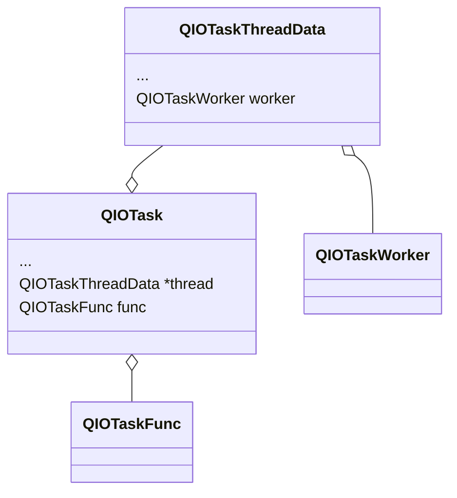

`QIOTask` in used in QEMU live migration code.



### `qio_net_listener_set_client_func_full()`

Register @func to be invoked whenever a new client connects to the listener. @func will be invoked passing in the QIOChannelSocket instance for the client.

### `QIONetListener`

```c
// The QIONetListener object encapsulates the management of a listening socket.
// It is able to listen on multiple sockets concurrently.
struct QIONetListener {
    Object parent;

    char *name;
    QIOChannelSocket **sioc;
    GSource **io_source;
    size_t nsioc; // number of channels

    bool connected;

    QIONetListenerClientFunc io_func;
    gpointer io_data;
    GDestroyNotify io_notify;
};
```

A listener's `io_func` is only

- set in `qio_net_listener_set_client_func_full`.
- called in `qio_net_listener_channel_func`.

### `qio_channel_add_watch_source/qio_channel_add_watch_full`

Call `func` when `condition` is met, with glib's help.

```c
// following are the same
qio_channel_add_watch_source
qio_channel_add_watch_full
guint qio_channel_add_watch_full
```

Here is the conditions:

```c
typedef enum /*< flags >*/
{
  G_IO_IN	GLIB_SYSDEF_POLLIN,
  G_IO_OUT	GLIB_SYSDEF_POLLOUT,
  G_IO_PRI	GLIB_SYSDEF_POLLPRI,
  G_IO_ERR	GLIB_SYSDEF_POLLERR,
  G_IO_HUP	GLIB_SYSDEF_POLLHUP,
  G_IO_NVAL	GLIB_SYSDEF_POLLNVAL
} GIOCondition;
```

The `func` seems always be `qio_net_listener_channel_func`, which is a function wrapper doing following things:

- accept new connection:
- call the `listener->io_func()`

### `qio_task_run_in_thread()`

有两个要执行的元素，一个是 task，另一个是 worker，正如其名，worker 是为 task 服务的，所以会先执行 worker，在 worker 执行完之后会调用 `QIOTask *task` 里的 `func` (也就是 callback) 。

worker 是在一个新的 thread 中被执行的，执行完之后此 thread 会被 close 并回到调用此函数的线程继续执行 task，可以做实验验证这一点。那么问题来了，既然这个是异步的，那么当 worker 执行完毕要继续执行 task 时，原线程当前执行的内容要被打断吗？（是会打断的，得益于 qemu 的事件循环机制，qemu 的主线程也就是 main event loop thread）。

```c
void qio_task_run_in_thread(QIOTask *task,
                            QIOTaskWorker worker,
                            gpointer opaque,
                            GDestroyNotify destroy,
                            GMainContext *context);
```

### `QIOTaskFunc` / `QIOTaskWorker`

```c
// It is a function type with the following function signature
typedef void (*QIOTaskFunc)(QIOTask *task, gpointer opaque);
// It is a function type with the following function signature, like QIOTaskFunc
typedef void (*QIOTaskWorker)(QIOTask *task, gpointer opaque);

// QIOTask 包含了 QIOTaskThreadData 包含了 QIOTaskWorker
// QIOTask 包含了 QIOTaskFunc
```

`QIOTaskWorker` is the function for preparation. `QIOTaskFunc` is used as the completion callback.

### `QIOTaskThreadData`

```c
struct QIOTaskThreadData {
    QIOTaskWorker worker; // the worker function executed before the real function
    gpointer opaque;
    GDestroyNotify destroy;
    GMainContext *context;
    GSource *completion;
};
```

### `QIOTask`

[[Qemu-devel] [PATCH v3 3/9] io: add QIOTask class for async operations - Daniel P. Berrange](https://lore.kernel.org/all/1447872172-1076-4-git-send-email-berrange@redhat.com/)

Provides a mechanism to run a **blocking** function in a **thread**, while triggering the **completion callback** in the **main event loop thread**.

the `QIOTask` class will be used for things like the TLS handshake, the websockets handshake and TCP `connect()` progress.

这个结构体里存了一些数据，比如要执行的函数，然后作为 `args` 传给 `qio_task_thread_worker()` 解析并执行。

**When use `QIOTask` and when use `Coroutine`?**

### `qio_task_thread_worker()`

这个函数接收一个 `QIOTask` 类型的参数，调用里面的函数，

```c
static gpointer qio_task_thread_worker(gpointer opaque)
{
    QIOTask *task = opaque;
    // task->thread->worker()
    task->thread->worker(task, task->thread->opaque);
    // task-func() (the callback function, this function is executed in the main event loop thread)
    g_source_set_callback(task->thread->completion,
                          qio_task_thread_result, task, NULL);
    //...
}
```

注意 `callback` 函数是在 main event loop thread 里跑的，比如我们起四个 stream 来测试 live migration, 然后在 `worker` 之前和 `func(callback)` 之前分别打印一下当前 thread id，可以得到：

```
qemu-system-x86_64: info: Working running in the thread id = 1403049046
qemu-system-x86_64: info: Callback running in the thread id = 140308090261312
qemu-system-x86_64: info: Working running in the thread id = 140304904615680
qemu-system-x86_64: info: Working running in the thread id = 140302924887808
qemu-system-x86_64: info: Working running in the thread id = 140305543153408
qemu-system-x86_64: info: Working running in the thread id = 140304879437568
qemu-system-x86_64: info: Callback running in the thread id = 140308090261312
qemu-system-x86_64: info: Callback running in the thread id = 140308090261312
qemu-system-x86_64: info: Callback running in the thread id = 140308090261312
qemu-system-x86_64: info: Callback running in the thread id = 140308090261312
```

可以看到，`callback` 都是在同一个 thread(140308090261312) 里跑的，说明这个是 main loop thread。