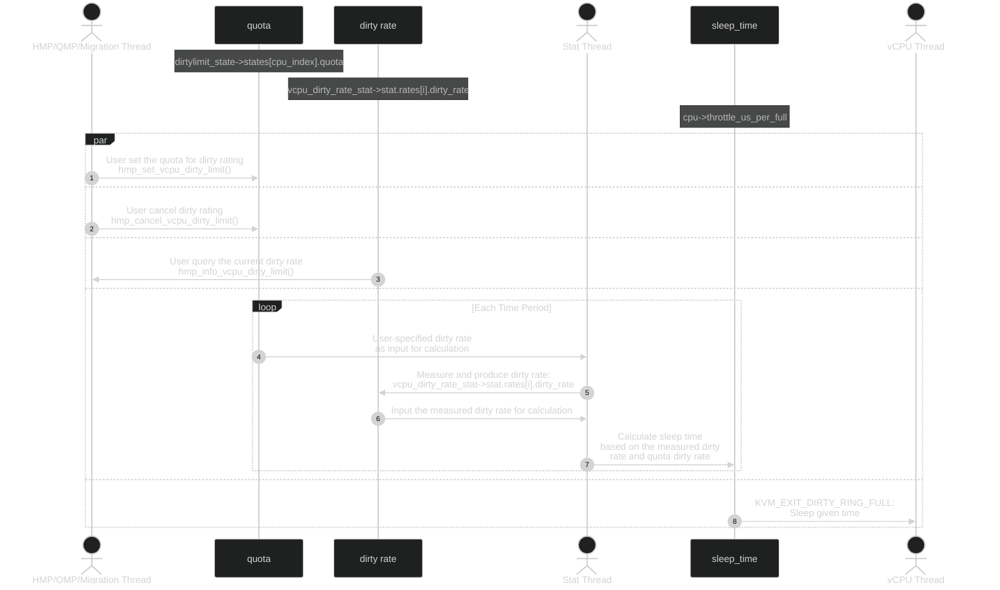

The whole patchset: [[PATCH v25 0/8] support dirty restraint on vCPU - huangy81](https://lore.kernel.org/all/cover.1656177590.git.huangy81@chinatelecom.cn/)

看起来是对 auto-converge^ CPU Throttling feature 的一个优化。

源代码主要是在文件 `system/dirtylimit.c` 中。

目前供外部使用的 API 主要有：

- `dirtylimit_in_service()`
- `dirtylimit_vcpu_execute()`
- `dirtylimit_throttle_time_per_round()`
- `dirtylimit_ring_full_time()`

QMP and HMP API:

- `qmp_cancel_vcpu_dirty_limit()`
- `hmp_cancel_vcpu_dirty_limit()`
- `qmp_set_vcpu_dirty_limit()`
- `hmp_set_vcpu_dirty_limit()`
- `qmp_query_vcpu_dirty_limit()`
- `hmp_info_vcpu_dirty_limit()`

Motivation: 现在的 auto-converge 机制有两个主要的缺点：

- Since auto-converge cannot control each vCPU’s throttling, so “read processes” on vCPU will be unnecessarily penalized。读的 vCPU 不应该被 throttle，但是 auto-converge 把所有 vCPU 一视同仁，一并都 throttle 了。
- Throttle increase percentage step by step, which seems struggling to find the optimal throttle percentage when dirtyrate is high. Also, the algorithm search the throttle percentage automatically thus cannot provide manually precise control to it’s user, e.g., Libvirt

**整个算法流程大致是这样的**：管理员可以通过 QMP 或者 HMP 设置每一个 vCPU 的 dirty rate 最大值 `quota` 来对这个 vCPU enable dirty-limit 这个 feature（当然也可以 cancel 和 query 信息），在第一个 vCPU 被 enable 之后我们会启动一个信息收集线程，不间断地收集每一个 vCPU 的 dirty rate `current`。每次收集完毕后都会基于 `quota` 和 `current` 来更新 `sleeptime`，从而能够保证 dirty rate 向 `quota` 靠近。在每一次因为 dirty ring 变满从 KVM exit 到 QEMU 时，会 sleep `sleeptime` 的时间，从而使得整体的 dirty rate 向 `quota` 靠近。

下面是一个 overview 的图，主要有三个线程（部分）进行交互：

- HMP/QMP/Migration Thread
- Stat Thread
- vCPU Thread



### `migration_dirty_limit_guest()` QEMU

这个函数是 dirty limit 的主入口函数。

```c
migration_bitmap_sync
    if (end_time > rs->time_last_bitmap_sync + 1000) {
        migration_trigger_throttle
            if (migrate_dirty_limit())
                migration_dirty_limit_guest
// Enable dirty-limit to throttle down the guest
static void migration_dirty_limit_guest(void)
{
    // dirty page rate quota for all vCPUs fetched from migration parameter 'vcpu_dirty_limit'
    // 这是一个静态变量
    static int64_t quota_dirtyrate;
    MigrationState *s = migrate_get_current();

    // If dirty limit already enabled and migration parameter vcpu-dirty-limit untouched.
    // 保证我们仅仅设置一次。
    if (dirtylimit_in_service() && quota_dirtyrate == s->parameters.vcpu_dirty_limit)
        return;

    quota_dirtyrate = s->parameters.vcpu_dirty_limit;

    // Set all vCPU a quota dirtyrate, note that the second
    // parameter will be ignored if setting all vCPU for the vm
    // set dirty limit for all the CPUs to quota_dirtyrate
    qmp_set_vcpu_dirty_limit(false, -1, quota_dirtyrate, NULL);
    //...
}
```

### `dirtylimit_set_vcpu()` / `dirtylimit_set_all()` QEMU

可以 enable 也可以 cancel。

```c
// 为单个 vCPU 设置 quota
void dirtylimit_set_vcpu(int cpu_index, uint64_t quota, bool enable)
{
    //...
    if (enable) {
        dirtylimit_state->states[cpu_index].quota = quota;
        // 之前没有 enable，那么 limited_nvcpu++
        if (!dirtylimit_vcpu_get_state(cpu_index)->enabled)
            dirtylimit_state->limited_nvcpu++;
    } else {
        // cancel 的话，就把 quota 置 0
        dirtylimit_state->states[cpu_index].quota = 0;
        // 之前 enable 了，那么 limited_nvcpu--
        if (dirtylimit_state->states[cpu_index].enabled)
            dirtylimit_state->limited_nvcpu--;
    }

    dirtylimit_state->states[cpu_index].enabled = enable;
}

// 也就是包装了一下上面的函数，对每一个 vCPU 调用了一下 set quota
void dirtylimit_set_all(uint64_t quota, bool enable)
{
    MachineState *ms = MACHINE(qdev_get_machine());
    int max_cpus = ms->smp.max_cpus;
    int i;

    for (i = 0; i < max_cpus; i++) {
        dirtylimit_set_vcpu(i, quota, enable);
    }
}
```

### `dirtylimit_done()` QEMU

如果 quota 和 current 这两者的差距小于可以接受的值，那么我们返回 true 表示 dirty limit 差不多得了，不用再进行了。

这个值是 `25MB/S`，好像还挺大的，是不是 CPU dirty memory 的速度更快？

```c
#define DIRTYLIMIT_TOLERANCE_RANGE  25  /* MB/s */
static inline bool dirtylimit_done(uint64_t quota, uint64_t current)
{
    uint64_t min, max;

    min = MIN(quota, current);
    max = MAX(quota, current);

    return ((max - min) <= DIRTYLIMIT_TOLERANCE_RANGE) ? true : false;
}
```

### `dirtylimit_dirty_ring_full_time()` QEMU

给定当前的 page dirty rate，看看把一个 dirty ring 塞满需要多久，返回单位为 us。

```c
static uint64_t dirtylimit_dirty_ring_full_time(uint64_t dirtyrate)
{
    static uint64_t max_dirtyrate;
    uint64_t dirty_ring_size_MiB;

    // dirty ring size in MiB
    dirty_ring_size_MiB = qemu_target_pages_to_MiB(kvm_dirty_ring_size());

    if (max_dirtyrate < dirtyrate)
        max_dirtyrate = dirtyrate;

    // bytes / (bytes / us) == us
    return dirty_ring_size_MiB * 1000000 / max_dirtyrate;
}
```

### `dirtylimit_need_linear_adjustment()` QEMU

如果 quota 和 current 的差值相比于最大值的比例大过了某一个值，那么就需要进行**线性**的调整。

```c
static inline bool
dirtylimit_need_linear_adjustment(uint64_t quota, uint64_t current)
{
    uint64_t min, max;

    min = MIN(quota, current);
    max = MAX(quota, current);

    return ((max - min) * 100 / max) > DIRTYLIMIT_LINEAR_ADJUSTMENT_PCT;
}
```

### `dirtylimit_adjust_throttle()` / `dirtylimit_set_throttle()` QEMU

```c
// 根据 measure 得到的 dirty rate 和期望的 dirty rate 来更新 throttling
// 可能往大了调，也可能往小了调
static void dirtylimit_adjust_throttle(CPUState *cpu)
{
    //...
    // 我们期望的 dirty rate。
    quota = dirtylimit_vcpu_get_state(cpu_index)->quota;
    // measure 得到的 dirty rate。
    current = vcpu_dirty_rate_get(cpu_index);

    // 如果两者差值还是还大，那就不能结束，还是需要 set
    if (!dirtylimit_done(quota, current))
        dirtylimit_set_throttle(cpu, quota, current);
}

static void dirtylimit_set_throttle(CPUState *cpu, uint64_t quota, uint64_t current)
{
    int64_t ring_full_time_us = 0;
    uint64_t sleep_pct = 0;
    uint64_t throttle_us = 0;

    // measure 得到的 dirty rate 是 0
    if (current == 0) {
        // 每次 dirty ring 满之后 sleep 的值。
        cpu->throttle_us_per_full = 0;
        return;
    }

    // 塞满 dirty ring 需要的 time
    ring_full_time_us = dirtylimit_dirty_ring_full_time(current);

    // 如果 quota 和 current 值差距过大，那么需要 linear 的方式
    if (dirtylimit_need_linear_adjustment(quota, current)) {
        if (quota < current) {
            // (current_sleep_time + full_time) * current == (expected_sleep_time + full_time) * quota
            //   ==>
            // expected_sleep_time - current_sleep_time == 
            // sleep_pct 表示的并不是 sleep 时间在整个 cycle 的占比，而应该是之前的占比与现在的占比之差
            // 所以我觉得这个公式是不对的。
            sleep_pct = (current - quota) * 100 / current;
            throttle_us = ring_full_time_us * sleep_pct / (double)(100 - sleep_pct);
            cpu->throttle_us_per_full += throttle_us;
        } else {
            sleep_pct = (quota - current) * 100 / quota;
            throttle_us = ring_full_time_us * sleep_pct / (double)(100 - sleep_pct);
            cpu->throttle_us_per_full -= throttle_us;
        }
        //...
    } else {
        if (quota < current) {
            cpu->throttle_us_per_full += ring_full_time_us / 10;
        } else {
            cpu->throttle_us_per_full -= ring_full_time_us / 10;
        }
    }

    /*
     * TODO: in the big kvm_dirty_ring_size case (eg: 65536, or other scenario),
     *       current dirty page rate may never reach the quota, we should stop
     *       increasing sleep time?
     */
    // DIRTYLIMIT_THROTTLE_PCT_MAX: sleep / cycle，所谓 cycle 指的是 (sleep + dirty_ring_full_time)
    cpu->throttle_us_per_full = MIN(cpu->throttle_us_per_full, ring_full_time_us * DIRTYLIMIT_THROTTLE_PCT_MAX);
    cpu->throttle_us_per_full = MAX(cpu->throttle_us_per_full, 0);
}
```

### `dirtylimit_init()` / `dirtylimit_state_initialize()` / `dirtylimit_change()` / `vcpu_dirty_rate_stat_initialize()` / `vcpu_dirty_rate_stat_start()` / QEMU

```c
static void dirtylimit_init(void)
{
    // 一些全局变量的内存分配以及初始化
    dirtylimit_state_initialize();
    // 设置 dirtylimit_quit 全局变量
    dirtylimit_change(true);
    // vcpu_dirty_rate_stat 的分配以及初始化
    vcpu_dirty_rate_stat_initialize();
    // 启动一个新线程跟踪每一个 vCPU 的 dirty rate 信息。
    // 同时根据 dirty rate 信息来更新 cpu->throttle_us_per_full 的值，
    // 也就是要睡眠的值。
    vcpu_dirty_rate_stat_start();
}

void dirtylimit_state_initialize(void)
{
    MachineState *ms = MACHINE(qdev_get_machine());
    int max_cpus = ms->smp.max_cpus;
    int i;

    // 对全局变量分配该分配的内容。
    dirtylimit_state = g_malloc0(sizeof(*dirtylimit_state));
    dirtylimit_state->states = g_new0(VcpuDirtyLimitState, max_cpus);

    // 置上 cpu_index
    for (i = 0; i < max_cpus; i++)
        dirtylimit_state->states[i].cpu_index = i;

    dirtylimit_state->max_cpus = max_cpus;
    //...
}

void dirtylimit_change(bool start)
{
    if (start)
        qatomic_set(&dirtylimit_quit, 0);
    else
        qatomic_set(&dirtylimit_quit, 1);
}

void vcpu_dirty_rate_stat_initialize(void)
{
    MachineState *ms = MACHINE(qdev_get_machine());
    int max_cpus = ms->smp.max_cpus;

    vcpu_dirty_rate_stat = g_malloc0(sizeof(*vcpu_dirty_rate_stat));
    vcpu_dirty_rate_stat->stat.nvcpu = max_cpus;
    vcpu_dirty_rate_stat->stat.rates = g_new0(DirtyRateVcpu, max_cpus);

    vcpu_dirty_rate_stat->running = false;
}

void vcpu_dirty_rate_stat_start(void)
{
    if (qatomic_read(&vcpu_dirty_rate_stat->running))
        return;

    qatomic_set(&vcpu_dirty_rate_stat->running, 1);

    // 启动一个新线程跟踪 dirty rate 信息。
    qemu_thread_create(&vcpu_dirty_rate_stat->thread,
                       "dirtyrate-stat",
                       vcpu_dirty_rate_stat_thread,
                       NULL,
                       QEMU_THREAD_JOINABLE);
}
```

### `vcpu_dirty_rate_stat_thread()`/ `vcpu_dirty_rate_stat_collect()` / `dirtylimit_process()` QEMU

这个线程会一直不间断地 measure dirty rate，每一次 measure 会花固定的时间，一旦 measure 结束之后，就会触发 process 来调整要 sleep 的值 `cpu->throttle_us_per_full`。

```c
static void *vcpu_dirty_rate_stat_thread(void *opaque)
{
    //...
    // Start log sync globally
    global_dirty_log_change(GLOBAL_DIRTY_LIMIT, true);

    while (qatomic_read(&vcpu_dirty_rate_stat->running)) {
        // 当 running 的时候，我们要 collect stat
        vcpu_dirty_rate_stat_collect();
        if (dirtylimit_in_service())
            // 调整 cpu->throttle_us_per_full 的值。
            dirtylimit_process();
    }

    // stop log sync
    global_dirty_log_change(GLOBAL_DIRTY_LIMIT, false);
    return NULL;
}
```

```c
static void vcpu_dirty_rate_stat_collect(void)
{
    VcpuStat stat;
    int i = 0;
    int64_t period = DIRTYLIMIT_CALC_TIME_MS;

    if (migrate_dirty_limit() && migration_is_active())
        period = migrate_vcpu_dirty_limit_period();

    // calculate vcpu dirtyrate during this period of time
    vcpu_calculate_dirtyrate(period, &stat, GLOBAL_DIRTY_LIMIT, false);

    // reap the calculation result
    for (i = 0; i < stat.nvcpu; i++) {
        vcpu_dirty_rate_stat->stat.rates[i].id = i;
        vcpu_dirty_rate_stat->stat.rates[i].dirty_rate = stat.rates[i].dirty_rate;
    }
    //...
}
```

```c
void dirtylimit_process(void)
{
    CPUState *cpu;

    // some sanity checks...
    CPU_FOREACH(cpu) {
        // 如果这个 vCPU 没有 enable，那么就到下一个 vCPU
        if (!dirtylimit_vcpu_get_state(cpu->cpu_index)->enabled)
            continue;
        dirtylimit_adjust_throttle(cpu);
    }
    //...
}
```

### `dirtylimit_throttle_time_per_round()` QEMU

返回所有 vCPU 中 sleep time 最大的。

```c
// Return the max throttle time of each vCPU
uint64_t dirtylimit_throttle_time_per_round(void)
{
    CPUState *cpu;
    int64_t max = 0;

    CPU_FOREACH(cpu) {
        if (cpu->throttle_us_per_full > max)
            max = cpu->throttle_us_per_full;
    }

    return max;
}
```

### `dirtylimit_ring_full_time()` QEMU

Estimate average dirty ring full time of each virtual CPU.

是为了让 migration 来 pop raminfo 用的。

```c
uint64_t dirtylimit_ring_full_time(void)
{
    CPUState *cpu;
    uint64_t curr_rate = 0;
    int nvcpus = 0;

    CPU_FOREACH(cpu) {
        if (cpu->running) {
            nvcpus++;
            curr_rate += vcpu_dirty_rate_get(cpu->cpu_index);
        }
    }

    if (!curr_rate || !nvcpus)
        return 0;

    return dirtylimit_dirty_ring_full_time(curr_rate / nvcpus);
}
```

### `dirtylimit_vcpu_execute()` QEMU

被外面调用的，用来在每一次发现 dirty ring full 了之后 sleep。

```c
kvm_cpu_exec
    // exit from KVM to QEMU
    switch (run->exit_reason) {
        case KVM_EXIT_DIRTY_RING_FULL:
            dirtylimit_vcpu_execute(cpu);
void dirtylimit_vcpu_execute(CPUState *cpu)
{
    if (cpu->throttle_us_per_full) {
        if (dirtylimit_in_service() && dirtylimit_vcpu_get_state(cpu->cpu_index)->enabled) {
            //...
            // sleep 这么长时间。
            g_usleep(cpu->throttle_us_per_full);
            return;
        }
        //...
    }
}
```

## Dirty Limit Migration Globals

### `throttle_us_per_full` QEMU

```c
struct CPUState {
    //...
    /*
     * Sleep throttle_us_per_full microseconds once dirty ring is full if dirty-limit feature is enabled.
     */
    int64_t throttle_us_per_full;
    //...
}
```

### `vcpu_dirty_rate_stat` QEMU

```c
typedef struct VcpuStat {
    int nvcpu; // number of vcpu
    // 每一个 CPU 的 dirty rate 信息。
    DirtyRateVcpu *rates; // array of dirty rate for each vcpu
} VcpuStat;

struct {
    VcpuStat stat;
    bool running;
    QemuThread thread;
} *vcpu_dirty_rate_stat;
```

### `struct VcpuDirtyLimitState` QEMU

```c
typedef struct VcpuDirtyLimitState {
    int cpu_index;
    bool enabled;
    // Quota dirty page rate, unit is MB/s zero if not enabled.
    uint64_t quota;
} VcpuDirtyLimitState;
```

### `dirtylimit_state` QEMU

```c
struct {
    // 每一个 CPU 对应一个这个 state
    VcpuDirtyLimitState *states;
    /* Max cpus number configured by user */
    int max_cpus;
    // Number of vcpu under dirtylimit
    // 每 enable 一个 vCPU，这个变量就会 +1
    int limited_nvcpu;
} *dirtylimit_state;
```

### `dirtylimit_mutex` QEMU

```c
/* protect dirtylimit_state */
static QemuMutex dirtylimit_mutex;
```

这个 mutex 用来保护 dirty limit 过程。

### `dirtylimit_quit` QEMU

```c
// dirtylimit thread quit if dirtylimit_quit is true
static bool dirtylimit_quit;
```

# Dirty Limit HMP/QMP Functions

### `qmp_set_vcpu_dirty_limit()` / `hmp_set_vcpu_dirty_limit()` QEMU

可能 enable dirty limit 也可能 disable dirty limit，是一个全局的函数。

```c
void qmp_set_vcpu_dirty_limit(bool has_cpu_index, int64_t cpu_index, uint64_t dirty_rate, Error **errp)
{
    //...
    // 可以 QMP 手动触发，也可以 migration 过程中自动触发，如果
    // 在手动触发的时候发现已经自动触发过了，那么就直接返回就好了。
    // 这么做的原因是自动触发都是有理由的，比如真的要 throttling，而
    // 手动触发没有任何理由，任何时候都可能发生。
    if (!dirtylimit_is_allowed())
        return;

    // cancel the dirty limit
    if (!dirty_rate) {
        qmp_cancel_vcpu_dirty_limit(has_cpu_index, cpu_index, errp);
        return;
    }

    // first time dirty limit, init it
    if (!dirtylimit_in_service())
        dirtylimit_init();

    // Set for 1 or for all
    if (has_cpu_index) {
        dirtylimit_set_vcpu(cpu_index, dirty_rate, true);
    } else {
        dirtylimit_set_all(dirty_rate, true);
    }
}

void hmp_set_vcpu_dirty_limit(Monitor *mon, const QDict *qdict)
{
    int64_t dirty_rate = qdict_get_int(qdict, "dirty_rate");
    int64_t cpu_index = qdict_get_try_int(qdict, "cpu_index", -1);
    Error *err = NULL;

    //...
    qmp_set_vcpu_dirty_limit(!!(cpu_index != -1), cpu_index, dirty_rate, &err);
    //...
}
```

### `qmp_cancel_vcpu_dirty_limit()` / `hmp_cancel_vcpu_dirty_limit()` QEMU

所谓 cancel 其实就是把每一个 vCPU 对应的 enable 都设置成 false。

```c
void qmp_cancel_vcpu_dirty_limit(bool has_cpu_index, int64_t cpu_index, Error **errp)
{
    // KVM 开启并且是基于 dirty ring
    if (!kvm_enabled() || !kvm_dirty_ring_enabled()) {
        return;
    }

    // sanity checks...
    // 在 migration 的过程中不允许 cancel。
    if (!dirtylimit_is_allowed()) {
        error_setg(errp, "can't cancel dirty page rate limit while"
                   " migration is running");
        return;
    }

    // 只有在 service 才谈得上需要 cancel
    if (!dirtylimit_in_service())
        return;

    // lock the mutex
    dirtylimit_state_lock();

    if (has_cpu_index) {
        dirtylimit_set_vcpu(cpu_index, 0, false);
    } else {
        dirtylimit_set_all(0, false);
    }

    // 一个在 limit 的 vCPU 都没有
    if (!dirtylimit_state->limited_nvcpu)
        dirtylimit_cleanup();

    // unlock the mutex
    dirtylimit_state_unlock();
}

void hmp_cancel_vcpu_dirty_limit(Monitor *mon, const QDict *qdict)
{
    int64_t cpu_index = qdict_get_try_int(qdict, "cpu_index", -1);
    Error *err = NULL;

    qmp_cancel_vcpu_dirty_limit(!!(cpu_index != -1), cpu_index, &err);
    //...
}
```

## `qmp_query_vcpu_dirty_limit()` / `hmp_info_vcpu_dirty_limit()` QEMU

其实都一样，调用了 `dirtylimit_query_all()` 函数。

```c
struct DirtyLimitInfoList *qmp_query_vcpu_dirty_limit(Error **errp)
{
    return dirtylimit_query_all();
}

void hmp_info_vcpu_dirty_limit(Monitor *mon, const QDict *qdict)
{
    DirtyLimitInfoList *info;
    g_autoptr(DirtyLimitInfoList) head = NULL;
    Error *err = NULL;

    if (!dirtylimit_in_service()) {
        monitor_printf(mon, "Dirty page limit not enabled!\n");
        return;
    }

    head = qmp_query_vcpu_dirty_limit(&err);
    if (err) {
        hmp_handle_error(mon, err);
        return;
    }

    for (info = head; info != NULL; info = info->next) {
        monitor_printf(mon, "vcpu[%"PRIi64"], limit rate %"PRIi64 " (MB/s),"
                            " current rate %"PRIi64 " (MB/s)\n",
                            info->value->cpu_index,
                            info->value->limit_rate,
                            info->value->current_rate);
    }
}
```

### `dirtylimit_query_all()` / `dirtylimit_query_vcpu()` QEMU

Just get all CPUs' information of **quota** and **current**.

```c
static struct DirtyLimitInfoList *dirtylimit_query_all(void)
{
    int i, index;
    DirtyLimitInfo *info = NULL;
    DirtyLimitInfoList *head = NULL, **tail = &head;

    //...
    for (i = 0; i < dirtylimit_state->max_cpus; i++) {
        index = dirtylimit_state->states[i].cpu_index;
        if (dirtylimit_vcpu_get_state(index)->enabled) {
            info = dirtylimit_query_vcpu(index);
            QAPI_LIST_APPEND(tail, info);
        }
    }
    //...
    return head;
}

static struct DirtyLimitInfo *dirtylimit_query_vcpu(int cpu_index)
{
    DirtyLimitInfo *info = NULL;

    info = g_malloc0(sizeof(*info));
    info->cpu_index = cpu_index;
    info->limit_rate = dirtylimit_vcpu_get_state(cpu_index)->quota;
    info->current_rate = vcpu_dirty_rate_get(cpu_index);

    return info;
}
```

# Dirty Limit Migration Parameters

### `vcpu-dirty-limit` QEMU

Dirty rate limit (MB/s) during live migration. Defaults to 1.

这个就是我们要控制设置的值，也就是需要达到的 dirty-limit 目标。

### `vcpu-dirty-limit-period` QEMU

采集多长时间的 dirty rate 信息。

Periodic time (in milliseconds) of dirty limit during live migration. Should be in the range 1 to 1000ms. Defaults to 1000ms.
