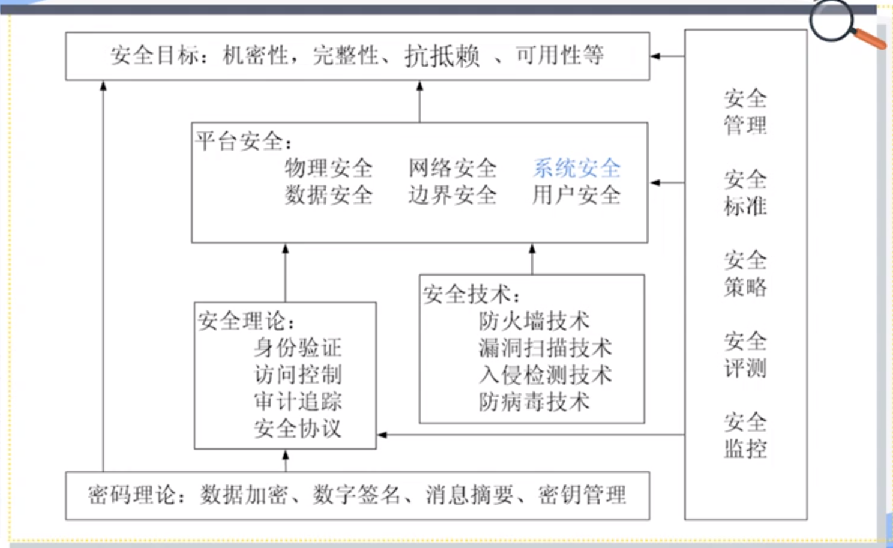
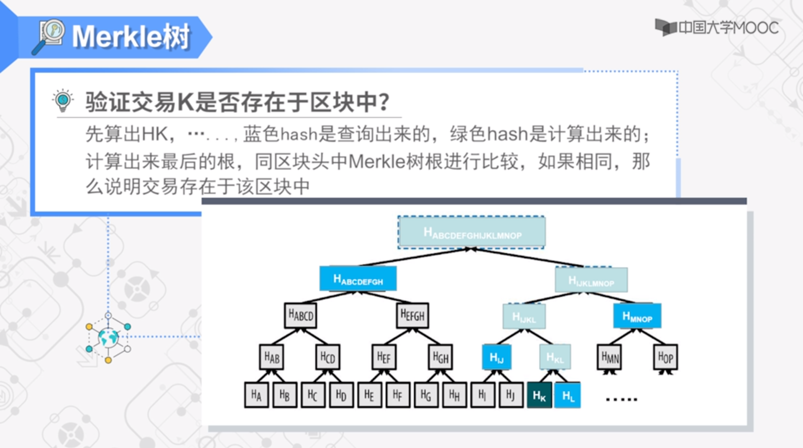

密码研究领域分类：

- 密码编码学（cryptography）：study of encryption principles/methods;
- 密码分析学（cryptanalysis）：the study of principles/methods of deciphering cipher text *without knowing key*;
- 密码学（cryptology）：the field of both cryptography and cryptanalysis.

# 古典密码学

## 对称密钥密码模型

对称密钥密码模型（Symmetric Cipher Model）。

> A cryptosystem is a 5-tuple $ (E,D,M,K,C) $，where
>
> - $M$ is the set of plain texts;
> - $C$ is the set of cipher texts;
> - $K$ is the set of keys;
> - $E:M \times K \rightarrow C$ is the set of encryption algorithms;
> - $D:C \times K \rightarrow M$ is the set of decryption algorithms.

密码需求或者密码服务：保密性（Confidentiality）、完整性（Integrity）、可用性（Availability）、可认证（Authentication）和抗抵赖/抗否认（Non-repudiation）。

**羊皮传书（置换密码）**：羊皮带子缠绕到木棒上。

**藏头诗（隐写术）**：每一句诗首字母。

**凯撒密码（替代密码）**：对每一个字母进行一个替换。

概念：

- 明文（plain text）：the original message;
- 密文（cipher text）：the coded message;
- 密钥（key）：info used in cipher known only to sender/receiver;
- 加密（算法）（encipher/encrypt）：converting plain text to cipher text;
- 解密（算法）（decipher/decrypt）：recovering plain text from cipher text.

要求：

- 在传输前需要协商好密钥，需要进行带外传输；
- 秘密应该全部寓于密钥（而非加密解密算法）$\neq$ 算法应当全部公开；
- 方便使用。

## 如何设计好的密码算法

定义：

- 无条件安全（unconditional security）：No matter how much computer power is available, the cipher cannot be broken since the ciphertext provides insufficient information to uniquely determine the corresponding plaintext;
- 计算安全（computational security）：Given limmied computing resources, the cipher cannot be broken.

**单字母表密码**（对凯撒密码的改进）：

凯撒密码仅仅使用某一字母后数几个数字的字母作为替代，而单字母表密码打乱了这种顺序。大大增加了密钥的数量。可以通过词频分析来进行解密。

**弗吉尼亚密码**（对凯撒密码的改进，当密钥长度与明文相同时，成为自动生成密钥密码 Autokey Cipher）：

存有多个字母表，通过变量 $k$ 指定选择哪一个密码表进行加密。$k$ 可以通过字母来进行指定，比如 dece 相当于 4535，通过循环使用 4535 即 dece 即可完成对明文的加密。

缺陷：密钥的长度容易被分析得到。

**自动生成密钥密码**（对弗吉尼亚密码的改进）：

- 先用初始密钥加密明文；
- 密文由发送者发送给接收方；
- 接收方有同样的密钥，解密得到初始明文；
- 发送者将初始的明文作为密钥，加密后面的明文；
- 接收方将初始解密得到的明文来解密收到的密文

缺陷：密钥出现的统计规律与明文相同。

如何解决这种问题：

- 密钥和明文一样长；
- 密钥应当与明文独立，没有统计规律（使用随机序列）。

## 对称密钥密码的理论标杆

**弗纳姆密码**（一次一密，One-Time Pad，**具有无条件安全性**）：

处理的对象是比特。通过以下算法加密与解密：

$$
C_{i}=P_{i} \oplus K_{i} \\
P_{i}=C_{i} \oplus K_{i}
$$

要求通信双方事先共享一个随机的密钥序列。

## 简单的置换密码

三种密码分类：

- **替代密码**：明文里的一个字符或者一个比特，使用密文里的一个字符或者一个比特进行替代。
- **置换密码**：在密文里对明文进行重新的排列。
- **乘积密码**：两次替代，两次置换，一次置换一次替代，一次替代一次置换等。现代密码几乎都是乘积密码。

**Rail Fence 密码**（羊皮传书的一种特例，也是一种置换密码）。

**行置换密码**：


## 转子机

现代密码出现前，转子机是一种典型的乘积密码，是古典密码的高峰（二战时用到）。

通过转子转动来选取字母表，共有三排转子，分别是快速转子、中速转子和慢速转子，每前面的转子转一圈后面的转子转一格。共有 $26^3$ 种状态，每一种状态对应一个字母表。

# 公开密钥密码学

## 对称密钥密码的密钥交换问题

在真正的通信开始前，需要共享密钥 $Key$，需要使用安全的信道进行传递，这是一个问题。

## 公开密钥模型提出

每个人有两个密钥：公钥（Public key）和私钥（Private key）。


加密只需要公开密钥，而解密则需要公开密钥和私有密钥。

根据使用的密钥的数量可以分为：

- 对称的、单密钥、秘密密钥、传统密码技术；
- 非对称的、双密钥、公钥密码技术。

使用公开密钥可以实现以下需求（并不是所有公开密钥算法都可以提供这三个服务）：保密通信、密钥交换（发送方使用公开密钥生成对称密钥，后通过对称密钥进行通信）以及数字签名。

## 设计公钥密码的基本要求

公开密钥算法的基本要求：

- 接收方 B 可以通过计算产生出一对密钥：（公开密钥 $KU_{b}$，私有密钥 $KR_{b}$）；
- 发送方 $A$ 很容易计算产生密文 $C=E_{KU_{b}}(M)$；
- 接收方 B 通过计算解密密文 $M=D_{KR_{b}}(C)=D_{KR_{b}}[E_{KU_{b}}(M)]$；
- 敌对方即使知道公开密钥，要确定私有密钥在计算上也是不可行的；
- 敌对方即使知道公开密钥和密文，要确定明文在计算上是不可行的；
- 通过公钥加密可以使用私钥解密（保密通信），通过私钥加密可以通过公钥解密（数字签名）：$M=D_{KR_{b}}[E_{KU_{b}}(M)]=D_{KU_{b}}[E_{KR_{b}}(M)]$。

## 数字签名

两个需求：实现身份认证与抗抵赖。

数字签名就是用 **私钥加密**。


公开密钥中非对称的含义：密钥的不对称（加密与解密的密钥不能相同，加密的不能解密，解密的不能加密）。

## RSA 算法

是一个分组加密算法，目前广泛地被采用。

理论基础是数论中地以下论断：要求两个大素数地乘积是容易的，但要分解一个合数为两个大素数地乘积，则在计算上是不可能的。

RSA 经过以下步骤进行 **密钥生成**（多项式时间内完成）：

- 生成两个大素数 $p$ 和 $q$；
- 计算这两个素数的乘积 $n=p\times q$（$n$ 只能分解为这两个素数的乘积）；
- 计算小于 $n$ 并且与 $n$ 互质的整数的个数，即欧拉函数 $\phi (n)=(p-1)(q-1)$；
- 选择一个随机数 $e$ 满足 $1<e<\phi (n)$，并且 $e$ 和 $\phi (n)$ 互质，即 $gcd(e,\phi (n))=1$；
- 解方程 $(e\times d)\mod\phi(n)=1$，求出 $d$；
- 保密 $d$，$p$ 和 $q$ 销毁，公开 $n$ 和 $e$；
- 公钥公开：${e,n}$；
- 私钥保密：$d,n$。

RSA 经过以下步骤进行 **报文加密**：

- 获取接收方公钥 $PU=\{e，n\}$；
- $C=M^{e}\mod n,0\leq M < n$；

RSA 经过以下步骤进行 **报文解密**：

- 用自己的私钥 $PR=\{d,n\}$；
- 计算：$M=C^{d}\mod n$；

## 公钥密码的特征总结

**单向函数**：对于一个函数 $f(x)$，如果对于其定义域上的任意 $x$，$f(x)$ 都容易计算，同时，对于其值域中几乎所有的取值 $y$，计算其逆函数 $f^{-1}(y)$ 都是不可行的，则函数 $f(x)$ 被称为单向函数。

可以提供单向函数的三大数学难题：

- 大整数分解问题（简称 IFP）；
- 离散对数问题（简称 DLP）；
- 椭圆曲线离散对数问题（简称 ECDLP）。

**单向陷门函数**：对于一个单向函数 $f(x)$，如果其逆函数 $f^{-1}(y)$ 在已知某些辅助信息的情况下容易求解得出，则称该单向函数 $f(x)$ 为单向陷门函数。

构造公钥密码系统的关键是如何在求解某个单向函数的逆函数的 NP 完全问题中设置合理的陷门。

## Diffie-Hellman 密钥交换算法

**在不安全网络建立共享密钥的方法**，需要安全通信的双方可以用这个方法确定对称密钥。

是第一个公钥方案，使用在一些常用安全协议或产品（例如 SSH 等），密钥交换方案：

- 不能直接用于有大量数据传输的保密通信；
- 允许两个用户可以安全地建立一个共享的秘密信息，用于后续的通讯过程；
- 该秘密信息仅为两个参与者知道。

算法的安全性依赖于有限域上计算离散对数的问题。

- 通信双方/多方选择两个数：$p$ 和 $a$，其中 $p$ 是一个大素数，$a$ 是 $p$ 的一个原根；
- 用户 $A$ 选择一个随机数 $X_{a}<p$，计算 $Y_{a}=a^{X_{a}}\mod p$；
- 用户 $B$ 选择一个随机数 $X_{b}<p$，计算 $Y_{b}=a^{X_{b}}\mod p$；
- 每一方保密 $X$ 值，而将 $Y$ 值交换给对方；
- 即 $X$ 是私钥，$Y$ 是公钥。

**密钥交换** 步骤如下：

- 双方获得一个共享密钥 $K=a^{X_{a}X_{b}}\mod p$；
  - 对于用户 $A$，计算出 $K=Y_{b}^{X_{a}}\mod p$；
  - 对于用户 $B$，计算出 $K=Y_{a}^{X_{b}}\mod p$；
- 攻击者要获得 $K$，需要解离散对数；
- 实际使用中，素数 $p$ 以及 $p$ 的原根 $a$ 可由一方选择后发给对方。

# 报文鉴别与哈希函数

## 安全服务与安全需求

**保密性**：防止未经授权的访问；

**完整性**：防止未经授权的篡改；

**可用性**：合法用户的访问请求应被允许，e.g. DDoS；

**可认证**：通信方的身份能够得到确认；

**抗抵赖、抗否认**：通信双方利益不一致，通信发生后一方不可抵赖。

## 报文鉴别的安全需求

**对保密性的威胁**：泄密、流量分析；

**对完整性的威胁**：修改内容、破坏数据包收到的先后顺序；

**对可认证的威胁**：冒名顶替；

**对抗抵赖的威胁**：不承认发送过某个报文。

报文鉴别有三种安全需求：

1. 保护报文的完整性（B 可以确认 A 发来的报文是没有被修改的）；
2. 验证发送者的身份（B 能够知道发送者是 A）；
3. 抗抵赖、防止报文发送者抵赖（B 能够证明是 A 发的，解决争议）。

如何实现报文鉴别：

- 报文加密（对称密钥密码加密、公开密钥密码加密）；
- 报文鉴别码（MAC）；
- HASH（哈希）函数。

不是所有的方案都能够实现全部的安全需求。

## 对报文加密来实现报文鉴别

使用 **对称密钥** 加密来实现报文鉴别能够提供一定程度的报文鉴别服务（**无法实现抗抵赖，因为接收方有密钥可以构造报文**）：

- 保护报文的完整性（传输过程中没有被篡改，需要有特定的格式/冗余）；
- 验证发送者的身份（只能来自于某一知道该对称密钥的发送方）。

使用 **公开密钥** 加密来实现报文鉴别：

- 使用公钥加密（无法实现任何一项报文鉴别服务）；
- 使用私钥加密（不保证保密性，但是实现了所有的报文鉴别需求）；
- 可以先私钥再公钥（先使用 A 的私钥加密（签名），再使用 B 的公钥进行加密），在保证保密性的同时，实现所有的报文鉴别需求。

## 报文鉴别码（Message Authentication Code, MAC）

用加密实现报文鉴别的缺点：

- 开销：加密整个报文，相当于用整个报文作为报文鉴别码；
- 较难实现自动化：需要有冗余信息进行确认；

报文鉴别码：

- 固定长度的比特串（例如 128 个 bit，等）；
- 由报文鉴别码算法生成：
  - 算法的输入包括：报文和密钥；
  - 算法的设计类似于对称密钥算法，但是不可逆。
- 附加到报文上用于报文鉴别。

接收者对报文执行相同方向的计算并检查它是否与收到的 MAC 匹配；

确保报文来自声称的发送者且传输过程中没有被篡改。整个算法的流程如下图所示：


应用场景：

- 有时候只需要报文鉴别；
- 有时候需要长时间保存数据的完整性（例如：档案）。

报文鉴别码相当于一个多对一映射，多个明文可能有相同的报文鉴别码（信息压缩）。

可以通过找到一个 $M^{\prime}\neq M$，但 $C_{k}(M^{\prime})=C_{k}(M)$ 进行攻击。

需要 MAC 满足以下要求：

- 不能通过一个报文和它的 MAC，找到另一条有相同 MAC 的报文；
- MAC 应该是均匀分布的；
- MAC 应该取决于报文的每一位；

**Data Authentication Algorithm(DAA)**报文鉴别码算法就是基于 DES-CBC（将分组密码的 CBC（Cipher Block Chaining）模式将最后一个密文块作为 MAC），是一个早期的 MAC 生成算法：


- 令 $IV=0$ 并用比特 0 填充最后一个明文块；
- 在 CBC 模式下使用 DES 加密报文；
- 将最后一个密文块作为 MAC 值或者最后一个块的最左边的 $M$ 位（$16\leq M\leq64$）；

这个算法最终得到的 MAC 太短，不够安全。

## 哈希函数

将任意长度的报文压缩到固定长度的二进制串：$h=H(M)$；

哈希函数与报文鉴别码的一个重要的 **区别** 是哈希函数是公开的，而报文鉴别码需要密钥。

通常假设哈希函数是 **公开的**。哈希函数无法防止恶意篡改，因为在篡改后可以重新计算哈希值再进行分发。

哈希函数很少单独使用，通常用来构造数字签名：


可以通过找到 $M^{\prime}\neq M$，但 $H(M^{\prime})=H(M)$ 的方式对哈希函数进行攻击。对哈希函数的要求如下：

- 可应用于任意大小的报文 $M$；
- 生成固定长度的输出 $h$；
- 很容易计算报文 $M$ 的哈希值；
- **单向性**：已知 $h$，不能计算得到 $x$，使得 $H(x)=h$；
- **弱抗碰撞性**：给定 $x$，找到 $y$，使得 $H(x)=H(y)$ 是计算上不可行的；
- **强抗碰撞性**：找到任意的 $x,y$，使得 $H(y)=H(x)$ 是计算上不可行的。

### 哈希函数的应用


### 哈希算法

哈希算法的一般结构如下：


**MD5 算法**（一系列 hash 算法 MD2, MD4）：

- 生成 128-bit 的哈希值；
- 曾经是广泛使用的哈希算法，并成为了 Internet 标准 RFC1321。

**SHA 算法**（Secure Hash Algorithm， 1995 年修订为 SHA-1）：

- 基于 MD4 设计；
- 生成 160-bit 的哈希值。

**RIPEMD-160**：

- 在欧洲开发的，由 MD4/5 的研究人员设计，在某些方面与 MD5/SHA 类似；
- 生成 160-bit 的哈希值；
- 比 SHA-1 慢，但更安全。

## 生日攻击（Birthday Attacks）

**生日悖论**：

在一组 23 名随机选择的人中，至少有两人同一天生日的概率约为 50%，如果有 30 人，则约有 70%；找到具有相同生日的两个人与找到哈希碰撞是一回事。

更一般地说，假设我们有 $N$ 个对象，$N$ 很大。有 $r$ 个人，每个人选择一个对象那么：

$$
P(match) \approx 1-e^{-r^{2}/2N}
$$

**生日攻击**：

选择 $r^{2}/2N=\ln2$，我们发现如果 $r \approx 1.177 \sqrt{N}$ 那么至少两个人选择同一个对象的概率为 50%；如果有 $N$ 种可能性的话（$N$ 种哈希值），并且我们有一个长度为 $\sqrt{N}$ 个列表（$\sqrt{N}$ 个报文），那么匹配的可能性在 50% 左右，如果我们想要增大匹配的可能性，那么我们可以列出一个长度为 $\sqrt{N}$ 的常数倍的列表。

**一个生日攻击的例子**：

我们有 40 个车牌，设每个车牌都以 3 位数字结尾。两个车牌结尾的 3 位数相同的概率是多少？

由于 $N=1000, r=40$，经过计算相同的概率大约在 50%。

**如何通过生日攻击攻击哈希函数**：

假设哈希函数的输出不够大，则可以使用生日攻击来找哈希碰撞。

假设 $h$ 是输出 $n$ 位数的哈希函数，存在 $N=2^{n}$ 个可能的输出。假设列表长度（查找测试的报文数量）$r \approx \sqrt{N}$，人们（即报文）有 $N$ 个可能的“生日”，**所以可能有两个报文生成相同的哈希值**。

# Web 与电子商务安全

## 信息安全的学科内容

涉及多方面的理论和应用知识，除了数学、通信、计算机等自然学科外，还涉及法律、心理学等社会科学。



## Web 和电子商务安全问题提出

Web 系统脆弱性讨论：

- Web 是外网可见的；
- 复杂的软件会隐藏漏洞；
- Web 站点容易配置和管理；
- 可被用作跳板发起对内网的攻击；
- 用户没有意识到威胁存在。

Web 安全威胁有哪些：原生的基于 http 协议的 Web 应用面临多种威胁（保密性、完整性、可用性、可认证（主要是对服务器的认证））；

威胁在哪里：

- 网络上：网络窃听、报文篡改；
- 服务端：恶意的钓鱼网站或安全性弱的站点；
- 客户端（最严重）：恶意软件。

## SSL 与 TLS

TLS 第一版可以认为是 SSLv3.1。

安全机制在传输层、网络层和应用层（取决于程序员）分别有相应的实现方案。


SSL 协议只能在主机上实现（因为在三层之上），IPSec 可以放到路由器上实现（保护整个子网）。

SSL 设计目标：为两个通讯个体之间提供 **保密性、数据完整性、身份认证（拿到服务器的公钥从而验证服务器身份）**。

**在不同的网络层实现安全机制，有什么区别？**

在应用层的加密方案相当于把加密交给了程序员自己去做。

在传输层和网络层实现是公共的服务。

传输层的加密只能放在主机上实现，而网络层的加密可以放在网络设备上实现，可以保护整个子网。

### SSL 协议体系结构


主要分为四部分：

- SSL 记录协议（SSL Record Protocol）；
- SSL 握手协议（SSL Handshake Protocol）；
- SSL 密码变化协议（SSL Change Cipher Spec Protocol，用来从公开密钥切换到对称密钥）；
- SSL 警告协议（SSL Alert Protocol）。

### SSL 工作流程

握手：

- 单向身份认证，双向认证（可选）；
- 协商 SSL 会话的密钥等参数；

SSL 记录协议：

- 加密会话数据；
- 提供完整性、保密性支持；

### SSL 记录协议

- 建立在可靠的传输协议之上（如 TCP）；
- 提供连接安全性，有两个特点（保密性：对称加密，完整性：MAC 算法）；
- 用来封装高层的协议。

SSL 记录协议的封装过程如下：


SSL 记录协议报文格式如下：

```c
struct{
    ContentType type; // 8位，上层协议类型（FTP, HTTP，密码变换，握手）
    ProtocolVersion version; // 16位，主次版本
    uint16 length; // 加密后数据的长度
    EncryptedData fragment; // 密文数据
} SSLCiphertext;
```

### SSL 握手协议

- 是最复杂的协议，也是最先工作的协议；
- 需要客户与服务器之间的相互认证；
- 共同协商加密算法和密钥；
- 提供连接安全性，有三个特点：
  - 身份认证：至少对一方提供认证，也可以是双向认证；
  - 协商得到的共享密钥是安全的，中间人不能知道；
  - 协商过程是可靠的。

## 安全电子交易（SET）

SET(Secure Electronic Transactions)，是一种开放的安全电子交易安全规范，保护因特网上的信用卡支付交易，由 Mastercard, Visa 发起，不是一种支付系统，是一系列安全协议与规范格式。

### SET 参与方

- 持卡人（Cardholder）；
- 商家（Merchant）；
- 支付网关（Payment Gateway）；
- 发卡行（Issuer）；
- 收单行（Acquirer）；
- 证书发布方 CA（Certificate Authority）（使用了公开密钥系统）；

### SET 服务

- 提供安全的交易通道（通信的保密性与完整性）；
- 基于 X.509 证书提供交易方之间的信任（基于公钥密码实现身份认证）；
- 强调隐私保护（限制参与方只能知道自己应该知道的信息）；

### 客户和商家交易的 10 个基本步骤

- 消费者开通账号（The customer opens an account）;
- 消费者收到证书（The customer receives a certificate）；
- 商家有他自己的证书，消费者浏览商家网页可以确定商家的身份（根据商家的密钥），消费者下一个订单，商家对订单进行确认；
- 持卡人把订单信息（买了三本书一个鼠标）与支付信息（信用卡信息）发送给商家（The order and payment are sent）；
- 商家请求支付授权（商家会把支付信息发送给支付网关）；
- 支付授权通过后，商家确认订单；
- 商家提供货物与提供服务；
- 商家请求支付（因为授权已通过）；

SET 是在线信用卡交易，不是第三方支付。

### 隐私保护（双重数字签名）

持卡人在发送订单信息与支付信息前，首先计算 **双重数字签名**。


在第六步：将订单信息与支付信息发送给商家。

在这中间的矩形中，上面两部分是密文，下面两部分是明文。

数字信封使用银行的公开密钥加密，加密的是一个对称密钥。这个信封由于使用了银行的公开密钥加密，所以商家无法打开，只能转交。


商家的验证过程：


银行的验证过程是支付过程的反过程。

解决了两个隐私问题：

- 持卡人隐私（支付信息）得到了保护；
- 商家的隐私（订单信息）得到了保护。

有一个问题：订单信息是明文传递的，如何防止其被窃取？订单信息理论上互联中都可以窃取。

# 公开密钥基础设施（PKI）

PKI（Public Key Infrastructure）要解决的问题是如何实现 **公钥和身份的绑定**。

定义：用公钥原理和技术实施和提供安全服务的具有普适性的安全基础设施。

一个完整的 PKI 应当包括：证书授权中心 CA(Certificate Authority)、证书库、证书注销机制、密钥备份和恢复、自动密钥更新、密钥历史档案、交叉认证、支持不可否认性、时间戳、客户端软件。

PKI 提供的服务：

- 认证：采用数字签名技术，签名作用于相应的数据之上；数据源的认证服务、身份认证服务。
- 完整性：数字签名，可以是实体认证，也可以是数据完整性；
- 保密性：用公钥分发随机密钥，使用随机密钥对数据加密；
- 不可否认：发送方的不可否认：数字签名；接收方的不可否认：收条：数字签名。

密钥对的用途：

- 用于加密的密钥对（用公钥加密，用私钥解密，使用期限更长）；
- 用于签名的密钥对（用私钥签名，用公钥验证）。

**数字证书（Digital Certificate）**的结构有：主体身份信息、主体的公钥、CA 名称、CA 签名（CA 使用自己的私钥签名）。

证书的权威性取决于颁发机构的权威性。

证书格式遵循 X.509 国际标准，如下：


## PKI 的组成

一般情况下，在 PKI 中有两种策略：

- 证书策略、用来管理证书的使用；
- CPS（Certificate Practice Statement）。包含如何在实践中增强支持安全策略的一些操作过程的详细文档。包括 CA 如何运作，证书如何发行、接受和废除、密钥如何产生、密钥如何存储、用户如何得到等。

广义 CA：PKI 的所有服务端都叫做 CA；

狭义 CA：只用来签发证书的服务器。

**CA 主要有两个功能**：签发证书、签发证书的注销列表。CA 不直接与用户通信，而是与注册中心 RA(Registration Authority) 通信，从 RA 处获得用户的请求。CA 维护一个证书注销列表 CRL(Certificate Revocation List)。

**RA**：验证用户身份，与用户进行物理接触。

**证书发布系统**：签发完毕后，放入证书发布系统以供存储与查阅。

## PKI 信任关系

### 层次结构 CA

根 CA 具有一个自签名的证书，根 CA 依次对下面的证书进行签名，层次结构中叶子节点上的 CA 用来对安全主体进行签名。

对于主体而言，只要信任根 CA 即可。

- 拿到需要验证的实体的证书；
- 拿到三级 CA 证书，验证实体签名；
- 拿到二级 CA 证书，验证三级签名；
- 从根 CA 证书，验证二级签名；
- 拿到根 CA 证书，验证 CA 自己的签名。

如果存在多个根 CA，那么一个根 CA 下的实体在需要验证另一个根 CA 下的实体的证书时，只需要让源根 CA 对目的根 CA 的证书签名即可。

桥 CA（BCA）不直接对用户进行认证，而是把多个 CA 连接起来，从而完成 **信任链的建立** 工作。

## PKI 的应用

基本的应用有：文件保护、E-mail 加密、Web 应用、Microsoft CryptoAPI；

其他：VPN、SSL/TLS、XML、WAP。

CA 分类：区域类、行业类、商业类、内部自用类。

# 身份认证

## 身份认证的基本概念

宣称者向验证方出示证据、证明其身份的交互过程。

至少涉及两个参与者，是一种协议。

分为：双向认证、单向认证。

**身份认证基本方法**：

- 宣称者所知道的：passwords、PINs(personal identification number)、keys；
- 宣称者所拥有的：cards、handhelds；
- 宣称者继承的生物特征：指纹等。

**身份认证协议的分类**：

- 弱的身份认证：
  - 基于口令、PIN 码等；
  - 动态口令。
- 强的（基于密码技术）的身份认证：
  - 质询与应答技术。
- 基于可信第三方的身份认证（不但实现身份认证，还解决密钥分发问题）：
  - Needham-Schroeder 协议；
  - Kerberos 协议。

## 基于口令的身份认证

是一种 **弱的认证方法**：

- 口令在相当长的一段时间固定；
- 明文存放或哈希之后存放；
- 通过设置规则，避免弱口令；
- 盐值（Salt）提高字典攻击穷举空间（在明文的特定位置加上干扰信息即撒盐，从而使得哈希后的结果与原结果有很大不同，当密码文件丢失后，由于攻击者不知道盐值，所以很难推出密码是多少，从而防止离线字典攻击）；

**基于口令的身份认证步骤如下**：

初始化阶段：

- 用户选择密码；
- 密码的哈希存储在密码文件里。

身份认证阶段：

- 用户登入系统，提交密码；
- 系统计算哈希，进行比对。

对基于口令认证的攻击：

- 重放攻击：口令一般一段时间固定；
- 穷举攻击：穷举空间少；
- 字典攻击（人名、宠物名、常用的口令，在线）（丢失密码文件后通过查哈希表来攻击）。

### 动态口令（One Time passwords, OTP）

解决的问题：基于口令的身份认证容易受到重放攻击，如何避免口令被重放。

**Lamport 方案**，利用哈希函数 **单向性**：

- 初始化阶段：
  - 用户 $A$ 基于一个秘密 $w$；
  - 使用 HASH 函数 $h$，计算出一组 password 序列：

    $$
    w, h(w), h(h(w)), \cdots,h^{t}(w)
    $$

  - 验证放 Bob server 仅仅知道 $h^{t}(w)$ 与哈希算法。
- 认证阶段：
  - 第 $i$ 次认证使用 $w_{i}=h^{t-i}(w)$。

## 质询与应答认证技术

**基本逻辑**：

- 身份认证基于 A 所知道的某个秘密（例如秘钥）；
- B 发送给 A 一个随机数（challenge）；
- A 收到这个随机数后，对它作某种变换，得到 response 报文，并发送回去；
- Response 同时依赖于随机数（challenge）和 A 所知道的这个秘密；
- B 收到 Response，可以验证 A 是知道这个秘密的。

### 使用对称密钥实现质询应答

单向身份认证对称加密：

- $Bob→Alice$: $r_{b}$；
- $Alice→Bob$: $E_{K}(r_{b},B)$，$K$ 是 Alice 和 Bob 共享的密钥；
- Bob 收到后检验 $r_{b}$ 是否是刚发送给 A 的随机数，同时检验 B 的标识 $B$，为了防止反射攻击，报文中 $B$ 标记了报文的方向；
- $r_{b}$ 要求不能重复，并且是随机的，为了防止重放攻击。

**反射攻击**：

反射攻击是对质询应答身份认证协议的一种攻击方法。攻击者 $I(A)$ 在两个方向上使用相同的协议。也就是说，$I(A)$ 用 Bob server 对自己这个方向的 Challenge，去质询 Bob server。

- $B→I(A)$：$r_{b}$；
- $I(A)\rightarrow B$：$r_{b}$；
- $B\rightarrow I(A)$：$E_{K}\{ r_{b} \}$；
- $I(A)\rightarrow B$：$E_{K}{r_{b}}$；

### 使用公开密钥实现质询应答

单向身份认证加密：

- $Bob\rightarrow Alice$：$r_{B}$ 随机数；
- $Alice \rightarrow Bob$：$cert_{A}, r_{A}, B, S_{A}(r_{A}, r_{B}, B)$；

$r_{A}$ 的作用相当于撒盐，防止假的 $Bob$ 易于分析 $Alice$ 的私钥。

## Needham-Schroeder 协议


1. Alice 创建随机数 $N_{A}$ 发送给 Trent：$Alice, Bob, N_{A}$；
2. Trent 产生会话密钥 $K$，发送给 Alice：$\{ N_{A}, K, Bob, \{K, Alice\}_{KBT} \}_{KAT}$；
3. Alice 解密，检查 $N_{A}$，检查 Bob 的 ID，发送给 Bob：$Trent, \{K,Alice\}_{KBT}$；
4. Bob 解密，检查 Alice 的 ID，创建随机数 $N_{B}$ 然后发送给 Alice：$\{I'm Bob, N_{B}\}_{K}$；
5. Alice 发送给 Bob：$\{I'm Alice, N_{B}-1\}_{K}$。

可能的攻击方式：**中间人攻击**，将后三步改为：

1. Alice 发送给 Malice("Bob")，Malice("Alice") 发送给 Bob：$\{K^{\prime},Alice\}_{KBT}$，实际上这个 $K^{\prime}$ 是一个旧的密钥，没有鲜活性；
2. Bob 解密，发送给 Malice("Alice")：$\{I'm Bob, N_{B}\}_{K^{\prime}}$；
3. Malice("Alice") 发送给 Bob：$\{I'm Alice, N_{B}-1\}_{K^{\prime}}$。

这种中间人攻击会发生的原因是第三个报文的 **鲜活性** 没有保证。

**改进措施**：

1. Trent 发送给 Alice：$\{Bob,K,T,\{Alice, K, T\}_{KBT}\}_{KAT}$；
2. Alice 发送给 Bob：$\{Alice, K, T\}_{KBT}$。

AB 均检验：

$$
|Clock-T|<\Delta t_{1} + \Delta t_{2}
$$

## KERBEOS 协议

KERBEOS 是希腊神话中看护地狱之门的三头神兽。

分布式环境、C/S 模型、实现应用服务器与用户之间的双向认证。

解决的问题是：在一个分布式的环境中，用户希望获取服务器上提供的服务，服务器能够限制授权用户的访问，并能对服务请求进行认证。还应当能够处理三种威胁：

- 用户伪装成另一个用户访问服务器；
- 用户更改工作站的网络地址；
- 用户窃听报文交换过程，利用重放攻击进入服务器。

**符号定义**：

| 符号  |                    意义                    |
| :---: | :----------------------------------------: |
|  $C$  |                    客户                    |
| $AS$  | 认证服务器（存放着所有用户及用户口令信息） |
|  $V$  |                   服务器                   |
| $IDc$ |            在 $C$ 上的用户标识符             |
| $IDv$ |                $V$ 的标识符                 |
| $Pc$  |             在 $C$ 上的用户口令              |
| $ADc$ |               $C$ 的网络地址                |
| $Kv$  |          $AS$ 和 $V$ 共享的加密密钥           |

一个简单的基于可信第三方的认证对话：

- $C\rightarrow AS:IDc||Pc||IDv$;
- $AS\rightarrow C:Ticket$, $Ticket=E_{Kv}\left[ IDc||ADc||IDv \right]$;
- $C\rightarrow V:IDc||Ticket$.

存在的问题：

- 要求用户频繁输入口令；
- 申请不同的服务，用户需要新的票据；
- 口令是明文传送的，敌对方可能窃听到口令；
- 敌对方窃取 $Ticket$，进行重放攻击。

改进方法：


这种改进仍然无法避免重放攻击。

### KERBEOS 协议的完整对话

**符号定义**：

|   符号    |         意义          |
| :-------: | :-------------------: |
|   $AS$    |      认证服务器       |
|  $K_{v}$  | TGS 和 V 共享的加密密钥  |
| $K_{tgs}$ | AS 和 TGS 共享的加密密钥 |

- 客户机的密钥可以通过计算客户机口令的单向函数来得到；
- 每个客户机与 AS 有共享的秘密：客户机的密钥；
- TGS 与 AS 有共享的对称密钥 $K_{tgs}$；
- 每个应用服务器都与 TGS 有共享的对称密钥 $K_{v}$。


一个完整的对话过程如下：


# 区块链

## 区块链简史

区块链是面向数字货币记账系统（Bitcoins）设计的密码解决方案。

比特币的两个主要支撑技术：

- 密码技术解决方案：区块链；
- 去中心化记账的网络技术设施：P2P 网络。

去中心化的记账：

- 账本公开机制：每人手里都有一份账本，都是真的；
- 账本不再记载每户参与者的余额，而是只记载每一笔交易；
- 账本由私有改为公开；
- 基本假设：大家都诚实守信，即一半以上的人诚实守信。

区块链的实质：账本就是比特币系统中的区块，多个区块连接在一起就是区块链：

- 一个区块记录着多笔交易；
- 区块是顺序的，一个区块会有唯一的父区块。

## 两个方面的完整性

**交易历史的完整性**，整个账本链条完整性：

- 交易发生后不可逆，交易历史记录完整，可追溯；

**交易本身的完整性**：

- 账本上所有交易记录完整，不可篡改。

区块包含两个部分：

- 区块头（Head）：
  - 记录当前区块的元信息；
  - 前一区块头哈希：交易历史的完整性：前一区块无法替换，替换后其哈希与该部分值不相同；
  - Merkle 树根哈希：交易本身的完整性。
- 区块体（Body）：
  - 记录实际交易数据。

可以通过 Merkle 树根哈希保证交易本身的完整性：



## 工作量证明

比特币参与者有两个身份：交易者、矿工。这两个身份可以同时兼有。

矿工从事比特币挖矿活动：即将最近发生的交易记录在账本上（生成区块，并加入到链条中）。

矿工可以随时退出，也可以随时有新的矿工加进来。

挖矿是有一定难度的，矿工之间存在竞争关系。

**矿工的工作**：

- 收集交易单：
  - 每笔交易的付款人，不但要将交易单给到收款人，还要同时把交易单投递到每个矿工小组的收件箱；
  - 矿工定期从自己的收件箱把收集到的交易单一并取出。
- 生成新区块，新区块需要满足以下两个条件：
  - 新区块记录的交易有待其他矿工的确认：当有新的矿工沿着该区块加区块时，便是得到了认可；
  - **新区块头** 的 HASH 必须满足计算量要求：矿工需要选择合适的随机数 Nonce，使得：

    $$
    H(prevhash,Nonce,Merkleroot,otherheadersegment)<E
    $$

    $E$ 是系统规定的难度值，如：

    $$
    0x00000000FFFFFFFFFFFFFF\cdots F
    $$

    验证很简单，生成很难。

**如何维持区块生成速度**：

- 难度值设置原则：区块链被设置为每十分钟生成一个新区块；
- 需要定期更新难度值 $E$（每隔 2016 个区块）：
  - 全网均会自动统计过去 2016 个区块生成耗时，重新计算出下一个 2016 个区块难度值的目标值。
- 生成 2016 个区块时间为 14 天；
- 新目标值=当前目标值 $\times$ 实际 2016 个区块生成时间/理论时间（14 天）。

## 共识机制

每一个区块的交易清单第一条交易为：系统为这个矿工支付 50 比特币。

不以线性方式组织账本，而是以树状组织账本，任何时刻，都以当前最长分支作为主账本，但是保留其他分支。

收款人在公告挂出时不能立即确认交易完成，而是应该再看一段时间，等待各个挖矿小组再挂出六张确认区块，并且之前的区块没有被取消，才能确认钱已到账。

### 通货膨胀

**挖矿活动导致比特币数量一直增加下去，岂不是会严重通货膨胀**？

刚开始协议每生成一页账本（一个区块），奖励矿工 50 个比特币。后面，每当账本增加 21000 页，奖励就减半。例如当达到 21000 页后，每生成一页账本奖励 25 个比特币，42000 页后，每生成一页奖励 12.5 个，依次类推等账本达到 693000 页后，新生成账本页就没有奖励了。此时比特币全量约为 21000000 个，这就是比特币的总量，所以不会无限增加下去。

**没有奖励后，就没有人做矿工了，岂不是没有人负责确认交易了**？

到时，矿工的收益会由生成区块所得变为收取手续费。例如，你在转账时可 以指定其中 1％作为手续费支付给生成账本页的矿工，各个矿工会挑选手续费高的优先确认。

### 防止篡改

攻击一：改变区块内交易记录，那么 Merkle 根对应不上；

攻击二：攻击者改变交易记录和 Merkle 根，那么区块 HASH 对应不上；

攻击三：某矿工没有到达难度就提交了区块，那么任何人根据难度要求的计算公式进行验证都会发现错误，或者说只要 51％的人都承认错误即攻击失败。

## 公钥密码实现身份标识、交易的签名

对于每笔交易（有唯一编号），付款人签名，签名块放在交易记录中。

付款人签名指使用付款人的私钥对 **当前交易与收款人的公钥** 进行签名。

钱包地址即为公钥的哈希。

**匿名性**：账本是公开的，公钥是匿名的，每个公钥后真实的人身份是保密的，并且他可以拥有无限多的公钥。

# 防火墙

## 防火墙基本介绍

防火墙的访问控制能力：

- 服务控制，确定哪些服务可以被访问；
- 方向控制，对于特定的服务，可以确定允许哪个方向能够通过防火墙；
- 用户控制，根据用户来控制对服务的访问；
- 行为控制，控制一个特定的服务的行为。

## 防火墙类型

包过滤器；

应用层网关。

## 防火墙部署


