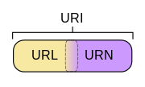

# 文件系统中的路径

From Wikipedia:

>  A path points to a file system location by following the directory tree hierarchy expressed in a [string](https://en.wikipedia.org/wiki/String_(computer_science)) of [characters](https://en.wikipedia.org/wiki/Character_(computing)) in which path components, separated by a delimiting character, represent each directory. The delimiting character is most commonly the [slash](https://en.wikipedia.org/wiki/Slash_(punctuation)) ("/"), the [backslash](https://en.wikipedia.org/wiki/Backslash) character ("\\"), or colon (":"), though some [operating systems](https://en.wikipedia.org/wiki/Operating_system) may use a different [delimiter](https://en.wikipedia.org/wiki/Delimiter). 

## 历史沿革

- Multics, ">", 1960s;
- Unix, "/", Around 1970;
- Microsoft, "\\";

## 相对路径与绝对路径

无论当前工作目录如何，绝对路径或完整路径都指向文件系统中的相同位置。 为此，它必须包含根目录。

相反，相对路径从某个给定的工作目录开始，无需提供完整的绝对路径。

## 一些操作系统和Shell中路径的表示

|     操作系统      |   Shell    |              根目录              | 分隔符 | 当前 |  父  | Home |
| :---------------: | :--------: | :------------------------------: | :----: | :--: | :--: | :--: |
|     Unix-like     | Unix Shell |                /                 |   /    |  .   |  ..  |  ~   |
| Microsoft Windows |  cmd.exe   | \\(relative) or [drive_letter]:\ |  /or\  |  .   |  ..  |  ~   |

**因为Windows也支持左斜杠，所以在实操中都用左斜杠就完事了**。

# 网络资源的路径

## URI, URL与URN 

以上三者的全称分别为`Universal Resource Identifier统一资源标志符`、`Universal Resource Locator统一资源定位符`和`Universal Resource Name 统一资源名称`，这三者的关系如下：

URI包含URL与URN。URL是URI的子集，所有的URL都是URI。

## URL

From Wikipedia:

> It is a reference to a [web resource](https://en.wikipedia.org/wiki/Web_resource) that specifies its location on a [computer network](https://en.wikipedia.org/wiki/Computer_network) and a mechanism for retrieving it. 

### 语法

统一资源定位符的完整格式如下：

\[协议类型\]: //[访问资源需要的凭证信息]@[服务器地址]:[端口号]/[资源层级UNIX文件路径]\[文件名\]?[查询]#[片段ID]

其中[访问凭证信息]、[端口号]、[查询]、[片段ID]都属于选填项。

其中，[片段ID]表示打开后会跳转到哪一部分，是浏览器执行的操作，与服务器无关。

### 一些特殊符号的含义

- #：代表网页中的一个位置。其右面的字符，就是该位置的标识符。比如http://www.example.com/index.html#print就代表网页index.html的print位置。浏览器读取这个URL后，会自动将print位置滚动至可视区域。

  为网页位置指定标识符，有两个方法。一是使用锚点，比如``，二是使用id属性，比如`
`。#是用来指导浏览器动作的，对服务器端完全无用。所以HTTP请求中不包括#；

- ?：有两个作用：

  - 连接作用：比如http://www.xxx.com/Show.asp?id=77&nameid=2905210001&page=1；
  - 清除缓存：比如http://www.xxxxx.com/index.html?test123123这个有问号，说明不调用缓存的内容，而认为是一个新地址，重新读取。

- &：不同参数的间隔符。

# 域名

域名由一或多个部分组成，这些部分通常连接在一起，并由点分隔，例如`zh.wikipedia.org`。最右边的一个标签是顶级域名，例如`zh.wikipedia.org`的顶级域名是org，`zh`是主机名。一个域名的层次结构，从右侧到左侧隔一个点依次下降一层。每个标签可以包含1到63个八字节。

**域名里的英文字母不区分大小写，因此可以使用大写方法拼写，但一般都以小写形式拼写**。

# 邮箱地址

邮箱地址格式为：user@mail.server.name，其中user是收件人的账号，mail.server.name是收件人的电子邮件服务器名，它还可以是**域名**或**十进制数字表示的 IP 地址**。@是连接符（音为“at”）用于连接前后两部分。当有邮件发送到邮箱后，该邮箱的用户就可以收取邮件了。
