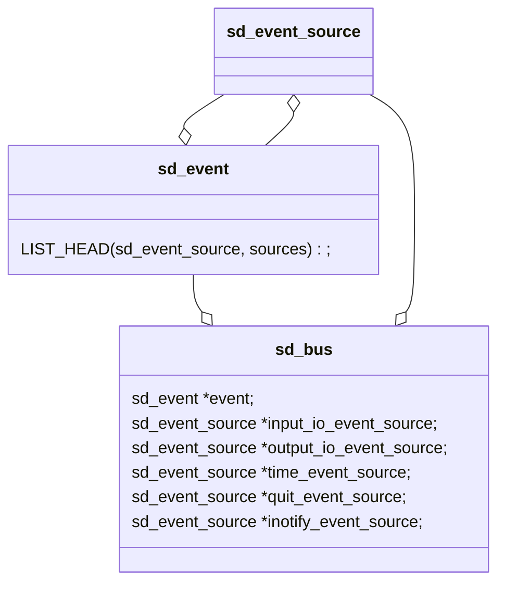

An object system for encapsulating OS resources alongside a transactional job scheduling engine (itself consisting of such objects) with the intention of providing a uniform interface for controlling and partitioning the units of CPU time, as well as static names and entities, in a GNU/Linux system.

[Structural and semantic deficiencies in the systemd architecture for real-world service management, a technical treatise](https://blog.darknedgy.net/technology/2015/10/11/0/)

Launchd is the MacOS init and deserves some respect for its speed and power; the systemd authors explicitly acknowledge launchd for inspiration.

systemd is Linux-only. It uses a bunch of non-POSIX APIs to do things like work with devices, configure security capabilities, etc.

[Things I learned about systemd \| Nelson's log](https://nelsonslog.wordpress.com/2016/04/30/things-i-learned-about-systemd/)

systemd's original design documentation: [Rethinking PID 1](http://0pointer.de/blog/projects/systemd.html)

systemd starts from `src/core/main.c`.

# Usage

```bash
# systemctl enable
systemctl enable <something> # 激活开机启动
systemctl enable --now <something> # 激活开机启动同时启动服务

# systemctl
systemctl disable <something> # 终止开机启动
systemctl disable --now <something> # 终止开机启动同时终止服务
```

# Overview

bus -> service/client/peer -> object (path) -> interface -> signal/property/method(function).

An **interface** is a collection of signals, methods, and properties (collectively called *members*), that belong together.

A service has the format: `org.freedesktop.login1`

An object has the format: `/org/freedesktop/login1`

An interface has the format: `org.freedesktop.login1.Manager`



我的理解是，bus 应该是独立于 event loop 的，为什么这里一个 bus 还要对应一个 event loop 呢？

感觉 bus 的这个 event 其实没什么用，只不过是作为一个中间变量，方便函数调用的时候传参？

### Manager, event loop, event source, dbus

1 manager run 1 event loop

### sd_bus_wait / sd_event_wait

What's the difference?

`sd_bus_wait` uses `ppoll`, and `sd_event_wait` uses `epoll_wait`.

### The essential of systemd

For traditional Unix daemons, there's one answer to it: they wait until the socket the other daemon offers its services on is ready for connections. Usually that is an AF_UNIX socket in the file-system, but it could be AF_INET[6], too. For example,

1. clients of D-Bus wait that /var/run/dbus/system_bus_socket can be connected to,
2. clients of syslog wait for /dev/log,
3. clients of CUPS wait for /var/run/cups/cups.sock and
4. NFS mounts wait for /var/run/rpcbind.sock and the portmapper IP port, and so on.

And think about it, this is actually the only thing they wait for!

Now, if that's all they are waiting for, if we manage to make those sockets available for connection earlier and only actually wait for that instead of the full daemon start-up, then we can speed up the entire boot and start more processes in parallel. So, how can we do that? Actually quite easily in Unix-like systems: **we can create the listening sockets before we actually start the daemon**, and then just pass the socket during exec() to it. That way, we can create all sockets for all daemons in one step in the init system, and then in a second step run all daemons at once. If a service needs another, and it is not fully started up, that's completely OK: what will happen is that the connection is queued in the providing service and the client will potentially block on that single request. But only that one client will block and only on that one request. Also, dependencies between services will no longer necessarily have to be configured to allow proper parallelized start-up: if we start all sockets at once and a service needs another it can be sure that it can connect to its socket.

[Rethinking PID 1](http://0pointer.de/blog/projects/systemd.html#Parallelizing%20Socket%20Services)

# Sd-bus

A bus is where you look for IPC services. There are usually two kinds of buses:

- a system bus, of which there's exactly one per system, and which is where you'd look for system services;
- and a user bus, of which there's one per user, and which is where you'd look for user services, like the address book service or the mail program. (Originally, **the user bus was actually a session bus** -- so that you get multiple of them if you log in many times as the same user --, and on most setups it still is, but we are working on moving things to a true user bus, of which there is only one per user on a system, regardless how many times that user happens to log in.)

[The new sd-bus API of systemd](https://0pointer.net/blog/the-new-sd-bus-api-of-systemd.html)

You can verity this from code:

```c
#define DEFAULT_SYSTEM_BUS_ADDRESS "unix:path=/run/dbus/system_bus_socket"
#define DEFAULT_USER_BUS_ADDRESS_FMT "unix:path=%s/bus"
```

To see all services on system bus: `busctl`.

To see all services on user bus: `busctl --user`.

### `bus->input_fd`, `e->epoll_fd` And socket

`fd` is different in each process, so `logind`'s bus's `output_fd` is different with other clients/services, they all share the same socket file `unix:path=/run/dbus/system_bus_socket`.

```
// client (pam_systemd)
pam_sm_open_session
	pam_acquire_bus_connection
		sd_bus_open_system
			sd_bus_open_system_with_description
				sd_bus_start
					bus_start_address
						bus_parse_next_address
							parse_unix_address // set b->sockaddr.un.sun_family to unix, set b->sockaddr.un.sun_path
						bus_socket_connect // b->input_fd = socket(); connect(b->input_fd, b->sockaddr.sa)

// service (logind)
run
	manager_new
		sd_event_default
			sd_event_new // e->epoll_fd = epoll_create1()
    manager_startup
	    manager_connect_bus
		    sd_bus_default_system
			    sd_bus_open_system
				    sd_bus_open_system_with_description
						sd_bus_start
							bus_start_address
								bus_parse_next_address
									parse_unix_address // set b->sockaddr.un.sun_family to unix, set b->sockaddr.un.sun_path
								bus_socket_connect // b->input_fd = socket(); connect(b->input_fd, b->sockaddr.sa)
								bus_attach_io_events
									sd_event_add_io
										source_io_register // epoll_ctl()
```

### We only use 1 socket, why use `epoll_wait` in service?

# Job

A Unit may encapsulate or queue a job (only one job per Unit), which is a generic unit of execution dispatched by a Manager object’s private run queue.

The standard way systemd handles units of execution is through an internal unit type called a job, which itself can be queued by other units.

# Manager

# Unit

**A Unit is associated with a Manager**, which as mentioned previously is the object responsible for being a systemd “driver”, system-wide or per-session.

Units have a name and a type. Since their configuration is usually loaded directly from the file system, these unit names are actually file names. Example: a unit avahi.service is read from a configuration file by the same name

Valid unit names consist of a "name prefix" and a dot and a suffix specifying the unit type. The type suffix must be one of ".service", ".socket", ".device", ".mount", ".automount", ".swap", ".target", ".path", ".timer", ".slice", or ".scope".

Unit files are placed under `/usr/lib/systemd/system`, due to the `/usr` merge, it is the same as `/lib/systemd/system`.

Service binaries are places under `/usr/lib/systemd`, they are used to start or stop a service:

```bash
❯ sudo cat /usr/lib/systemd/system/user-runtime-dir@.service
#  SPDX-License-Identifier: LGPL-2.1-or-later
#
#  This file is part of systemd.
#
#  systemd is free software; you can redistribute it and/or modify it
#  under the terms of the GNU Lesser General Public License as published by
#  the Free Software Foundation; either version 2.1 of the License, or
#  (at your option) any later version.

[Unit]
Description=User Runtime Directory /run/user/%i
Documentation=man:user@.service(5)
After=systemd-user-sessions.service dbus.service
StopWhenUnneeded=yes
IgnoreOnIsolate=yes

[Service]
ExecStart=/lib/systemd/systemd-user-runtime-dir start %i
ExecStop=/lib/systemd/systemd-user-runtime-dir stop %i
Type=oneshot
RemainAfterExit=yes
Slice=user-%i.slice
```

They are actually compiled from the source code of systemd, for example `src/login/user-runtime-dir.c` corresponding to the binary used by this unit file.

### Permanent units

Permanent units, though not officially christened as such (the term is instead derived from the antonym of “transient unit”, which *is* official terminology) are the standard ones you know which have configuration loaded from disk in the form of unit files.

### Transient (executable) units

Transient units are not specified from unit files, but created programmatically.

Systemd 可以管理所有系统资源：其将系统资源划分为几类，不同类别的 Unit 是通过后缀名来区分类别，比如 `sys-devices-virtual-tty-ttyb0.device`, `boot.mount`, `cups.path`, `session-16.scope` 以及 `accounts-daemon.service` 等等。

可以通过 `systemctl -t help` 查看 unit 的类型：

- Target: **A group of** units that defines a synchronization point. The synchronization point is used at boot time to start the system in a particular state.
- Service: A unit of this type starts, stops, restarts or reloads a service daemon such as Apache webserver.
- Socket: A unit of this type activates a service when the service receives incoming traffic on a listening socket.
- Device: A unit of this type implements device-based activation such as a device driver.
- Mount: A unit of this type controls the file-system mount point.
- Automount: A unit of this type provides and controls on-demand mounting of file systems.
- Swap: A unit of this type encapsulates/activates/deactivates swap partition.
- Path: A unit of this type monitors files/directories and activates/deactivates a service if the specified file or directory is accessed.
- Timer: A unit of this type activates/deactivates specified service based on a timer or when the set time is elapsed.
- Slice: **A group of** units that manages system resources such as CPU, and memory.
- Scope: A unit that organizes and manages foreign processes.

Note: Target and Slice are a group of units, not just a single unit.

### Slice unit

- By default, service and scope units are placed in `system.slice`;
- Virtual machines and containers registered with [systemd-machined(8)](https://www.freedesktop.org/software/systemd/man/systemd-machined.html#) are found in `machine.slice`;
- User sessions handled by systemd-logind(8) in `user.slice`.

[systemd.slice](https://www.freedesktop.org/software/systemd/man/systemd.slice.html#)

`systemd-cgls` can be used to see internal of all slices.

```
$ systemd-cgls --no-page
├─1 /usr/lib/systemd/systemd --switched-root --system --deserialize 22
├─user.slice
│ ├─user-1000.slice
│ │ └─session-11.scope
│ │   ├─9507 sshd: tom [priv]
│ │   ├─9509 sshd: tom@pts/3
│ │   └─9510 -bash
│ └─user-0.slice
│   └─session-1.scope
│     ├─ 6239 sshd: root@pts/0
│     ├─ 6241 -zsh
│     └─11537 systemd-cgls --no-page
└─system.slice
  ├─rsyslog.service
  │ └─5831 /usr/sbin/rsyslogd -n
  ├─sshd.service
  │ └─5828 /usr/sbin/sshd -D
  ├─tuned.service
  │ └─5827 /usr/bin/python2 -Es /usr/sbin/tuned -l -P
  ├─crond.service
  │ └─5546 /usr/sbin/crond -n
```

我们可以看出来，Slice 是可以嵌套的。

### Scope unit

Scope units are not configured via unit configuration files, but are only created programmatically using the bus interfaces of systemd.

[systemd.scope](https://www.freedesktop.org/software/systemd/man/systemd.scope.html)

# Signal

Much like a method it has a signature.

- While in a method call a single client issues a request on a single service, and that service sends back a response to the client
- signals are for general notification of peers. Services send them out when they want to tell one or more peers on the bus that something happened or changed. In contrast to method calls and their replies they are hence usually **broadcast** over a bus.

Example: `systemd-logind` broadcasts a `SessionNew` signal from its manager object each time a user logs in, and a `SessionRemoved` signal every time a user logs out.

A service can listen on the bus of the signal not sent to it! For example, logind has a following code:

```c
r = bus_match_signal_async(m->bus, NULL, bus_systemd_mgr, "JobRemoved", match_job_removed, NULL, m);
```

Which listens the `JobRemoved` signal on the bus sent to the `bus_systemd_mgr`.

# Service/Client/Peer

A client is a program that makes use of some IPC API on a bus. It talks to a service, monitors it and generally doesn't provide any services on its own.

### State

To see all services:

```bash
systemctl list-units --type=service
```

- The LOAD column shows the load state, one of loaded, not-found, bad-setting, error, masked.
- The ACTIVE columns shows the general unit state, one of active, reloading, inactive, failed, activating, deactivating.
- The SUB column shows the unit-type-specific detailed state of the unit, possible values vary by unit type.

# Type system

D-Bus has a type system, in which values of various types can be serialized into a sequence of bytes referred to as the **wire format** in a standard way. Converting a value from some other representation into the wire format is called **marshaling** and converting it back from the wire format is **unmarshaling**.

[D-Bus Specification](https://dbus.freedesktop.org/doc/dbus-specification.html#type-system)

# Interface

### Standard interface

A couple of interfaces are standardized though and you'll find them available on many of the objects offered by the various services. Specifically, those are `org.freedesktop.DBus.Introspectable`, `org.freedesktop.DBus.Peer` and `org.freedesktop.DBus.Properties`.

So `org.freedesktop.login1` will have an interface `org.freedesktop.DBus.Properties` though there names don't match.

If you want to get a property on a interface, you can send a `Get` method call to `org.freedesktop.Dbus.Properties` interface on `org.freedesktop.login1`, and specify the real interface the property on as the parameter.

```
Parameters:
	interface_name - The interface this property is associated with.
	property_name - The name of the property.
Returns:
	The value of the property (may be any valid DBus type).
```

[DBus.Properties](https://dbus.freedesktop.org/doc/dbus-java/api/org/freedesktop/DBus.Properties.html)

# Property

**Q: Where to process the `Get` request for a property?**

In `src/libsystemd/sd-bus/bus-objects.c`.

```c
sd_event_run()
	sd_event_dispatch()
		source_dispatch()
			// Somewhere the io_callback() function is added: s->io.callback = io_callback
			io_callback()/timer_callback()
				sd_bus_process()
					bus_process_internal()
						process_running()
							process_message()
								bus_process_object()
									object_find_and_run()
										if (streq(m->interface, "org.freedesktop.DBus.Properties"))
```

# Signature

A signature describes a set of parameters a function (or signal, property, see below) takes or returns. It's a series of characters that each encode one parameter by its type.

For the definition of each type, please refer to: [D-Bus Specification](https://dbus.freedesktop.org/doc/dbus-specification.html#type-system)


# Sd-event

The design of sd-event is focussed on running one event loop per thread. [Introducing sd-event](https://0pointer.net/blog/introducing-sd-event.html)

`struct sd_event` which is defined in `src/libsystemd/sd-event/sd-event.c`, it represents an event loop, not just a n event! [sd_event_add_io](https://www.freedesktop.org/software/systemd/man/sd_event_add_io.html#)

sd-event.h provides a generic event loop implementation, based on Linux epoll(7).

The event loop design is targeted on running a separate instance of the event loop in each thread; it has no concept of distributing events from a single event loop instance onto multiple worker threads.

[sd-event](https://www.freedesktop.org/software/systemd/man/sd-event.html)

The event loop design is targeted on running a separate instance of the event loop in each thread

# Event source

In each event loop iteration a single event source is dispatched. Each time an event source is dispatched the kernel is polled for new events, before the next event source is dispatched.

Event sources may be assigned a 64bit priority value, that controls the order in which event sources are dispatched if multiple are pending simultaneously.

Each event source has it's **type**:

```c
typedef enum EventSourceType {
        SOURCE_IO,
		//...
        SOURCE_INOTIFY,
} EventSourceType;

// for each type, there is a union as correspondings
struct sd_event_source {
		//...
        union {
                struct {
						//...
                } io;
                struct {
						//...
                } time;
                struct {
						//...
                } signal;
                struct {
						//...
                } child;
                struct {
						//...
                } defer;
                struct {
						//...
                } post;
                struct {
						//...
                } exit;
                struct {
						//...
                } inotify;
        };
};
```