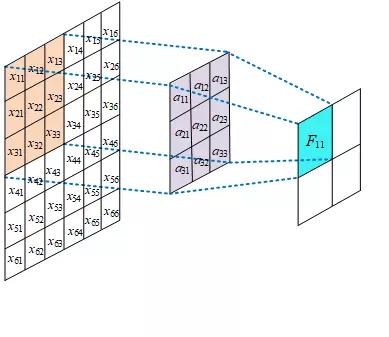
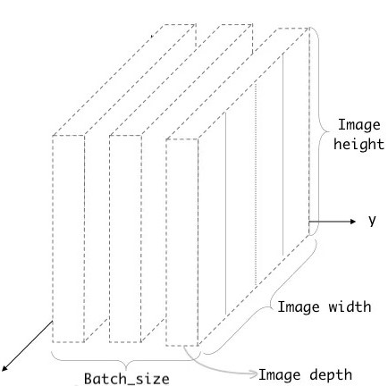

最近有个问题涉及到使用卷积神经网络来解决，在查阅了一些Pytorch中关于CNN的内容后，打算写个总结，以供以后参阅。

在深度学习中，一个典型的卷积神经网络的结构如下图所示：


其中，INPUT层是图像的输入，从图中可以看出这个输入有三个通道（可能是RGB通道），经过第一层卷积后，整个模型变厚（通道数变多），长与宽变得很小，以至于慢慢变为一个一维的向量；最后将这个向量与一个全连接层做连接（但是本身数据的shape仍然是一个四维的形式，即长+宽+厚+batch size，我们需要使用`view`函数将这个四维的向量转化为一个二维的向量，即长+batch size，进而将其作为一个全连接层的输入），从而将图片变为一个分类器。

CNN中同样采取了**权值共享**机制用来减少参数量，即**同一个卷积核在扫描不同的图像位置时的参数**是相同的，可以理解为下图：



在Pytorch中，卷积神经网络分为了三类，分别是1D, 2D, 3D。他们的函数声明分别如下所示：

```python
torch.nn.Conv1d(in_channels, out_channels, kernel_size, stride=1, padding=0, dilation=1, groups=1, bias=True, padding_mode='zeros')
torch.nn.Conv2d(in_channels, out_channels, kernel_size, stride=1, padding=0, dilation=1, groups=1, bias=True, padding_mode='zeros')
torch.nn.Conv3d(in_channels, out_channels, kernel_size, stride=1, padding=0, dilation=1, groups=1, bias=True, padding_mode='zeros')
```

他们的声明很相似，他们本身也有很多相似的地方。这里的`in_channels`代表的是它们输入的channels个数，而输入的形状不需要进行指定。以二维的图像举例子：在构建`Conv2d`类时，我们不需要指定图片的长和宽，只需要指定这个图片是一个灰度图还是一个RGB图像（in_channels=1 or 3）。



每一个卷积核是一个立方体，它的长宽都可以指定，深度一般与输入的通道深度相同。可以定义多个卷积核并行扫描，输出的通道个数与扫描的卷积核个数相同。

对于单个卷积核，其对于每个通道做扫描，然后将扫描的结果求和。所以单个卷积核的输出是一个二维的矩阵，不仅缩小了长与宽，还将通道数置为了1。

一般来说，对于一个指定了维度的卷积神经网络，它的输入都会比指定多两个维度。比如对于一个用来处理图像的标准的二维卷积神经网络，那么它的输入则需要是四维，因为有两个扩展维度，它们是：

- batch：用来指定这个batch中包含的所有学习例；
- channel：用来指定单个学习例中每个channel的值。

以下是一些官网提供的简单的例子：

对于一维的卷积神经网络来说：

```python
m = nn.Conv1d(16, 33, 3, stride=2)
input = torch.randn(20, 16, 50)
output = m(input)
```

对于二维的卷积神经网络来说：

```python
# With square kernels and equal stride
m = nn.Conv2d(16, 33, 3, stride=2)
# non-square kernels and unequal stride and with padding
m = nn.Conv2d(16, 33, (3, 5), stride=(2, 1), padding=(4, 2))
# non-square kernels and unequal stride and with padding and dilation
m = nn.Conv2d(16, 33, (3, 5), stride=(2, 1), padding=(4, 2), dilation=(3, 1))
input = torch.randn(20, 16, 50, 100)
output = m(input)
```

对于三维的卷积神经网络来说：

```python
# With square kernels and equal stride
m = nn.Conv3d(16, 33, 3, stride=2)
# non-square kernels and unequal stride and with padding
m = nn.Conv3d(16, 33, (3, 5, 2), stride=(2, 1, 1), padding=(4, 2, 0))
input = torch.randn(20, 16, 10, 50, 100)
output = m(input)
```

