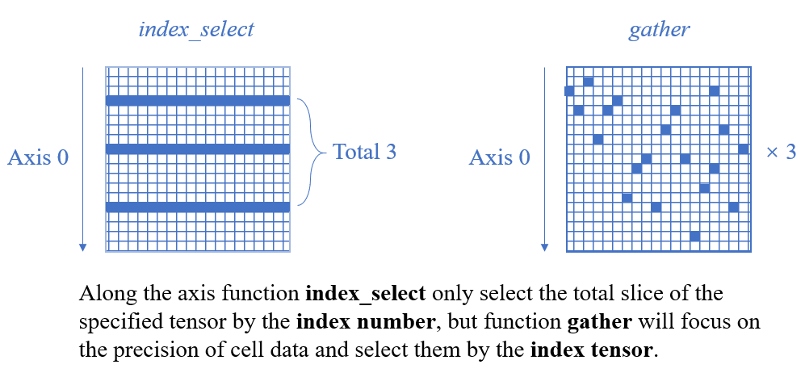

#  `torch.gather`

函数声明为：

```python
torch.gather(input, dim, index, out=None, sparse_grad=False) → Tensor
```

函数作用为：

> Gathers values along an axis specified by dim. 

$$\begin{array}{l}{\text { If input is an n-dimensional tensor with size }\left(x_{0}, x_{1} \ldots, x_{i-1}, x_{i}, x_{i+1}, \ldots, x_{n-1}\right) \text { and dim }=i, \text { then index must be }} \\ {\text { an } n \text { -dimensional tensor with size }\left(x_{0}, x_{1}, \ldots, x_{i-1}, y, x_{i+1}, \ldots, x_{n-1}\right) \text { where } y \geq 1 \text { and out will have the same }} \\ {\text { size as index. }}\end{array}$$

举个例子：

```python
t = torch.tensor([[1, 2], [3, 4]])
#tensor([[3, 4],
#        [1, 2],
#        [1, 4]])
torch.gather(t, 0, torch.tensor([[1, 1], [0, 0], [0, 1]]))
```

由于输出张量和*index*张量有着相同的形状，所以我们可以做以下直观的理解：


#  `torch.unsqueeze`

函数声明为：

```python
torch.unsqueeze(input, dim, out=None) → Tensor
```

函数的作用为：

> Returns a new tensor with a dimension of size one inserted at the specified position. 

可以理解为使得这个张量在指定的位置增加一维，例子如下：

```python
# create a tensor
x = torch.tensor([1, 2, 3, 4])

# insert a dimension in dim 0
torch.unsqueeze(x, 0)
# tensor([[ 1,  2,  3,  4]])

# insert a dimension in dim 1
torch.unsqueeze(x, 1)
# tensor([[ 1],
#        [ 2],
#        [ 3],
#        [ 4]])
```

#  `torch.squeeze`

函数声明为：

```python
torch.squeeze(input, dim=None, out=None) → Tensor
```

函数作用为：

> Returns a tensor with all the dimensions of `input` of size 1 removed. 

可以理解为返回一个张量，这个张量所有size为1的维度都将被去除，如果给定了*dim*，那么我们将会只去除这一维度（如果这一维度size为1）：

```python
>>> x = torch.zeros(2, 1, 2, 1, 2)
>>> x.size()
torch.Size([2, 1, 2, 1, 2])
>>> y = torch.squeeze(x)
>>> y.size()
torch.Size([2, 2, 2])
>>> y = torch.squeeze(x, 0)
>>> y.size()
torch.Size([2, 1, 2, 1, 2])
>>> y = torch.squeeze(x, 1)
>>> y.size()
torch.Size([2, 2, 1, 2])
```

#  `torch.Tensor.view `

函数声明为：

```
torch.Tensor.view(*shape) → Tensor
```

函数作用为：

> Returns a new tensor with the same data as the `self` tensor but of a different `shape`. 

即为保持原张量的数据不变，变化张量的形状。

```python
>>> x = torch.randn(4, 4)
>>> x.size()
torch.Size([4, 4])
>>> y = x.view(16)
>>> y.size()
torch.Size([16])
>>> z = x.view(-1, 8)  # the size -1 is inferred from other dimensions
>>> z.size()
torch.Size([2, 8])
```

#  `torch.index_select` 

函数声明为：

```python
torch.index_select(input, dim, index, out=None) → Tensor
```

函数的作用为：

> Returns a new tensor which indexes the `input` tensor along dimension `dim` using the entries in `index` which is a LongTensor. 

也就是返回一个新的张量，相对于原张量来说，这个张量的其他维度保持不变，但是其选定的维度*dim*为仅为通过*index*张量所选定的那些维。**index张量是一个一维的向量**。

举个例子来说：

```python
>>> x = torch.randn(3, 4)
>>> x
tensor([[ 0.1427,  0.0231, -0.5414, -1.0009],
        [-0.4664,  0.2647, -0.1228, -1.1068],
        [-1.1734, -0.6571,  0.7230, -0.6004]])
>>> indices = torch.tensor([0, 2])
>>> torch.index_select(x, 0, indices)
tensor([[ 0.1427,  0.0231, -0.5414, -1.0009],
        [-1.1734, -0.6571,  0.7230, -0.6004]])
>>> torch.index_select(x, 1, indices)
tensor([[ 0.1427, -0.5414],
        [-0.4664, -0.1228],
        [-1.1734,  0.7230]])
```

注意，这个函数与`torch.gather`函数的区别：*index_select*函数中*index*参数的值仅仅代表了张量在这一维度上所有张量的*index*，而*gather*函数中的*index*参数的值代表这一维度上所有元素的*index*，举一个二维的例子：



# `torch.max`

函数声明为：

```python
torch.max(input, dim, keepdim=False, out=None) -> (Tensor, LongTensor)
```

函数作用为：

>  Returns a namedtuple `(values, indices)` where `values` is the maximum value of each row of the `input` tensor in the given dimension `dim`. And `indices` is the index location of each maximum value found (argmax). 

举个例子来说：

```python
>>> a = torch.randn(4, 4)
>>> a
tensor([[-1.2360, -0.2942, -0.1222,  0.8475],
        [ 1.1949, -1.1127, -2.2379, -0.6702],
        [ 1.5717, -0.9207,  0.1297, -1.8768],
        [-0.6172,  1.0036, -0.6060, -0.2432]])
>>> torch.max(a, 1)
torch.return_types.max(values=tensor([0.8475, 1.1949, 1.5717, 1.0036]), indices=tensor([3, 0, 0, 1]))
```

# `torch.transpose`

函数声明为：

```python
torch.transpose(input, dim0, dim1) → Tensor
```

函数作用为：

> Returns a tensor that is a transposed version of `input`. The given dimensions `dim0` and `dim1` are swapped. 

举个例子来说：

```python
>>> x = torch.randn(2, 3)
>>> x
tensor([[ 1.0028, -0.9893,  0.5809],
        [-0.1669,  0.7299,  0.4942]])
>>> torch.transpose(x, 0, 1)
tensor([[ 1.0028, -0.1669],
        [-0.9893,  0.7299],
        [ 0.5809,  0.4942]])
```

# `torch.cat`

函数声明为：

```python
torch.cat(tensors, dim=0, out=None) → Tensor
```

函数作用为：

> Concatenates the given sequence of `seq` tensors in the given dimension. All tensors must either have the same shape (except in the concatenating dimension) or be empty. 

举个例子来说：

```python
>>> x = torch.randn(2, 3)
>>> x
tensor([[ 0.6580, -1.0969, -0.4614],
        [-0.1034, -0.5790,  0.1497]])
>>> torch.cat((x, x, x), 0)
tensor([[ 0.6580, -1.0969, -0.4614],
        [-0.1034, -0.5790,  0.1497],
        [ 0.6580, -1.0969, -0.4614],
        [-0.1034, -0.5790,  0.1497],
        [ 0.6580, -1.0969, -0.4614],
        [-0.1034, -0.5790,  0.1497]])
>>> torch.cat((x, x, x), 1)
tensor([[ 0.6580, -1.0969, -0.4614,  0.6580, -1.0969, -0.4614,  0.6580,
         -1.0969, -0.4614],
        [-0.1034, -0.5790,  0.1497, -0.1034, -0.5790,  0.1497, -0.1034,
         -0.5790,  0.1497]])
```

