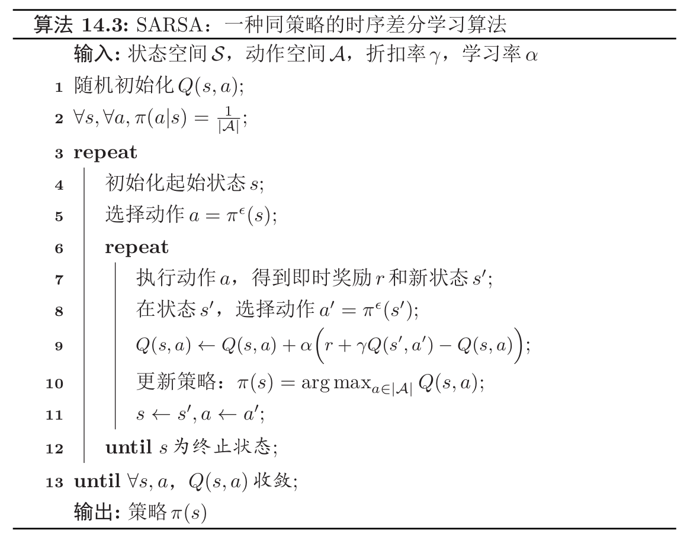

# 什么是SARSA

 SARSA算法的全称是State Action Reward State Action，属于**时序差分学习算法**的一种，其综合了动态规划算法和蒙特卡洛算法，比仅仅使用蒙特卡洛方法速度要快很多。**当时序差分学习算法每次更新的动作数为最大步数时，就等价于蒙特卡洛方法**。

## 值函数更新公式的引入：多次试验的平均

SARSA的核心思想在于**增量计算**。在蒙特卡洛算法中，我们需要对$Q$函数$\hat{Q}^{\pi}(s, a)$进行有效的估计，假设第$N$次试验后值函数为$\hat{Q}_{N}^{\pi}(s, a)$的平均为：

$$
\begin{aligned} \hat{Q}_{N}^{\pi}(s, a) &=\frac{1}{N} \sum_{n=1}^{N} G\left(\tau_{s_{0}=s, a_{0}=a}^{(n)}\right) \\&=\frac{1}{N}\left(G\left(\tau_{s_{0}=s, a_{0}=a}^{(N)}\right)+\sum_{n=1}^{N-1} G\left(\tau_{s_{0}=s, a_{0}=a}^{(n)}\right)\right) \\ &=\frac{1}{N}\left(G\left(\tau_{s_{0}=s, a_{0}=a}^{(N)}\right)+(N-1) \hat{Q}_{N-1}^{\pi}(s, a)\right) \\ &=\hat{Q}_{N-1}^{\pi}(s, a)+\frac{1}{N}\left(G\left(\tau_{s_{0}=s, a_{0}=a}^{(N)}\right)-\hat{Q}_{N-1}^{\pi}(s, a)\right) \end{aligned}
$$

其中$\tau_{s_{0}}=s, a_{0}=a$表示轨迹$\tau$的起始状态和动作为$s$, $a$。

省却以上公式的中间过程，我们可以将该公式简化为如下：

$$
\hat{Q}_{N}^{\pi}(s, a)=\hat{Q}_{N-1}^{\pi}(s, a)+\frac{1}{N}\left(G\left(\tau_{s_{0}=s, a_{0}=a}^{(N)}\right)-\hat{Q}_{N-1}^{\pi}(s, a)\right)
$$

在该公式中，值函数$\hat{Q}^{\pi}(s, a)$在第$N$次试验后的值$\hat{Q}_{N}^{\pi}(s, a)$，即$N$次试验的平均等于前$N-1$次试验再加上一个**增量**。在该公式中，**$1/N$可以表示成第$N$次试验相对于前$N-1$次试验的重要性**。

## 值函数更新公式的改进：权重参数的调整

更一般性的，我们可以将权重系数$1/N$改成一个比较小的正数$\alpha$，由此，以上公式可以被改写成为以下：

$$
\hat{Q}^{\pi}(s, a) \leftarrow \hat{Q}^{\pi}(s, a)+\alpha\left(G\left(\tau_{s_{0}=s, a_{0}=a}\right)-\hat{Q}^{\pi}(s, a)\right)
$$

其中，增量$\delta \triangleq G\left(\tau_{s_{0}=s, a_{0}=a}\right)-\hat{Q}^{\pi}(s, a)$称为蒙特卡洛误差，表示真实的回报与期望回报之间的差距。

## 值函数更新公式的改进：累积奖励的计算

在上面的公式中，$G\left(\tau_{s_{0}}=s, a_{0}=a\right)$为一次试验的**完整轨迹所得到的总回报**，为了提高效率，放宽模型的约束，可以借助**动态规划**算法来计算$G\left(\tau_{s_{0}}=s, a_{0}=a\right)$，而不需要得到完整的轨迹。

从$s,a$开始，采样下一步的状态和动作$\left(s^{\prime}, a^{\prime}\right)$，并得到奖励$r(s,a,s^{\prime})$，然后利用**贝尔曼方程**来近似估计函数$G\left(\tau_{s_{0}}=s, a_{0}=a\right)$。

$$
\begin{aligned} G\left(\tau_{s 0}=s, a_{0}=a, s_{1}=s^{\prime}, a_{1}=a^{\prime}\right) &=r\left(s, a, s^{\prime}\right)+\gamma G\left(\tau_{s 0}=s^{\prime}, a_{0}=a^{\prime}\right) \\ & \approx r\left(s, a, s^{\prime}\right)+\gamma \hat{Q}^{\pi}\left(s^{\prime}, a^{\prime}\right) \end{aligned}
$$

贝尔曼方程的思想精髓在于**动态规划**，即当前值的计算依赖于上一时刻的值。对于无最终状态的情况，我们定义了折扣率$\gamma$来重点强调现世的回报。

将以上公式结合，可以得到以下计算公式：

$$
\hat{Q}^{\pi}(s, a) \leftarrow \hat{Q}^{\pi}(s, a)+\alpha\left(r\left(s, a, s^{\prime}\right)+\gamma \hat{Q}^{\pi}\left(s^{\prime}, a^{\prime}\right)-\hat{Q}^{\pi}(s, a)\right)
$$

这种策略学习算法称为$SARSA$算法。

## 通用$SARSA$算法框架：一个示例

一个通用的$SARSA$算法如下所示：

该算法的大致逻辑如下：

1. 运行完一个回合即一个内循环。
2. 运行直到$Q$函数收敛即为一个外循环。
3. 运行期间动态更新$Q$函数，并基于$Q$函数更新策略$\pi(s)$。

$SARSA$学习算法是一种**同策略**的时序差分学习算法。

时序差分学习和蒙特卡罗方法的主要不同为：蒙特卡罗需要完整一个路径完成才能知道其总回报，也不依赖**马尔可夫性质**；而时序差分学习只需要一步，其总回报需要依赖**马尔可夫性质**来进行近似估计。

