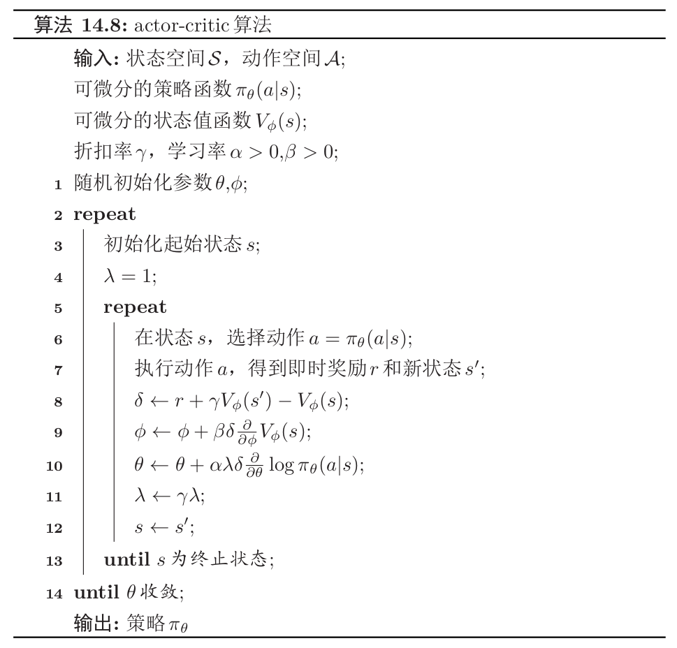

在$REINFORCE$算法中，每次需要根据一个策略采集一条完整的轨迹,并计算这条轨迹上的回报。这种采样方式的方差比较大，学习效率也比较低。我们可以借鉴时序差分学习的思想，使用动态规划方法来提高采样的效率，即从状态开始$s$的总回报可以通过当前动作的即时奖励$r(s,a,s^{\prime})$和下一个状态$s^{\prime}$的值函数来近似估计。

演员评论员算法（Actor-Critic Algorithm）既不属于基于值函数的学习方法，也不属于基于策略函数的学习方法，它是结合**策略梯度**和**时序差分学习**的强化学习方法。

# 基本思想

## 演员（Actor）

演员（Actor）是指策略函数$\pi_{\theta}(s, a)$，即学习一个策略来得到尽量高的回报。

## 评论员（Critic）

评论员（Critic）是指值函数$V_{\phi}(s)$，对当前策略的值函数进行估计，即评估Actor的好坏。借助于值函数，Actor-Critic算法可以进行单步更新参数，不需要等到回合结束才进行更新。

**在该算法中，策略函数$\pi_{\theta}(s, a)$和值函数$V_{\phi}(s)$都是待学习的函数，需要在训练中同时学习。**

## 训练过程

假设从时刻$t$开始的回报$G\left(\tau_{t : T}\right)$，我们用下面公式计算。

$$
\hat{G}\left(\tau_{t : T}\right)=r_{t+1}+\gamma V_{\phi}\left(s_{t+1}\right)
$$

其中$s_{t+1}$是$t+1$时刻的状态，$r_{t+1}$是即时奖励。

在每步更新中，分别进行策略函数$\pi_{\theta}(s,a)$和值函数$V_{\phi}(s)$的学习。一方面，更新参数$\phi$使得值函数$V_{\phi}(s_{t})$接近于估计的真实回报$\hat{G}\left(\tau_{t : T}\right)$。

$$
\min _{\phi}\left(\hat{G}\left(\tau_{t : T}\right)-V_{\phi}\left(s_{t}\right)\right)^{2}
$$

另一方面，将**值函数**$V_{\phi}(s_{t})$作为基函数来更新**策略函数**的参数$\theta$，减少策略梯度的方差。

$$
\theta \leftarrow \theta+\alpha \gamma^{t}\left(\hat{G}\left(\tau_{t : T}\right)-V_{\phi}\left(s_{t}\right)\right) \frac{\partial}{\partial \theta} \log \pi_{\theta}\left(a_{t} | s_{t}\right)
$$

在每步更新中：

- **演员**根据当前的环境状态$s$和策略$\pi_{\theta}$去执行动作$a$，环境状态变为$s^{\prime}$，并到即时奖励$r$。
- **评论员**根据环境给出的真实奖励和之前标准下的打分$\left(r+\gamma V_{\phi}\left(s^{\prime}\right)\right)$，来调整自己的打分标准，使得自己
  的评分更接近环境的真实回报。
- **演员**则跟据评论员的打分，调整自己的策略$\pi_{\theta}$，争取下次做得更好。

开始训练时，演员随机表演，评论员随机打分。通过不断的学习，评论员的评分越来越准，演员的动作越来越好。

# 通用算法框架：一个示例

由于我们最后希望得到一个策略，所以大循环中终止目标是策略函数的参数$\theta$收敛。

1. 外部循环在参数$\theta$收敛后停止。
2. 内部循环中，首先演员表演，得到蒙特卡洛误差$\delta$，并利用该参数更新值函数参数$\phi$和演员参数$\theta$，并降低更新步长参数$\lambda$。内部循环到终止状态时结束。