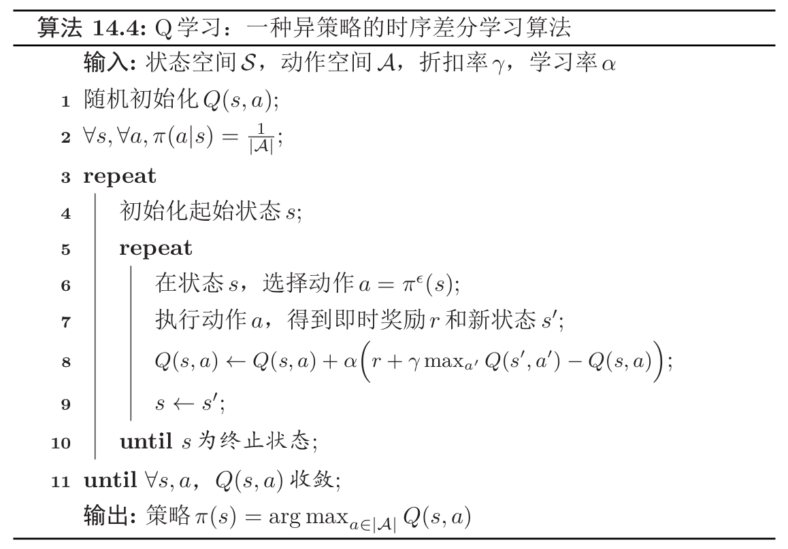

# 定义

$Q$学习（$Q-Learning$）算法是一种**异策略**的时序差分学习算法。在$Q$学习中，$Q$函数的估计方法为：

$$
Q(s, a) \leftarrow Q(s, a)+\alpha\left(r+\gamma \max _{a^{\prime}} Q\left(s^{\prime}, a^{\prime}\right)-Q(s, a)\right)
$$

相当于让$Q(s,a)$直接去估计最优状态值函数$Q^{*}(s,a)$。

# 与$SARSA$异同

$SARSA$的迭代公式如下：

$$
\hat{Q}^{\pi}(s, a) \leftarrow \hat{Q}^{\pi}(s, a)+\alpha\left(r\left(s, a, s^{\prime}\right)+\gamma \hat{Q}^{\pi}\left(s^{\prime}, a^{\prime}\right)-\hat{Q}^{\pi}(s, a)\right)
$$

而$Q$学习算法如下：

$$
Q(s, a) \leftarrow Q(s, a)+\alpha\left(r+\gamma \max _{a^{\prime}} Q\left(s^{\prime}, a^{\prime}\right)-Q(s, a)\right)
$$

不管是在$SARSA$算法中，还是在$Q$学习算法中，**环境对于当前状态$s$下做出动作$a$的反馈$r$和$s^{\prime}$是不变的**。

## 下一动作的选择

$SARSA$算法与$Q$学习算法对于下一动作$a^{\prime}$的选择**都基于原策略**。

## 状态动作值函数的更新

在$SARSA$算法中，我们使用了同策略下下一状态动作值函数（采样策略）对当前状态动作值函数（目标策略）进行了更新，可知采样策略与更新策略都是策略$\pi$，所以该算法为**同策略**的学习算法。

而在$Q$学习算法中，我们可以定义当前策略为$\pi$，基于当前值函数可计算出的最佳策略为$\pi^{*}$，在该学习算法中，每一步对于**状态动作值函数$Q(s,a)$**的更新，都是基于最佳的策略（注意，实际的动作选取并未基于最佳策略，只是在**值函数的更新**上基于了该最优策略），**而每一个回合使用的采样策略都是策略$\pi$**，对该策略$\pi$的更新要到整个算法都结束后才会进行，即

$$
\pi(s)=\arg \max _{a \in|\mathcal{A}|} Q(s, a)
$$

# 通用$Q$学习算法框架：一个示例

一个通用的$Q$学习算法如下所示：

该算法的大致逻辑如下：

1. 运行完一个回合即一个内循环。
2. 运行直到$Q$函数收敛即为一个外循环。
3. 运行期间动态更新$Q$函数。
4. 在算法结束时更新策略$\pi$。

$Q$学习算法是一种**异策略**的时序差分学习算法。