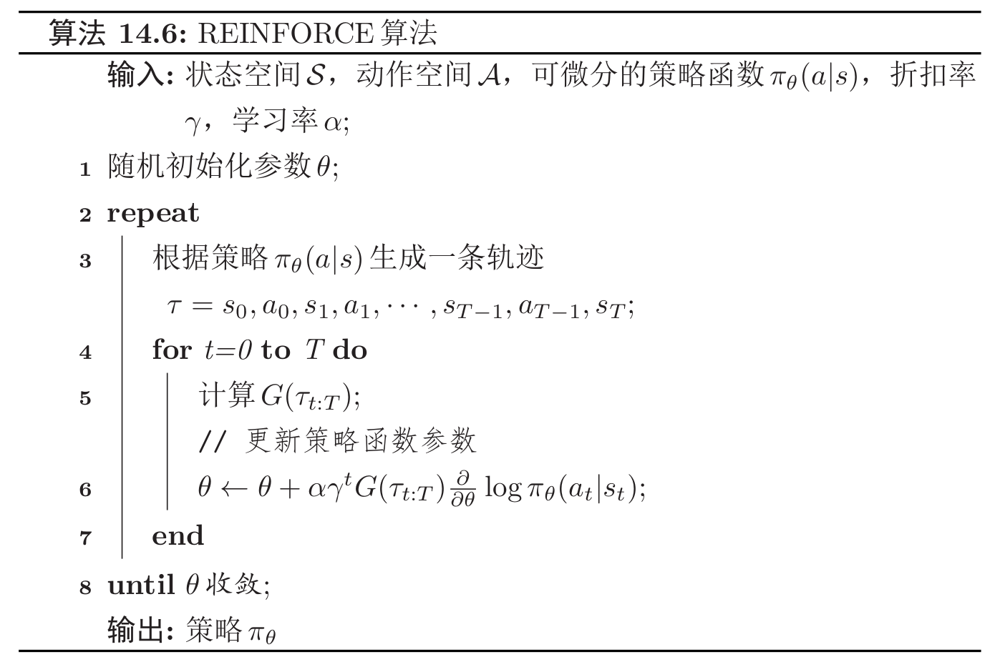

# $REINFORCE$算法

我们已知策略梯度$\frac{\partial \mathcal{J}(\theta)}{\partial \theta}$的计算公式为：

$$
\frac{\partial \mathcal{J}(\theta)}{\partial \theta}=\mathbb{E}_{\tau \sim p_{\theta}(\tau)}\left[\sum_{t=0}^{T-1}\left(\frac{\partial}{\partial \theta} \log \pi_{\theta}\left(a_{t} | s_{t}\right) \gamma^{t} G\left(\tau_{t : T}\right)\right)\right]
$$

其中，期望可以通过采样的方法来进行近似。对于当前策略$\pi_{\theta}$，可以随机游走采集多个轨迹$\tau^{(1)}, \tau^{(2)}, \cdots, \tau^{(N)}$，每一条轨迹$\tau^{(n)}=s_{0}^{(n)}, a_{0}^{(n)}, s_{1}^{(n)}, a_{1}^{(n)}, \cdots$，其梯度定义为

$$
\frac{\partial \mathcal{J}(\theta)}{\partial \theta} \approx \frac{1}{N} \sum_{n=1}^{N}\left(\sum_{t=0}^{T-1} \frac{\partial}{\partial \theta} \log \pi_{\theta}\left(a_{t}^{(n)} | s_{t}^{(n)}\right) \gamma^{t} G_{\tau_{t : T}^{(n)}}\right)
$$

结合随机梯度上升算法，我们可以每次采集一条轨迹，计算每个时刻的梯度并更新参数，称为$REINFORCE$算法。

## $REINFORCE$算法通用框架：一个示例

# 带基准线的$REINFORCE$算法

$REINFORCE$算法的一个主要缺点是不同路径之间的方差很大，导致训练不稳定，这是在高维空间中使用蒙特卡罗方法的的通病。一种减少方差的通用方法是引入一个控制变量。