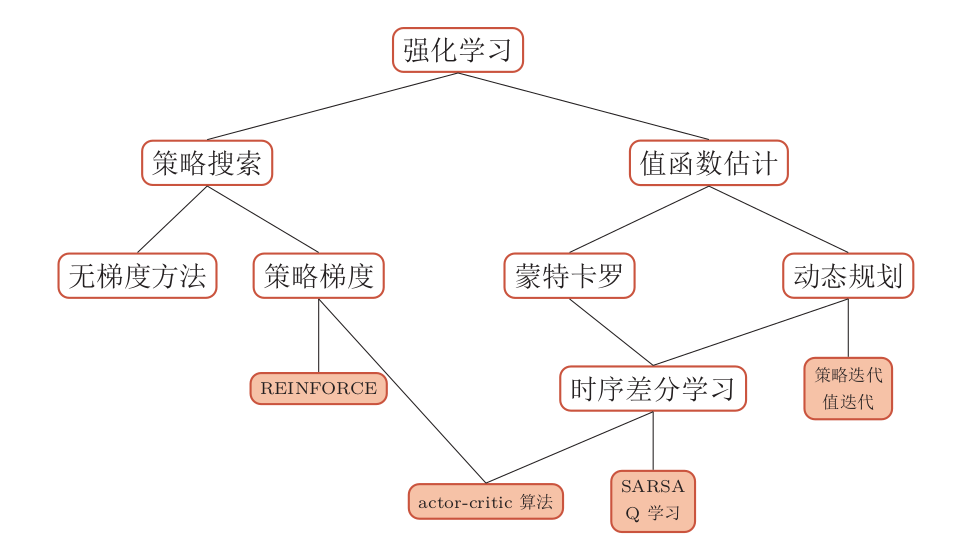

# 什么是强化学习

强化学习是一种十分吸引人的机器学习方法，通过智能体不断与环境进行交互，并根据经验调整其策略来最大化其长远的所有奖励的累积值。强化学习更接近生物学习的本质，可以应对多种复杂的场景，而从更接近通用人工智能
系统的目标。

目前，机器学习分为四类：

- 监督学习。
- 无监督学习。
- 半监督学习。
- **强化学习**。

强化学习即为其中的一种。

强化学习和监督学习的区别在于：

- 强化学习的样本通过与环境进行交互产生，即**试错学习**，而监督学习的样本由人工收集并标注。
- 强化学习的反馈信息只有奖励，并且是延迟的；而监督学习需要明确的指导信息（每一个状态对应的动作）。

现代强化学习可以追溯到两个来源：

- 一个是心理学中的**行为主义理论**，即有机体如何在环境给予的奖励或惩罚的刺激下，逐步形成对刺激的预期，产生能获得最大利益的习惯性行为；
- 另一个是控制论领域的最优控制问题，即在满足一定约束条件下，寻求最优控制策略，使得性能指标取极大值或极小值。

强化学习的算法分为以下几类：

# 更加泛化的强化学习

## 部分可观测马尔可夫决策过程

部分可观测马尔可夫决策过程（Partially Observable Markov Decision Processes, POMDP）是一个马尔可夫决策过程的泛化。POMDP依然具有马尔可夫性，但是假设智能体无法感知环境的状态$s$，只能知道部分观测值$o$。比如在自动驾驶中，智能体只能感知传感器采集的有限的环境信息。

## 逆向强化学习

逆向强化学习（Inverse Reinforcement Learning, IRL）就是指一个不带奖励的马尔可夫决策过程，通过给定的一组专家（或教师）的行为轨迹示例来逆向估计出奖励函数$r\left(s, a, s^{\prime}\right)$来解释专家的行为，然后再进行强化学习。

## 分层强化学习

分层强化学习（Hierarchical Reinforcement Learning, HRL）是指将一个复杂的强化学习问题分解成多个小的、简单的子问题，每个子问题都可以单独用马尔可夫决策过程来建模。这样，**我们可以将智能体的策略分为高层次策略和低层次策略，高层次策略根据当前状态决定如何执行低层次策略。**这样，智能体就可以解决一些非常复杂的任务。

