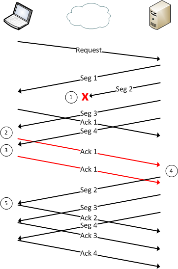
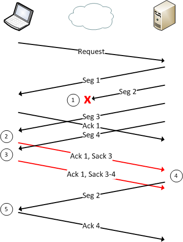

SACK是一个TCP的选项，来允许TCP单独确认非连续的片段，用于告知真正丢失的包，只重传丢失的片段。

# 传统情形

下图罗列了一个客户端与服务器的TCP链接，时间在纵向上从上到下：

客户端给服务器发送了一些请求，服务器将回复分隔成为四个TCP Segments，并将其作为回复返回给客户端。然而，第二个回复丢失了，没有达到主机，下面对整个过程进行一些梳理（下面每一步对应上图一个圆圈）：

- 返回Segment 2丢失了。
- 客户端接收到了Segment 3， 检查Sequence Number，客户端认识到这个段是失序的，客户端重传了一个冗余请求来告诉服务器，Segment 1之后任何可靠数据仍旧未被接收。
- 服务器没有注意到有些事情错了，它仍旧在发送Segment 4，客户端发现仍旧未改善，所以重复发送冗余ACK给服务器。
- 服务器接收到客户端的第一个冗余的ACK，发现仍旧需要重传Segment 2。
- 客户端成功接收，并ACK了另外三个段。

# SACK

你可能注意到设计是没有效率的，**尽管只有Segment 2丢失了，但是服务器仍旧需要重传Segment 3和Segment 4，因为客户端没有确认这两个段。**

SACKs通过允许客户端说“我只有Segment 1是有序的，但，我也接收到了Segment 3和Segment 4”，这允许服务器仅仅重传丢失的包。

在TCP开始链接时，他们将会协商是否支持SACK，如果两端都支持，就可能会被使用，让我们看看下面这个例子：

对应以下几步：

- Segment 2丢失了。
- 客户端发现Segment  1和Segment 3之前丢了一个段，发送了一个带SACK的冗余ACK。
- 客户端接收到了Segment 4，发送了一个冗余ACK带SACK 3, 4。
- 服务器重传Segment 2。
- 客户端接收到后确认Segment 4。

