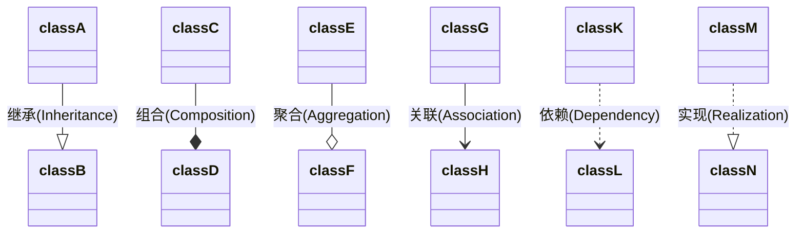

昨天读完了《Dive Into Design Patterns》这本书，还是有颇多感触的，这本书是由 Alexander Shvets 编写，主要对 22 种设计模式做了一个直观、形象并且足够简单的介绍。这本书的结构非常清晰，主要分为前置部分（介绍设计模式的 Motivation 以及其设计所应当遵循的原则）与正文（将 22 种设计模式分为了三类，并对每一个设计模式做了充分的介绍）两部分，其中正文部分是本书的重点，下面对这本书做一个必要的总结，以期在以后查阅该书时能够快速找到所需要索引的部分。

# 本书其书

起初这本书是在浏览这个网站 [Source Making](https://sourcemaking.com/) 所注意到的，这个网站是代码洁癖的福音，因为里面这个网站对设计模式、反模式、重构以及 UML 做了一个全面的介绍，致力于让开发者能够写出更加漂亮的代码。因为最近打算深入了解下 TCP 在 Linux 操作系统的实现，但是《TCP Socket In C》的作者建议在读该书前要对设计模式有所了解，虽然本科期间开设了关于设计模式的课程，但无奈当时我太划水，没怎么听，而且正好最近对设计模式也很感兴趣，所以那就一石三鸟，通过读这本书弥补一下本科的遗憾，满足一下我的兴趣、以及了解一下《TCP Socket In C》这本书的前置知识吧！

# 作者其人

Alexander Shvets，俄国人，在领英上的信息显示其硕士毕业于莫斯科国立鲍曼技术大学（Bauman Moscow State Technical University），在很多个公司就职过，现在是 ScanToBuy 公司的 CTO。

# 本书结构

## 前置部分

前置部分包含三章，分别是：

- Introduction to OOP（对于面向对象编程的介绍）其中分为：

  Basic of OOP：一些诸如类、对象、继承等 OOP 基础知识，乏善可陈；

  Pillars of OOP：抽象、多态、封装、继承。本科知识、乏善可陈。需要注意实现与继承的连线画法上的区别，因为正文部分会有大量的箭头，现在不清楚后面读起来也容易搞混，耽误不必要的时间；

  Relations Between Objects：对象之间的关系，即关联、依赖、组合、聚合。需要它们连线画法上的区别。

- Introduction to Design Patterns（对于设计模式的介绍），其中分为：

  What's a Design Pattern：介绍了设计模式的结构、分类以及发明者（GoF）;

  Why should I Learn Patterns；

- **Software Design Principles**（软件设计原则），这部分比较重要，也是各个设计模式出现的初衷：**当前软件设计面临什么问题、我们应当如何解决这些问题、以及解决这些问题应当遵循哪些原则**。其中分为：
  - Design Principles（设计原则）：什么才是好的设计？作者认为应当是：

    封装变化（Encapsulate What Varies）：主要的原则是最小化变化所带来的影响，有方法层面的封装以及类层面的封装；

    面向接口编程、而非面向实现编程（Program to an Interface, not an Implementation）：接口可以理解为没有成员变量的抽象类，面向接口编程的抽象度会更高；

    使用组合来代替继承所带来的问题（Favor Composition Over Inheritance）：继承可能带来维数灾，使用组合关系能够更好地解决这个问题，举个例子，TCP 里的 Socket Base 类有一个域用来存放拥塞控制算法，即我把 Vegas 作为我的拥塞控制算法（has）；而之前则是直接基于基类往下继承，即我是 Vegas 拥塞控制算法（is）。在 NS3 的技术文档中也描述了这种实现方式：

    > Before, a congestion control was considered in the code as a stand-alone TCP. In software-engineering terms, the inheritance relation between a TCP congestion algorithm, for example TcpNewReno , and the main TCP class TcpSocketBase , logically implied that “TcpNewReno was-a TcpSocketBase ”. The change consisted in reverting this paradigm in a more sound statement: “TcpSocketBase has TcpNewReno as congestion control algorithm”, which basically translates in avoiding the inheritance relation between these classes, and writing an interface to exchange data between sockets and congestion control modules. Such modularity is already employed in real-world stacks (a famous example is the modularization of congestion control algorithms in Linux).

    这种设计有很多缺点，此不赘述。

  - SOLID Principles（SOLID 原则）：SOLID 原则是五个不同原则的简称，它们分别是：单一责任原则（Single Responsibility Principle）、开闭原则（Open/Closed Principle）、里氏代换原则（Liskov Substitution Principle）、接口分离原则（Interface Segregation Principle）以及依赖倒置原则（Dependency Inversion Principle）。下面对这五个原则进行逐一的介绍：

    **S**ingle Responsibility Principle：每一个类应当只负责其应当负责的部分，当软件变得逐渐庞大、责任越来越多时，就应当将责任分离以防止原类变得过于庞大；

    **O**pen/Closed Principle：类应当对于扩展开放、对于更改封闭（高内聚、低耦合）；

    **L**iskov Substitution Principle：这个原则比较有意思：它的出现是基于多态的考虑（当扩展一个类时，应当记住我们在任何时刻都可以传递一个子类的对象在基类的位置，所以我们应当时刻考虑我们的设计基于此所带来的影响）。这个原则也可以细分为几个子原则：相对于父类来说，子类的函数参数应当更加抽象/不能加强前置、子类的返回值/报出异常应当更加具象/不能削弱后置、子类不应该加强前置条件、尽量添加新函数，而不是重写原有函数；

    **I**nterface Segregation Principle：把不相关的函数分离成多个接口，而不是全部放在一个接口里，这会导致实现该接口的类也要实现那些它们可能用不到的接口；

    **D**ependency Inversion Principle：高级类（业务类）应当依赖于低级类（轮子类）的抽象，而不是直接依赖，这会导致耦合关系。

## 正文部分

正文部分分为三部分，分别是：

- Creational Design Patterns：包含 Factory Method、Abstract Factory、Builder、Prototype、Singleton；
- Structural Design Patterns：包含 Adapter、Bridge、Composite、Decorator、Facade、Flyweight、Proxy;
- Behavioral Design Patterns：包含 Chain of Res、Command、Iterator、Mediator、Memento、Observer、State、Strategy、Template Method、Visitor。

在介绍每一个单一的设计模式时，也分为一下几部分：

- Problem：当前面临的问题；
- Solution：如何通过该设计模式解决；
- Structure：UML 架构；
- Pseudocode：伪代码；
- Applicability：应用场景；
- How to Implement：如何实现；
- Pros and Cons：优缺点；
- Relations with Other Patterns：和其他设计模式的关系。

总的来说，从 UML 的角度，所有的设计模式可以概括成以下 cheat sheet：

[Design Pattern Cheat Sheet](http://www.lug.or.kr/files/cheat_sheet/design_pattern_cheatsheet_v1.pdf)

# 附录

### Class Relationship / 关联 / 组合 / 聚合 / UML

本书中的继承、实现、关联、依赖、组合、聚合分别使用六种箭头表示：

- 继承：三角实线箭头；
- 实现：三角虚线箭头；
- 依赖：普通虚线箭头；类 A 的某个成员函数的返回值、形参、局部变量或静态方法的调用，则表示类 A 引用了类 B。**箭头源为依赖者，箭头端为被依赖者，表示依赖者依赖于被依赖者。**
- 关联：普通实线箭头；类 A 成为类 B 的属性，而属性是一种更为紧密的耦合，更为长久的持有关系。关联暗示了依赖。**注意箭头方向和组合/聚合是相反的。**
    - 聚合关联：虚心菱形箭头。是 has-a 的关系，整体和部分可以具有各自的生命周期。**箭头源为部分，箭头端为整体，表示部分组合/聚合了整体。**
    - 组合关联：实心菱形箭头；强聚合，表示一种 contains-a 的关系，部分不能脱离整体而存在。**箭头方向同上。**

In mermaid:

| **Type** | **Description** |
|:--------:|:---------------:|
| <\|\-\-  | Inheritance     |
| \*\-\-   | Composition     |
| o\-\-    | Aggregation     |
| \-\->    | Association     |
| \-\-     | Link \(Solid\)  |
| \.\.>    | Dependency      |
| \.\.\|>  | Realization     |
| \.\.     | Link \(Dashed\) |
